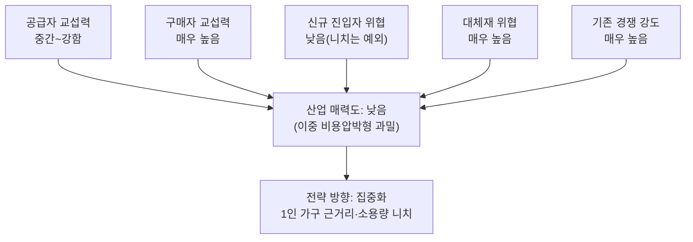

# 분석 ④ — 1인 가구 대상 음식 배달·포장 주문 플랫폼

> [분석 방법론](./분석방법론.md)에 따른 Porter's Five Forces 분석
> 비교 대상: [분석 ③ — 개인 맞춤형 자산관리](./분석③-개인자산관리서비스.md) · [비교 분석](./비교분석-개인자산관리-vs-1인가구배달플랫폼.md)

## 0. 분석 단위 설정

| 항목 | 설정 |
|---|---|
| 분석 주체 | 1인 가구 수요(소용량 메뉴·즉시 조리·근거리 단건 배달)에 특화한 음식 배달·포장 주문 **중개 플랫폼 사업자** |
| 수익 모델 | 입점업체 중개수수료, 배달비, 입점업체 대상 노출 광고 |
| 지역·시점 | 국내 도심 지역, 2026년 현재 |
| 참고 사례 | 배달의민족(배민1), 쿠팡이츠, 요기요 |

⚠️ 이 산업은 구매자가 두 종류(주문자·입점업체)일 뿐 아니라, **라이더(배달 인력)라는 제3의 이해관계자가 사실상 공급자로 가치사슬에 참여**한다. 라이더를 구매자나 운영 인력으로 뭉뚱그리면 공급자 분석이 무너진다.

---

## 1) 공급자의 힘 — **중간~강함**

| 공급자 층 | 힘 | 근거 |
|---|---|---|
| **라이더(배달 인력)** | 강함 | 여러 플랫폼에 동시 등록(멀티호밍)하는 것이 표준이라, 배달비 정책이 불리해지면 즉시 타 플랫폼으로 이동한다. 다만 라이더 전체 공급량은 충분해 개별 라이더의 협상력은 낮고, **집단으로서의 민감도**가 힘의 원천이다. |
| **결제 PG사·지도 API** | 중간 | 대체 가능하지만 결제 인프라 전환에는 일정 비용이 든다. |
| **클라우드 인프라** | 중간 | 주문 급증 시간대(피크타임)에 맞춘 확장성이 필요해 특정 벤더 종속이 발생한다. |

> 📌 라이더 공급자는 [분석①(위치기반 SNS)](./분석①-위치기반-SNS.md)의 크리에이터와 구조가 닮았다 — 개별로는 약하지만 멀티호밍 때문에 집단적으로 플랫폼 정책에 큰 영향력을 행사한다.

---

## 2) 구매자의 힘 — **매우 높음**

### 소비자 (주문자)
- 배민·쿠팡이츠·요기요를 동시에 깔아두고 쿠폰이 있는 곳에서 주문하는 멀티호밍이 일반적이며, 전환비용은 0에 가깝다.
- → **매우 강함**

### 입점업체 (식당·편의점)
- 여러 플랫폼에 동시 입점하는 것이 기본이고, 수수료율에 불만이 있으면 노출 축소 등으로 대응할 수 있다. 다만 입점 자체를 끊는 것은 매출 감소로 직결되므로 완전한 협상력은 아니다.
- → **강함, 단 이중적** — 조건 협상력은 있으나 이탈 협상력은 제한적

---

## 3) 신규 진입자의 위협 — **낮음, 단 니치는 예외**

| 장벽 요소 | 평가 |
|---|---|
| 규모의 경제 | **강함(장벽)** — 라이더 네트워크 밀도와 배차 최적화는 규모가 커야 효율이 난다. |
| 기술적 우위·특허 | **약함** — 배차 알고리즘 자체는 특허로 보호되지 않는다. |
| 채널·브랜드 선점 | **강함(장벽)** — 입점업체 확보에 오랜 시간이 걸리고, 소비자의 앱 설치 습관이 이미 고착되어 있다. |

**전국 단위 정면 진입은 막혀 있지만, "1인 가구 근거리 소용량"이라는 니치는 예외다.** 대형 플랫폼이 규모의 경제를 위해 최적화한 것은 넓은 배달 반경과 다양한 메뉴 구성이지, 좁은 반경·소용량 단건 배달이 아니다 — [분석①](./분석①-위치기반-SNS.md)의 "로컬 네트워크 효과가 방어자에게 불리하다"는 논리가 여기서도 유효하다.

---

## 4) 대체재의 위협 — **매우 높음**

| 충족하려는 욕구 | 대체재 |
|---|---|
| 끼니 해결 | 편의점 도시락·HMR(가정간편식) |
| 식재료 직접 조리 | 쿠팡프레시 등 새벽·당일 식재료 배송 |
| 근거리 외식 | 도보 이동 가능한 구내식당·백반집 |

가장 치명적인 것은 HMR(가정간편식)이다 — 최근 몇 년 사이 품질이 급격히 상승했고, 배달비 없이 집에서 바로 조리할 수 있어 배달앱 대비 가격 우위가 압도적이다. 1인 가구일수록 소용량 HMR과의 대체 관계가 더 직접적이라는 점이 이 세그먼트의 특수한 리스크다.

---

## 5) 산업 내 경쟁 강도 — **매우 높음**

- 배민·쿠팡이츠·요기요 3강 구도에 지역 기반 소형 플랫폼까지 가세한다.
- 쿠폰·무료배달 경쟁으로 마진이 소진되는 동시에, 라이더 확보를 위한 배달비 인상 경쟁까지 겹쳐 **양쪽에서 동시에 비용 압박**을 받는 구조다.

---

## 종합: 산업 매력도 **낮음** — 이중 비용압박형 과밀 시장

전국 단위로는 진입장벽이 높아 신규 진입자가 막혀 있지만, 그 장벽은 대형 플랫폼이 최적화하지 않은 좁은 니치에는 적용되지 않는다. 다만 그 니치 안에서도 대체재(HMR)와 쿠폰 경쟁이라는 산업 전체의 압박은 고스란히 적용된다.

## 전략 시사점

| 방향 | 내용 |
|---|---|
| **집중화** (권장) | 반경을 넓히지 말고 1인 가구 밀집 지역(오피스텔·원룸촌)에서 소용량 메뉴·단건 즉시배달로 좁게 포지셔닝한다. |
| **차별화** (비권장) | 메뉴 큐레이션이나 UI 차별화는 대형 플랫폼에 즉시 복제된다. |
| **저비용** (비권장) | 쿠폰·무료배달 경쟁과 라이더 배달비 인상이 동시에 원가를 끌어올려 저비용 전략이 성립하지 않는다. |
| *(보조) 수요 예측성 확보* | 구독형 정기 주문(예: 매일 같은 시간 1인분 배달) 등으로 주문 패턴을 예측 가능하게 만들면 라이더 배차 효율이 올라가 원가 압박의 일부를 완화할 수 있다. |
