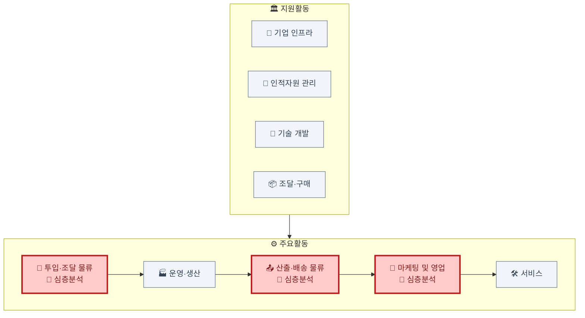

# 가치사슬 분석: 1인 가구 대상 음식 배달·포장 주문 플랫폼

> 분석 대상: 1인 가구 수요(소용량·근거리·즉시조리)에 특화한 배달·포장 주문 중개 플랫폼 사업자. [Porter's Five Forces 비교](../01.porters-five-forces/비교분석-개인자산관리-vs-1인가구배달플랫폼.md)에서 다룬 동일 시장을 기업 내부 활동 관점에서 분석.

## 분석 우선순위

이 산업은 핵심 자원이 사람의 이동(라이더)이라는 소유 불가능한 자원이라는 점에서, 조달과 산출이 사실상 분리되지 않는 특이 구조를 가진다. **투입·조달 물류(라이더 확보), 산출·배송 물류(배달 자체가 제품의 본질), 마케팅 및 영업(쿠폰 경쟁)** 세 활동에 원가·차별화가 집중되므로 이 세 곳을 심층 분석하고, 나머지는 간략히 짚는다.

## 심층 분석

### 투입·조달 물류 (Inbound Logistics) — 소유가 아니라 접근권으로 확보하는 자원
- 핵심 투입자원은 라이더 풀과 입점업체 계약이다. 라이더는 고용 계약이 아니라 플랫폼 가입이라는 느슨한 관계로 확보되며, 여러 플랫폼에 동시 가입(멀티호밍)하는 것이 표준이라 "조달"이라기보다 "매 순간 재확보"에 가깝다.
- 입점업체 역시 배타적 계약이 아니라 복수 플랫폼 동시 입점이 기본이라, 조달 관계가 구조적으로 느슨하다.
- **개선 관점**: 특정 시간대·지역에 라이더가 부족해지는 상황(피크타임 배차 실패)에 대비한 인센티브 설계가 조달 안정성의 핵심 레버.

### 산출·배송 물류 (Outbound Logistics) — 이 산업에서는 부가활동이 아니라 본질활동
- 대부분의 산업에서 산출·배송 물류는 완성된 가치를 전달하는 부가 단계이지만, 이 산업에서는 **배송 자체가 판매하는 제품의 실체**다. 배달 속도와 정확도가 곧 상품 품질이다.
- 실시간 위치 트래킹과 정확한 도착 예정시간(ETA) 안내가 고객이 느끼는 서비스 품질의 대부분을 결정한다.
- **개선 관점**: 지연 발생 시 원인(조리 지연 vs 배차 지연 vs 이동 지연)을 구분해 안내하지 못하면, 실제로는 입점업체 문제인데 플랫폼 불만으로 귀결되는 오귀인이 반복된다.

### 마케팅 및 영업 (Marketing & Sales) — 쿠폰이 곧 원가인 산업
- Five Forces 분석이 지적한 대로 소비자 멀티호밍이 극심해, 쿠폰·프로모션이 없으면 주문 자체가 경쟁 플랫폼으로 이동한다. 마케팅 비용이 일회성 캠페인이 아니라 상시 원가 항목으로 고정되어 있다.
- 입점업체 유치도 마찬가지로 수수료 조건 경쟁으로 나타나, 마케팅과 영업 두 축 모두에서 가격 경쟁 압력이 상시적이다.
- **개선 관점**: 프로모션 의존도를 낮추는 유일한 방법은 구독형 정기 주문처럼 쿠폰 없이도 재주문이 일어나는 습관을 만드는 것.

## 나머지 활동 요약
- **운영·생산**: 주문 접수→입점업체 전달→조리→배차→픽업 흐름. 피크타임 배차 최적화가 핵심 공정.
- **서비스**: 오배달·누락·환불 처리, 소비자-라이더-입점업체 3자 분쟁 조정이 일반 CS보다 복잡한 구조.
- **기업 인프라**: 라이더 근로 형태(개인사업자 vs 고용)를 둘러싼 법적 리스크 관리, 지자체별 배달 규제 대응.
- **인적자원 관리**: 배차 알고리즘 엔지니어, 3자 분쟁 처리 CS 인력.
- **기술 개발**: 배차 최적화·수요 예측 알고리즘 — 구독형 주문으로 수요를 예측 가능하게 만드는 것과 직결된 영역.
- **조달·구매**: 클라우드, 지도 API, 결제 PG.

## 종합
라이더(투입)와 배송(산출)이라는 가치사슬의 양 끝이 결국 "사람의 이동"이라는 동일한 자원에 의존한다는 점에서, 이 산업은 조달과 산출이 사실상 하나의 자원 관리 문제로 수렴한다. 마케팅(쿠폰)은 이 이동 자원의 가동률을 높이기 위한 수요 조절 수단으로 기능한다 — 즉 세 심층분석 활동이 겉보기엔 다른 활동이지만 실제로는 모두 "라이더 가동률"이라는 단일 변수를 사이에 두고 연결되어 있다.
