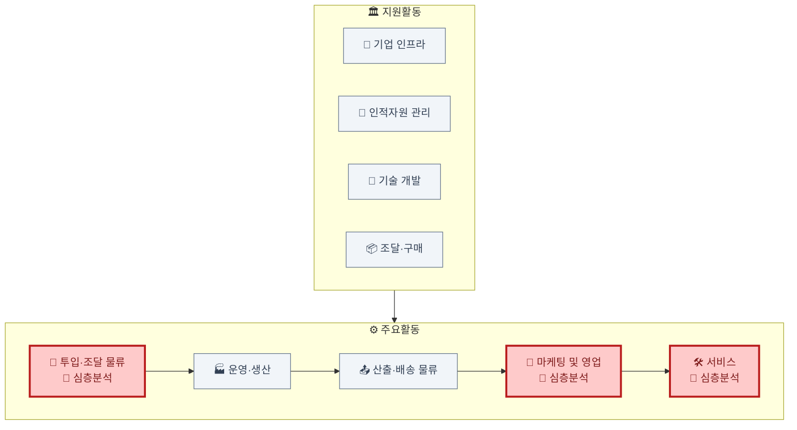

# 가치사슬 분석: 금융데이터 기반 개인 맞춤형 자산관리 서비스

> 분석 대상: 마이데이터 기반으로 개인 자산 현황을 분석하고 맞춤형 자산배분·금융상품을 추천하는 핀테크 플랫폼 사업자. [Porter's Five Forces 비교](../01.porters-five-forces/비교분석-개인자산관리-vs-1인가구배달플랫폼.md)에서 다룬 동일 시장을 기업 내부 활동 관점에서 분석.

## 분석 우선순위

이 산업은 핵심 투입자원(금융데이터)의 소유권이 자사가 아니라 은행·카드사에 있다는 점이 활동 전반을 규정한다. **투입·조달 물류(마이데이터 의존), 마케팅 및 영업(크로스셀 전환), 서비스(불완전판매 리스크 관리)** 세 활동에 원가·수익·규제 리스크가 집중되므로 이 세 곳을 심층 분석하고, 나머지 활동은 간략히 짚는다.

## 심층 분석

### 투입·조달 물류 (Inbound Logistics) — 소유하지 못하는 원재료
- 핵심 투입자원은 마이데이터 API를 통해 들어오는 **고객 동의 기반 금융데이터**(은행·카드사·증권사 계좌·거래내역)다. 원재료를 사서 쌓아두는 것이 아니라, 매 순간 외부 API 호출로만 확보할 수 있는 자원이라는 점이 제조업과 근본적으로 다르다.
- 데이터 제공자인 은행·카드사가 동시에 자체 자산관리 서비스를 운영하는 경쟁자이기도 해, 조달 관계 자체가 경쟁 관계와 겹친다.
- 마이데이터 중계기관이 정한 표준 API 규격을 그대로 따라야 하므로, 규격 변경이 곧 개발 비용으로 전가된다.
- **개선 관점**: 특정 은행·API 장애에 대비해 여러 마이데이터 채널을 동시에 연동해두는 이중화가 가용성 리스크를 줄이는 핵심 레버.

### 마케팅 및 영업 (Marketing & Sales) — 수익이 실제로 발생하는 지점
- 무료로 자산 현황을 조회하는 이용자를 유료 자문·상품 가입 고객으로 전환하는 것이 사실상 유일한 수익화 경로다.
- Five Forces 분석이 지적하듯 무료 조회 기능은 경쟁사와 동질화되어 있어, 전환을 이끌어내는 것은 기능이 아니라 신뢰 경험과 타이밍(생애주기 이벤트에 맞춘 추천)이다.
- **개선 관점**: 프로모션이 끝난 뒤에도 유료 전환이 유지되는지, 상품 판매와 객관적 자문 사이의 이해상충을 어떻게 관리하는지가 지속가능성을 가른다.

### 서비스 (Service) — 규제 리스크가 응축되는 지점
- 금융소비자보호법상 불완전판매 방지가 이 산업 서비스 활동의 핵심 과제다 — 일반적인 CS와 달리 잘못된 안내가 즉시 금전적 피해와 규제 제재로 이어진다.
- 자동 상담(챗봇)이 잘못된 금융 정보를 안내하지 않도록 검증하는 체계가 필요하며, 사고 발생 시 조사·보상·재발방지 프로세스가 규제기관 보고 의무와 직결된다.
- **개선 관점**: 상담 처리시간이 아니라 불완전판매 재발률을 핵심 지표로 관리해야 규제 리스크가 실제로 줄어든다.

## 나머지 활동 요약
- **운영·생산**: 데이터 수집→정제·표준화→분석→포트폴리오 추천→상품 매칭 흐름. 보안·정합성 검증이 매 단계에 필요.
- **산출·배송 물류**: 앱 UI로 자산 현황과 추천 결과를 전달, 생애주기 이벤트(월급일 등)에 맞춘 푸시 알림.
- **기업 인프라**: 금융위 마이데이터 라이선스 취득·유지, 준법감시 조직이 사업 존속의 전제.
- **인적자원 관리**: 데이터사이언티스트와 컴플라이언스 인력의 결합이 핵심 과제.
- **기술 개발**: 추천 알고리즘 자체는 상용화되어 차별화 요소가 아니며, 오히려 데이터 보안·API 통합 안정성이 기술 투자의 우선순위.
- **조달·구매**: 클라우드, 마이데이터 API 이용료, 신용정보 조회 수수료.

## 종합
금융데이터라는 단일 투입자원이 조달(은행 의존·경쟁자화)·마케팅(크로스셀이라는 유일한 수익원)·서비스(불완전판매 규제 리스크)까지 세 핵심 활동 전반에 걸쳐 있다 — [위치기반 SNS의 위치 데이터](./분석-위치기반SNS.md)가 리스크이자 차별화 자원이라는 이중성을 가졌던 것과 구조적으로 닮았다. 다만 이 산업은 그 이중성이 "규제 위반 시 사업 존속이 걸린다"는 훨씬 무거운 형태로 나타난다는 점이 다르다.
