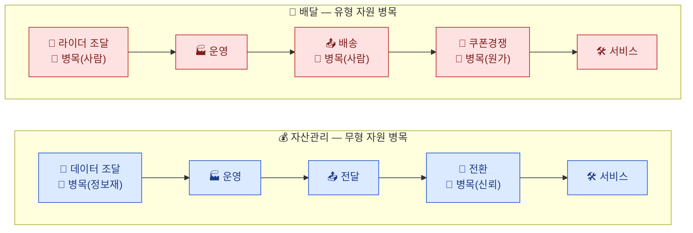

# 가치사슬 비교 분석: 개인 맞춤형 자산관리 vs. 1인 가구 배달·포장 플랫폼

> 개별 분석: [자산관리](./분석-개인자산관리서비스.md) / [배달 플랫폼](./분석-1인가구배달플랫폼.md)
> 관련 산업구조 분석: [Porter's Five Forces 비교](../01.porters-five-forces/비교분석-개인자산관리-vs-1인가구배달플랫폼.md)

## 1. 각 산업이 집중 분석한 활동

| 산업 | 심층 분석 활동 | 선정 근거 |
| --- | --- | --- |
| 자산관리 서비스 | 투입·조달 물류 / 마케팅 및 영업 / 서비스 | 데이터 의존·수익화·규제 리스크가 각각 다른 활동에서 응축됨 |
| 배달 플랫폼 | 투입·조달 물류 / 산출·배송 물류 / 마케팅 및 영업 | 라이더라는 단일 자원이 조달·산출 양쪽에 걸쳐 있고, 쿠폰 경쟁이 상시 원가로 고정됨 |

두 산업 모두 **투입·조달 물류와 마케팅 및 영업**을 공통으로 심층분석 대상에 포함했다는 공통점이 있다 — 다만 자산관리는 조달(데이터)과 마케팅(전환)이 분리된 반면, 배달은 조달(라이더)과 산출(배송)이 사실상 하나의 자원으로 묶여 있다는 점이 다르다.

## 2. 활동별 비교

| 활동 | 자산관리 서비스 | 배달 플랫폼 |
| --- | --- | --- |
| 투입·조달 물류 | 마이데이터 API로 매 순간 재확보하는 정보 자산 — 제공자가 곧 경쟁자 | 라이더·입점업체를 느슨한 플랫폼 가입으로 확보 — 소유가 아니라 접근권 |
| 운영·생산 | 데이터 정제→분석→추천→상품매칭, 보안·정합성 검증이 핵심 | 주문접수→조리→배차→픽업, 피크타임 최적화가 핵심 |
| 산출·배송 물류 | 앱 UI로 추천 결과 전달, 부가적 활동 | **본질적 활동** — 배송 품질이 곧 상품 품질 |
| 마케팅 및 영업 | 무료 조회 이용자를 유료 전환하는 것이 유일한 수익화 경로 | 쿠폰이 일회성이 아니라 상시 원가로 고정 |
| 서비스 | 불완전판매 방지가 핵심 — 잘못된 안내가 규제 제재로 직결 | 3자(소비자-라이더-입점업체) 분쟁 조정이 일반 CS보다 복잡 |
| 기술 개발 | 알고리즘 자체는 차별화 요소 아님, 데이터 보안이 우선순위 | 배차·수요예측 알고리즘이 원가 구조에 직접 영향 |

## 3. 핵심 차이: 병목의 "형태"가 다르다 — 무형 자원 vs 유형 자원

- **자산관리**의 병목(조달·마케팅)은 모두 **무형 자원**(데이터, 신뢰)에 관한 것이다. 데이터는 복제·저장이 가능하지만 소유권이 없고, 신뢰는 시간이 걸리지만 한 번 쌓이면 잘 사라지지 않는다.
- **배달**의 병목(조달·산출·마케팅)은 모두 결국 **사람의 시간이라는 유형 자원**(라이더)과 그 자원을 붙잡기 위한 원가(쿠폰)에 관한 것이다. 유형 자원은 저장이 불가능해 매 순간 재조달해야 한다.
- 이 차이가 개선 전략의 성격을 가른다 — 자산관리는 시스템·계약(API 이중화, 신뢰 브랜드 구축)으로 병목을 완화할 수 있지만, 배달은 결국 사람의 물리적 이동량 자체를 늘리거나 예측 가능하게 만드는 것 외에 근본적 해법이 없다.

## 4. 공통점: 핵심 자원을 "소유"하지 못한다

- 두 산업 모두 가치사슬의 출발점(데이터/라이더)을 **자사가 소유하지 않고 접근권만 가진다**. 이는 [Five Forces 비교](../01.porters-five-forces/비교분석-개인자산관리-vs-1인가구배달플랫폼.md)에서 지적한 "구매자·공급자의 멀티호밍"과 정확히 같은 원인에서 나온다 — 자원을 소유하지 못하니 그 자원의 주인(은행, 라이더)이 언제든 다른 플랫폼으로 옮겨갈 수 있다.
- 두 산업 모두 **수익화 지점이 핵심 가치제공 활동과 분리**되어 있다 — 자산관리는 무료 조회(가치제공)와 유료 전환(수익화)이 다른 활동이고, 배달은 배송(가치제공)과 쿠폰 경쟁(수익잠식)이 같은 마케팅 활동 안에서 충돌한다.

## 5. 전략적 시사점

- **자산관리**: 데이터 조달의 이중화(복수 API 연동)와 서비스의 규제 리스크 관리가 우선이며, 마케팅은 신뢰 기반 전환율 개선에 집중해야 한다 — 무형 자원이므로 시스템 설계로 병목을 완화할 여지가 크다.
- **배달 플랫폼**: 라이더 가동률을 예측 가능하게 만드는 것(구독형 주문 등)이 조달·산출·마케팅 세 병목을 동시에 완화하는 유일한 레버다 — 유형 자원이므로 시스템만으로는 해결되지 않고 수요 자체를 조절해야 한다.
- 가치사슬의 병목이 무형 자원인지 유형 자원인지에 따라, 같은 "심층분석 3개 활동"이라도 개선 전략의 자유도가 근본적으로 달라진다.
