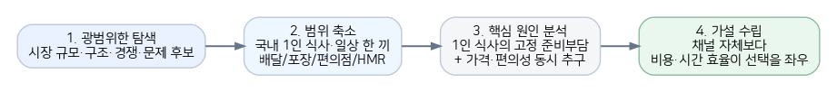
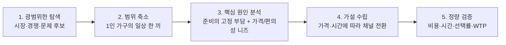

# 1인 가구 한 끼 해결 시장 — 프로젝트 개요

> 문제의식을 비즈니스 계획으로 전환하는 1~7단계 리서치 요약. 기준일 2026-08-07, 국내 시장 중심, 최신 공개자료 우선.

## 최종 가설

> **"배달 자체가 목적이 아니다."**
> 1인 가구는 배달·포장·편의점·HMR 등 특정 채널에 고정되기보다, 상황별 총비용과 총소요시간에 따라 더 효율적인 한 끼 해결 수단으로 전환할 것이다.

## 한눈에 보는 결론

1인 가구가 늘면서 "혼자 한 끼를 적은 노력과 합리적인 비용으로 해결"하려는 니즈가 커졌다. 그러나 기존 시장은 배달·포장·편의점·HMR처럼 채널별로 분절되어 있어, 소비자가 상황별 비용·시간을 비교해 최적 수단을 고르기 어렵다는 가설로 좁혔다.

| 구분 | 핵심 판단 | 근거 데이터 |
| --- | --- | --- |
| 시장 성장 | 온라인 음식서비스는 여전히 큰 성장시장 | 2025년 41.49조원, 전년 대비 +12.2%; 2026년 5월도 음식서비스 +10.2% YoY |
| 수요 구조 | 1인 생활단위가 계속 확대 | 2025년 1인 가구 824.4만, 일반가구의 36.6% |
| 니즈 | 편리성과 비용 절감이 동시에 중요 | KREI 2025: 간편식 구매 이유 편리성 43.1%, 직접 조리보다 비용 절감 31.8% |
| 배달 채널의 마찰 | 1인 주문은 많지만 최소주문금액이 이탈을 유발 | 배민 2025: 42.1%가 혼자 먹을 음식 주문; 그중 59.7%는 최소주문금액이 높으면 포기·전환 |
| 가설 피벗 | "저렴한 묶음배달"은 차별화 가설로 폐기 | 두잇이 배달비 0원·최소주문금액 0원·1인가구 특화 모델을 이미 운영 |
| 최종 가설 | 채널이 아니라 총비용×총시간이 선택을 좌우할 가능성 | 5단계에서 가격·시간 조건별 선택률/WTP로 정량 검증 |

> ⚠️ **주의**: "1인 식사 주문 참고시장 약 17.5조원"은 공식 통계가 아니라 2025 음식서비스 거래액 × 배민 1인 주문자 비중을 적용한 Top-down 참고 추정치다. 최종 SAM은 [08-TAMSAMSOM단계별대응구조.md](./08-TAMSAMSOM단계별대응구조.md)에서 1인가구 인구 × 연령대별 배달앱 결제액을 곱한 bottom-up 방식(9.02조원, 배달·포장 채널)으로 재확정했다.

## 전체 로직 흐름 (1~5단계)

## 데이터 해석 원칙

- 공식 통계는 "사실", 공개 설문을 거래액에 적용한 값은 "추정", 소비행동 변화 문장은 "가설"로 구분한다.
- 2025년 음식서비스 41.4882조원은 **온라인 음식서비스 거래액**이지 배달앱 플랫폼 매출이 아니다.
- 약 17.5조원은 41.4882조 × 42.1%로 계산한 참고치로, 1인 주문자의 객단가·빈도가 전체 이용자와 같다는 강한 가정이 포함된다.
- 최종 가설이 배달·포장·편의점·HMR을 함께 보므로, 최종 SAM은 채널별 데이터를 확보하는 대로 갱신한다 — 배달·포장은 [08-TAMSAMSOM단계별대응구조.md](./08-TAMSAMSOM단계별대응구조.md)에서 9.02조원으로 확정했고, 편의점·HMR은 1인가구 몫을 분리한 통계가 없어 참고치로만 병기했다.
- 두잇의 존재는 "1인분 저가 배달 문제"가 실재한다는 검증 사례인 동시에, 같은 해법의 차별성이 낮다는 반증 자료로 사용했다.

## 출처 및 데이터 메모

- [S1] 국가데이터처, 2025년 인구주택총조사 등록센서스 방식 결과, 2026-07-28
- [S2] 대한민국 정책브리핑, 2025년 인구주택총조사 결과 브리핑 (1인 가구 824만, 36.6%, 서울 40.5%)
- [S3] 국가데이터처, 2025년 12월 온라인쇼핑동향 및 연간 동향, 2026-02-02
- [S4] 국가데이터처, 2026년 5월 온라인쇼핑동향, 2026-07-01
- [S5] 한국농촌경제연구원, 2025년 식품소비행태조사 결과발표대회
- [S6] 매일경제, "1인분도 무조건 무료 배달입니다"…'한그릇' 메뉴 주문량 급증, 2025-06-25
- [S7] 두잇 공식 사이트, 1인가구를 위한 무료배달앱
- [S8] 사용자 첨부자료, [Porter's Five Forces 분석 - 1인 가구 대상 음식 배달·포장 주문 플랫폼](../../01.porters-five-forces/분석④-1인가구배달플랫폼.md)
- [S9] 사용자 첨부자료, [가치사슬 분석 - 1인 가구 대상 음식 배달·포장 주문 플랫폼](../../02.value-chain/분석-1인가구배달플랫폼.md)
