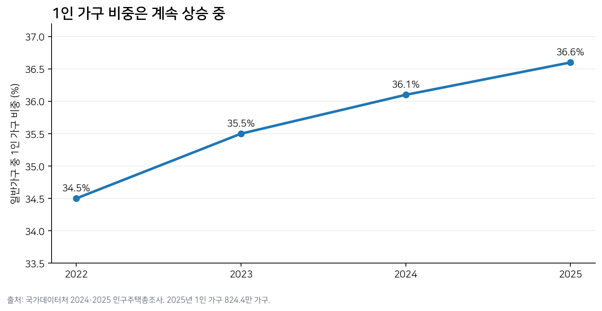

# 1단계 — 광범위한 탐색 (Broad Inquiry)

> 거시적 시장을 넓게 보고, 시장의 크기·구조·경쟁·문제 후보를 수집하는 단계.
> **AI 역할**: 시장 리서처 + 구조 분석가
> **핵심 산출물**: 시장 정의, 최신 시장규모, 수요/공급/경쟁/대체재 지도, 문제 후보 목록

## 1-1. 시장 정의

| 포함 | 인접·대체 시장 | 초기 분석에서 제외 |
| --- | --- | --- |
| 배달앱 음식주문, 포장 주문 | 편의점 즉석식/도시락, HMR·밀키트, 온라인 식품구매 | 회식·단체주문, 고급 외식 목적 소비 |
| 1인분·소액 주문 상황 | 직접조리(비용·시간 비교의 기준선) | B2B 급식·단체케이터링 |

## 1-2. 시장을 움직이는 최신 숫자

| 지표 | 최신 수치 | 해석 |
| --- | --- | --- |
| 1인 가구 | 824.4만 가구 / 36.6% (2025) | 1인 생활단위가 구조적으로 확대. 서울 40.5%로 가장 높지만 전국적 현상 |
| 온라인 음식서비스 | 41.4882조원 (2025) | 사상 첫 40조원 돌파, 전년 대비 12.2% 증가 |
| 2026 성장 지속 | 음식서비스 +10.2% YoY (2026년 5월) | 2025년만의 일시적 증가로 보기 어려움 |
| 모바일 중심 | 음식서비스는 사실상 앱 중심 소비 | 온라인 음식서비스가 일상 인프라화된 배경 |

출처: 국가데이터처 「2025년 인구주택총조사 결과」(2026.07.28), 「2025년 12월 온라인쇼핑동향」(2026.02.02), 「2026년 5월 온라인쇼핑동향」(2026.07.01).

## 1-3. 산업 구조에서 보인 문제

| 관점 | 첨부자료의 진단 | 외부 데이터로 본 판정 |
| --- | --- | --- |
| 수요 | 소비자 전환비용이 낮고 가격 민감 | 확인. 최소주문금액이 높으면 1인 주문자의 59.7%가 포기·타 가게 전환 |
| 공급/배송 | 라이더 이동비용이 핵심 제약 | 부분 확인. 공개 단위경제성 자료는 부족하지만 저가 주문에 대한 수수료 면제·배달비 지원 정책은 비용 압박을 시사 |
| 대체재 | HMR·편의점 등이 강한 대체재 | 확인 방향. KREI에서 간편식 구매 핵심 이유가 편리성·비용 절감이며 온라인 구매도 증가 |
| 경쟁 | 무료배달·쿠폰 경쟁 심화 | 확인. 대형 플랫폼 무료배달 경쟁 + 두잇의 1인가구 무료배달 특화 |
| 니치 | 고밀도 1인가구 묶음배달 기회 | 수정 필요. 두잇이 이미 유사 모델을 운영하므로 '미충족 공백'으로 보기 어려움 |

> 여기서 "첨부자료의 진단"은 이 프로젝트에 앞서 진행한 [Porter's Five Forces](../../01.porters-five-forces/분석④-1인가구배달플랫폼.md)·[가치사슬](../../02.value-chain/분석-1인가구배달플랫폼.md) 분석(S8, S9)에서 나온 가설을 가리키며, 이번 1단계는 그 가설을 외부 공개 데이터로 교차검증한 것이다.

## 1단계 산출물

시장은 충분히 크고 1인 수요도 증가한다. 다만 "1인분 배달을 싸게 만들자"만으로는 이미 배민 한그릇·두잇 등과 겹친다. 문제를 배달 채널보다 한 단계 위인 **"혼자 한 끼를 어떻게 해결하는가"**로 재정의할 필요가 있다.
