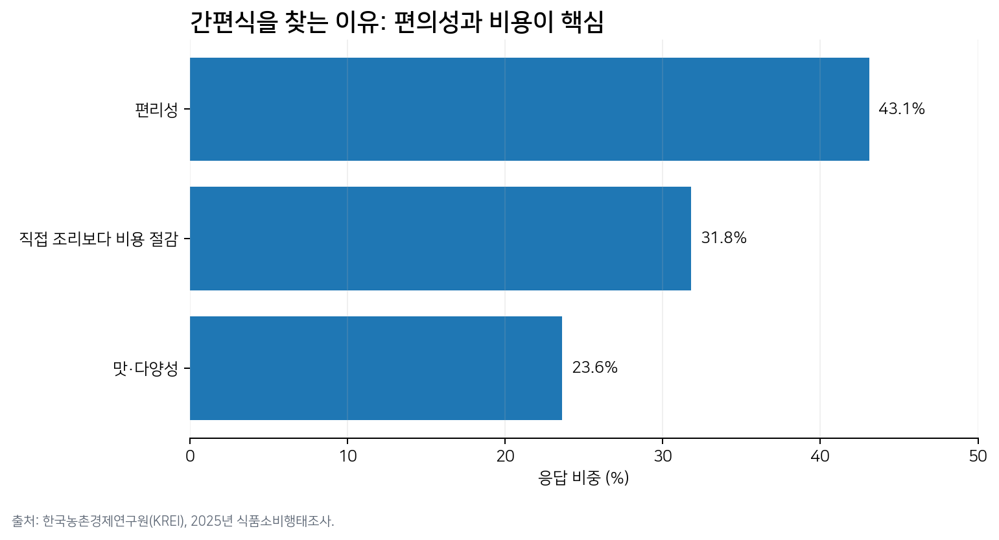
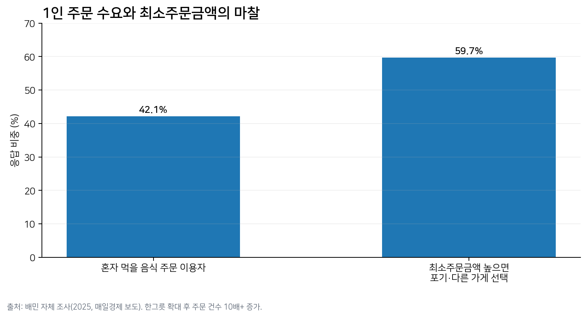
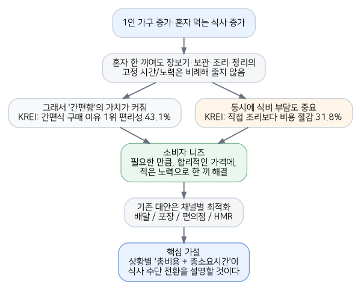
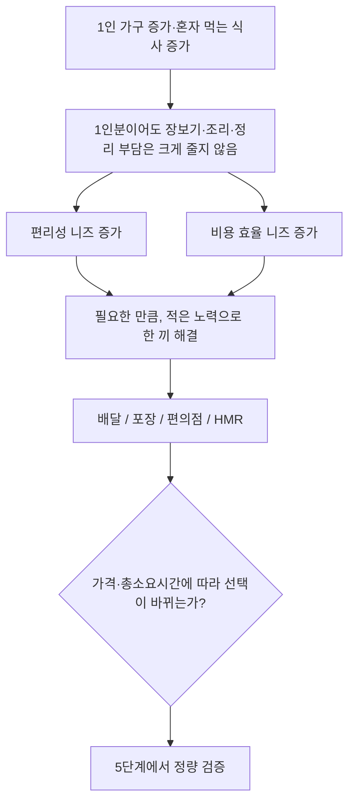

# 3단계 — 핵심 원인 분석 (Causal Analysis)

> 표면 문제인 '배달비가 비싸다'보다 왜 합리적이고 간편한 한 끼를 원하는지 원인 사슬을 찾는 단계.
> **AI 역할**: 인과 분석가
> **핵심 산출물**: 원인-니즈-시장 마찰의 인과 사슬, 근본원인과 증상의 구분, 데이터 근거

## 3-1. 데이터로 확인되는 원인

| 관찰된 사실 | 의미 |
| --- | --- |
| KREI 2025: 간편식 구매 이유 1위 편리성 43.1% | 소비자는 "조리하지 않는 것" 자체에 큰 가치를 둠 |
| 2위: 직접 재료를 사서 조리하는 것보다 비용이 적어서 31.8% | 편의성과 동시에 비용 효율도 요구 |
| 간편식 온라인 주구매 비중: 2021년 9.6% → 2025년 19.7% | 한 끼 해결 채널이 온라인·오프라인을 넘나들며 확대 |
| 간편식 비구매 이유 1위 "가격이 비싸서" 37.9% | 편리해도 가격이 맞지 않으면 대체재로 이동할 가능성 |

출처: 한국농촌경제연구원(KREI), 「2025년 식품소비행태조사 결과발표대회」.

## 3-2. 배달에서 드러나는 동일한 니즈

- 배민 자체 조사에서 이용자의 **42.1%**가 혼자 먹을 음식을 주문.
- 그중 **59.7%**는 원하는 가게의 최소주문금액이 높으면 주문을 포기하거나 다른 가게로 이동.
- 최소주문금액이 없는 5,000~12,000원 '한그릇' 확대 후 5월 첫째 주 대비 6월 셋째 주 **주문 건수 10배+, 이용자 11배+, 메뉴 13배+** 증가.
- 따라서 "1인분 수요가 없다"보다 **"기존 구매조건이 수요를 눌렀다"**는 해석이 더 타당.

출처: 매일경제(2025.06), 배달의민족 한그릇 관련 배민 자체 조사 인용.

## 3단계 핵심 원인

1인 단위의 식사는 늘었지만, 한 끼를 준비하는 시간·노력·비용은 식사량만큼 줄어들지 않는다. 그래서 소비자는 **"필요한 만큼, 합리적인 가격에, 적은 노력으로"** 한 끼를 해결하려는 니즈를 갖는다.

## 인과 사슬 (부록)

