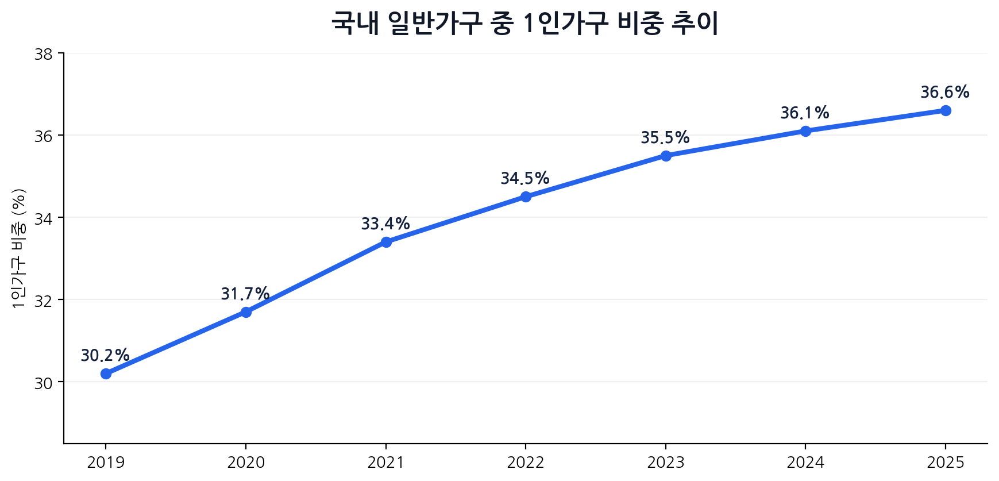
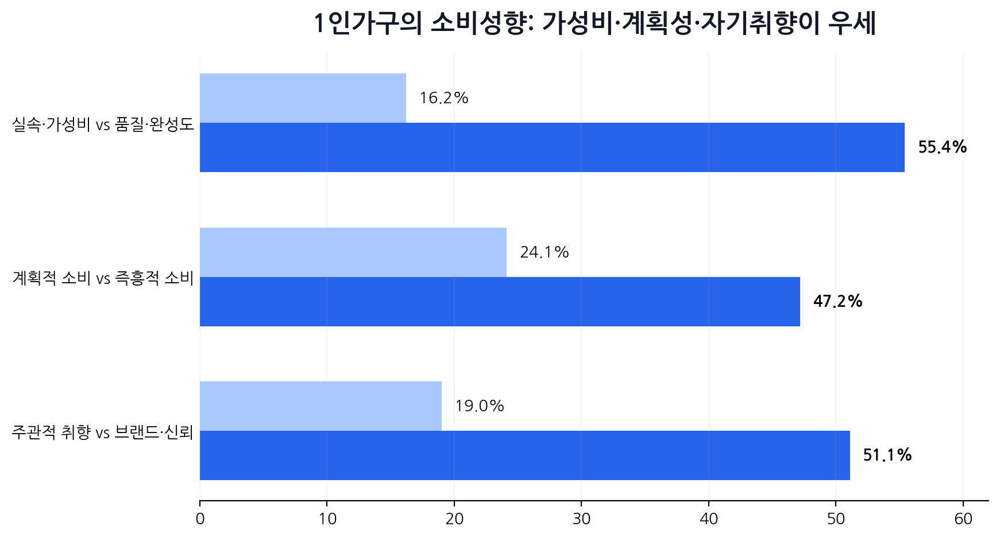
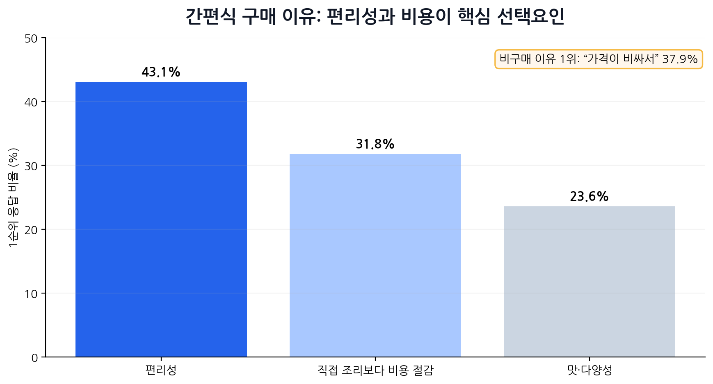
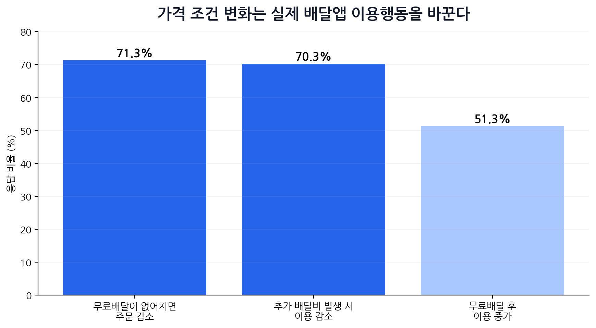
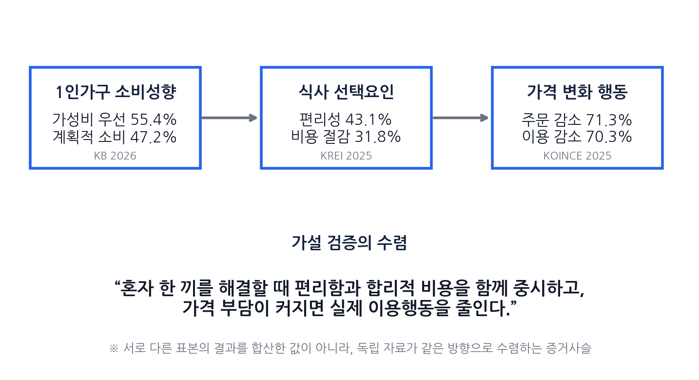
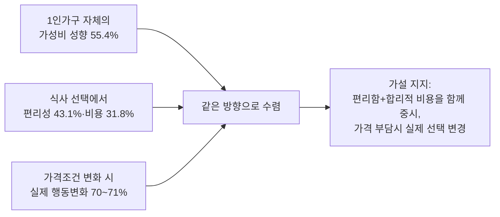

# 5단계 — 정량적 검증 및 시각화 (Quantitative Validation)

> 1인 가구의 "합리적이고 간편한 한 끼" 니즈 검증. 원본 문서(`1인가구_한끼해결_5단계_정량적검증_및_시각화.docx`) 기반 — [이전 버전](이 파일은 6단계 문서에서 역추적 재구성했던 초안을 원본 문서 내용으로 교체한 것이다).
> **AI 역할**: 데이터 시각화 담당
> **핵심 산출물**: 4단계 가설을 뒷받침하는 정량 검증 차트·테이블

## 검증 가설

> 1인 가구는 혼자 한 끼를 해결할 때 편리함과 합리적인 비용을 함께 중요하게 여기며, 가격 부담이 커질 경우 실제 식사·배달 선택을 변경한다.

작성 기준: 2026년 8월 7일 현재 공개된 최신 자료 우선.

## 1. 정량 검증 구조

이번 단계는 새로운 설문을 설계하는 단계가 아니라, 이미 공개된 통계와 조사자료를 이용해 가설의 각 부분을 숫자로 검증하고 시각화하는 단계다. **서로 다른 조사 결과를 한 표본처럼 합산하지 않고, 각 자료의 모집단·표본·연도를 분리해 해석한다.**

| 자료 | 대상 | 시점 | 핵심 변수 | 가설에서 역할 |
| --- | --- | --- | --- | --- |
| 국가데이터처 인구주택총조사 | 전국 일반가구 | 2019~2025 | 1인가구 비중 추이 | 시장 배경 규모 |
| KB경영연구소 2026 한국 1인가구 보고서 | 주요 도시 25~59세 경제활동 1인가구 n=2,000 | 2026 | 소비성향 | 1인가구 자체의 가성비 성향 |
| KREI 2025 식품소비행태조사 | 식품 주 구입자·가구 조사 | 2025 | 간편식 구매 이유 | 식사 선택에서 편리성·비용 요인 |
| 한국소비자교육지원센터·인하대 | 전국 배달앱 이용자 n=1,000 | 2025.08 | 무료배달·배달비 변화 행동 | 가격 변화가 실제 행동에 미치는 영향 |

**해석 원칙**: ① "1인가구 성향"은 KB 자료로 직접 검증한다. ② "식사 선택에서 편리성과 비용이 중요하다"는 KREI로 검증한다. ③ "가격이 바뀌면 행동이 바뀐다"는 배달앱 이용자 조사로 검증한다. **세 자료의 비율을 서로 더하거나 곱하지 않는다.**

## 2. 문제 규모: 1인가구는 구조적으로 커지고 있다

2019년 30.2%였던 1인가구 비중은 2024년 36.1%, 2025년 36.6%까지 상승했다. 2025년 1인가구는 824만 4천 가구로, 전체 일반가구에서 가장 큰 가구형태다. 즉 "혼자 한 끼를 해결하는 상황"은 일시적 니치가 아니라 **구조적으로 확대되는 생활 맥락**이다.

> **검증 포인트**: 이 차트는 가설 자체를 직접 검증하는 차트가 아니라, 문제가 발생할 수 있는 모집단의 크기와 지속성을 보여주는 배경 지표다.

## 3. 가설 검증 ① — 1인가구는 실제로 가성비를 중시하는가

KB경영연구소가 전국 주요 도시에 거주하며 6개월 이상 혼자 살고 독립적 경제활동을 하는 만 25~59세 1인가구 2,000명을 조사한 결과, "실속·가성비 우선"은 **55.4%**로 "품질·완성도 우선" 16.2%의 약 3.4배였다. 계획적 소비(47.2%)도 즉흥적 소비(24.1%)보다 높았다.

> **판정**: 가설 중 "1인가구가 합리적인 비용을 중요하게 여긴다"는 부분은 1인가구 자체를 대상으로 한 최신 2026년 정량조사에서 **직접 지지**된다.

## 4. 가설 검증 ② — 한 끼 선택에서 편리성과 비용이 함께 작동하는가

2025년 KREI 식품소비행태조사에서 간편식을 구입하는 가장 큰 이유는 **편리성 43.1%**, 직접 조리보다 비용이 적게 들어서 **31.8%**, 맛·다양성 23.6% 순이었다. 반대로 간편식을 구입하지 않는 이유 1위는 "가격이 비싸서" **37.9%**였다.

> **판정**: 식사 해결 방식의 선택에서 "편리함"과 "비용"이 동시에 상위 요인으로 나타난다. 따라서 한 끼 니즈를 단순히 "빨리 먹고 싶다" 또는 "싸게 먹고 싶다" 하나로 축소하기보다 **두 요소가 함께 작동하는 문제**로 보는 편이 데이터와 맞다.

## 5. 가설 검증 ③ — 가격 부담이 커지면 실제 행동이 바뀌는가

한국소비자교육지원센터와 인하대가 2025년 8월 전국 배달앱 이용자 1,000명을 조사한 결과, 무료배달이 없어지면 주문을 줄이겠다는 응답이 **71.3%**, 추가 배달비가 생기면 이용을 줄이겠다는 응답이 **70.3%**였다. 반대로 무료배달 시행 후 이용이 늘었다는 응답도 51.3%였다. 만족도는 시행 전 36.6%에서 시행 후 66.1%로 **29.5%p 상승**했다.

> **판정**: 가격은 단순한 선호 요인이 아니라 실제 주문 빈도와 만족도를 바꾸는 **행동 변수**다. 가설의 "가격 부담이 커질 경우 실제 선택을 변경한다"는 부분을 가장 직접적으로 지지하는 수치다.

## 6. 정량 데이터의 수렴: 가설 전체를 한눈에 보기

세 데이터는 조사대상이 서로 다르므로 하나의 통계량으로 합칠 수는 없다. 대신 **"1인가구 자체의 가성비 성향 → 식사 선택에서 편리성·비용 중시 → 가격조건 변화 시 실제 주문행동 변화"**라는 논리적 사슬로 병치하면 가설의 각 구성요소가 독립된 자료에서 같은 방향으로 확인된다.

## 7. 최종 정량 검증 테이블

| 검증 요소 | 지표 | 수치 | 출처/표본 | 판정 |
| --- | --- | --- | --- | --- |
| 문제 규모 | 1인가구 비중 | 36.6% | 국가데이터처 2025 | 배경 지지 |
| 합리적 비용 니즈 | 실속·가성비 우선 | 55.4% | KB 2026, 1인가구 n=2,000 | 직접 지지 |
| 편의성 니즈 | 간편식 구매 이유: 편리성 | 43.1% | KREI 2025 | 지지 |
| 비용 니즈 | 간편식 구매 이유: 비용 절감 | 31.8% | KREI 2025 | 지지 |
| 가격장벽 | 간편식 비구매 이유: 가격이 비싸서 | 37.9% | KREI 2025 | 보조 지지 |
| 가격→행동 | 무료배달 종료 시 주문 감소 | 71.3% | KOINCE·인하대 2025, n=1,000 | 강한 지지 |
| 가격→행동 | 추가 배달비 발생 시 이용 감소 | 70.3% | KOINCE·인하대 2025, n=1,000 | 강한 지지 |
| 가격→행동 | 무료배달 후 이용 증가 | 51.3% | KOINCE·인하대 2025, n=1,000 | 강한 지지 |

**최종 판정: 가설 지지.** 1인가구는 전반적으로 가성비를 중시하며, 식사 선택에서는 편리성과 비용이 핵심 선택요인으로 나타난다. 또한 배달앱 시장에서는 가격 부담의 증감이 실제 이용 빈도와 만족도 변화로 이어진다. 따라서 "혼자 한 끼를 해결할 때 편리함과 합리적 비용을 함께 중요하게 여기고, 가격 부담이 커질 경우 실제 선택을 변경한다"는 가설은 공개된 정량자료에 의해 상당 부분 지지된다.

## 8. 해석 한계와 보조 데이터

정량 검증의 설득력을 유지하려면 다음 한계를 같이 제시해야 한다. 숫자가 예쁘다고 표본의 정체까지 예뻐지는 건 아니어서, 조사대상이 다르면 반드시 분리해서 읽어야 한다.

| 자료 | 해석 한계 |
| --- | --- |
| KB 2026 | 1인가구 자체 조사라 가설의 핵심 근거로 적합하나, 만 25~59세·주요 도시·경제활동 1인가구라는 표본 범위가 있다. |
| KREI 2025 | 식사 선택요인을 보여주지만 1인가구만의 응답은 아니다. 따라서 "식사시장 전체의 선택 메커니즘"을 뒷받침하는 자료로 사용한다. |
| KOINCE 2025 | 배달앱 이용자 조사라 실제 가격반응을 잘 보여주지만 1인가구로 한정된 표본은 아니다. |
| 배민 자체조사 | 이용자의 42.1%가 혼자 먹을 음식을 주문하고, 이 중 59.7%가 최소주문금액이 높으면 주문을 포기하거나 다른 가게를 선택했다고 알려졌지만 표본 수가 공개되지 않아 메인 차트에서는 제외하고 보조근거로만 활용한다. |

## 9. 출처

- 국가데이터처, 2025년 인구주택총조사 등록센서스 방식 결과
- 국가데이터처, 2024년 인구주택총조사 결과(시도별 1인가구 비율 2019~2024)
- KB경영연구소, 2026 한국 1인가구 보고서
- 한국농촌경제연구원, 2025년 식품소비행태조사 결과발표대회
- 한국소비자교육지원센터, 2025 배달앱 이용행태와 소비자만족도 조사 보도자료
- 보조: 배민 1인 주문 관련 조사 보도
