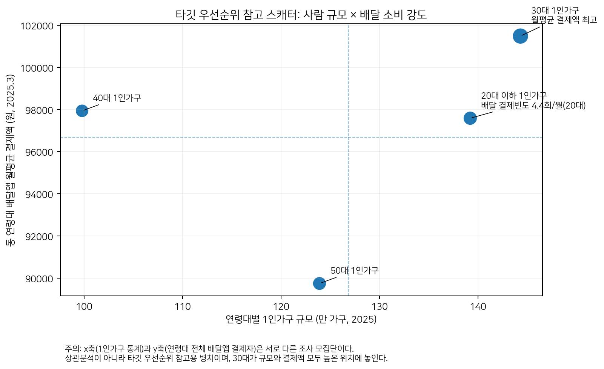
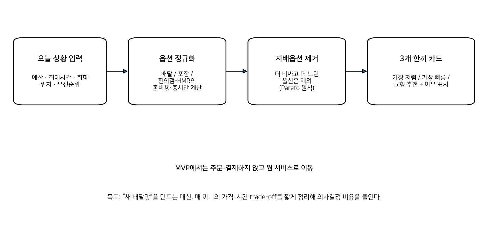
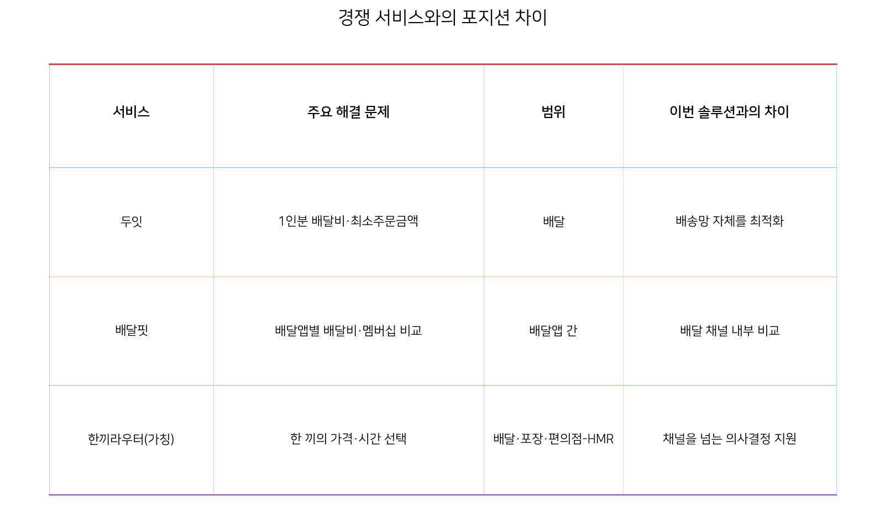
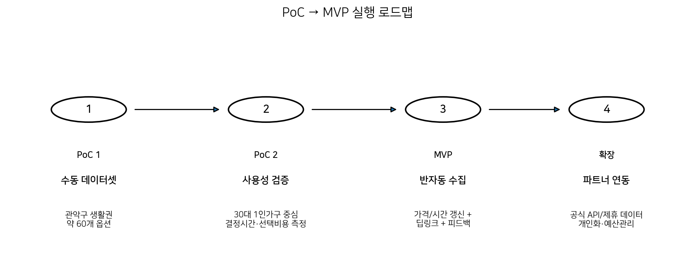
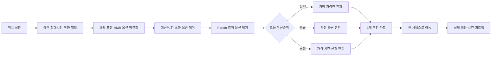

# 7단계 — 솔루션 구체화 (Solution Definition & SRS)

> 1인 가구 한 끼 해결 서비스, 가칭 **"한끼라우터"** · PoC/MVP 실행계획 및 소프트웨어 요구사항 명세서 v0.1
> **AI 역할**: 브레인스토밍 파트너 + 실행계획 문서화
> **핵심 산출물**: 실행 계획(SRS) 문서
> 작성 기준: 2026-08-07, 공개자료 및 1~6단계 분석 결과

## 요약

| 핵심 문제 | 가격 × 편의 — 한 끼마다 반복되는 trade-off |
| --- | --- |
| 1차 타깃 | 30대 1인가구 (2025년 144.3만 가구) |
| 핵심 기능 | 3개 한끼 카드 — 저렴 / 빠름 / 균형 |
| MVP 원칙 | 주문 중개 X, 의사결정 지원에 집중 |

## 1. 최종 의사결정

**결론**: "저렴한 1인분 배달앱"을 하나 더 만드는 대신, 사용자가 오늘의 예산·시간·취향에 맞춰 배달·포장·편의점-HMR 중 가장 적합한 한 끼 해결 경로를 빠르게 고르도록 돕는 **의사결정 서비스**를 만든다.

**검증 근거**

| 지표 | 값 | 의미 |
| --- | --- | --- |
| 1인가구 실속·가성비 우선 | 55.4% | [6단계](./06-반복적정제.md) 최종 증거층 1 |
| 반복성 | 12.9끼/주 | 경제활동 1인가구 평균 |
| 가격 반응 | 약 70% | 배달비 발생/무료배달 종료 시 이용 감소 |
| 경쟁 공백 | 채널 간 | 배달 자체가 아닌 "한 끼 방식" 선택 |

**왜 이 방향인가?** 두잇은 배달비 0원·최소주문금액 0원을 내세워 "저렴한 1인 배달"을 이미 강하게 해결하고 있고, 배달핏은 배달앱 간 배달비·멤버십 비교를 제공한다. 따라서 새로운 공급망을 만드는 것보다, 여러 식사 해결 수단 사이의 비용·시간 판단을 정규화하는 쪽이 차별성과 PoC 가능성이 높다.

## 2. 사람 세그먼트와 1차 타깃

| 사람 그룹 | 1인가구 규모(2025) | 동연령대 배달앱 월평균 결제액 | 추가 관찰 | 판단 |
| --- | --- | --- | --- | --- |
| 20대 이하 1인가구 | 139.2만 가구 | 97,590원 | 월평균 결제횟수 4.4회로 최고 | 2차 타깃/초기 사용자 |
| 30대 1인가구 | 144.3만 가구 | 101,491원 | 연령대 중 월평균 결제액 최고 | **1차 타깃** |
| 40대 1인가구 | 99.8만 가구 | 97,941원 | 규모는 상대적으로 작음 | 후속 확장 |
| 50대 1인가구 | 123.9만 가구 | 89,741원 | 배달 소비 강도 상대적 낮음 | 후속 확장 |

**1차 타깃 정의: 30대 1인가구.** 대표 상황은 "평일 퇴근 후 혼자 한 끼를 해결해야 하는 사람"이다. 연령 자체가 문제의 원인은 아니지만, 공개 데이터에서 30대는 1인가구 규모가 크고 배달앱 결제액도 높아 첫 검증집단으로 가장 설명력이 좋다. 20대는 주문 빈도가 높아 2차 초기 사용자군으로 둔다.

> ⚠️ **통계 해석 주의**: 1인가구 규모와 배달앱 결제액은 서로 다른 조사 모집단에서 나온 값이다. 따라서 "30대 1인가구의 월 배달비가 101,491원"이라고 해석하지 않는다. 이 자료는 타깃 우선순위를 정하기 위한 병치 자료다.

## 3. 솔루션 후보 수렴

| 후보 | 문제 적합성 | 차별성 | PoC 난이도 | 핵심 판단 |
| --- | --- | --- | --- | --- |
| A. 저렴한 1인 배달망 | 높음 | 낮음 | 매우 높음 | 두잇과 직접 중복. 공급망·라이더 운영 필요 |
| B. 배달앱 가격비교 | 중간 | 낮음 | 중간 | 배달핏 등과 겹침. 문제를 배달 채널 안에 가둠 |
| C. 월간 식사 패스 | 높음 | 중간 | 높음 | 가맹점 제휴와 정산 구조가 PoC부터 필요 |
| D. 포장 특가 탐색 | 중간 | 중간 | 낮음 | 가격은 해결하지만 편의성이 크게 훼손될 수 있음 |
| **E. 한끼라우터** | **매우 높음** | **높음** | **낮음~중간** | 기존 채널을 활용하면서 가격·시간 trade-off를 직접 해결 |

**선정 솔루션: E. 한끼라우터(가칭).** 핵심은 "모든 가격을 긁어오는 비교 사이트"가 아니라, 서로 성격이 다른 식사 옵션을 한 끼 기준으로 정규화해 판단을 빠르게 만드는 것이다.

## 4. 솔루션 정의

| 항목 | 정의 |
| --- | --- |
| 제품 한 줄 | 오늘 한 끼의 예산·시간·취향을 입력하면 배달·포장·편의점-HMR 중 "가장 저렴 / 가장 빠름 / 균형" 3개 선택지를 보여주는 서비스 |
| 사용자 입력 | 현재 위치, 한 끼 예산, 최대 허용시간, 먹고 싶은 카테고리/제외 음식, 오늘의 우선순위 |
| 핵심 출력 | 총비용, 총소요시간, 선택 이유, 최소주문/이동 조건, 데이터 갱신시각, 원 서비스 이동 버튼 |
| MVP에서 하지 않는 것 | 직접 주문·결제, 라이더 배차, 음식점 정산, 구독권 판매, 실시간 쿠폰 자동 적용 |
| 차별점 | 배달앱끼리의 비교가 아니라 서로 다른 "한 끼 해결 방식"을 동일한 비용·시간 축으로 정규화 |

### 4.1 추천 원칙: 임의 가중치 대신 Pareto 방식

균형 추천에서 "가격 40%, 시간 30%"처럼 근거 없는 가중치를 고정하지 않는다. 먼저 사용자의 예산·시간 조건을 넘는 옵션을 제거하고, 남은 옵션 중 다른 옵션보다 더 비싸면서 더 느린 선택지를 제거한다(파레토 열위 제거). 그 뒤 취향 적합도와 사용자가 고른 우선순위로 정렬한다. 이렇게 하면 추천 이유를 설명하기 쉽고 PoC에서 기준을 조정하기도 쉽다.

| 모드 | 1순위 기준 | 사용자에게 보이는 문구 예시 |
| --- | --- | --- |
| 절약 | 총현금지출 최소 | "오늘 예산에서 가장 적게 드는 한 끼" |
| 빠름 | 총소요시간 최소 | "지금 가장 빨리 먹을 수 있는 한 끼" |
| 균형 | 비용·시간 모두 열위인 옵션 제거 후 취향 적합도 | "가격과 시간을 둘 다 낭비하지 않는 선택" |

## 5. 기존 서비스와의 경계

**중요한 제품 경계**: 한끼라우터는 "두잇보다 더 싼 배달"도, "배민·쿠팡이츠 중 누가 더 싼지"만 보는 서비스도 아니다. 사용자가 한 끼를 해결하는 순간에 배달·포장·HMR을 같은 화면에서 비용과 시간으로 비교해 선택을 끝내게 하는 것이 제품의 본체다.

## 6. PoC 계획

| 항목 | PoC 설계 |
| --- | --- |
| 검증 질문 | 정규화된 총비용·총시간 정보를 제시했을 때 사용자의 한 끼 결정시간과 선택비용이 줄어드는가? |
| 1차 사용자 | 30대 1인가구 중심. 20대 1인가구를 보조군으로 포함 |
| 테스트 생활권 | 서울 관악구 1개 생활권. 1인가구 관련 월별 통계를 공개하고 식생활 지원을 정책과제로 두는 지역 |
| 옵션 데이터 | 배달/포장 음식점 약 30곳 + 편의점 약 10곳 + HMR 약 20개 품목 = 약 60개 옵션 |
| 데이터 수집 | PoC는 수동·공개자료·제휴가능 자료만 사용. 비공개 플랫폼 데이터 무단 스크래핑은 제외 |
| 테스트 방식 | 평소 방식으로 한 끼 선택 → 프로토타입으로 동일 조건 재선택. 결정시간·선택비용·채널변경·만족도 비교 |

### 6.1 PoC 핵심 지표와 성공 기준

| 지표 | 정의 | PoC 내부 성공 기준* |
| --- | --- | --- |
| 결정시간 | 메뉴 탐색 시작~최종 선택까지 걸린 시간 | 기존 방식 대비 중앙값 30% 이상 단축 |
| 선택 총비용 | 실제로 선택한 한 끼의 총 현금지출 | 기존 첫 선택 대비 중앙값 10% 이상 절감 |
| 추천 수용률 | 상위 3개 카드 중 하나를 최종 선택한 비율 | 40% 이상 |
| 채널 전환률 | 처음 생각한 방식과 다른 식사 채널을 선택한 비율 | 관찰값 확보(목표치 고정하지 않음) |
| 데이터 오류율 | 화면 가격/시간과 확인 시점 실제 정보가 불일치한 비율 | 5% 미만 |

\* 성공 기준은 외부 통계가 아니라 PoC 의사결정을 위한 내부 기준값이다. 결과에 따라 조정한다.

## 7. MVP 범위

| 우선순위 | 기능 | MVP 처리 |
| --- | --- | --- |
| MUST | 위치/예산/시간/취향 입력 | 포함 |
| MUST | 배달·포장·편의점-HMR 옵션 정규화 | 포함 |
| MUST | 저렴/빠름/균형 3개 카드 추천 | 포함 |
| MUST | 총비용·총시간·추천이유·갱신시각 표시 | 포함 |
| MUST | 원 서비스/매장으로 이동 | 포함 |
| MUST | 선택 결과 및 실제 비용·시간 피드백 | 포함 |
| SHOULD | 즐겨찾기·최근 선택 | 포함 가능 |
| SHOULD | 주간 한 끼 지출 요약 | 후순위 |
| WON'T | 앱 내 주문·결제/라이더 배차 | MVP 제외 |
| WON'T | 실시간 개인 쿠폰·멤버십 자동계산 | MVP 제외 |

## 8. SRS — 소프트웨어 요구사항 명세서

> 문서 상태: v0.1 / PoC 검증 전. "MUST"는 MVP 출시 전 충족해야 하는 기능 요구사항이다.

### 8.1 사용자 및 시스템 액터

| 액터 | 역할 |
| --- | --- |
| 사용자 | 오늘의 한 끼 조건을 입력하고 추천을 비교해 외부 서비스로 이동 |
| 데이터 관리자 | 메뉴·가격·시간·영업여부·갱신시각을 등록/수정/검수 |
| 추천 엔진 | 조건 필터링, 비용·시간 정규화, Pareto 제거, 결과 정렬 |
| 외부 서비스 | 배달앱, 음식점 주문채널, 편의점/상품 상세페이지 등 실제 구매처 |

### 8.2 기능 요구사항

| ID | 우선 | 요구사항 | 설명 | 수용 기준 |
| --- | --- | --- | --- | --- |
| FR-01 | MUST | 위치 설정 | 사용자는 동 단위 위치 또는 현재 위치를 설정할 수 있어야 한다. | 정확한 주소 저장 없이 생활권 단위로 추천 가능 |
| FR-02 | MUST | 한 끼 조건 입력 | 예산, 최대시간, 음식 카테고리, 제외조건, 우선순위를 입력한다. | 필수값 누락 시 명확한 안내 |
| FR-03 | MUST | 옵션 정규화 | 서로 다른 채널 데이터를 총비용·총시간 공통 필드로 변환한다. | 모든 노출 옵션에 두 값이 존재 |
| FR-04 | MUST | 조건 필터 | 예산/시간/영업/최소주문 조건을 충족하지 못하는 옵션을 제외한다. | 필터 이유 확인 가능 |
| FR-05 | MUST | 추천 생성 | 저렴/빠름/균형 3종 결과를 최대 3개 카드로 제시한다. | 중복 옵션을 최소화하고 이유 표시 |
| FR-06 | MUST | 비교 상세 | 가격 구성, 시간 구성, 거리·최소주문, 갱신시각을 보여준다. | 사용자가 총액의 근거 확인 가능 |
| FR-07 | MUST | 외부 이동 | 선택 시 원 서비스/매장 페이지로 이동한다. | MVP 내부 결제 없음 |
| FR-08 | MUST | 피드백 | 선택 여부, 실제 결제액, 실제 소요시간, 만족도를 기록할 수 있다. | 미입력 시 건너뛰기 가능 |
| FR-09 | MUST | 관리자 데이터 관리 | 옵션의 가격/시간/영업/상태/갱신일을 수정·비활성화한다. | 변경 이력과 갱신시각 저장 |
| FR-10 | SHOULD | 최근 선택/즐겨찾기 | 사용자가 반복 선택을 빠르게 재사용한다. | 로그인 없이 로컬 저장 가능 구조 |

### 8.3 비용·시간 계산 규칙

| 채널 | 총비용 | 총시간 | 주의 |
| --- | --- | --- | --- |
| 배달 | 메뉴가격 + 필수 추가구매 + 배달비 - 확인 가능한 할인 | 표시 ETA | 회원 전용 할인은 적용 여부를 분리 표기 |
| 포장 | 메뉴가격 - 포장할인 | 왕복 이동 + 조리/대기 | 이동비는 도보 PoC에서는 0원, 교통 이용 시 별도 |
| 편의점-HMR | 상품가격 | 왕복 이동 + 구매 + 가열/준비 | 재고 확인이 안 되면 "재고 미확인" 배지 표시 |

### 8.4 비기능 요구사항

| ID | 영역 | 요구사항 |
| --- | --- | --- |
| NFR-01 | 성능 | PoC 데이터셋 기준 추천 결과를 2초 이내 표시하도록 설계 |
| NFR-02 | 데이터 신뢰성 | 모든 옵션에 데이터 갱신시각과 출처 유형(수동/공공/파트너)을 표시 |
| NFR-03 | 개인정보 | MVP는 정확한 집 주소를 저장하지 않고 생활권 단위 위치만 보관 |
| NFR-04 | 설명가능성 | 추천 결과는 "왜 저렴/빠름/균형인지" 한 문장으로 설명 |
| NFR-05 | 오류 처리 | 가격·시간이 불확실한 옵션은 추정값 여부를 명확히 표시하거나 추천에서 제외 |
| NFR-06 | 모바일 우선 | 핵심 입력과 결과 비교가 한 손 조작 가능한 모바일 화면에서 완료 |

## 9. 데이터 설계와 구현 현실성

| 엔터티 | 핵심 필드 |
| --- | --- |
| MealOption | option_id, channel_type, store_name, item_name, base_price, fee, discount, min_order, eta_min, walk_min, prep_min, availability, updated_at, source_type |
| UserContext | area_code, budget, max_minutes, preference_tags, exclusions, priority_mode |
| Recommendation | option_id, total_cost, total_minutes, rank_type, reason_text, generated_at |
| Feedback | recommendation_id, selected, actual_cost, actual_minutes, satisfaction, created_at |

**데이터 확보 현실성**: 한국소비자원 "참가격" 오픈 API는 상품명·판매가격·판매업소·할인 여부 등을 제공하므로 소매 가격 비교의 보조 데이터로 활용할 수 있다. 반면 주요 배달앱의 실시간 메뉴·개인별 쿠폰·재고를 범용으로 가져오는 공개 API는 이번 조사에서 확인되지 않았다. 따라서 PoC는 수동/공공/제휴 데이터를 사용하고, 파트너 연동 전 무단 스크래핑을 전제로 하지 않는다.

## 10. 사용자 흐름 및 최소 화면 세트

| 화면 | 핵심 요소 |
| --- | --- |
| S1 홈/조건입력 | 위치, 예산 슬라이더, 최대시간, 음식 태그, 절약/빠름/균형 |
| S2 추천결과 | 3개 카드, 총비용, 총시간, 추천 이유, 채널 배지, 갱신시각 |
| S3 상세비교 | 가격 구성·시간 구성·최소주문·거리·데이터 출처 |
| S4 외부이동 확인 | "원 서비스에서 가격을 다시 확인하세요" 안내 후 딥링크 |
| S5 피드백 | 실제 결제액, 실제 시간, 선택 만족도 1~5 |
| A1 관리자 | 옵션 등록/수정/비활성화, 갱신시각, 오류 플래그 |

## 11. 핵심 리스크와 대응

| 리스크 | 왜 중요한가 | MVP 대응 |
| --- | --- | --- |
| 실시간 가격/쿠폰 접근 제한 | 개인별 결제액이 앱 화면과 달라질 수 있음 | 회원 혜택 미반영/반영 여부를 분리하고 갱신시각 표시 |
| 서빙량 비교 오류 | 배달 2인분과 HMR 1인분을 단순 가격비교하면 왜곡 | 1인 기준 수량 태그와 비교가능 여부 표시 |
| 재고 불확실성 | 편의점 HMR은 매장별 재고가 다름 | PoC는 재고확인 가능한 항목만 추천하거나 미확인 배지 |
| 취향 훼손 | 최저가만 추천하면 사용자 만족이 떨어짐 | 카테고리/제외 조건을 하드필터로 사용 |
| 플랫폼 정책/약관 | 무단 수집은 지속가능하지 않음 | 수동·공공·파트너 데이터로 PoC, 제휴 전 스크래핑 금지 |
| 중개 서비스로의 범위 팽창 | 주문·결제까지 가면 운영·법적 범위가 커짐 | MVP는 정보 제공·외부 이동까지만 |

## 12. 7단계 최종 산출물 요약

| 구분 | 확정 내용 |
| --- | --- |
| 핵심 고객 | 30대 1인가구 1차, 20대 1인가구 2차 |
| 해결할 문제 | 혼자 한 끼를 먹을 때 "편리함"과 "비용" 사이에서 반복되는 의사결정 부담 |
| 솔루션 | 한끼라우터: 예산·시간·취향 기반 식사 해결 경로 추천 |
| MVP 채널 | 배달 / 포장 / 편의점-HMR |
| MVP 결과 | 가장 저렴 / 가장 빠름 / 균형 3개 추천 카드 |
| PoC 핵심 | 정규화된 비용·시간 정보가 결정시간·선택비용을 실제로 줄이는지 측정 |
| MVP 제외 | 직접 주문·결제, 배달망 운영, 실시간 개인 쿠폰 자동적용 |
| 확장 조건 | PoC에서 의사결정 단축·비용절감이 확인된 후 데이터 제휴와 개인화 확대 |

> **최종 한 문장**: "1인분 배달을 더 싸게 만드는 서비스"가 아니라, "혼자 먹는 사람이 오늘 가진 돈과 시간 안에서 가장 납득되는 한 끼를 더 빨리 고르게 하는 서비스"로 정의한다.

## 13. 주요 데이터·경쟁·구현 출처

- 국가데이터처, 2025년 인구주택총조사 등록센서스 결과 (2026-07-28)
- 뉴시스, 2025 연령대별 1인가구 수 보도 (2026-07-28)
- KB경영연구소, 2026 한국 1인가구 보고서 (2026-07-19)
- 와이즈앱·리테일 연령별 배달앱 결제 추정 보도 (2025-04-09)
- 한국소비자교육지원센터, 2025 배달앱 이용행태 조사
- 한국농촌경제연구원, 2025 식품소비행태조사 결과
- 두잇 공식 사이트 (2026 확인) — https://doeat.io/
- 배달핏 공식 사이트 (2026 확인) — https://www.baedalfit.com/
- 관악구청, 1인가구 현황 및 비전·전략체계
- 공공데이터포털, 한국소비자원 생필품 가격정보 Open API
