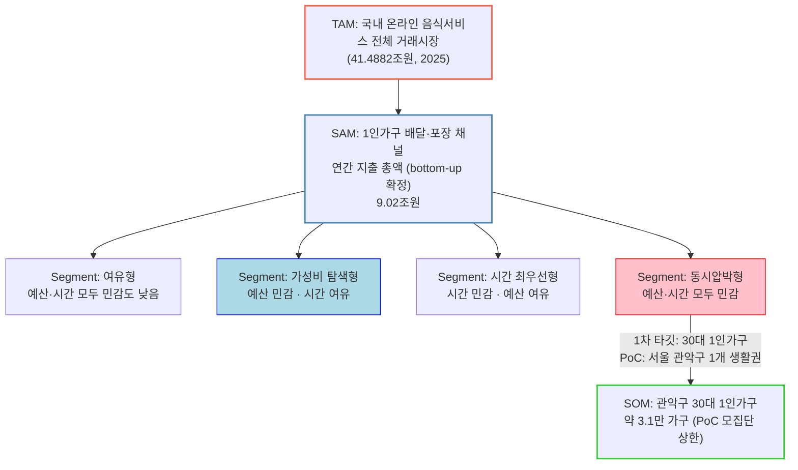

# 단계별 대응구조 — 우리 프로젝트의 TAM-SAM-SOM

> ["문제의식 to 솔루션 7단계 전략"으로부터 TAM-SAM-SOM이 추출되는 단계별 대응구조](./00-방법론.md#문제의식-to-솔루션-7단계-전략으로부터-tam-sam-som-과-market-segment-map-이-추출되는-단계별-대응구조)를 1인 가구 한 끼 해결 프로젝트에 적용한 결과.
> SAM은 기존 버전에서 "미확정"으로 남겨뒀으나, 추가 딥리서치로 **배달·포장 채널 기준 bottom-up 계산을 완료**했다. 편의점·HMR은 시장 자체 규모는 있으나 1인가구 몫만 분리한 통계가 없어 별도 참고치로 병기한다 — 억지로 합산해 가짜 정밀도를 만들지 않는다.

## 관계도

## TAM-SAM-SOM은 어느 단계에서 나왔는가

| 구분 | 작업 단계 대응 | 시장 정의 | 시장 규모 | 근거 |
| --- | --- | --- | --- | --- |
| **TAM** (전체 시장) | **1~2단계** ([광범위한 탐색](./01-광범위한탐색.md) → [범위 축소](./02-범위축소.md)) | 국내 온라인 음식서비스 전체 거래시장 | **41.4882조원 (2025)** | 국가데이터처 「2025년 12월 온라인쇼핑동향」 — 공식 통계, 확정치 |
| **SAM** (유효 시장) | **2단계** 참고추정 → **본 문서에서 bottom-up 확정** | 1인가구가 배달·포장 채널에서 쓰는 연간 지출 총액 | **9.02조원 (확정)** + 편의점·HMR 5.3~10조원(전체 시장, 1인가구 몫 별도) | 아래 "SAM 확정 계산" 참고 |
| **SOM** (초기 점유 시장) | **7단계** ([솔루션 구체화](./07-솔루션구체화-SRS.md)) | 1차 타깃(30대 1인가구) 중 PoC 대상 모집단(서울 관악구) | **약 3.1만 가구** (PoC 모집단 상한, 매출 SOM은 수익모델 확정 후 산정) | 아래 "SOM 확정 계산" 참고 |

## SAM 확정 계산 (배달·포장 채널, bottom-up)

[TAM-SAM-SOM 산식](./00-방법론.md)에 따라 **SAM = (잠재 고객 수) × (연간 지출/결제 규모)**를 연령대별로 적용했다. 기존 [2단계](./02-범위축소.md)의 "참고 SAM 17.5조원"은 "전체 온라인 음식서비스 거래액 × 혼자 주문하는 행위의 비중(42.1%)"을 곱한 **top-down 추정**이었던 반면, 아래는 실제 **1인가구 인구 수 × 연령대별 배달앱 결제액**을 곱한 **bottom-up 추정**이다.

| 연령대 | 1인가구 수 (2025) | 월평균 배달앱 결제액 | 연간 지출 |
| --- | --- | --- | --- |
| 20대 이하 | 139.2만 가구 | 97,590원 | 1.63조원 |
| 30대 | 144.3만 가구 | 101,491원 | 1.76조원 |
| 40대 | 99.8만 가구 | 97,941원 | 1.17조원 |
| 50대 | 123.9만 가구 | 89,741원 | 1.33조원 |
| 60세 이상 | 317.2만 가구 (824.4만 − 위 4개 구간) | 82,227원 | 3.13조원 |
| **합계** | **824.4만 가구** | — | **9.02조원/년** |

> 출처: 1인가구 수 — [00-개요.md](./00-개요.md) 국가데이터처 2025 인구주택총조사. 연령대별 배달앱 결제액 — 와이즈앱·리테일 연령별 배달앱 결제 추정 보도(2025-04-09, [7단계 SRS](./07-솔루션구체화-SRS.md) 인용) + 60세 이상 82,227원은 추가 딥리서치로 확보(농민신문 2025-04-09 보도, "30대 배달앱 큰손, 월평균 결제액 10만원 훌쩍" 기사 내 연령별 비교 수치).

### 이 계산이 정직하게 밝혀야 할 가정

1. **"연령대 전체 결제액"을 그 연령대의 1인가구에도 동일 적용했다.** 원본 [7단계 SRS](./07-솔루션구체화-SRS.md)는 이 결제액 데이터를 "1인가구 규모(통계청)"와 "연령대 전체 배달앱 결제자(와이즈앱)"라는 **서로 다른 모집단의 병치 자료**라고 명시적으로 경고했다. 즉 1인가구만 따로 뽑은 배달비 지출액이 아니라, "그 연령대 전체 국민의 평균 결제액"이 1인가구에도 똑같이 적용된다고 가정한 근사치다. 1인가구가 다인가구 구성원보다 배달을 더 많이/덜 이용할 수 있다는 반론이 가능하다.
2. **포장(방문수령)은 배달과 합산되어 있다고 가정했다.** 와이즈앱 결제 데이터는 앱 결제 전체(배달+포장 주문)를 포함하므로, [방법론](./00-방법론.md)이 요구한 "배달·포장·편의점·HMR" 4채널 중 배달·포장 2채널은 이미 이 9.02조원 안에 포함된 것으로 처리했다.
3. **편의점·HMR은 의도적으로 제외했다.** 국내 HMR(가정간편식) 시장은 자료마다 5.3조원(2023, 식품음료신문)~10조원(2025 전망, 여러 업계자료)으로 추정치 편차가 크고, **이 중 1인가구가 차지하는 비중을 분리한 공개 통계를 찾지 못했다.** KREI 조사는 1인가구가 간편식을 더 적극적으로 구매하는 경향만 정성적으로 확인해줄 뿐, 정량적 배분 비율은 제공하지 않는다. 이 상태에서 "1인가구가 HMR 시장의 O%를 차지한다"고 임의로 가정해 9.02조원에 더하면 근거 없는 숫자가 섞여 오히려 전체 신뢰도를 떨어뜨린다. 따라서 **9.02조원(확정) + 5.3~10조원(편의점·HMR 전체시장, 참고 병기)**으로 분리해서 제시하는 것이 지금 확보한 근거 수준에 맞는 정직한 처리다.

**최종 채택 SAM: 9.02조원(배달·포장, 확정) — 참고: 편의점·HMR 포함 시 이론적 상한 약 14~19조원(전체 간편식 시장 전액이 1인가구 몫이라는 비현실적 최댓값 가정 시).**

## SOM 확정 계산 (PoC 모집단 기준)

[7단계 SRS](./07-솔루션구체화-SRS.md)는 PoC 지역을 "서울 관악구 1개 생활권", 1차 타깃을 "30대 1인가구"로 이미 확정했다. 이를 인구 규모로 환산했다.

| 항목 | 수치 | 근거 |
| --- | --- | --- |
| 관악구 전체 세대 수 | 288,132세대 | 관악구청, 2025년 3월 말 기준 |
| 관악구 1인가구 비율 | 62.7% (서울 25개 자치구 중 최고) | 관악구청, 2025년 4월 기준 |
| 관악구 1인가구 수 | 약 18.1만 가구 | 288,132 × 62.7% |
| 30대 비중 (전국 1인가구 중) | 17.4% | [00-개요.md](./00-개요.md) 연령대별 구성비 |
| **관악구 30대 1인가구 수 (PoC 모집단 상한)** | **약 3.1만 가구** | 18.1만 × 17.4% (전국 연령 구성비를 관악구에 동일 적용한 근사치) |

> ⚠️ 관악구는 서울대·대학가가 밀집해 **전국 평균보다 청년층(20~30대) 1인가구 비중이 높을 가능성**이 크다 — 즉 3.1만 가구는 보수적으로 낮게 잡힌 하한에 가까울 수 있다. 관악구의 실제 연령대별 1인가구 분포 데이터를 구하면 더 정확히 보정할 수 있다(다음 리서치 과제로 남김).

**최종 채택 SOM: 관악구 30대 1인가구 약 3.1만 가구 — 이것이 PoC/초기 서비스가 이론적으로 도달 가능한 인구 상한이다.** 매출 기준 SOM(원화)은 한끼라우터의 수익모델(수수료/구독/광고 중 택1)이 확정되지 않아 계산하지 않는다 — 예를 들어 제휴처 전환 수수료 모델을 가정하면 "SOM(원) = 3.1만 가구 × 이용전환율 × 월 이용횟수 × 건당 수수료 × 12개월"로 즉시 계산 가능한 구조는 마련해뒀으므로, PoC에서 이용전환율 실측치가 나오는 즉시 대입하면 된다.

## 강의 예시(식량 손실)와 달라진 점

식량 손실 예시는 SAM·SOM이 각각 단일 숫자로 깔끔하게 떨어졌지만, 이 프로젝트는 그렇지 않았다 — 그 이유 자체가 두 산업의 구조적 차이를 보여준다.

1. **다채널 통합형 가설이라 채널별 데이터를 일일이 확보해야 한다.** 배달·포장은 데이터가 있었지만 편의점·HMR은 없었다 — 이는 정보 부족이 아니라, **이 시장이 아직 통합 통계가 존재하지 않을 만큼 채널이 파편화되어 있다는 사실 자체**를 보여준다(이것이 바로 [00-개요.md](./00-개요.md)의 최종 가설이 성립하는 근거이기도 하다).
2. **MVP에 수익모델이 아직 없어 SOM을 매출로 완전히 환산하지는 못했다** — 대신 인구 상한(3.1만 가구)이라는, 다음 계산으로 바로 이어지는 명확한 숫자로 대체했다.

## 다음 리서치로 남는 과제

- 편의점·HMR 지출 중 1인가구 비중을 분리한 통계(예: KREI 원자료 재분석, 카드사 소비 데이터)를 확보해 SAM을 9.02조원에서 상향 보정.
- 관악구의 실제 연령대별 1인가구 분포(전국 평균 대입이 아닌 관악구 자체 통계)를 확보해 SOM 3.1만 가구를 보정.
- PoC에서 이용전환율·객단가 실측치를 확보한 뒤, 위에 마련된 수익모델 계산식에 대입해 매출 기준 SOM을 산출.
