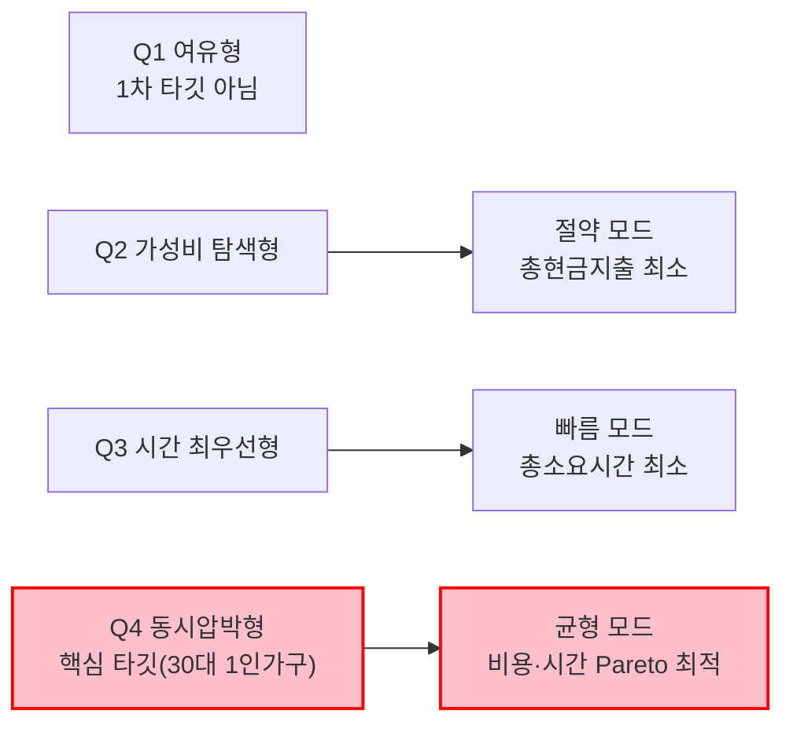
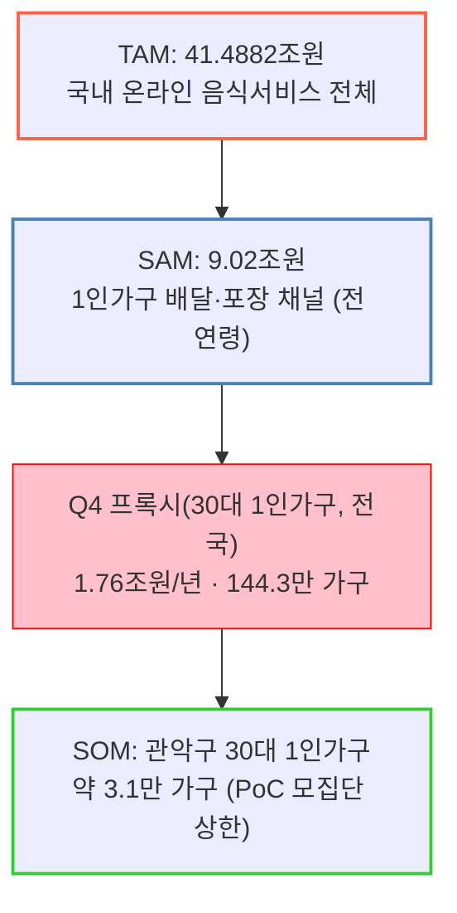

# Market Segment Map — 1인 가구 한 끼 해결

> [Market Segment Map 시각화 지침](./00-방법론.md#market-segment-map-시각화하기)에 따라, 강의 예시(잉여/부족 × 인프라 접근성)를 그대로 베끼지 않고 **이 프로젝트의 최종 가설이 실제로 다루는 두 변수**를 축으로 잡았다. [4단계](./04-가설수립.md)에서 정의한 5단계 핵심 변수(총비용, 총소요시간)와 [7단계 SRS](./07-솔루션구체화-SRS.md)의 추천 3모드(절약/빠름/균형)가 이 매트릭스의 네 칸에 그대로 대응한다.

## 왜 이 두 축인가

- 후보로 검토했던 축: (a) 연령대 × 배달 결제액 — 이미 7단계 SRS의 스캐터에서 사용함(중복), (b) 채널 선호(배달/포장/HMR) × 가격 — 채널은 결과 변수이지 세그먼트를 나누는 원인 변수가 아님.
- 최종 채택: **예산 민감도 × 시간 민감도.** 이 프로젝트의 최종 가설 자체가 "채널이 아니라 총비용×총시간이 선택을 좌우한다"이므로, 세그먼트도 이 두 변수로 나누는 것이 가설-세그먼트-솔루션(3모드)을 하나의 논리로 꿰는 가장 직접적인 방법이다.

## 2×2 매트릭스 (규모 반영)

> [08-TAMSAMSOM단계별대응구조.md](./08-TAMSAMSOM단계별대응구조.md)에서 SAM(9.02조원)·SOM(3.1만 가구)을 **연령대 기준**으로 확정했다. 이 매트릭스는 **예산×시간 민감도 기준**이라 분류축이 달라, SAM을 사분면별로 직접 쪼갤 수는 없다 — 대신 Q4의 가장 가까운 인구학적 프록시가 "30대 1인가구"이므로, 08번 문서에서 이미 계산해 둔 30대 수치를 Q4의 참고 규모로 연결한다. Q1~Q3는 예산·시간 민감도를 직접 조사한 데이터가 없어 규모를 매기지 않는다 — 근거 없는 숫자를 채우지 않는다.

| | **예산 민감도 낮음** | **예산 민감도 높음** |
| --- | --- | --- |
| **시간 민감도 낮음** | **Q1: 여유형** 특징: 배달·외식을 채널 고민 없이 이용. 가격도 시간도 크게 신경 쓰지 않음. 근거: [5단계](./05-정량적검증.md)의 "실속·가성비 우선 55.4%" 이면에 있는 나머지 44.6% 중 일부. **규모: 산정 안 함** (예산·시간 민감도 직접조사 데이터 없음) 전략: **1차 타깃 아님.** 이미 만족도가 높아 서비스 개입 유인이 약함. | **Q2: 가성비 탐색형** 특징: 시간 여유는 있어 포장·편의점·HMR 등을 직접 비교할 수 있음. 최저가 탐색에 적극적. 근거: KREI "간편식 비구매 이유 1위 가격이 비싸서 37.9%"([3단계](./03-핵심원인분석.md)) — 가격에 극도로 민감한 층. **규모: 산정 안 함** 전략: **"절약" 모드 핵심 유저.** 정보 탐색 자체를 대신해주는 것이 가치 제안. |
| **시간 민감도 높음** | **Q3: 시간 최우선형** 특징: 돈보다 지금 당장의 시간이 아까움. 배달을 압도적으로 선호. 근거: 배민 "혼자 먹을 음식 주문 42.1%"·최소주문금액 완화 후 주문 급증([3단계](./03-핵심원인분석.md)) — 편의성이 곧 시간 절약. **규모: 산정 안 함** 전략: **"빠름" 모드 핵심 유저.** 비교할 시간조차 아까우므로 즉시 추천이 핵심. | **Q4: 동시압박형 (핵심 타겟)** 특징: 예산도 시간도 여유가 없어 매번 트레이드오프에 시달림. "평일 퇴근 후 혼자 한 끼"의 전형. 근거: [7단계](./07-솔루션구체화-SRS.md) 1차 타깃 30대 1인가구(144.3만 가구, 월평균 결제액 101,491원로 전 연령대 최고)와 정확히 일치. **규모(프록시=30대 1인가구): 전국 SAM 1.76조원/년(9.02조원의 19.5%) · 전국 인구 144.3만 가구 · PoC(관악구) SOM 3.1만 가구** 전략: **핵심 목표 시장 · "균형" 모드.** 한끼라우터의 존재 이유 자체가 이 사분면. |

## 세그먼트 → 솔루션 대응

## TAM → SAM → Q4(핵심 세그먼트) → SOM 퍼널

> [08-TAMSAMSOM단계별대응구조.md](./08-TAMSAMSOM단계별대응구조.md)의 확정치를 이 지도 위에 그대로 얹은 것 — Market Segment Map은 세그먼트를 "그리는" 도구이자, TAM-SAM-SOM 숫자가 "어디로 좁혀지는지"를 보여주는 깔때기이기도 하다.

| 단계 | 규모 | TAM 대비 | 비고 |
| --- | --- | --- | --- |
| TAM | 41.49조원 | 100% | 국내 온라인 음식서비스 전체 |
| SAM | 9.02조원 | 21.8% | 1인가구 배달·포장 채널 (전 연령, bottom-up 확정) |
| Q4 프록시 (30대 1인가구, 전국) | 1.76조원 · 144.3만 가구 | 4.2% | SAM 중 핵심 타깃 세그먼트 몫 |
| SOM (관악구 PoC) | 3.1만 가구 | 30대 전국 인구의 2.15% | 1차 PoC 지역 모집단 상한, 매출 환산은 수익모델 확정 후 |

> Q1~Q3는 위 표에 없다 — SAM 9.02조원 중 나머지 78.2%(20대·40대·50대·60세+)가 이 세 사분면에 흩어져 있다는 뜻이지만, 사분면별로 정확히 얼마씩 배분되는지는 예산·시간 민감도 직접조사 없이는 알 수 없다. **"핵심 타깃(Q4) 몫만 정밀하게, 나머지는 정직하게 비워둔다"**는 원칙을 SAM/SOM 확정 때와 동일하게 유지했다.

## 이 매트릭스가 말해주는 것

- 강의 예시(식량 손실)의 매트릭스는 "공급원 vs 수요처"를 물리적으로 연결하는 물류 문제였지만, 이 매트릭스는 **한 사람이 상황에 따라 네 칸을 오간다**는 점이 다르다 — 같은 30대 1인가구도 월급날 직후엔 Q1(여유형), 월말엔 Q4(동시압박형)로 이동할 수 있다. 즉 세그먼트는 "사람 유형"이 아니라 **"상황(occasion) 유형"**에 가깝다.
- 이는 [00-개요.md](./00-개요.md)의 최종 가설("채널이 아니라 총비용×총시간이 선택을 좌우한다")과 정합적이다 — 애초에 고정된 사람 세그먼트를 나누는 것 자체가 최종 가설과 살짝 어긋나므로, PoC(6-1절 지표)에서는 "같은 사용자가 어떤 조건일 때 어느 사분면으로 이동하는지"를 함께 관찰할 필요가 있다는 것이 이 시각화의 실질적 시사점이다.
- **SAM·SOM 확정치를 얹어보니 드러난 것**: SOM(3.1만 가구)은 Q4 전국 인구(144.3만 가구)의 2.15%에 불과하다 — 즉 PoC는 "핵심 타깃의 핵심 타깃"이라는 이중으로 좁힌 표본에서 출발한다. 이는 방법론이 원래 의도한 대로다(단기 실현 가능 범위), 다만 PoC 성공이 곧 전국 144.3만 가구로의 확장을 보장하지 않는다는 점 — 관악구가 대학가 밀집지라 청년 1인가구 비중이 전국 평균보다 높다는 [08번 문서](./08-TAMSAMSOM단계별대응구조.md)의 경고와 같은 맥락 — 은 확장 단계에서 반드시 재검증해야 한다.
