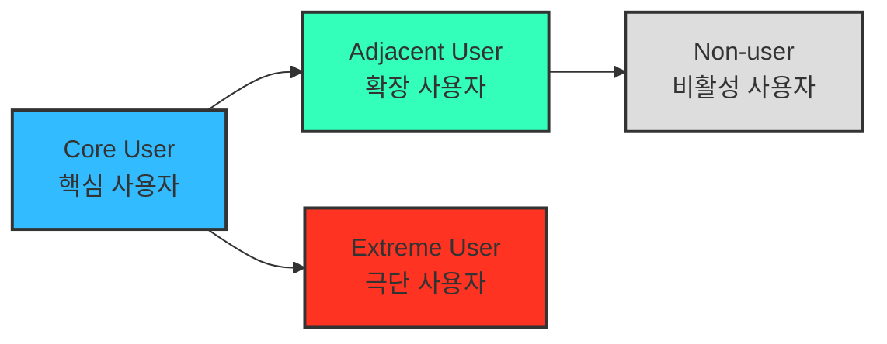

# 05 - 페르소나, 페르소나 스펙트럼, 고객 여정지도

> 이 시장 연구는 [04.tam-sam-som](../../04.tam-sam-som/1인가구한끼해결-7단계/) 단계에서 확정한 TAM-SAM-SOM과 [Market Segment Map](../../04.tam-sam-som/1인가구한끼해결-7단계/09-마켓세그먼트맵.md)을 이어받아, "정성적 문제 정의 & 정량적 가설 검증을 뚫고 상세 분석의 가치가 확인된 구체적 고객"과 만나는 단계다.
> Market Segment를 둘러본 후 만나는 고객 페르소나는 **임의로 선택한 가상의 페르소나**가 되어서는 안 된다 — 반드시 기존 시장분석(TAM-SAM-SOM + Market Segment)에서 정의한 고객 그룹으로부터 추출해야 한다.

## 1. 페르소나 (Persona)

> AI 시대의 페르소나는 더 이상 "정적 프로필"이 아니라, **"행동과 맥락의 시뮬레이션 모델"**이어야 한다.

| 구분 | 전통적 페르소나 | AI 확장형 페르소나 |
| --- | --- | --- |
| 초점 | 인구통계, 직업, 연령 등 속성 중심 | 과업·문제·맥락 중심 |
| 데이터 소스 | 설문/관찰 중심 | AI 기반 데이터 리서치, 소셜 트렌드 |
| 활용 목적 | 대표 사용자 이미지화 | 시나리오 시뮬레이션, 인터뷰 대상 선정 |

**프롬프트 원칙**: 시장 정의 문장 + 서비스 정의 문장 + 기존 작업 내용 전부(TAM-SAM-SOM + Market Segment)를 첨부한 뒤, "Market Segment가 정의하고 있는 고객 그룹 유형들로부터 페르소나를 추출"하도록 요청해야 한다. 참고자료 없이 "주요 고객 페르소나 3가지를 설정해줘"라고만 요청하면 기존 분석과 무관한 가상의 페르소나가 나올 위험이 크다.

→ 산출물: [01-페르소나.md](./01-페르소나.md) (Market Segment Map의 Q1~Q4 세그먼트로부터 추출한 4종 페르소나)

## 2. 페르소나 스펙트럼 (Persona Spectrum)

> 핵심 사용자만으로는 놓치는 **포용성(Inclusivity)**과 **사용 맥락의 다양성**을 극단적·비전형적 사용자까지 포함해 확보하는 분석 방법.

| 구분 | 설명 | 목적 | 생성 포인트 |
| --- | --- | --- | --- |
| **핵심(Core)** | 이상적인 주요 고객군 | 주력 타깃 설정 | 매출/사용 빈도 중심 |
| **확장(Adjacent)** | 유사 문제를 가진 인접 시장군 | 확장 기회 탐색 | 유사 니즈/다른 맥락 |
| **극단(Extreme)** | 제약·극단적 상황을 가진 사용자 | 제품 개선 및 포용적 설계 | 실패·불편·대안 사용 중심 |
| **비활성(Non-user)** | 아직 사용하지 않거나 회피하는 집단 | 시장 진입 장벽 및 거부 요인 파악 | 인식·가치·신뢰 결여 중심 |

**도출 핵심 질문**

- (확장) "유사한 제품/서비스를 사용하고 있는 사람은 누구인가?"
- (비활성) "이 제품/서비스를 사용할 수 없는 사람은 누구인가?"
- (극단) "가장 자주 실패를 경험하는 사람은 누구인가?"

### AI 기반 다중 페르소나 생성 및 평가 워크플로우

| 단계 | 목적 | 산출물 |
| --- | --- | --- |
| ① 1차 생성 (Divergent Thinking) | 스펙트럼 유형별 3~5개 버전 생성(핵심 5·확장 3·극단 2·비활성 2) | 총 10~12개 페르소나 원본 |
| ② 2차 평가 (Convergent Filtering) | 문제·행동·맥락의 현실성 기준으로 평가·선별 | 4개 대표 페르소나(Core/Adjacent/Extreme/Non-user) |
| ③ 3차 보정 (Contextual Rewriting) | 사업 맥락(한끼라우터)에 맞게 언어·상황 맞춤화 | 실제 적용 가능한 4종 페르소나 카드 |
| ④ 4차 검증 (AI Peer Review) | 다중 AI 교차검증 — 실제 시장 존재 확률과 근거 | 검증 코멘트 요약 리포트 |
| ⑤ 5차 통합 (Spectrum Map) | 페르소나 간 관계 구조화 | Persona Spectrum Map |

→ 산출물: `02-페르소나스펙트럼.md` (예정)

## 3. 고객 여정지도 (Customer Journey Map, CJM)

> 고객이 "문제 인식 → 탐색 → 의사결정 → 사용 → 유지" 과정에서 겪는 경험·감정·Pain Point를 시각화한 흐름도. 비즈니스 유형별로 매우 다른 맞춤형 CJM이 도출된다(예: 가구 시장 → "실측·조립/설치", 자동차 시장 → "비교·시승·협상"). **"예쁘면 다 좋은 게 아니라, 지식으로서 가치있는 부분을 가독성 높고 재사용하기 쉽게 추출하기"**가 핵심.

| 단계 | 고객 행동 | 고객 생각 | 감정 | Pain Point | 개선 기회 |
| --- | --- | --- | --- | --- | --- |
| 문제 인식 | 불편함을 느낌 | "이 문제 왜 생기는 거지?" | 불안 | 정보 부족 | 문제 원인 콘텐츠 제공 |
| 탐색 | 대안을 찾음 | "이건 괜찮아 보이는데?" | 기대 | 복잡한 비교 | 비교 툴 제공 |
| 의사결정 | 선택 고민 | "이걸 사도 될까?" | 불안 | 신뢰 부족 | 후기·데모 제공 |
| 사용 | 실제 사용 | "생각보다 어렵네" | 실망 | UX 미흡 | 온보딩 개선 |
| 유지 | 반복 사용 | "이제 익숙해졌네" | 안정 | 가치 감소 | 리텐션 캠페인 |

→ 산출물: `03-고객여정지도.md` (예정, 단계별 Pain Point를 반드시 정확·간결하게 서술)

## 이 폴더의 구성

| 파일 | 대응 단계 | 핵심 산출물 |
| --- | --- | --- |
| [01-페르소나.md](./01-페르소나.md) | 1. 페르소나 | Market Segment Q1~Q4 기반 4종 페르소나 |

> 02(페르소나 스펙트럼), 03(고객 여정지도)은 다음 작업에서 추가된다.
