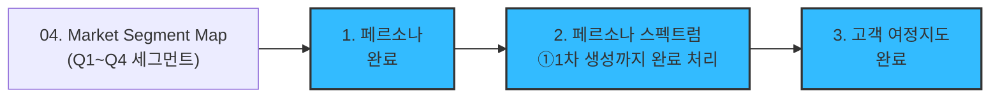
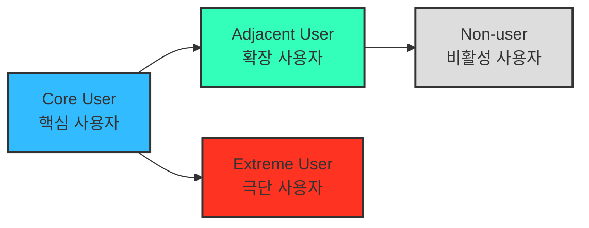
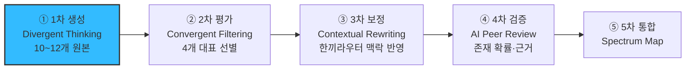
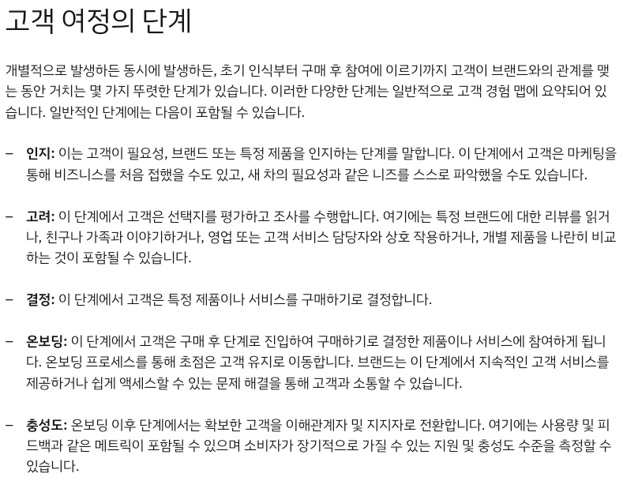
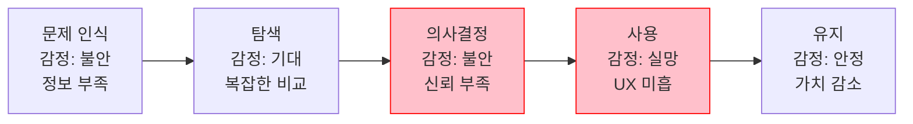

# 05 - 페르소나, 페르소나 스펙트럼, 고객 여정지도

> 이 시장 연구는 [04.tam-sam-som](../../04.tam-sam-som/1인가구한끼해결-7단계/) 단계에서 확정한 TAM-SAM-SOM과 [Market Segment Map](../../04.tam-sam-som/1인가구한끼해결-7단계/09-마켓세그먼트맵.md)을 이어받아, "정성적 문제 정의 & 정량적 가설 검증을 뚫고 상세 분석의 가치가 확인된 구체적 고객"과 만나는 단계다.
> Market Segment를 둘러본 후 만나는 고객 페르소나는 **임의로 선택한 가상의 페르소나**가 되어서는 안 된다 — 반드시 기존 시장분석(TAM-SAM-SOM + Market Segment)에서 정의한 고객 그룹으로부터 추출해야 한다.

## 이 단계의 3개 하위 작업

> ✅ **05단계 완료(2026-08-10)** — 1·2·3번 모두 산출물이 있다. 1은 세그먼트 직접 매핑, 2는 스펙트럼 ①1차 생성까지(②~⑤는 범위 밖), 3은 한끼라우터 고유 6단계로 재정의한 CJM.

## 1. 페르소나 (Persona)

> AI 시대의 페르소나는 더 이상 "정적 프로필"이 아니라, **"행동과 맥락의 시뮬레이션 모델"**이어야 한다.

| 구분 | 전통적 페르소나 | AI 확장형 페르소나 |
| --- | --- | --- |
| 초점 | 인구통계, 직업, 연령 등 속성 중심 | 과업·문제·맥락 중심 |
| 데이터 소스 | 설문/관찰 중심 | AI 기반 데이터 리서치, 소셜 트렌드 |
| 활용 목적 | 대표 사용자 이미지화 | 시나리오 시뮬레이션, 인터뷰 대상 선정 |

**프롬프트 원칙**: 시장 정의 문장 + 서비스 정의 문장 + 기존 작업 내용 전부(TAM-SAM-SOM + Market Segment)를 첨부한 뒤, "Market Segment가 정의하고 있는 고객 그룹 유형들로부터 페르소나를 추출"하도록 요청해야 한다. 참고자료 없이 "주요 고객 페르소나 3가지를 설정해줘"라고만 요청하면 기존 분석과 무관한 가상의 페르소나가 나올 위험이 크다.

→ 산출물: [01-페르소나.md](./01-페르소나.md) (Market Segment Map의 Q1~Q4 세그먼트로부터 추출한 4종 페르소나)

## 2. 페르소나 스펙트럼 (Persona Spectrum)

> 더 정확한 방법으로 내 서비스를 둘러싼 "여러 유형의 페르소나와 유형별 특성"을 파악하고, 구체적인 사례까지 확인한다. 극단적·비전형적 사용자까지 포함해 서비스의 **포용성(Inclusivity)**과 **사용 맥락의 다양성**을 확보하는 분석 방법.

**페르소나 스펙트럼 유형별 설명**

| 구분 | 설명 | 목적 | 생성 포인트 |
| --- | --- | --- | --- |
| **핵심(Core)** | 이상적인 주요 고객군 | 주력 타깃 설정 | 매출/사용 빈도 중심 |
| **확장(Adjacent)** | 유사 문제를 가진 인접 시장군 | 확장 기회 탐색 | 유사 니즈/다른 맥락 |
| **극단(Extreme)** | 제약·극단적 상황을 가진 사용자 | 제품 개선 및 포용적 설계 | 실패·불편·대안 사용 중심 |
| **비활성(Non-user)** | 아직 사용하지 않거나 회피하는 집단 | 시장 진입 장벽 및 거부 요인 파악 | 인식·가치·신뢰 결여 중심 |

**페르소나 스펙트럼 도출 핵심 질문**

- (확장) "유사한 제품/서비스를 사용하고 있는 사람은 누구인가?"
- (비활성) "이 제품/서비스를 `사용할 수 없는 사람`은 누구인가?"
- (극단) "가장 자주 실패를 경험하는 사람은 누구인가?"

> 💡 **AI 활용 방향**: AI를 고객의 '다양한 가능성'을 빠르게 탐색하는 프로토타이핑 파트너로 삼아 각 사용자 군의 맥락적 특성과 감정적 동기를 가상으로 생성한다.

### AI 기반 다중 페르소나 생성 및 평가 워크플로우

| 단계 | 목적 | AI 프롬프트 예시 | 산출물 |
| --- | --- | --- | --- |
| ① 1차 생성 (Divergent Thinking) | 각 스펙트럼 유형별 3~5개 버전 생성 | "핵심 사용자 5명, 확장 사용자 3명, 극단 사용자 2명, 비활성 사용자 2명을 만들어줘. 각자는 이름, 직무, 문제, 목표, 감정, 대체 솔루션을 포함해." | 총 10~12개 페르소나 원본 |
| ② 2차 평가 (Convergent Filtering) | 생성된 페르소나를 평가 및 선별 | "각 페르소나를 문제·행동·맥락의 현실성 기준으로 평가해, 상위 1개씩만 추천해줘." | 4개 대표 페르소나 (Core, Adjacent, Extreme, Non-user) |
| ③ 3차 보정 (Contextual Rewriting) | 사업 주제에 맞게 언어 및 상황 맞춤화 | "우리의 서비스 맥락(한끼라우터)에 맞춰 다시 기술해줘." | 실제 적용 가능한 4종 페르소나 카드 |
| ④ 4차 검증 (AI Peer Review) | 다중 AI 교차검증 | "이 4명의 페르소나가 실제 시장에서 존재할 확률과 근거를 설명해줘." | 검증 코멘트 요약 리포트 |
| ⑤ 5차 통합 (Spectrum Map) | 페르소나 간 관계 구조화 | Mermaid / Figma로 시각화 | Persona Spectrum Map 완성 |

> ⚠️ **5단계 워크플로우는 인간용으로 사용한다** — AI가 5단계를 한 번에 자동으로 전부 실행하지 않는다. 각 단계 산출물을 사람이 확인하고 다음 단계를 별도로 지시하는 방식으로 진행한다.

→ 산출물: [02-페르소나스펙트럼.md](./02-페르소나스펙트럼.md) — **①1차 생성까지 수행하고 여기서 완료 처리(2026-08-10).** ②평가~⑤통합은 이번 프로젝트 범위에서 진행하지 않기로 결정했다.

## 3. 고객 여정지도 (Customer Journey Map, CJM)

> 고객이 "문제를 인식 → 해결을 탐색 → 구매/사용 → 평가/유지"와 같은 과정에서 겪는 경험, 감정, Pain Point를 시각화한 흐름도.

### 고객 여정의 단계를 정의하는 방법

> 출처: [IBM — Customer journey map](https://www.ibm.com/kr-ko/think/topics/customer-journey-map)

IBM은 일반적인 고객 여정 단계로 **인지(Awareness) → 고려(Consideration) → 결정(Decision) → 온보딩(Onboarding) → 충성도(Loyalty)**를 제시한다. 이것은 "표준 5단계"가 아니라 **여러 산업에서 반복적으로 관찰되는 하나의 참고 골격**이다 — 아래 두 예시가 보여주듯, 실제로 CJM을 만들 때는 이 골격을 그대로 쓰기보다 서비스 특성에 맞는 단계로 다시 정의하는 경우가 더 많다.

### 비즈니스 유형별로 매우 다른 맞춤형 고객 여정지도가 도출될 수 있음

> 잘 만들어진 고객 여정지도는 **내 서비스에 대해 고객의 생각과 행동 반경을 잘 담고 있는 체계적인 분석도구**다.

| 시장 | 핵심 단계로 새로 정의된 것 | 왜 표준 단계로는 부족한가 |
| --- | --- | --- |
| 가구 시장 | **"실측" & "조립/설치"** | 구매 결정 이후에도 "내 공간에 맞는가(실측)"와 "설치까지 완료되는가(조립/설치)"라는, 다른 시장에는 없는 물리적 단계가 경험의 핵심을 좌우한다 |
| 자동차 시장 | **"비교" & "시승" & "협상"** | 탐색 단계 하나로 뭉뚱그릴 수 없을 만큼 "시승"이라는 체험 단계와 "협상"이라는 가격 결정 단계가 별도로 크고 중요하다 |

> ⚠️ 위 두 예시의 원본 스크린샷(가구 시장 CJM, 자동차 시장 CJM)은 이 리서치의 원 강의 자료에는 있었으나 이 리포지토리에는 확보되지 않았다 — 단계 이름과 근거 설명만 텍스트로 옮겼다.

> ***"예쁘면 다 좋은 게 아니라, 지식으로서 가치있는 부분을 가독성 높고 재사용하기 쉽게 추출하기"***가 핵심.

### 한끼라우터에 적용해 본 예시 골격 (수정 전 초안)

| 단계 | 고객 행동 | 고객 생각 | 감정 | Pain Point | 개선 기회 |
| --- | --- | --- | --- | --- | --- |
| 문제 인식 | 불편함을 느낌 | "이 문제 왜 생기는 거지?" | 불안 | 정보 부족 | 문제 원인 콘텐츠 제공 |
| 탐색 | 대안을 찾음 | "이건 괜찮아 보이는데?" | 기대 | 복잡한 비교 | 비교 툴 제공 |
| 의사결정 | 선택 고민 | "이걸 사도 될까?" | 불안 | 신뢰 부족 | 후기·데모 제공 |
| 사용 | 실제 사용 | "생각보다 어렵네" | 실망 | UX 미흡 | 온보딩 개선 |
| 유지 | 반복 사용 | "이제 익숙해졌네" | 안정 | 가치 감소 | 리텐션 캠페인 |

> 감정 곡선이 "불안→기대→불안→실망→안정"으로 굴곡지는 지점이 바로 개선 우선순위다 — 특히 문제 인식과 의사결정에서 반복되는 불안은, 한끼라우터가 [FR-06 비교 상세](../../04.tam-sam-som/1인가구한끼해결-7단계/07-솔루션구체화-SRS.md)로 근거를 보여줘 해소하려는 지점과 일치한다.

> ⚠️ **경고 — 위 5단계(문제 인식→탐색→의사결정→사용→유지)를 고정된 정답으로 쓰지 않는다.** IBM의 5단계, 가구 시장의 "실측·조립/설치", 자동차 시장의 "비교·시승·협상"이 서로 다른 것처럼, **CJM은 서비스마다 균일하게 같은 단계로 작성되는 결과물이 아니다.** 위 표는 일반적인 커머스형 골격을 그대로 가져온 **초안**일 뿐이며, 실제 `03-고객여정지도.md`를 만들 때는 한끼라우터의 실제 사용 패턴(예: "매일 반복되는 짧은 의사결정"이라 "재구매"가 아니라 "오늘의 선택"이 매번 반복된다는 점, 원 서비스로의 "외부 이동"이 결제 단계를 대신한다는 점 등)에 맞춰 **핵심 단계 자체를 새로 정의**해야 한다.

→ 산출물: [03-고객여정지도.md](./03-고객여정지도.md) — 위 초안을 쓰지 않고, ①오늘의 갈등~⑥내일의 재방문 6단계로 재정의해 스펙트럼 4유형(Core·Adjacent·Extreme·Non-user)별로 정리했다. Extreme·Non-user는 여정이 중간에 끊긴다는 것 자체가 핵심 발견이다.

## 이 폴더의 구성

| 파일 | 대응 단계 | 핵심 산출물 |
| --- | --- | --- |
| [01-페르소나.md](./01-페르소나.md) | 1. 페르소나 (Market Segment 직접 매핑) | Market Segment Q1~Q4를 그대로 옮긴 4종 페르소나 — 스펙트럼 워크플로우 이전 버전 |
| [02-페르소나스펙트럼.md](./02-페르소나스펙트럼.md) | 2. 페르소나 스펙트럼 — ①1차 생성 | Core 5·Adjacent 3·Extreme 2·Non-user 2, 총 12개 발산적 원본(미검증). 완료 처리(②~⑤ 미진행) |
| [03-고객여정지도.md](./03-고객여정지도.md) | 3. 고객 여정지도 | 한끼라우터 고유 6단계 재정의 + 스펙트럼 4유형별 여정(Extreme·Non-user는 중도 이탈 구조) |
| [04-고객여정지도-수령준비단계.md](./04-고객여정지도-수령준비단계.md) | 3의 심화 | 7단계(⑤수령·준비 포함) + 스펙트럼 4유형 대표 1인씩 심층 진단(4문항 근거, 이탈위험 매트릭스, 개선우선순위). 03을 대체하지 않고 별도 문서로 병행 — 나머지 8명의 개별 여정은 03에 남아 있다 |

> ✅ **05단계 완료(2026-08-10).** 02의 ②평가~⑤통합만 이 프로젝트 범위 밖으로 남는다([02-페르소나스펙트럼.md §7](./02-페르소나스펙트럼.md)에 후속 검증 시 열 지점을 남겨뒀다).
