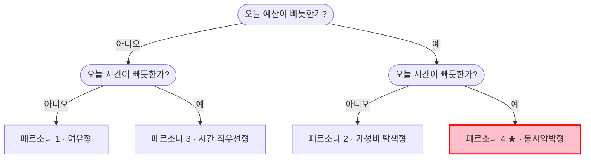
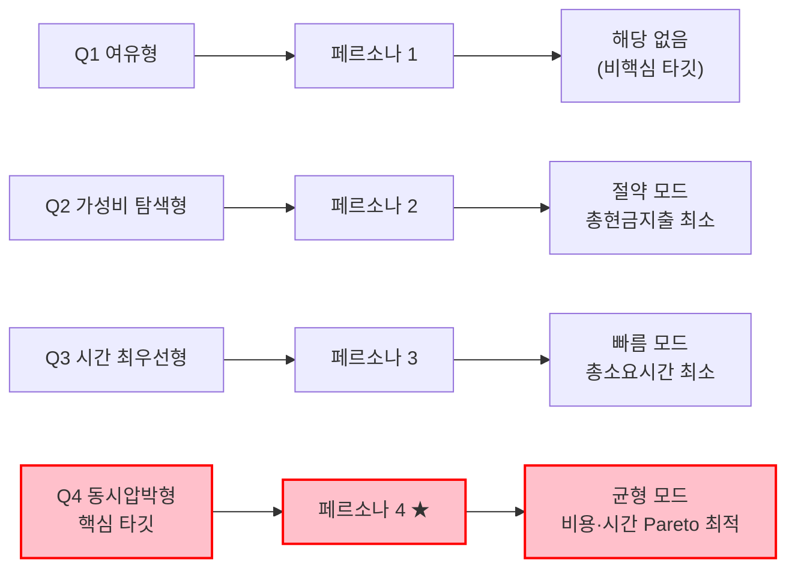
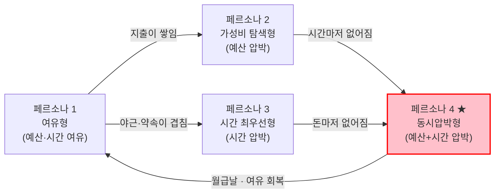

# 페르소나 — Market Segment 기반 4종

> [05.persona-journey-map](../) 폴더의 1단계 산출물. [04단계 Market Segment Map](../../04.tam-sam-som/1인가구한끼해결-7단계/09-마켓세그먼트맵.md)의 2×2 매트릭스(예산 민감도 × 시간 민감도)가 정의한 4개 세그먼트(Q1~Q4)로부터 페르소나를 추출한 결과.
> 해당 문서가 이미 명시했듯, Q1~Q3는 예산·시간 민감도를 직접 조사한 데이터가 없어 규모를 매기지 않았다 — 페르소나도 근거 문서에 있는 정성적 특징까지만 반영하고, 없는 인구통계를 임의로 채우지 않는다. Q4만 [07단계 SRS](../../04.tam-sam-som/1인가구한끼해결-7단계/07-솔루션구체화-SRS.md)·[08단계](../../04.tam-sam-som/1인가구한끼해결-7단계/08-TAMSAMSOM단계별대응구조.md)에서 확정한 "30대 1인가구" 수치를 그대로 프록시로 연결한다.

> ⚠️ **세그먼트가 아니라 상황(occasion)**: [Market Segment Map](../../04.tam-sam-som/1인가구한끼해결-7단계/09-마켓세그먼트맵.md)이 지적하듯 이 네 유형은 고정된 "사람 유형"이 아니라 한 사람이 상황에 따라 오가는 "상황 유형"에 가깝다. 같은 30대 1인가구도 월급날 직후엔 페르소나 1(여유형), 월말엔 페르소나 4(동시압박형)로 이동할 수 있다. 아래 페르소나는 이 전제 위에서 각 사분면의 "전형적 순간"을 묘사한 것이다.

## 한눈에 보기 — 4종 페르소나 지도

> 상세 카드로 들어가기 전에, 예산·시간 민감도 축 위에 4종이 어디 위치하는지부터 확인한다. 축 정의는 [Market Segment Map](../../04.tam-sam-som/1인가구한끼해결-7단계/09-마켓세그먼트맵.md)과 동일하다.

| | **예산 민감도 낮음** | **예산 민감도 높음** |
| --- | --- | --- |
| **시간 민감도 낮음** | **페르소나 1** 여유형 · 비핵심 타깃 | **페르소나 2** 가성비 탐색형 · "절약" 모드 |
| **시간 민감도 높음** | **페르소나 3** 시간 최우선형 · "빠름" 모드 | **페르소나 4 ★** 동시압박형 · "균형" 모드(핵심 타깃) |

> 위 흐름도는 09단계 2×2 매트릭스를 "오늘 이 사람은 어디에 해당하는가"를 판정하는 두 번의 예/아니오 질문으로 풀어놓은 것 — [한끼라우터 SRS](../../04.tam-sam-som/1인가구한끼해결-7단계/07-솔루션구체화-SRS.md)의 FR-02(한 끼 조건·우선순위 입력)가 실제로 사용자에게 던지는 질문과 같은 구조다.

## 페르소나 1 — 여유형 (비핵심 타깃)

| 항목 | 내용 |
| --- | --- |
| 역할 | 소득·시간 여유가 있는 1인가구 직장인/자영업자. 배달·외식을 습관적으로 이용 |
| 주요 문제 | 사실상 문제가 약함 — 가격도 시간도 크게 신경 쓰지 않아 서비스 개입 유인이 낮음 |
| 목표 | 익숙한 맛집·채널을 큰 고민 없이 반복 이용 |
| 사용 맥락 | "오늘은 먹고 싶은 거 그냥 시킨다" — 예산·시간 제약이 의사결정에 거의 작용하지 않는 상황 |

> 근거: [Market Segment Map](../../04.tam-sam-som/1인가구한끼해결-7단계/09-마켓세그먼트맵.md) Q1 정의("배달·외식을 채널 고민 없이 이용"). [07단계 SRS](../../04.tam-sam-som/1인가구한끼해결-7단계/07-솔루션구체화-SRS.md) 솔루션 정의상 1차 타깃에서 제외.

## 페르소나 2 — 가성비 탐색형 ("절약" 모드 핵심 유저)

| 항목 | 내용 |
| --- | --- |
| 역할 | 시간적 여유는 있지만 지출에 민감한 1인가구(학생, 재택/유연근무자 등) |
| 주요 문제 | 간편식·배달이 "가격이 비싸서"(KREI 비구매 이유 1위, 37.9%) 망설여짐. 최저가를 찾기 위해 포장·편의점·HMR을 매번 직접 비교해야 하는 탐색 부담 |
| 목표 | 예산 안에서 가장 저렴한 한 끼를 찾되, 비교 자체에 시간을 뺏기지 않기 |
| 사용 맥락 | 월말·지출을 아껴야 하는 주간, 여러 앱/매장을 오가며 가격을 직접 비교하던 상황을 앱 하나로 대체 |

> 근거: [핵심원인분석](../../04.tam-sam-som/1인가구한끼해결-7단계/03-핵심원인분석.md)(간편식 비구매 이유 1위 가격 37.9%), [Market Segment Map](../../04.tam-sam-som/1인가구한끼해결-7단계/09-마켓세그먼트맵.md) Q2 정의. 솔루션의 "절약" 모드(총현금지출 최소)에 직접 대응.

## 페르소나 3 — 시간 최우선형 ("빠름" 모드 핵심 유저)

| 항목 | 내용 |
| --- | --- |
| 역할 | 업무량이 많거나 야근이 잦은 1인가구 직장인. 배달을 압도적으로 선호 |
| 주요 문제 | 돈보다 "지금 당장의 시간"이 아까움. 메뉴를 비교할 여유조차 없어 최소주문금액 등 진입장벽에 부딕히면 바로 포기하거나 이탈 |
| 목표 | 고민 없이 즉시 결정하고 가장 빨리 먹을 수 있는 선택지 확보 |
| 사용 맥락 | 퇴근 직후·야근 중처럼 배가 고프고 시간이 없는 순간, 여러 앱을 켜서 비교할 여력이 없는 상황 |

> 근거: [핵심원인분석](../../04.tam-sam-som/1인가구한끼해결-7단계/03-핵심원인분석.md)(배민 자체조사 — 혼자 먹을 음식 주문 42.1%, 최소주문금액 완화 후 주문 10배+ 증가). 솔루션의 "빠름" 모드(총소요시간 최소)에 대응.

## 페르소나 4 — 동시압박형 (핵심 타깃, 30대 1인가구) ★

| 항목 | 내용 |
| --- | --- |
| 역할 | 평일 퇴근 후 혼자 한 끼를 해결해야 하는 30대 1인가구 직장인. 전국 144.3만 가구, 동연령대 배달앱 월평균 결제액 101,491원(전 연령대 최고) |
| 주요 문제 | 예산도 시간도 여유가 없어 매번 "싸지만 늦거나, 빠르지만 비싼" trade-off에 시달림. 매번 새로 배달·포장·편의점-HMR을 비교하는 데 드는 의사결정 피로 자체가 문제 |
| 목표 | 오늘의 예산·시간 조건 안에서 "가격과 시간을 둘 다 낭비하지 않는" 한 끼를 빠르게 확정하고 싶음 |
| 사용 맥락 | 퇴근길 또는 퇴근 직후, 예산이 넉넉하지 않은 주간(월급날 직후엔 페르소나 1로 이동할 수도 있음)에 앱을 열어 "오늘은 어떻게 먹지"를 즉시 판단해야 하는 순간. PoC 무대는 서울 관악구(1인가구 비율 62.7%, 서울 최고) |

> 근거: [07단계 SRS](../../04.tam-sam-som/1인가구한끼해결-7단계/07-솔루션구체화-SRS.md) 1차 타깃 정의, [08단계](../../04.tam-sam-som/1인가구한끼해결-7단계/08-TAMSAMSOM단계별대응구조.md) SAM/SOM 계산(전국 1.76조원·144.3만 가구, PoC 관악구 약 3.1만 가구), [Market Segment Map](../../04.tam-sam-som/1인가구한끼해결-7단계/09-마켓세그먼트맵.md) Q4 정의. 솔루션의 "균형" 모드(Pareto 최적)와 정확히 대응 — 한끼라우터의 존재 이유 자체.

## 세그먼트 → 페르소나 → 솔루션 대응

| 세그먼트 | 페르소나 | 추천 모드 |
| --- | --- | --- |
| Q1 여유형 | 페르소나 1 | 해당 없음(비핵심 타깃) |
| Q2 가성비 탐색형 | 페르소나 2 | 절약 — 총현금지출 최소 |
| Q3 시간 최우선형 | 페르소나 3 | 빠름 — 총소요시간 최소 |
| Q4 동시압박형(핵심 타깃) | 페르소나 4 | 균형 — 비용·시간 Pareto 최적 |

## 한 사람이 상황에 따라 이동하는 경로

> 위 4종은 별개의 사람이 아니라, 같은 30대 1인가구가 그날의 예산·시간 압박에 따라 오가는 상황이다. 예: 월급날 직후엔 페르소나 1 → 지출이 쌓이면 페르소나 2 → 야근이 겹치면 페르소나 4로 이동.

> [PoC 6.1절 지표](../../04.tam-sam-som/1인가구한끼해결-7단계/07-솔루션구체화-SRS.md#61-poc-핵심-지표와-성공-기준)의 "채널 전환률"은 이 경로 이동을 실측하려는 지표다 — 같은 사용자가 관찰 기간 동안 어느 화살표를 얼마나 자주 타는지가 곧 서비스 사용 빈도의 근거가 된다.
