# 페르소나 스펙트럼 — ① 1차 생성 (Divergent Thinking)

> [00-방법론.md §2](./00-방법론.md) · 입력 [04단계 Market Segment Map](../../04.tam-sam-som/1인가구한끼해결-7단계/09-마켓세그먼트맵.md) · 이전 판본 [01-페르소나.md](./01-페르소나.md)(Market Segment 직접 매핑 4종, 커밋 `14a74e4` 이전 상태)

> ⚙️ **현재 진행 상태 — 워크플로우 ①단계까지 수행.**
> 이 문서는 [00-방법론.md](./00-방법론.md) 2절의 **AI 기반 다중 페르소나 생성 및 평가 워크플로우** 5단계 중 **①단계 1차 생성(Divergent Thinking)**의 산출물이다. **12종 페르소나 원본**이며, 아직 선별되지 않았다. ②평가 · ③보정 · ④검증 · ⑤통합은 미수행.
>
> 📌 이 문서는 [01-페르소나.md](./01-페르소나.md)(Market Segment 직접 매핑 4종)를 대체하지 않는다 — 4종은 "세그먼트→인물 1:1 매핑"이 정확히 이렇게 작동한다는 것을 보여주는 근거 자료로 남기고, 아래 12종이 이후 의사결정의 기준이 된다. 계보는 §4에 표로 남겼다.

---

## 0. 이 단계의 규칙과 두 가지 편차

### 무엇을 하는 단계인가

**①단계는 좁히는 단계가 아니라 넓히는 단계다.** 방법론이 요구하는 배분(핵심 5·확장 3·극단 2·비활성 2 = **12종**)을 그대로 채웠다. 현실성이 의심스러운 후보도 지우지 않고 남겼다 — 걸러내는 일은 ②단계의 몫이다.

각 페르소나는 방법론이 지정한 **6개 항목**(이름·직무·문제·목표·감정·대체 솔루션)을 모두 채운다.

### 편차 ① — '이름'을 코드네임으로 대체했다

방법론 원문의 `이름` 항목은 **식별용 코드네임**(`C1 「퇴근을 예측할 수 없다」` 형태)으로 채웠다. 나이·성별 같은 신상은 만들지 않았다.

> 📌 지어낸 신상은 어떤 설계 판단도 바꾸지 못하면서 문서 전체를 사실처럼 읽히게 만든다 — 이전 판본([01-페르소나.md](./01-페르소나.md), [처음 이 문서를 만들었을 때의 커밋](https://github.com/soobworks/business-research-practice/commit/154c12d))이 바로 이 문제를 갖고 있었다: 이름·나이를 붙였지만 그 값들은 이후 어떤 설계 결정에도 쓰이지 않았다. 12종을 구분하는 **호칭 기능**은 코드네임으로 충분하다. 괄호 안 별칭은 그 사람의 **한 문장짜리 문제**에서 따왔다. 직무는 유지한다 — 직무는 실제로 문제·대체 솔루션을 좌우하는 변수다.

### 편차 ② — 비활성(Non-user)을 두 갈래로 나눴다

방법론 §2 자체가 비활성을 두 가지로 서술한다.

| 방법론의 서술 위치 | 정의 | 해당 인물 |
| --- | --- | --- |
| 유형별 설명 — *"아직 사용하지 않거나 **회피**하는 집단 / 인식·가치·신뢰 결여"* | **회피형** — 알지만 거부한다 | **N1** 회계사무소 직원 |
| 도출 핵심 질문 — *"이 제품/서비스를 **사용할 수 없는** 사람은 누구인가?"* | **비접근형** — 쓰고 싶어도 닿지 않는다 | **N2** 개인 사업자 |

**둘은 완전히 다른 사람이고 대응도 반대다.** N1은 설득(신뢰 회복)의 문제이고, N2는 온보딩(진입장벽 제거)의 문제다. 비활성 2명 자리에 하나씩 배치했다.

---

## 1. 스펙트럼 배치

```mermaid
graph LR
%% subgraph 안에 direction 을 넣지 말 것.
%% 내부 노드끼리 연결선이 없어 모두 같은 rank 이므로, 진행 방향의 직각으로 배치된다.
%% 부모의 LR 을 물려받아야 세로로 쌓이고, TB 를 주면 가로로 퍼진다.
    subgraph CORE["Core 핵심 5 — 주력 타깃"]
        C1["C1 「퇴근을 예측할 수 없다」<br>스타트업 백엔드 개발자<br>야근으로 시각 불규칙, 배달비도 아깝다"]
        C2["C2 「마감엔 다 필요없다」<br>프리랜서 콘텐츠 마케터<br>마감 중 예산·시간 둘 다 무너진다"]
        C3["C3 「매일이 곧 지출이다」<br>제조업 대기업 사무직<br>시간은 있어도 누적 지출이 부담"]
        C4["C4 「기운이 없는데 골라야 한다」<br>병원 간호사(낮 근무)<br>체력 소진, 스케줄 불규칙"]
        C5["C5 「둘 다 없다」<br>계약직 사무보조<br>예산·시간 동시 압박의 전형"]
    end

    subgraph ADJ["Adjacent 확장 3 — 유사 문제·다른 맥락"]
        A1["A1 「1인분은 손해다」<br>대학생·야간 알바<br>최소주문금액이 유독 아프다"]
        A2["A2 「또 그 메뉴다」<br>프리랜서 디자이너(인접 연령)<br>배달 피로감·선택 다양성 결핍"]
        A3["A3 「같이 살아도 혼자 먹는다」<br>맞벌이 2인가구<br>퇴근시각이 엇갈려 상황적 1인식사"]
    end

    subgraph EXT["Extreme 극단 2 — 제약 상황·실패 중심"]
        X1["X1 「새벽엔 문 닫은 도시」<br>물류센터 야간 교대근무<br>시간이 아니라 영업시간 자체가 벽"]
        X2["X2 「지도 밖의 동네」<br>지방 소도시 원룸 거주<br>배달 커버리지 자체가 없다"]
    end

    subgraph NON["Non-user 비활성 2 — 진입 장벽"]
        N1["N1 「안 시켜도 괜찮다」<br>회계사무소 직원<br>회피형 — 배달 불신, 직접 조리 선호"]
        N2["N2 「전화가 더 빠르다」<br>개인 사업자<br>비접근형 — 앱 사용 자체가 장벽"]
    end

    CORE --> ADJ
    CORE --> EXT
    ADJ --> NON

    classDef core fill:#33BBFF,stroke:#333,stroke-width:2px,color:#111;
    classDef adj fill:#33FFBB,stroke:#333,stroke-width:2px,color:#111;
    classDef ext fill:#FF3322,stroke:#333,stroke-width:2px,color:#fff;
    classDef non fill:#DDDDDD,stroke:#333,stroke-width:2px,color:#111;
    class C1,C2,C3,C4,C5 core;
    class A1,A2,A3 adj;
    class X1,X2 ext;
    class N1,N2 non;
```

> 이 그림은 **인원 배치**까지만 보여준다. 페르소나 사이의 관계(누가 누구를 막고, 누가 누구에게 가는 유일한 경로인지)를 그리는 **Spectrum Map은 ⑤단계** 산출물이므로 여기서는 그리지 않는다.

---

## 2. 페르소나 원본 12종

각 표의 `Q` 열은 [04단계 Market Segment Map](../../04.tam-sam-som/1인가구한끼해결-7단계/09-마켓세그먼트맵.md)의 사분면(예산 민감도 × 시간 민감도)을, `—`는 **두 축만으로는 설명되지 않는 인물**을 뜻한다.

### 🔵 핵심(Core) 5종 — 주력 타깃 / 매출·사용 빈도 중심

| 코드·이름 | 직무 | Q | 문제 | 목표 | 감정 | 대체 솔루션 (현재 쓰는 것) |
| --- | --- | --- | --- | --- | --- | --- |
| **C1** 「퇴근을 예측할 수 없다」 | 스타트업 백엔드 개발자 | Q4 | 야근이 잦아 퇴근 시각을 스스로도 예측 못 한다. 늦게 시키면 배달비가 아깝고, 대기시간까지 겹쳐 자정을 넘겨 먹는 날이 반복된다 | 퇴근 시각과 무관하게 **20분 안에** 예산 내 한 끼를 확정 | 매번 같은 고민을 반복하는 데서 오는 피로감 | 배달앱 3개를 번갈아 켜서 가격을 눈으로 비교 |
| **C2** 「마감엔 다 필요없다」 | 프리랜서 콘텐츠 마케터 | Q4 | 재택근무라 규칙적인 식사 시간이 없다. 마감 직전엔 가장 빨리 오는 걸 시켜 예산을 초과하고, 그 죄책감이 다음 선택도 흐트러뜨린다 | 마감 기간에도 예산을 지키면서 스트레스 없이 정하기 | 지출까지 통제 못 한다는 자책감 | 최근 주문 목록에서 고민 없이 재주문 |
| **C3** 「매일이 곧 지출이다」 | 제조업 대기업 사무직 | **Q2** | 정시 퇴근은 하지만 혼자 사는 집에서 요리할 의욕이 없어 거의 매일 배달·포장에 의존, 누적 지출이 부담된다 | 매일 반복되는 지출을 줄이되 매번 새로 고민하지 않기 | 귀찮음과 지출 부담 사이의 무력감 | 편의점 도시락으로 며칠 버티다 다시 배달로 복귀 |
| **C4** 「기운이 없는데 골라야 한다」 | 병원 간호사 (낮 근무) | **Q3** | 육체노동 후 퇴근하면 장을 보거나 조리할 체력이 남지 않는다. 근무 스케줄이 불규칙해 미리 계획하기도 어렵다 | 그날 체력·시간에 맞춰 즉석에서 "이거면 된다"는 확신 | 체력 소진 상태에서 또 결정해야 하는 부담 | 병원 근처 익숙한 가게 몇 곳을 번갈아 전화 주문 |
| **C5** 「둘 다 없다」 | 계약직 사무보조 | Q4 | 소득이 불규칙해 예산 압박이 크면서, 야근이 잦은 회사라 시간도 없다 — 예산·시간이 동시에 바닥나는 전형적 상황 | 오늘 쓸 수 있는 돈 안에서 가장 빠르게 해결되는 한 끼 | 돈도 시간도 없다는 이중 압박감 | 편의점에서 가장 싼 상품을 즉흥적으로 선택 |

> 📌 **Core 5인 중 순수하게 "예산·시간 둘 다 높음(Q4)"인 사람은 C1·C2·C5 셋뿐이다.** C3는 시간은 여유롭고 예산만 압박받는 **Q2**, C4는 예산은 여유롭고 시간만 압박받는 **Q3**에 실제로는 더 가깝다. Core를 "이상적 주요 고객군"으로 정의하면서도 다양성을 확보하려다 보니, 축 하나만 극단적인 인물이 섞여 들어왔다 — **Core 배치 자체가 시장 검증이 아니라 발산적 배치였다는 증거**이며, ②단계에서 되짚어야 할 지점이다.

### 🟢 확장(Adjacent) 3종 — 유사 문제 / 다른 맥락

| 코드·이름 | 직무 | Q | 문제 | 목표 | 감정 | 대체 솔루션 (현재 쓰는 것) |
| --- | --- | --- | --- | --- | --- | --- |
| **A1** 「1인분은 손해다」 | 대학생·야간 편의점 알바 | Q2 | 용돈·알바비로 생활해 예산 민감도가 Core보다 훨씬 높다. 배달앱 최소주문금액 때문에 혼자 시키면 손해라고 느낀다 | 1인분만 시켜도 손해 보지 않는 선택지를 빠르게 찾기 | 최소주문금액 앞에서 매번 느끼는 억울함 | 알바지 편의점 상품으로 직접 해결 |
| **A2** 「또 그 메뉴다」 | 프리랜서 디자이너 (인접 연령) | **—** | 배달 앱을 오래 써서 "배달 피로감"이 쌓였고, 매번 비슷한 메뉴만 반복하게 된다 — 예산도 시간도 아니라 **선택 다양성 결핍**이 진짜 문제 | 반복되지 않으면서도 새로 고민할 필요 없는 다양한 대안 | 선택의 다양성이 줄어드는 데서 오는 지루함 | 밀키트를 대량 구매해 냉동 보관 후 조리 |
| **A3** 「같이 살아도 혼자 먹는다」 | 맞벌이 2인가구 (퇴근시각 엇갈림) | **—** | 가구는 2인이지만 실제로는 각자 다른 시각에 혼자 저녁을 먹는 날이 더 많다 — **가구 형태(1인가구)가 아니라 상황이 문제를 만든다** | 혼자 먹는 날에도 함께 먹는 날과 비슷한 만족도 | 함께 살면서도 "혼자 먹는다"는 옅은 소외감 | 한 명이 미리 2인분을 시켜 냉장 보관 |

> 📌 **A2·A3는 Market Segment Map의 두 축(예산×시간) 밖에서 나왔다.** A2의 문제는 "지출·시간"이 아니라 "지루함"이고, A3의 문제는 축 자체가 겨냥한 "1인가구"라는 전제 밖에 있다. 확장(Adjacent) 질문("유사한 서비스를 이미 쓰는 사람은 누구인가")이 시장 세그먼트 정의보다 넓게 작동한다는 뜻이다.

### 🔴 극단(Extreme) 2종 — 제약 상황 / 실패·대안 사용 중심

| 코드·이름 | 직무 | Q | 문제 | 목표 | 감정 | 대체 솔루션 (현재 쓰는 것) |
| --- | --- | --- | --- | --- | --- | --- |
| **X1** 「새벽엔 문 닫은 도시」 | 물류센터 야간 교대근무 | **—** | 새벽 3~4시에 퇴근해 영업 중인 배달·매장이 거의 없다 — 시간이 아니라 **영업시간 자체**가 벽이다 | 야간에도 확실히 먹을 수 있는 선택지를 미리 알기 | 배가 고파도 선택지가 없다는 좌절 | 퇴근 전 편의점에서 미리 사둔 상온 보관 식품 |
| **X2** 「지도 밖의 동네」 | 지방 소도시 원룸 거주 1인가구 | **—** | 거주 지역의 배달 커버리지가 열악해 원하는 메뉴 대부분이 "배달 불가" 지역으로 표시된다 | 내 위치에서 실제로 가능한 옵션만 빠르게 걸러 보기 | 도시 기준 정보와 내 현실이 다르다는 소외감 | 포장 가능한 가까운 몇 곳만 기억해 반복 방문 |

> 📌 **X1·X2는 예산·시간이 아니라 "영업시간의 존재"와 "배달 커버리지"라는 완전히 다른 축의 제약을 겪는다.** 한끼라우터의 [FR-04 조건 필터](../../04.tam-sam-som/1인가구한끼해결-7단계/07-솔루션구체화-SRS.md)가 "예산/시간/영업/최소주문"을 함께 필터링 대상으로 잡은 것은 이 두 사람을 감안했을 때만 의미가 있다.

### ⬜ 비활성(Non-user) 2종 — 진입 장벽 / 거부 요인

| 코드·이름 | 직무 | Q | 문제 | 목표 | 감정 | 대체 솔루션 (현재 쓰는 것) |
| --- | --- | --- | --- | --- | --- | --- |
| **N1** 「안 시켜도 괜찮다」*(회피형)* | 회계사무소 직원 | **—** | 배달 음식의 가격·위생·건강에 대한 불신이 커서 앱 자체를 거의 열지 않는다 — "문제"가 없다고 스스로 여긴다 | 굳이 앱을 쓰지 않아도 되는 지금의 방식(직접 요리) 유지 | 배달에 의존하는 주변을 보며 느끼는 약한 안도감 | 주말에 몰아서 장을 보고 직접 조리·소분 |
| **N2** 「전화가 더 빠르다」*(비접근형)* | 개인 사업자 | **—** | 앱 사용 자체가 익숙하지 않고, 오래 다닌 단골 식당에 전화로 주문하는 방식에 만족한다 | 지금 쓰는 방식보다 딱히 더 나아질 게 없다고 느낌 | 새 앱을 배워야 한다는 데서 오는 가벼운 거부감 | 단골 식당 전화 주문, 안 되면 직접 방문 포장 |

> 📌 **N1은 설득의 대상, N2는 온보딩의 대상이다.** N1에게는 "왜 안전한지"를 보여주는 근거([NFR-02 데이터 신뢰성](../../04.tam-sam-som/1인가구한끼해결-7단계/07-솔루션구체화-SRS.md))가, N2에게는 "왜 어렵지 않은지"를 보여주는 [NFR-06 모바일 우선](../../04.tam-sam-som/1인가구한끼해결-7단계/07-솔루션구체화-SRS.md) 설계가 각각 필요하다 — 같은 "미사용"이지만 해법이 반대다.

---

## 3. 12종 요약 대조

| 코드 | 유형 | 한 줄 정체 | 사분면 | 선호 채널 | 화면을 쓰는가 |
| --- | --- | --- | --- | --- | --- |
| C1 | 핵심 | 야근 잦은 개발자 | Q4 | 배달 | 예 (매일·모바일) |
| C2 | 핵심 | 마감 중인 프리랜서 마케터 | Q4 | 배달 | 예 (불규칙·모바일) |
| C3 | 핵심 | 지출 누적된 사무직 | Q2 | 배달·편의점 | 예 (매일·모바일) |
| C4 | 핵심 | 체력 소진된 간호사 | Q3 | 배달(전화) | 제한적 (전화 위주) |
| C5 | 핵심 | 예산·시간 둘 다 없는 계약직 | Q4 | 편의점 | 예 (즉흥·모바일) |
| A1 | 확장 | 최소주문금액에 걸리는 대학생 | Q2 | 편의점 | 예 |
| A2 | 확장 | 메뉴가 지겨운 디자이너 | — | 밀키트 | 예 |
| A3 | 확장 | 퇴근이 엇갈리는 맞벌이 | — | 배달 | 예 |
| X1 | 극단 | 새벽에 갈 곳 없는 야간근무자 | — | 편의점(사전구매) | 제한적 (사전 대비) |
| X2 | 극단 | 배달 사각지대 거주자 | — | 포장 | 제한적 (반복 방문 위주) |
| N1 | 비활성·회피 | 배달을 안 믿는 직접조리형 | — | 직접 조리 | **아니오 (회피)** |
| N2 | 비활성·비접근 | 전화 주문이 편한 아날로그형 | — | 전화 주문 | **아니오 (비접근)** |

---

## 4. 기존 4종과의 계보

[01-페르소나.md](./01-페르소나.md)의 4종(Market Segment Q1~Q4 직접 매핑)은 하나도 버리지 않았다.

| 이전 판본 | 12종에서의 위치 | 변화 |
| --- | --- | --- |
| 페르소나 4 — 동시압박형 (Q4, 핵심 타깃) | **C1·C2·C5** | 유지 + 세 갈래로 변주(직무·상황 다양화) |
| 페르소나 2 — 가성비 탐색형 (Q2) | **A1**, 그리고 재분류된 **C3** | 유지 + 다른 연령(대학생)으로 확장, Core 안에서도 재발견 |
| 페르소나 3 — 시간 최우선형 (Q3) | 재분류된 **C4** | Core로 배치했었지만 재검토 결과 이 세그먼트에 더 부합 |
| 페르소나 1 — 여유형 (Q1, 비핵심) | **대응 인물 없음** | [01번 문서 자체의 결론](./01-페르소나.md)대로, 여유형은 별도 인물이 아니라 다른 페르소나가 예산·시간 여유가 생겼을 때의 "상황"이므로 새 인물로 옮기지 않았다 |
| — | **A2·A3·X1·X2·N1·N2** (6종 신규) | 아래 참조 |

### 신규 6종이 나온 곳

| 신규 | 어디서 나왔는가 |
| --- | --- |
| A2 메뉴가 지겨운 디자이너 | 확장(Adjacent) 질문 — *"유사한 서비스를 이미 쓰는 사람은 누구인가"* → 이미 쓰지만 피로해진 사람 |
| A3 퇴근이 엇갈리는 맞벌이 | **가구 형태 밖** — 1인가구 정의만 보느라 "상황적 1인식사"를 놓쳤다 |
| X1 야간 교대근무자 | 극단 질문 — *"가장 자주 실패하는 사람은 누구인가"* → 영업시간 자체가 실패 조건 |
| X2 배달 사각지대 거주자 | 극단 질문의 인프라 축 — 배달 커버리지가 실패 조건 |
| N1 배달을 안 믿는 직접조리형 | 비활성 설명 — *"회피하는 사람은 누구인가"* |
| N2 전화 주문이 편한 아날로그형 | 비활성 도출 질문 — *"사용할 수 없는 사람은 누구인가"* |

> 📌 **신규 6종 중 절반 이상(A3·X1·X2)이 Market Segment Map의 두 축(예산×시간) 바깥에서 나왔다.** 그 축은 "얼마나 압박받는가"만 재는데, 정작 A3·X1·X2를 막는 건 압박의 크기가 아니라 **가구 정의·영업시간·인프라 커버리지**라는 전혀 다른 조건이다. 스펙트럼을 돌린 첫 번째 소득이 이것이다.

---

## 5. ①단계에서 이미 보이는 것

선별 전이지만 12종을 나란히 놓았을 때 드러나는 사실 네 가지를 기록한다. ②단계 평가의 입력으로 쓴다.

1. **Core 5인 중 진짜 Q4는 3명뿐이다.** C3(Q2)·C4(Q3)는 Core 자리에 있지만 실제로는 다른 사분면에 더 맞는다 — Core 배치가 시장 검증이 아니라 다양성 확보를 위한 발산이었다는 증거다.
2. **Q1(여유형)에 정확히 대응하는 인물이 12명 중 한 명도 없다.** [01-페르소나.md](./01-페르소나.md)가 이미 지적한 대로, 여유형은 별도 인물이 아니라 다른 사람들의 "상황"이기 때문일 가능성이 높다 — ②단계에서 별도 인물을 만들 필요는 없어 보인다.
3. **극단·비활성 4명(X1·X2·N1·N2)의 제약은 예산·시간 축과 무관하다.** 영업시간의 존재, 배달 커버리지, 신뢰, 디지털 리터러시라는 세 번째·네 번째 축에서 나온다. Market Segment Map의 두 축만으로는 이 4명의 자리를 설명할 수 없다.
4. **대체 솔루션 칸을 세로로 읽으면 12명 중 다수가 이미 "편의점·직접조리·전화주문·밀키트"로 스스로 문제를 해결하고 있다.** 싸워야 할 상대는 다른 배달앱이 아니라 **이미 자리잡은 개인적 해결책**이다.

---

## 6. 근거 등급

[08](../../04.tam-sam-som/1인가구한끼해결-7단계/08-TAMSAMSOM단계별대응구조.md)·[09단계](../../04.tam-sam-som/1인가구한끼해결-7단계/09-마켓세그먼트맵.md)의 표기 규칙을 그대로 적용한다.

| 구성 요소 | 등급 | 비고 |
| --- | --- | --- |
| Core의 인구·소비 배경 수치(30대 1인가구 144.3만 가구, 월평균 결제액 101,491원) | **(확인)** | [07단계 SRS](../../04.tam-sam-som/1인가구한끼해결-7단계/07-솔루션구체화-SRS.md)·[08단계](../../04.tam-sam-som/1인가구한끼해결-7단계/08-TAMSAMSOM단계별대응구조.md) 직접 인용 |
| Adjacent의 20대·40대 타깃 존재 | **(확인)** | [07단계 SRS](../../04.tam-sam-som/1인가구한끼해결-7단계/07-솔루션구체화-SRS.md)가 2차/후속 타깃으로 명시 |
| 직무·근무형태의 존재와 대략적 특성 | **(추정)** | 일반적 생활상에서 추론 |
| **12종의 문제·목표·감정·대체 솔루션 전체** | **(가정)** | **인터뷰 없음. 전량 생성물이다** |
| Extreme·Non-user 4명(X1·X2·N1·N2)의 실재 여부·규모 | **(가정)** | ④단계 검증 대상. [09단계 원칙](../../04.tam-sam-som/1인가구한끼해결-7단계/09-마켓세그먼트맵.md)("근거 없는 숫자를 채우지 않는다")에 따라 규모를 부여하지 않았다 |

> ⚠️ **①단계 산출물은 가설의 목록이지 발견의 목록이 아니다.** 특히 `감정` 열은 방법론이 요구해서 채운 항목으로, 근거가 가장 얇다. ②·④단계를 거치기 전에는 이 문서를 인용해 의사결정을 내리지 않는다.

---

## 7. 다음 단계

| 단계 | 할 일 | 이 문서에서 넘기는 것 |
| --- | --- | --- |
| **②** 2차 평가 | 문제·행동·맥락의 현실성으로 12종을 평가해 유형별 1명씩 **4명**으로 압축 | 12종 원본 + §5의 관찰 4가지. **C3·C4의 사분면 재분류**를 선별 기준에 반영할 것 |
| **③** 3차 보정 | 한끼라우터 맥락에 맞춰 언어·상황 재기술 | 선별된 4명 + [07단계 SRS](../../04.tam-sam-som/1인가구한끼해결-7단계/07-솔루션구체화-SRS.md)의 FR/NFR 대응표 |
| **④** 4차 검증 | 실재 확률과 근거 교차검증 | 우선 검증 대상 3종 — **A3·X1·X2** (사분면 밖에서 나와 근거가 가장 얇다) |
| **⑤** 5차 통합 | Spectrum Map 시각화 | 관계 축 후보 — *N1이 신뢰 회복 전까지 회피* · *X1·X2가 FR-04 조건 필터의 존재 이유* · *C3·C4가 Core 재정의의 근거* |
