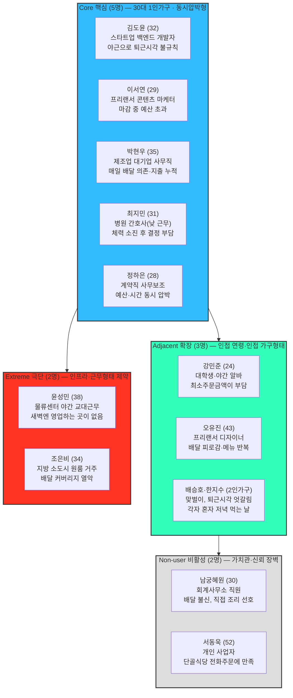

# 페르소나 스펙트럼 — ① 1차 생성 (Divergent Thinking)

> [00-방법론.md](./00-방법론.md) 2절의 워크플로우 중 **①1차 생성 단계만** 수행한 결과. 스펙트럼 유형별로 3~5개씩, 총 12개의 **발산적·미검증 원본**이다. ②평가(Convergent Filtering)로 유형별 1개씩 압축하고 ③보정 ④검증 ⑤통합을 거쳐야 실제 서비스 의사결정에 쓸 수 있는 4종 페르소나가 된다 — 이 문서는 그 이전 단계이므로 **아직 확정된 페르소나가 아니다.**
>
> 대비 문서: [01-페르소나.md](./01-페르소나.md)는 Market Segment Q1~Q4를 1:1로 옮긴 4종이고, 이 문서는 같은 시장을 Core/Adjacent/Extreme/Non-user 축으로 더 넓게 발산시킨 원본이다. 두 문서는 같은 시장을 서로 다른 방법으로 본 것이라 내용이 겹치지 않는다.

## 스펙트럼 전체 지도

> ⚠️ **근거 수준 안내**: Core 5명은 [04단계](../../04.tam-sam-som/1인가구한끼해결-7단계/) 확정 통계(30대 1인가구 144.3만 가구, 월평균 결제액 101,491원 등)로 뒷받침되는 실제 핵심 세그먼트의 변주다. Adjacent 3명은 [07단계 SRS](../../04.tam-sam-som/1인가구한끼해결-7단계/07-솔루션구체화-SRS.md)가 이미 언급한 2차/후속 타깃(20대·40대)에 근거한다. **Extreme·Non-user 4명은 포용성 탐색을 위한 AI 발산적 가설이며, 이 프로젝트의 확정 데이터로 뒷받침되지 않는다** — 09단계 문서의 원칙("근거 없는 숫자를 채우지 않는다")에 따라, 이들에게는 규모나 비율을 임의로 부여하지 않았다.

## Core — 핵심 사용자 (5명)

> 이상적인 주요 고객군. [Market Segment Map](../../04.tam-sam-som/1인가구한끼해결-7단계/09-마켓세그먼트맵.md) Q4(동시압박형) 자체를 직무·상황별로 다양화한 변주다.

| 이름 | 직무 | 문제 | 목표 | 감정 | 대체 솔루션 |
| --- | --- | --- | --- | --- | --- |
| 김도윤 (32) | 스타트업 백엔드 개발자 | 야근이 잦아 퇴근 시각을 예측할 수 없음. 배달비 아까워 늦게 시키면 대기시간까지 겹쳐 자정 넘겨 먹는 날이 많음 | 퇴근 시각과 무관하게 20분 안에 예산 내 한 끼를 확정하고 싶음 | 매번 같은 고민을 반복하는 데서 오는 피로감 | 습관적으로 쓰던 배달앱 3개를 켜서 가격을 눈으로 비교 |
| 이서연 (29) | 프리랜서 콘텐츠 마케터 | 재택근무라 규칙적인 식사 시간이 없고, 마감 직전엔 아무거나 가장 빨리 오는 걸 시켜 예산을 초과함 | 마감 기간에도 예산을 지키면서 스트레스 없이 한 끼를 정하고 싶음 | 마감 압박에 지출까지 통제 못 한다는 자책감 | 배달앱 최근 주문 목록에서 재주문 |
| 박현우 (35) | 제조업 대기업 사무직 | 정시 퇴근은 하지만 혼자 사는 집에서 요리할 의욕이 없어 거의 매일 배달·포장에 의존, 누적 지출이 부담됨 | 매일 반복되는 지출을 줄이면서도 매번 새로 고민하고 싶지 않음 | 귀찮음과 지출 부담 사이에서 오는 무력감 | 편의점 도시락으로 대체하다가 다시 배달로 복귀 |
| 최지민 (31) | 병원 간호사 (낮 근무) | 육체노동 후 퇴근하면 걸어서 장을 보거나 조리할 체력이 남지 않음. 근무 스케줄이 불규칙해 미리 계획하기 어려움 | 그날 체력·시간에 맞춰 즉석에서 "이거면 된다"고 확신할 수 있는 선택 | 체력 소진 상태에서 또 결정을 내려야 하는 부담 | 병원 근처 익숙한 가게 몇 곳을 번갈아 전화 주문 |
| 정하은 (28) | 계약직 사무보조 (취업 준비 중) | 소득이 불규칙해 예산 압박이 크면서도, 야근이 잦은 회사라 시간도 없음 — 예산·시간 모두 여유가 없는 전형적 상황 | 오늘 쓸 수 있는 돈 안에서 가장 빠르게 해결되는 한 끼 | 돈도 시간도 없다는 이중 압박감 | 편의점에서 가장 싼 상품을 즉흥적으로 선택 |

## Adjacent — 확장 사용자 (3명)

> 유사한 문제를 가진 인접 시장군. [07단계 SRS](../../04.tam-sam-som/1인가구한끼해결-7단계/07-솔루션구체화-SRS.md)가 이미 2차/후속 타깃으로 언급한 연령대와, 가구 형태는 다르지만 상황적으로 "혼자 한 끼"를 겪는 경우를 포함한다.

| 이름 | 직무 | 문제 | 목표 | 감정 | 대체 솔루션 |
| --- | --- | --- | --- | --- | --- |
| 강민준 (24) | 대학생 겸 편의점 야간 알바 | 용돈·알바비로 생활해 예산 민감도가 Core보다 훨씬 높음. 배달앱 최소주문금액 때문에 혼자 시키면 손해라고 느낌 | 1인분만 시켜도 손해 보지 않는 선택지를 빠르게 찾기 | 최소주문금액 앞에서 매번 느끼는 억울함 | 편의점 알바 특성상 직접 편의점 상품으로 해결 |
| 오유진 (43) | 프리랜서 그래픽 디자이너 (40대 1인가구) | 배달 앱을 오래 써서 "배달 피로감"이 쌓였고, 매번 비슷한 메뉴만 반복하게 됨 | 반복되지 않으면서도 새로 고민할 필요 없는 다양한 대안 확보 | 선택의 다양성이 줄어드는 데서 오는 지루함 | 밀키트를 대량 구매해 냉동 보관 후 조리 |
| 배승호 (38) & 한지수 (36) | 맞벌이 2인 가구 (서로 다른 퇴근 시각) | 가구는 2인이지만 실제로는 각자 다른 시각에 혼자 저녁을 먹는 날이 더 많음 — 1인가구와 동일한 상황적 문제를 겪음 | 혼자 먹는 날에도 함께 먹는 날과 비슷한 만족도의 한 끼 | 함께 살면서도 "혼자 먹는다"는 데서 오는 옅은 소외감 | 미리 얘기해서 한 명이 2인분을 시키고 냉장 보관 |

## Extreme — 극단 사용자 (2명)

> 제약·극단적 상황을 가진 사용자. 실패·불편·대안 사용 중심으로 도출했으며, 이 프로젝트가 확보한 정량 데이터의 뒷받침은 없는 가설적 인물이다.

| 이름 | 직무 | 문제 | 목표 | 감정 | 대체 솔루션 |
| --- | --- | --- | --- | --- | --- |
| 윤성민 (38) | 물류센터 야간 교대근무자 | 새벽 3~4시에 퇴근해 영업 중인 배달·매장이 거의 없음 — 시간이 아니라 "영업시간 자체"가 벽 | 야간에도 확실히 먹을 수 있는 선택지를 미리 알고 싶음 | 배가 고파도 선택지가 없다는 데서 오는 좌절 | 퇴근 전 편의점에 들러 미리 사둔 상온 보관 식품 |
| 조은비 (34) | 지방 소도시 원룸 거주 1인가구 | 거주 지역의 배달 커버리지가 열악해 원하는 메뉴 대부분이 "배달 불가" 지역으로 표시됨 | 내 위치에서 실제로 가능한 옵션만 빠르게 걸러서 보고 싶음 | 도시 지역 기준 정보와 내 현실이 다르다는 데서 오는 소외감 | 포장이 가능한 가까운 몇 곳만 기억해 반복 방문 |

## Non-user — 비활성 사용자 (2명)

> 아직 사용하지 않거나 회피하는 집단. 인식·가치·신뢰 결여가 원인이며, 마찬가지로 정량 데이터 뒷받침은 없는 가설적 인물이다.

| 이름 | 직무 | 문제 | 목표 | 감정 | 대체 솔루션 |
| --- | --- | --- | --- | --- | --- |
| 남궁혜원 (30) | 회계사무소 직원 | 배달 음식의 가격·위생·건강에 대한 불신이 커서 앱 자체를 거의 열지 않음 — "문제"가 없다고 스스로 여김 | 굳이 앱을 쓰지 않아도 되는 지금의 방식(직접 요리)을 유지 | 배달에 의존하는 주변 사람들을 보며 느끼는 약한 우월감·안도감 | 주말에 몰아서 장을 보고 직접 조리·소분 |
| 서동욱 (52) | 개인 사업(소규모 매장 운영) | 앱 사용 자체가 익숙하지 않고, 오래 다닌 단골 식당에 전화로 주문하는 방식에 만족함 | 지금 쓰는 방식보다 딱히 더 나아질 게 없다고 느낌 | 새 앱을 배워야 한다는 데서 오는 가벼운 거부감 | 단골 식당 전화 주문, 안 되면 직접 방문 포장 |

## 다음 단계 (사람이 지시할 때 진행)

| 단계 | 내용 | 상태 |
| --- | --- | --- |
| ① 1차 생성 | 이 문서 — Core 5·Adjacent 3·Extreme 2·Non-user 2, 총 12명 | 완료 |
| ② 2차 평가 | 문제·행동·맥락의 현실성 기준으로 유형별 1명만 선별 | 대기 |
| ③ 3차 보정 | 선별된 4명을 한끼라우터 맥락으로 재기술 | 대기 |
| ④ 4차 검증 | 4명의 시장 실존 확률·근거를 교차검증 | 대기 |
| ⑤ 5차 통합 | 4명을 Persona Spectrum Map으로 시각 통합 | 대기 |
