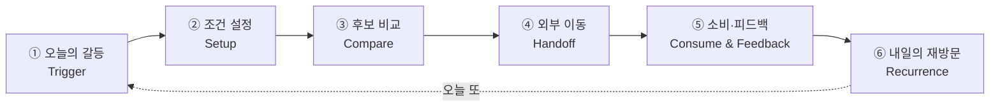
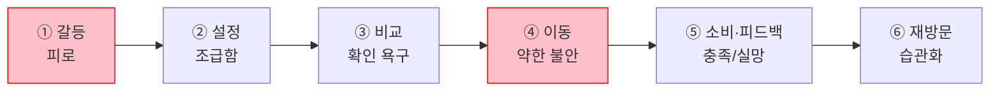
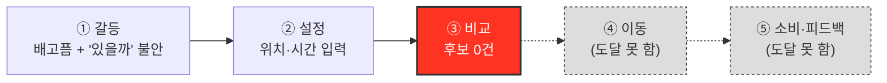

# 고객 여정지도 — 한끼라우터 고유 단계로 재정의

> 입력: [02-페르소나스펙트럼.md](./02-페르소나스펙트럼.md)(Core 5·Adjacent 3·Extreme 2·Non-user 2, 총 12종) · 방법론 [00-방법론.md §3](./00-방법론.md)(경고: 표준 단계를 그대로 쓰지 말 것)
>
> [00-방법론.md §3의 경고](./00-방법론.md)에 따라 IBM의 5단계(인지→고려→결정→온보딩→충성도)나 앞서 만든 "수정 전 초안"(문제 인식→탐색→의사결정→사용→유지)을 그대로 쓰지 않는다. 아래 §0에서 한끼라우터 고유의 단계를 먼저 다시 정의하고, §1~4에서 스펙트럼 유형별로 그 단계를 실제로 어떻게 겪는지 정리한다.

---

## 0. 왜 표준 단계를 쓰지 않는가 — 한끼라우터 고유 6단계

일반적인 커머스형 CJM은 "결정 = 구매"이고 "유지 = 구독/재구매"를 가정한다. 한끼라우터는 둘 다 아니다.

1. **"결정"과 "실제 소비" 사이에 독립된 단계가 끼어든다.** 앱 안에 결제가 없다([FR-07 외부 이동](../../04.tam-sam-som/1인가구한끼해결-7단계/07-솔루션구체화-SRS.md), MVP 제외: 직접 주문·결제). 사용자는 추천을 고른 뒤 **원 서비스로 이동**해야 실제로 먹을 수 있다.
2. **"유지"가 구독이 아니라 매일 반복되는 습관이다.** 경제활동 1인가구는 주 12.9끼([06단계](../../04.tam-sam-som/1인가구한끼해결-7단계/06-반복적정제.md))를 반복 해결한다. "이번 달에도 결제할까"가 아니라 "**오늘도 열까**"가 핵심이다.

| # | 단계 | 무엇을 하는가 | 대응 화면/요구사항 |
| --- | --- | --- | --- |
| ① | 오늘의 갈등 (Trigger) | 배고픔과 예산·시간 압박이 동시에 인식되는 순간 | — (앱 밖) |
| ② | 조건 설정 (Setup) | 위치·예산·최대시간·우선순위 입력 | S1 홈/조건입력, FR-01·FR-02 |
| ③ | 후보 비교 (Compare) | 3개 추천 카드 확인 + 필요시 상세비교 | S2 추천결과·S3 상세비교, FR-03~06 |
| ④ | 외부 이동 (Handoff) | 원 서비스로 이동해 실제 주문 — **"구매"가 아니라 "이양"** | S4 외부이동확인, FR-07 |
| ⑤ | 소비·피드백 (Consume & Feedback) | 실제로 먹고 결과를 기록(또는 건너뜀) | S5 피드백, FR-08 |
| ⑥ | 내일의 재방문 (Recurrence) | 습관으로 자리잡는가 — 구독이 아니라 "오늘 또" | — (앱 밖, 반복 관찰) |

> 이 6단계는 Core·Adjacent에게는 끝까지 이어지지만, 아래 §3~4에서 보듯 **Extreme·Non-user는 중간에 끊긴다** — 그 끊기는 지점 자체가 이들의 Pain Point다.

---

## 1. Core — 핵심 사용자의 여정 (C1·C2·C5 대표, 예산·시간 동시 압박형)

| 단계 | 행동 | 생각 | 감정 | Pain Point | 개선 기회 |
| --- | --- | --- | --- | --- | --- |
| ① Trigger | 퇴근·마감 시각이 다가오며 배고픔을 자각 | "또 정해야 하나" | 피로 | **매번 같은 고민이 반복된다** | 최근 조건 자동 채움([FR-10](../../04.tam-sam-som/1인가구한끼해결-7단계/07-솔루션구체화-SRS.md) 즐겨찾기) |
| ② Setup | 위치·예산·최대시간을 빠르게 입력 | "이번엔 빨리 끝내고 싶다" | 조급함 | **입력 자체가 새로운 결정 부담이다** | 슬라이더 기본값을 최근 패턴으로 사전 설정 |
| ③ Compare | 3개 카드와 총비용·총시간을 확인 | "이 숫자를 믿어도 되나" | 확인 욕구 | **갱신시각이 지난 정보에 대한 불신** | [NFR-02 데이터 신뢰성](../../04.tam-sam-som/1인가구한끼해결-7단계/07-솔루션구체화-SRS.md)(출처·갱신시각 강조 노출) |
| ④ Handoff | 원 서비스로 이동 | "여기서 가격이 바뀌면 어떡하지" | 약한 불안 | **이동 직후 가격이 달라질 수 있다는 불확실성** | S4 안내 문구 명확화("다시 확인" 리마인드) |
| ⑤ Consume & Feedback | 실제로 먹고, 피드백은 대체로 건너뜀 | "예상과 비슷했나" | 충족 또는 실망 | **피드백 입력이 귀찮아 생략된다** | 만족도 1탭만이라도 남기는 최소 피드백 |
| ⑥ Recurrence | 다음 날도 앱을 다시 여는가 | "어제도 도움이 됐으니 또" | 습관화 시작 | **새로울 것이 없다는 지루함이 재발할 수 있다** | 주간 지출 요약([SHOULD 기능](../../04.tam-sam-som/1인가구한끼해결-7단계/07-솔루션구체화-SRS.md))으로 누적 가치 환기 |

---

## 2. Adjacent — 확장 사용자의 여정 (A1·A2·A3, Core와 다른 지점만 표기)

세 사람 모두 ①②④는 Core와 크게 다르지 않다. 차이는 **③ Compare**, **⑤~⑥**에서 갈린다.

| 코드 | 갈리는 단계 | 행동/생각/감정 | Pain Point | 개선 기회 |
| --- | --- | --- | --- | --- |
| **A1** (대학생·야간알바) | ③ Compare | 1인분 기준 옵션을 확인하며 "또 최소주문금액에 걸리겠지"라고 예상 — 감정: 억울함(선제적) | **최소주문금액 미충족 옵션이 후보에 섞여 나오면 확인 자체가 시간 낭비다** | [FR-04 조건 필터](../../04.tam-sam-som/1인가구한끼해결-7단계/07-솔루션구체화-SRS.md)에서 최소주문금액 미충족 옵션을 사전 배제 |
| **A2** (프리랜서 디자이너) | ③ Compare, ⑥ Recurrence | 카드를 보며 "또 그 메뉴들이네"라고 반응 — 감정: 지루함 | **추천이 매번 비슷해 다양성 결핍이 해결되지 않는다** | 카테고리 강제 다양화 또는 신규 옵션 우선 노출 |
| **A3** (맞벌이 2인가구) | ② Setup (신규 단계 삽입) | 입력 전 "내 조건으로 입력해도 되나"를 배우자와 조율 — 감정: 옅은 어색함 | **1인가구 전제로 설계된 입력 흐름이 2인 상황에는 맞지 않는다** | "혼자 먹는 날" 토글 등 상황 명시 옵션 |

---

## 3. Extreme — 극단 사용자의 여정 (X1·X2, ③에서 끊긴다)

| 코드 | 단계 | 행동/생각/감정 | Pain Point | 개선 기회 |
| --- | --- | --- | --- | --- |
| **X1** (야간 교대근무) | ③ Compare에서 종료 | 새벽 시간대로 조건을 입력했지만 추천 카드가 뜨지 않음 — 생각: "그럼 뭘 먹으라는 거지" — 감정: 좌절 | **조건에 맞는 옵션이 0개면 여정이 그대로 끝난다** | 결과 0건일 때 "다음 영업 예상 시각"이라도 안내(다음 행동 제시) |
| **X2** (지방 소도시 원룸) | ③ Compare에서 종료 | 위치 입력 후 대부분이 "배달 불가"로 표시되고 포장 몇 곳만 남음 — 감정: 소외감 | **선택지가 사실상 없어 "비교"라는 단계 자체가 무의미해진다** | 포장 전용 뷰로 전환해 "비교 실패"가 아니라 "포장 모드"로 재구성 |

> ④~⑥은 X1·X2 둘 다 **도달하지 못한다.** 이들의 실제 다음 행동(사전에 사둔 상온식품, 반복 방문하는 포장 매장)은 앱 밖에서 일어난다 — [02-페르소나스펙트럼.md](./02-페르소나스펙트럼.md)의 "대체 솔루션" 칸과 일치한다.

---

## 4. Non-user — 비활성 사용자의 여정 (N1·N2, ①에서 갈라진다)

Non-user는 "느리게 이탈"이 아니라 **①단계에서부터 아예 다른 경로로 새는 사람**이다. 표준 CJM처럼 ②~⑥을 채우면 실재하지 않는 경험을 지어내게 되므로, 대신 "왜 ①에서 갈라지는가"와 "대신 어떤 대체 루프를 도는가"를 적는다.

| 코드 | ① Trigger에서의 분기 | 대체 루프 (앱 밖) | Pain Point | 개선 기회 |
| --- | --- | --- | --- | --- |
| **N1** (회피형, 배달 불신) | 배고픔은 느끼지만 "배달은 못 믿는다"는 판단이 앱을 여는 행동보다 먼저 작동 — 감정: 확신에 찬 거부 | 장보기 → 직접 조리 → 소분 보관(자기 완결 루프) | **불신이 근본 원인이라, UX를 개선해도 애초에 앱을 열지 않는다** | 신뢰 신호(가격·출처 근거)는 필요조건이지만, 앱을 열게 만드는 건 UX가 아니라 별도의 신뢰 획득 문제([04단계 리스크](../../04.tam-sam-som/1인가구한끼해결-7단계/07-솔루션구체화-SRS.md)와 동일 계열) |
| **N2** (비접근형, 앱 장벽) | 배고픔을 느끼지만 "새 앱을 배우는 수고"가 기대 이득보다 크다고 판단 — 감정: 가벼운 거부감 | 단골 식당 인지 → 전화 주문 → 방문 포장(외부 루프, 앱 개입 지점 없음) | **앱이라는 형식 자체가 진입장벽이다** | [NFR-06 모바일 우선](../../04.tam-sam-som/1인가구한끼해결-7단계/07-솔루션구체화-SRS.md)은 필요조건일 뿐 — 전화 주문만큼 쉬운 대안 채널(예: 문자·전화 연동) 없이는 근본 해결이 안 될 수 있음 |

---

## 5. 네 여정이 갈라지는 지점 — 통합 비교

| 유형 | 여정이 끝까지 가는가 | 갈라지는 단계 | 핵심 차이 |
| --- | --- | --- | --- |
| Core | 완주 | — | 감정 곡선이 ①④에서 두 번 눌린다(피로 → 약한 불안) |
| Adjacent | 완주 | ③ 또는 ② | 완주하지만 ③에서 "이 앱이 내 상황에 맞는가"를 매번 재확인해야 한다 |
| Extreme | **중단** | ③ | "비교"가 아니라 "후보 없음"으로 끝난다 — 앱이 무용해지는 지점 |
| Non-user | **시작 안 함** | ① | UX 개선으로 닿지 않는 영역 — 신뢰·채널 문제 |

> 📌 **한끼라우터가 실제로 손댈 수 있는 지점은 ②~⑤ 사이뿐이다.** ①(Trigger)은 앱 밖의 심리이고, Non-user는 애초에 여기서 갈라진다. Extreme의 ③(후보 0건)은 앱이 "잘못 추천"한 게 아니라 "추천할 것이 없다"는 근본적으로 다른 실패이므로, 일반적인 UX 개선(로딩 속도, 카드 디자인 등)으로는 해결되지 않는다.

---

## 6. Pain Point 우선순위 (여러 유형이 공유하는 것 먼저)

| 순위 | Pain Point | 겪는 유형 | 연결되는 요구사항 |
| --- | --- | --- | --- |
| 1 | 조건에 맞는 후보가 0건이면 여정이 그대로 끝난다 | Extreme(X1·X2) | [FR-04 조건 필터](../../04.tam-sam-som/1인가구한끼해결-7단계/07-솔루션구체화-SRS.md) — 0건 시 대안 안내 필요(현재 SRS엔 없음, 신규 제안) |
| 2 | 최소주문금액 미충족 옵션이 후보에 섞여 나온다 | Core 일부·Adjacent(A1) | FR-04 필터 로직 보강 |
| 3 | 갱신시각이 지난 정보에 대한 불신 | Core 전반 | [NFR-02 데이터 신뢰성](../../04.tam-sam-som/1인가구한끼해결-7단계/07-솔루션구체화-SRS.md) |
| 4 | 추천이 매번 비슷해 다양성이 없다 | Adjacent(A2) | 신규 제안 — 추천 다양화 로직 |
| 5 | 앱 자체가 진입장벽이거나, 애초에 신뢰하지 않아 열지 않는다 | Non-user(N1·N2) | NFR-06 + 별도 신뢰·채널 확보 과제(UX 밖) |

---

## 7. 근거 등급

| 구성 요소 | 등급 | 비고 |
| --- | --- | --- |
| 6단계 재정의의 근거([FR-07 외부이동](../../04.tam-sam-som/1인가구한끼해결-7단계/07-솔루션구체화-SRS.md), 주 12.9끼) | **(확인)** | 07단계 SRS·06단계 직접 인용 |
| Core·Adjacent의 행동/생각/감정/Pain Point | **(가정)** | [02-페르소나스펙트럼.md](./02-페르소나스펙트럼.md) 원본과 마찬가지로 인터뷰 없는 생성물 |
| Extreme의 "③에서 종료"라는 구조적 판단 | **(추정)** | FR-04 필터 로직상 발생 가능한 결과를 논리적으로 추론(실제 빈 결과 케이스 테스트는 아직 없음) |
| Non-user의 "①에서 미시작"이라는 구조적 판단 | **(추정)** | 02번 문서의 회피형/비접근형 정의에서 논리적으로 도출 |

> ⚠️ 이 문서 역시 [02-페르소나스펙트럼.md](./02-페르소나스펙트럼.md)와 같은 이유로 가설의 목록이다. 특히 Extreme·Non-user의 "여정 중단" 구조는 실제 사용자 없이 로직만으로 추론했으므로, PoC([07단계 SRS §6](../../04.tam-sam-som/1인가구한끼해결-7단계/07-솔루션구체화-SRS.md))에서 가장 먼저 확인해야 할 대상이다.
