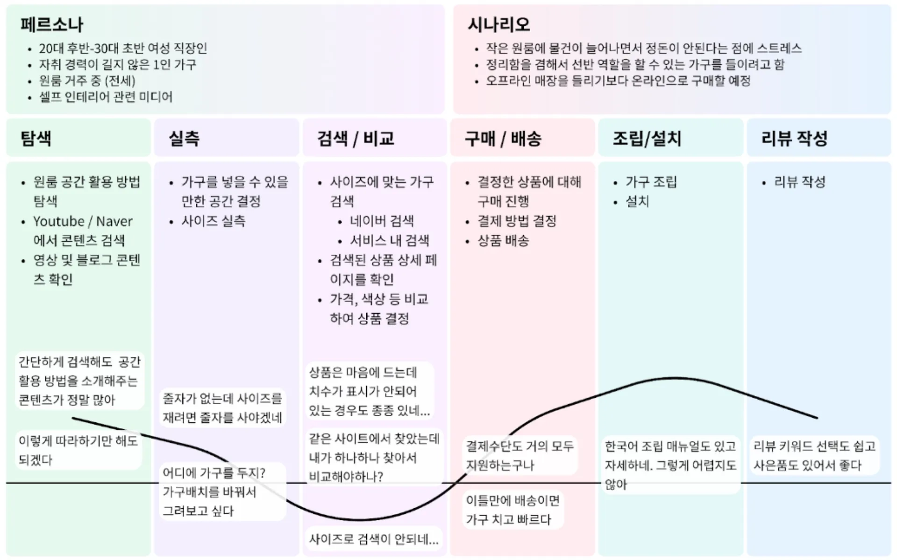
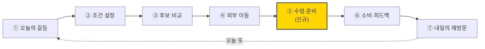
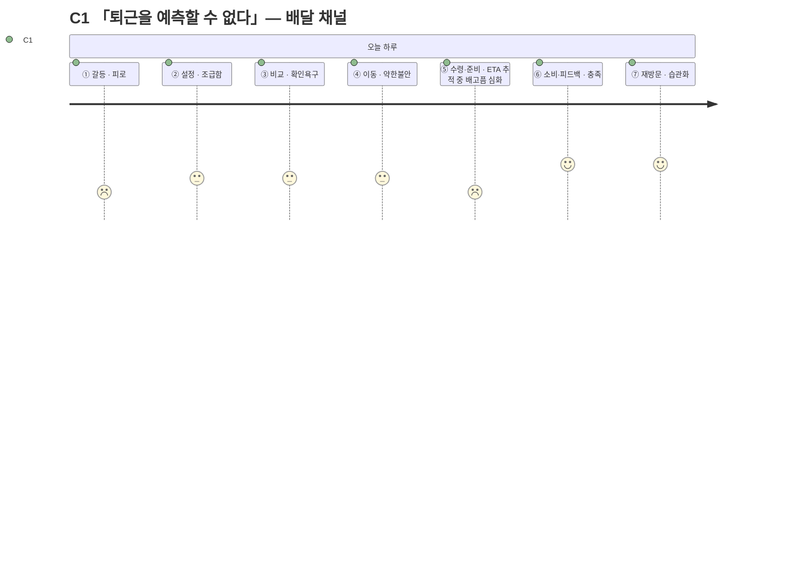
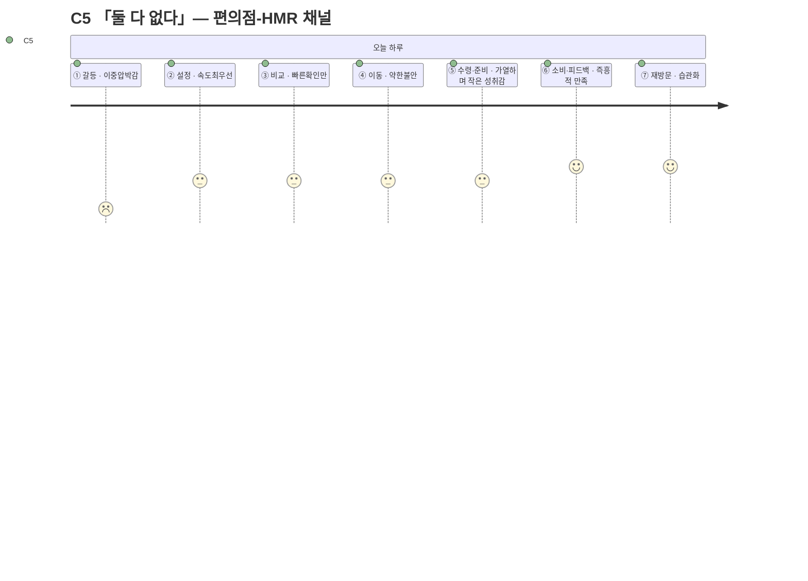
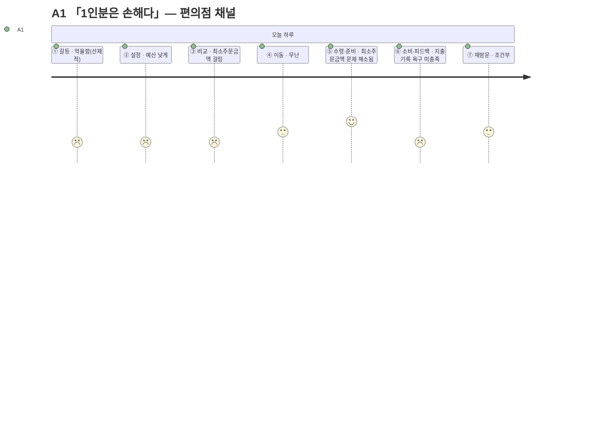

# 고객 여정지도 심화 — 채널별 "수령·준비" 단계 추가

> 입력: [03-고객여정지도.md](./03-고객여정지도.md)(6단계 기본형 + 12종 개별 여정) · [02-페르소나스펙트럼.md](./02-페르소나스펙트럼.md)(12종 + 선호 채널) · 계기: 가구 시장 CJM 이미지("실측"·"조립/설치")와의 비교 검토
>
> 이 문서는 [03-고객여정지도.md](./03-고객여정지도.md)를 대체하지 않는다. 03은 6단계 기본형으로 유지하고, 이 문서는 가구 CJM의 물리적 특수 단계를 검토한 결과로 나온 **7단계 심화형**을 별도로 기록한다.

---

## 0. 왜 새 단계가 필요한가 — 가구의 "실측·조립/설치"와의 대응

| 가구 CJM의 특수 단계 | 무엇을 검증/수행하는가 | 한끼라우터의 대응 |
| --- | --- | --- |
| 실측 (탐색과 검색/비교 사이) | 온라인 정보가 내 물리적 공간과 맞는지 **사전 검증** | **이미 있음** — [03의 ③ 후보 비교](./03-고객여정지도.md)에서 FR-04 조건 필터·NFR-05 불확실 옵션 표시가 같은 역할을 한다. 별도 단계 불필요 |
| 조립/설치 (구매/배송 다음) | 구매만으로 안 끝나고, 소비 가능한 상태로 만드는 **물리적 노동** | **빠져 있었음** — 07단계 SRS [8.3절 비용·시간 계산 규칙](../../04.tam-sam-som/1인가구한끼해결-7단계/07-솔루션구체화-SRS.md)에 이미 "왕복 이동 + 구매 + **가열/준비**"(편의점-HMR)라는 필드로 존재했는데, 03의 6단계 모델은 이걸 ④~⑤ 사이에 뭉개서 다뤘다 |

**신규 단계: ⑤ 수령·준비 (Receive & Prep).** ④ 외부 이동과 (기존) ⑤ 소비·피드백 사이에 삽입한다.

> 가구의 실측이 "선택 이전" 검증이고 조립/설치가 "결제 이후" 노동인 것처럼, 한끼라우터도 **결제(외부 이동) 이후에 물리적 노동이 남는다** — 다만 그 노동의 모양이 채널마다 완전히 다르다는 것이 §2의 핵심이다.

---

## 1. 채널별 "수령·준비"의 세 가지 모습

| 채널 | 행동 | 감정 | Pain Point | 근거 |
| --- | --- | --- | --- | --- |
| 배달 | 배달원 위치추적 + 대기 | 표시 ETA를 보며 배고픔이 점점 심해짐 | **표시 ETA와 실제 도착시간의 차이가 클수록 신뢰가 깎인다** | [07단계 SRS 8.3절](../../04.tam-sam-som/1인가구한끼해결-7단계/07-솔루션구체화-SRS.md) "총시간 = 표시 ETA" |
| 포장 | 왕복 이동 → 도착해 결제확인/대기 → 귀가 | 이동 자체가 수고, 날씨·거리에 따라 부담 커짐 | **"주문"과 "수령"이 물리적으로 분리돼 있어 이동이라는 숨은 비용이 매번 재발한다** | [07단계 SRS 8.3절](../../04.tam-sam-som/1인가구한끼해결-7단계/07-솔루션구체화-SRS.md) "총시간 = 왕복 이동 + 조리/대기" |
| 편의점-HMR | 매장 방문 → 구매 → **가열/준비**(전자레인지 등) | 준비를 직접 해야 한다는 귀찮음, 또는 "내가 마무리했다"는 작은 성취감 | **가열 도구·장소가 없는 상황(사무실 등)에서는 이 단계 자체가 성립하지 않을 수 있다** | [07단계 SRS 8.3절](../../04.tam-sam-som/1인가구한끼해결-7단계/07-솔루션구체화-SRS.md) "총시간 = 왕복 이동 + 구매 + 가열/준비" |

> 편의점-HMR의 "가열/준비"가 가구의 "조립/설치"와 가장 정확히 대응한다 — 둘 다 **구매 후 사용자 본인이 마무리해야 최종 산출물(먹을 수 있는 상태 / 쓸 수 있는 상태)이 완성**된다.

---

## 2. 페르소나별 대응 — 완주하는 사람만 이 단계에 도달한다

[03-고객여정지도.md §5](./03-고객여정지도.md)의 결론(Extreme은 ③에서 중단, Non-user는 ①에서 미시작)은 이 신규 단계에도 그대로 적용된다. **⑤ 수령·준비에 실제로 도달하는 건 Core·Adjacent뿐이다.**

| 코드 | 채널([02 §3](./02-페르소나스펙트럼.md) 기준) | ⑤ 수령·준비 도달 여부 | 이 단계의 경험 |
| --- | --- | --- | --- |
| C1 | 배달 | 도달 | ETA 추적 중 배고픔 심화, 지연 시 불안 상승 |
| C2 | 배달 | 도달 | 마감 중이라 대기시간이 더 아깝게 느껴짐 |
| C3 | 배달·편의점 | 도달 | 편의점 선택 시 가열 준비, 배달 선택 시 대기 — 매번 다름 |
| C4 | 배달(전화) | 도달 | 전화 주문이라 ETA 추적 UX 자체를 안 씀 — 앱의 이 기능이 무용해짐 |
| C5 | 편의점 | 도달 | 즉흥적 성향과 잘 맞음 — 가열/준비가 오히려 "직접 골랐다"는 감각을 줌 |
| A1 | 편의점 | 도달 | 최소주문금액 문제가 없는 채널이라 ③의 억울함이 여기서 해소됨 |
| A2 | 편의점-HMR(밀키트) | 도달 | 가열/준비 과정 자체가 "또 그 메뉴"라는 지루함을 살짝 상쇄 |
| A3 | 배달 | 도달 | 2인분 수령 시 "혼자 먹을 몫"을 나누는 미세한 조율이 추가됨 |
| X1 | 편의점(사전구매 지향) | **도달 못 함** | [03](./03-고객여정지도.md)대로 ③에서 후보 0건으로 종료 — 이 채널 선호는 실제 도달이 아니라 시도였을 뿐 |
| X2 | 포장(지향) | **도달 못 함** | 마찬가지로 ③에서 종료 |
| N1 | — | **도달 못 함** | ①에서 이미 갈라짐 |
| N2 | — | **도달 못 함** | ①에서 이미 갈라짐 |

> 📌 **완주 채널 목록에 "포장" 대표가 없다.** 완주하는 8명(C1~C5, A1~A3) 중 아무도 포장을 주 채널로 쓰지 않는다 — 포장을 선호하는 건 X2(Extreme)뿐인데 X2는 애초에 ③에서 좌절한다. [02단계 ①1차 생성](./02-페르소나스펙트럼.md)이 포장 채널의 "정상적으로 완주하는 대표 사용자"를 발산해내지 못했다는 뜻이다 — 이후 ②평가를 다시 열게 되면 채워야 할 공백이다.

---

## 3. 대표 3인의 갱신된 7단계 여정

Extreme·Non-user는 §2에서 이미 "도달 못 함"으로 확정됐으므로, 실제로 이 신규 단계를 겪는 대표 3인만 7단계 전체로 다시 그린다.

> A1은 ⑤에서 오히려 점수가 오른다 — 편의점 채널을 선택한 순간 ③의 Pain Point(최소주문금액)가 자연히 해소되기 때문이다. **채널 선택 자체가 Pain Point 회피 전략으로 쓰이고 있다**는 것을 보여준다.

---

## 4. Pain Point 추가분 — [03 §6](./03-고객여정지도.md) 우선순위에 더할 것

| Pain Point | 겪는 채널/유형 | 연결되는 요구사항 |
| --- | --- | --- |
| 표시 ETA와 실제 도착시간의 차이가 신뢰를 깎는다 | 배달 전체(C1·C2·C3·A3) | [07단계 SRS 8.3절](../../04.tam-sam-som/1인가구한끼해결-7단계/07-솔루션구체화-SRS.md) — ETA 정확도는 외부 서비스 소관이라 한끼라우터가 직접 통제 불가, "추정치 여부"만 명시 가능 |
| 가열 도구·장소가 없으면 편의점-HMR 선택 자체가 무의미해진다 | 편의점-HMR(C5·A1·A2) | 신규 제안 — 조건 입력에 "가열 가능 여부" 옵션 추가 검토 |
| 완주 페르소나 중 포장 대표가 없다 | 스펙트럼 공백 | [02단계 ②평가](./02-페르소나스펙트럼.md) 재개 시 보완 필요 |

---

## 5. 근거 등급

| 구성 요소 | 등급 | 비고 |
| --- | --- | --- |
| "가열/준비" 필드의 존재 | **(확인)** | [07단계 SRS 8.3절](../../04.tam-sam-som/1인가구한끼해결-7단계/07-솔루션구체화-SRS.md) 원문 인용 |
| 채널별 ⑤ 경험(행동/감정/Pain Point) | **(가정)** | 인터뷰 없는 생성물, [03](./03-고객여정지도.md)·[02](./02-페르소나스펙트럼.md)와 동일한 근거 수준 |
| "완주 채널 중 포장 대표 없음"이라는 공백 관찰 | **(확인)** | [02 §3 요약표](./02-페르소나스펙트럼.md)를 직접 재검토해 도출 — 새 데이터가 아니라 기존 표의 재해석 |

> ⚠️ 이 문서도 [03](./03-고객여정지도.md)·[02](./02-페르소나스펙트럼.md)와 같은 이유로 가설의 목록이다. PoC 단계에서는 특히 "가열/준비" Pain Point와 "포장 대표 공백"을 우선 확인 대상으로 삼는다.
