# 고객 여정지도 — 수령·준비 단계 추가 (7단계 개정판)

> 입력: [03-고객여정지도.md](./03-고객여정지도.md)(6단계 기본형 + 12종 개별 여정) · [02-페르소나스펙트럼.md](./02-페르소나스펙트럼.md)(12종 + 선호 채널)
>
> 03의 6단계는 ④ 외부 이동과 ⑤ 소비·피드백 사이에 있는 "실제로 받아서 먹을 수 있는 상태로 만드는" 과정을 뭉개서 다뤘다. 07단계 SRS [8.3절 비용·시간 계산 규칙](../../04.tam-sam-som/1인가구한끼해결-7단계/07-솔루션구체화-SRS.md)은 이미 이 과정을 채널별로 "표시 ETA"(배달), "왕복 이동+조리/대기"(포장), "왕복 이동+구매+**가열/준비**"(편의점-HMR)로 구분해 정의해뒀다. 이 문서는 그 구분을 CJM에 정식 반영해 **⑤ 수령·준비 (Receive & Prep)** 단계를 신규 삽입한 7단계 개정판이다.

---

## 0. 갱신된 7단계 모델

| # | 단계 | 무엇을 하는가 | 대응 화면/요구사항 |
| --- | --- | --- | --- |
| ① | 오늘의 갈등 (Trigger) | 배고픔과 예산·시간 압박이 동시에 인식되는 순간 | — (앱 밖) |
| ② | 조건 설정 (Setup) | 위치·예산·최대시간·우선순위 입력 | S1 홈/조건입력, FR-01·FR-02 |
| ③ | 후보 비교 (Compare) | 3개 추천 카드 확인 + 필요시 상세비교 | S2 추천결과·S3 상세비교, FR-03~06 |
| ④ | 외부 이동 (Handoff) | 원 서비스로 이동해 실제 주문 | S4 외부이동확인, FR-07 |
| **⑤** | **수령·준비 (Receive & Prep)** | **채널별로 완전히 다른 물리적 과정 — 배달 대기, 포장 왕복 이동, 편의점 가열/준비** | **07단계 SRS 8.3절(신규 반영)** |
| ⑥ | 소비·피드백 (Consume & Feedback) | 실제로 먹고 결과를 기록(또는 건너뜀) | S5 피드백, FR-08 |
| ⑦ | 내일의 재방문 (Recurrence) | 습관으로 자리잡는가 | — (앱 밖, 반복 관찰) |

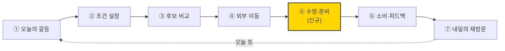

### 채널별 "수령·준비"의 세 가지 모습

| 채널 | 행동 | 감정 | Pain Point |
| --- | --- | --- | --- |
| 배달 | 배달원 위치추적 + 대기 | 표시 ETA를 보며 배고픔이 점점 심해짐 | **표시 ETA와 실제 도착시간의 차이가 클수록 신뢰가 깎인다** |
| 포장 | 왕복 이동 → 도착해 결제확인/대기 → 귀가 | 이동 자체가 수고, 날씨·거리에 따라 부담 커짐 | **"주문"과 "수령"이 물리적으로 분리돼 있어 이동이라는 숨은 비용이 매번 재발한다** |
| 편의점-HMR | 매장 방문 → 구매 → 가열/준비(전자레인지 등) | 준비를 직접 해야 한다는 귀찮음, 또는 작은 성취감 | **가열 도구·장소가 없는 상황(사무실 등)에서는 이 단계 자체가 성립하지 않을 수 있다** |

### 점수 범례 (§1~4 공통)

| 점수 | 의미 |
| --- | --- |
| 5 | 편안·만족·습관화 |
| 4 | 무난 |
| 3 | 중립·약한 불편 |
| 2 | 불편(피로, 자책감, 지루함, 억울함) |
| 1 | 매우 괴로움 또는 확신에 찬 거부 |

> 이 7단계는 Core·Adjacent에게는 끝까지 이어지지만, Extreme·Non-user는 [03](./03-고객여정지도.md)에서 확정된 대로 여전히 중간에 끊긴다 — **⑤ 수령·준비에 실제로 도달하는 건 Core·Adjacent뿐이다.**

---

## 1. Core — 핵심 사용자의 여정 (C1~C5, 5인 개별)

Core 5인 중 순수 Q4(예산·시간 동시압박)는 C1·C2·C5이고, C3는 Q2·C4는 Q3에 더 가깝다([02-페르소나스펙트럼.md §2](./02-페르소나스펙트럼.md)의 재분류). ⑤에서도 채널 차이가 그대로 드러난다 — C1·C2·A3는 배달의 "대기 스트레스"를, C5는 편의점의 "즉흥적 만족"을 겪는다.

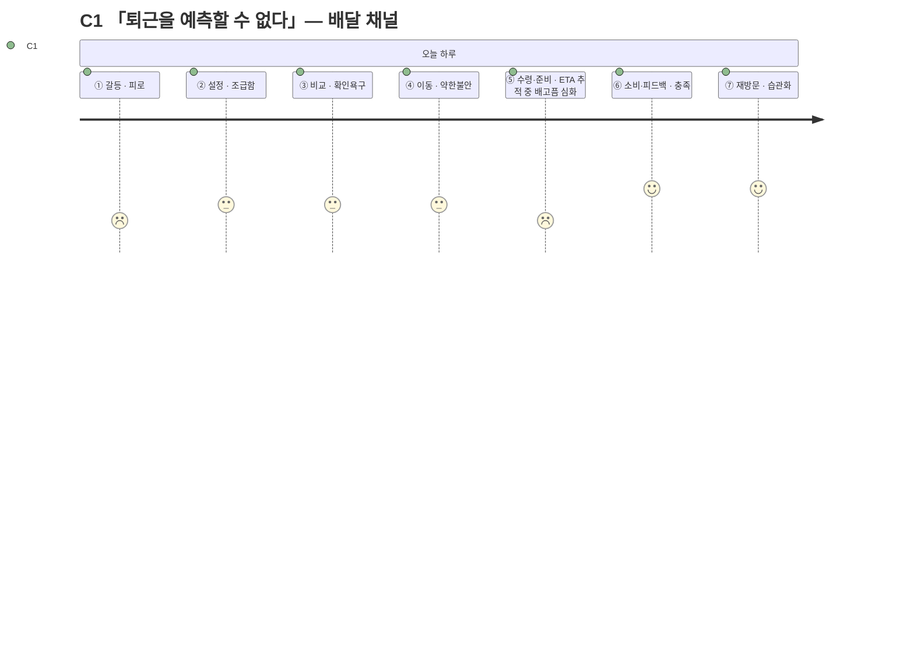

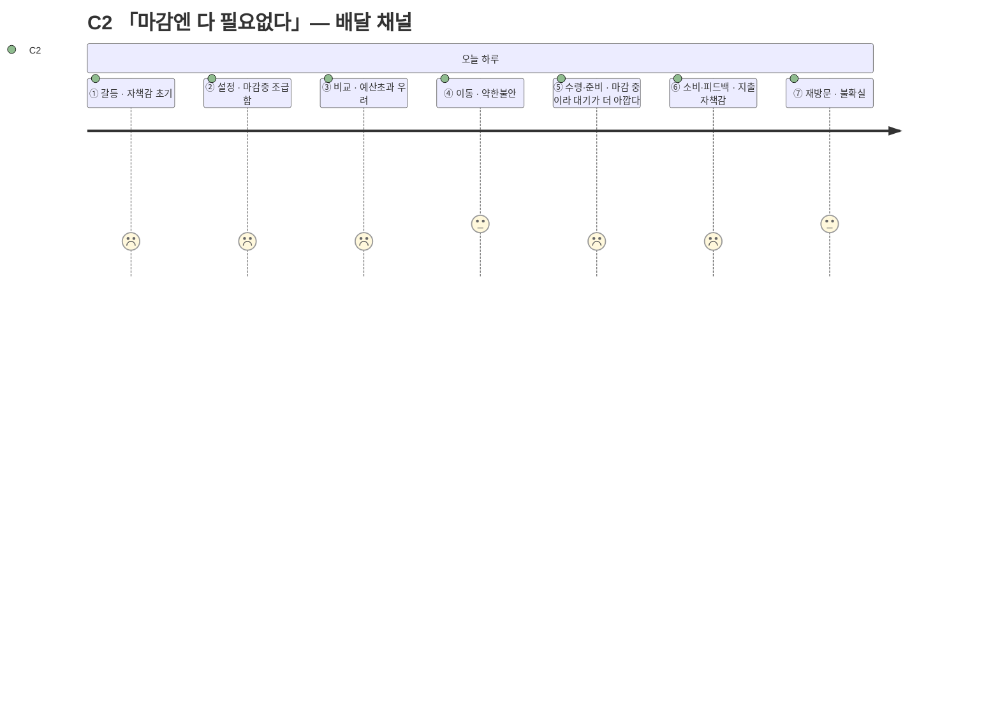

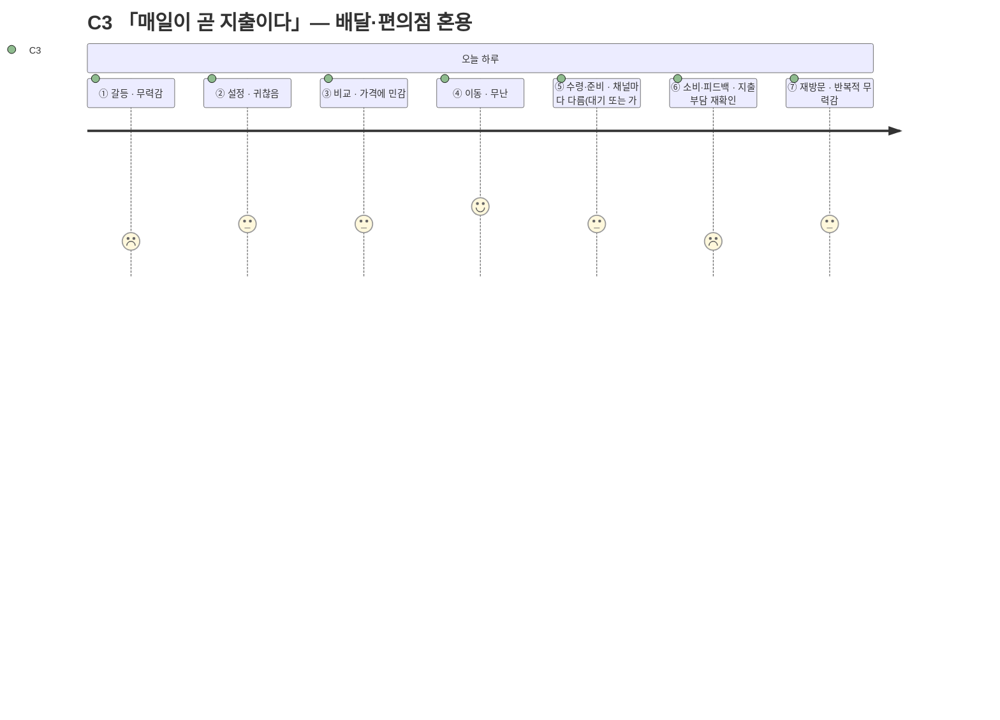

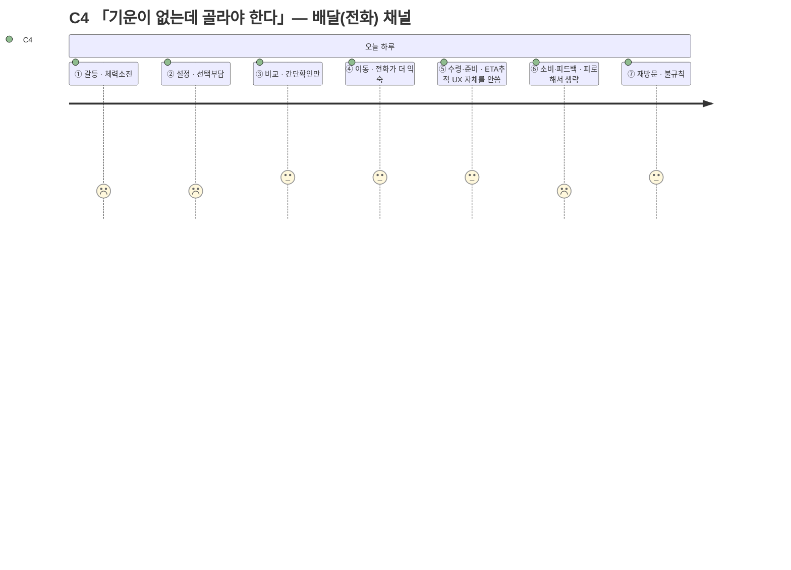

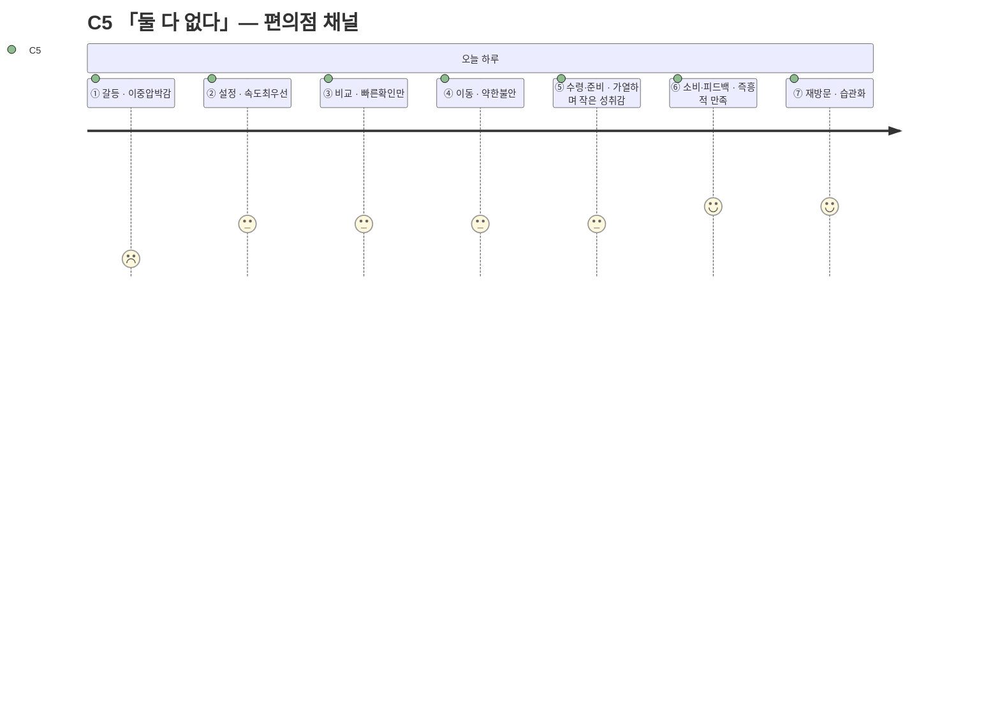

| 단계 | 행동 | 생각 | 감정 | Pain Point | 개선 기회 |
| --- | --- | --- | --- | --- | --- |
| ① Trigger | 퇴근·마감 시각이 다가오며 배고픔을 자각 | "또 정해야 하나" | 피로 | **매번 같은 고민이 반복된다** | 최근 조건 자동 채움([FR-10](../../04.tam-sam-som/1인가구한끼해결-7단계/07-솔루션구체화-SRS.md) 즐겨찾기) |
| ② Setup | 위치·예산·최대시간을 빠르게 입력 | "이번엔 빨리 끝내고 싶다" | 조급함 | **입력 자체가 새로운 결정 부담이다** | 슬라이더 기본값을 최근 패턴으로 사전 설정 |
| ③ Compare | 3개 카드와 총비용·총시간을 확인 | "이 숫자를 믿어도 되나" | 확인 욕구 | **갱신시각이 지난 정보에 대한 불신** | [NFR-02 데이터 신뢰성](../../04.tam-sam-som/1인가구한끼해결-7단계/07-솔루션구체화-SRS.md)(출처·갱신시각 강조 노출) |
| ④ Handoff | 원 서비스로 이동 | "여기서 가격이 바뀌면 어떡하지" | 약한 불안 | **이동 직후 가격이 달라질 수 있다는 불확실성** | S4 안내 문구 명확화("다시 확인" 리마인드) |
| **⑤ Receive & Prep** | **채널별로 대기 또는 가열/준비** | **"언제 오지" / "이 정도면 됐나"** | **채널마다 다름(불안~성취감)** | **표시 ETA와 실제 시간의 차이, 또는 가열 도구·장소의 부재** | **추정 ETA 오차 범위 표시, 가열 가능 여부 필터** |
| ⑥ Consume & Feedback | 실제로 먹고, 피드백은 대체로 건너뜀 | "예상과 비슷했나" | 충족 또는 실망 | **피드백 입력이 귀찮아 생략된다** | 만족도 1탭만이라도 남기는 최소 피드백 |
| ⑦ Recurrence | 다음 날도 앱을 다시 여는가 | "어제도 도움이 됐으니 또" | 습관화 시작 | **새로울 것이 없다는 지루함이 재발할 수 있다** | 주간 지출 요약([SHOULD 기능](../../04.tam-sam-som/1인가구한끼해결-7단계/07-솔루션구체화-SRS.md))으로 누적 가치 환기 |

---

## 2. Adjacent — 확장 사용자의 여정 (A1·A2·A3 개별)

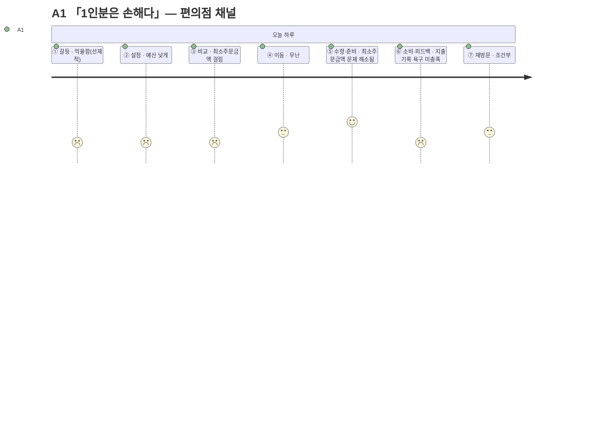

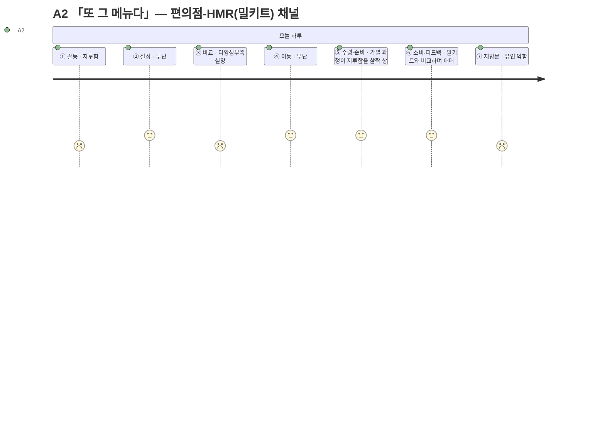

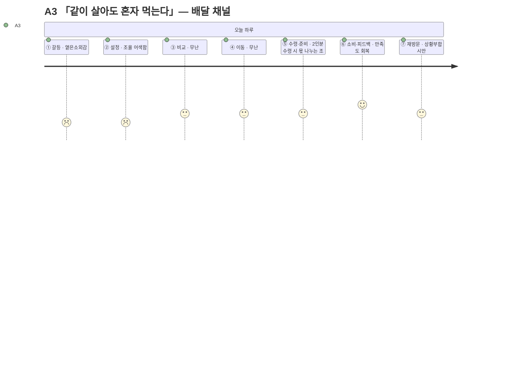

> A1은 ⑤에서 오히려 점수가 오른다 — 편의점 채널을 선택한 순간 ③의 Pain Point(최소주문금액)가 자연히 해소되기 때문이다. **채널 선택 자체가 Pain Point 회피 전략으로 쓰이고 있다.**

| 코드 | 갈리는 단계 | 행동/생각/감정 | Pain Point | 개선 기회 |
| --- | --- | --- | --- | --- |
| **A1** (대학생·야간알바) | ③ Compare, ⑤ Receive(회복) | 1인분 기준 옵션을 확인하며 억울함을 느끼지만, 편의점 수령에서 그 문제가 사라짐을 확인 | **최소주문금액 미충족 옵션이 후보에 섞여 나오면 확인 자체가 시간 낭비다** | [FR-04 조건 필터](../../04.tam-sam-som/1인가구한끼해결-7단계/07-솔루션구체화-SRS.md)에서 최소주문금액 미충족 옵션을 사전 배제 |
| **A2** (프리랜서 디자이너) | ③ Compare, ⑦ Recurrence | 카드를 보며 "또 그 메뉴들이네" — 감정: 지루함, 가열 과정에서만 잠시 상쇄 | **추천이 매번 비슷해 다양성 결핍이 해결되지 않는다** | 카테고리 강제 다양화 또는 신규 옵션 우선 노출 |
| **A3** (맞벌이 2인가구) | ② Setup, ⑤ Receive(신규 조율) | 입력 전 조율(어색함), 수령 시 몫 나누는 조율(약한 불편) — 1인가구 전제 흐름이 2인 상황엔 두 번 어긋난다 | **1인가구 전제로 설계된 입력·수령 흐름이 2인 상황에는 맞지 않는다** | "혼자 먹는 날" 토글 등 상황 명시 옵션 |

> 📌 **완주 채널 목록에 "포장" 대표가 없다.** Core·Adjacent 8명 중 아무도 포장을 주 채널로 쓰지 않는다 — 포장을 선호하는 건 Extreme의 X2뿐인데, X2는 §3에서 보듯 ③에서 좌절해 이 신규 단계 자체에 도달하지 못한다. [02단계 ①1차 생성](./02-페르소나스펙트럼.md)이 포장 채널의 "정상적으로 완주하는 대표 사용자"를 발산해내지 못했다는 뜻 — 이후 ②평가를 다시 열게 되면 채워야 할 공백이다.

---

## 3. Extreme — 극단 사용자의 여정 (X1·X2, ③에서 끊긴다 — 신규 단계는 도달하지 못함)

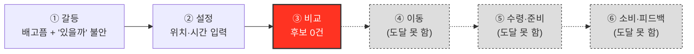

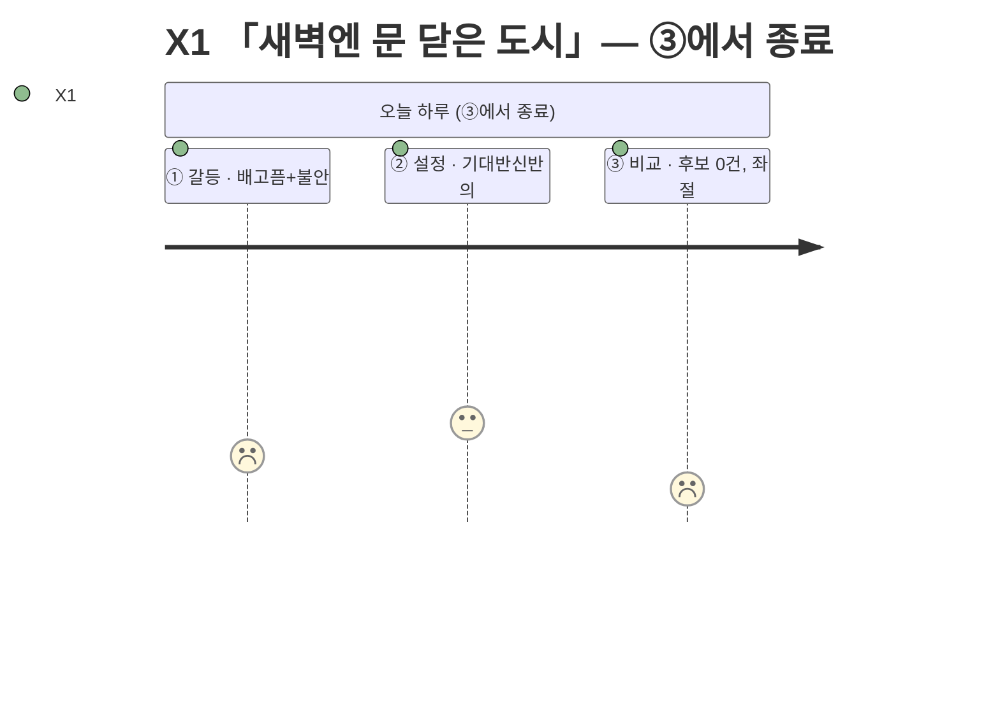

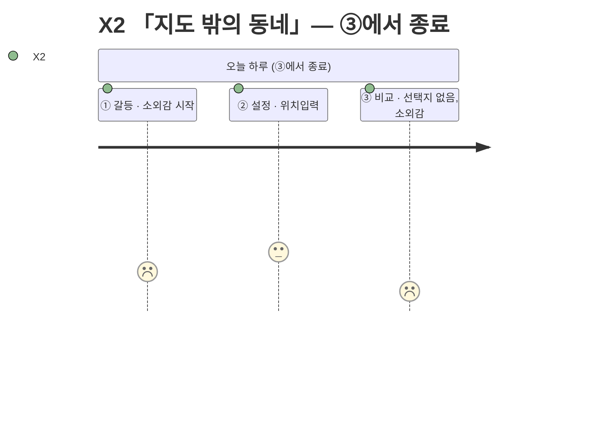

| 코드 | 단계 | 행동/생각/감정 | Pain Point | 개선 기회 |
| --- | --- | --- | --- | --- |
| **X1** (야간 교대근무) | ③ Compare에서 종료 | 새벽 시간대로 조건을 입력했지만 추천 카드가 뜨지 않음 — 생각: "그럼 뭘 먹으라는 거지" — 감정: 좌절 | **조건에 맞는 옵션이 0개면 여정이 그대로 끝난다** | 결과 0건일 때 "다음 영업 예상 시각"이라도 안내 |
| **X2** (지방 소도시 원룸) | ③ Compare에서 종료 | 위치 입력 후 대부분이 "배달 불가"로 표시되고 포장 몇 곳만 남음 — 감정: 소외감 | **선택지가 사실상 없어 "비교"라는 단계 자체가 무의미해진다** | 포장 전용 뷰로 전환해 "비교 실패"가 아니라 "포장 모드"로 재구성 |

> ④~⑦은 X1·X2 둘 다 여전히 **도달하지 못한다** — ⑤ 수령·준비 신설이 이들의 상황을 바꾸지 않는다. 이들의 실제 다음 행동(사전에 사둔 상온식품, 반복 방문하는 포장 매장)은 앱 밖에서 일어난다.

---

## 4. Non-user — 비활성 사용자의 여정 (N1·N2, ①에서 갈라진다 — 신규 단계는 도달하지 못함)

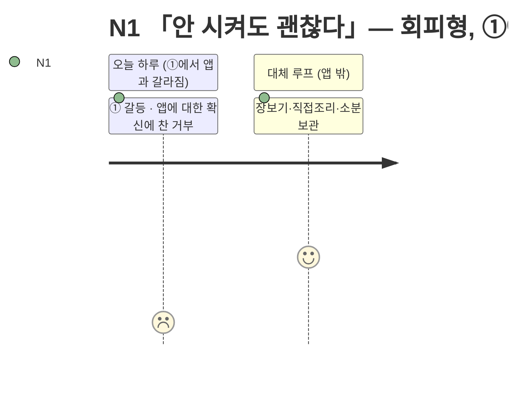

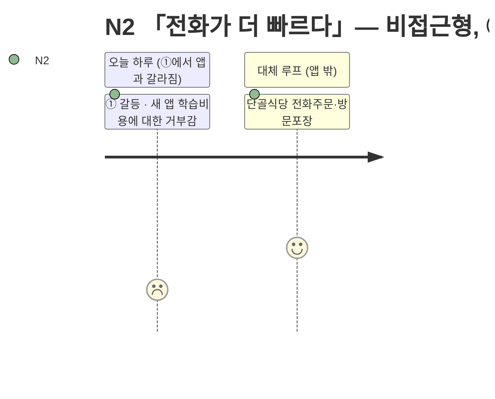

| 코드 | ① Trigger에서의 분기 | 대체 루프 (앱 밖) | Pain Point | 개선 기회 |
| --- | --- | --- | --- | --- |
| **N1** (회피형, 배달 불신) | 배고픔은 느끼지만 "배달은 못 믿는다"는 판단이 앱을 여는 행동보다 먼저 작동 — 감정: 확신에 찬 거부 | 장보기 → 직접 조리 → 소분 보관(자기 완결 루프) | **불신이 근본 원인이라, UX를 개선해도 애초에 앱을 열지 않는다** | 신뢰 신호는 필요조건이지만, 앱을 열게 만드는 건 별도의 신뢰 획득 문제 |
| **N2** (비접근형, 앱 장벽) | 배고픔을 느끼지만 "새 앱을 배우는 수고"가 기대 이득보다 크다고 판단 — 감정: 가벼운 거부감 | 단골 식당 인지 → 전화 주문 → 방문 포장(외부 루프, 앱 개입 지점 없음) | **앱이라는 형식 자체가 진입장벽이다** | [NFR-06 모바일 우선](../../04.tam-sam-som/1인가구한끼해결-7단계/07-솔루션구체화-SRS.md)은 필요조건일 뿐 |

> 두 사람 모두 앱과 만나는 지점(①)에서만 낮은 점수를 찍고, 대체 루프에서는 만족도가 높다 — ⑤ 수령·준비 신설과 무관하게 그대로다.

---

## 5. 일곱 단계로 다시 본 통합 비교

| 유형 | 여정이 끝까지 가는가 | 갈라지는 단계 | ⑤ 수령·준비 도달 | 핵심 차이 |
| --- | --- | --- | --- | --- |
| Core | 완주 | — | 도달(배달 대기 또는 편의점 가열) | 채널에 따라 ⑤의 감정이 완전히 다르다 |
| Adjacent | 완주 | ③ 또는 ② | 도달(A1은 ⑤에서 회복) | ⑤가 ③의 Pain Point를 상쇄하거나 반복시킨다 |
| Extreme | **중단** | ③ | 도달 못 함 | "비교"가 아니라 "후보 없음"으로 끝난다 |
| Non-user | **시작 안 함** | ① | 도달 못 함 | UX 개선으로 닿지 않는 영역 |

> 📌 **⑤ 수령·준비는 한끼라우터가 직접 설계하지 않는 단계인데도 만족도를 좌우한다.** 배달의 ETA 정확도, 포장의 이동 부담, 편의점의 가열 가능성은 전부 원 서비스·사용자 환경의 소관이라 앱이 직접 통제할 수 없다 — 그런데도 [FR-06 비교 상세](../../04.tam-sam-som/1인가구한끼해결-7단계/07-솔루션구체화-SRS.md)에 "이 단계는 어떨 것이다"라는 예측 정보를 얼마나 정확히 보여주느냐가 ⑥의 만족도를 결정한다.

---

## 6. Pain Point 우선순위 (7단계 반영, [03 §6](./03-고객여정지도.md) 갱신)

| 순위 | Pain Point | 겪는 유형 | 연결되는 요구사항 |
| --- | --- | --- | --- |
| 1 | 조건에 맞는 후보가 0건이면 여정이 그대로 끝난다 | Extreme(X1·X2) | [FR-04 조건 필터](../../04.tam-sam-som/1인가구한끼해결-7단계/07-솔루션구체화-SRS.md) — 0건 시 대안 안내 필요(신규 제안) |
| 2 | 표시 ETA와 실제 도착시간의 차이가 신뢰를 깎는다 | 배달 전체(C1·C2·C3·A3) | 07단계 SRS 8.3절 — 추정치 오차 범위 표시(신규 제안) |
| 3 | 최소주문금액 미충족 옵션이 후보에 섞여 나온다 | Core 일부·Adjacent(A1) | FR-04 필터 로직 보강 |
| 4 | 갱신시각이 지난 정보에 대한 불신 | Core 전반 | [NFR-02 데이터 신뢰성](../../04.tam-sam-som/1인가구한끼해결-7단계/07-솔루션구체화-SRS.md) |
| 5 | 가열 도구·장소가 없으면 편의점-HMR 선택 자체가 무의미해진다 | 편의점-HMR(C5·A1·A2) | 신규 제안 — 조건 입력에 "가열 가능 여부" 필터 |
| 6 | 추천이 매번 비슷해 다양성이 없다 | Adjacent(A2) | 신규 제안 — 추천 다양화 로직 |
| 7 | 완주 페르소나 중 포장 대표가 없다 | 스펙트럼 공백 | [02단계 ②평가](./02-페르소나스펙트럼.md) 재개 시 보완 필요 |
| 8 | 앱 자체가 진입장벽이거나, 애초에 신뢰하지 않아 열지 않는다 | Non-user(N1·N2) | NFR-06 + 별도 신뢰·채널 확보 과제(UX 밖) |

---

## 7. 근거 등급

| 구성 요소 | 등급 | 비고 |
| --- | --- | --- |
| 7단계 재정의의 근거(FR-07 외부이동, "가열/준비" 필드, 주 12.9끼) | **(확인)** | [07단계 SRS 8.3절](../../04.tam-sam-som/1인가구한끼해결-7단계/07-솔루션구체화-SRS.md)·[06단계](../../04.tam-sam-som/1인가구한끼해결-7단계/06-반복적정제.md) 직접 인용 |
| Core·Adjacent의 행동/생각/감정/Pain Point (⑤ 포함) | **(가정)** | [02-페르소나스펙트럼.md](./02-페르소나스펙트럼.md) 원본과 마찬가지로 인터뷰 없는 생성물 |
| Extreme·Non-user가 ⑤에 도달하지 못한다는 판단 | **(추정)** | [03단계](./03-고객여정지도.md)에서 이미 도출한 구조적 판단을 그대로 승계 |
| "완주 채널 중 포장 대표 없음"이라는 공백 관찰 | **(확인)** | [02 §3 요약표](./02-페르소나스펙트럼.md)를 직접 재검토해 도출 — 새 데이터가 아니라 기존 표의 재해석 |

> ⚠️ 이 문서도 [03](./03-고객여정지도.md)·[02](./02-페르소나스펙트럼.md)와 같은 이유로 가설의 목록이다. PoC 단계에서는 특히 "ETA 오차", "가열 가능 여부", "포장 대표 공백"을 우선 확인 대상으로 삼는다.
