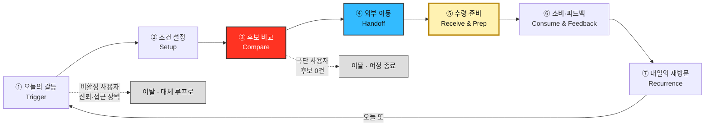

# 고객 여정지도 — 채널별 "수령·준비" 단계 포함 7단계 정식판

> [00-방법론.md §3](./00-방법론.md) · 입력 [02-페르소나스펙트럼.md](./02-페르소나스펙트럼.md) · 이전 판 [03-고객여정지도.md](./03-고객여정지도.md)(6단계, 12종 개별)

## 0. 등장 인물

이 지도는 스펙트럼 4유형의 대표 페르소나 넷을 다룬다. **접하기 전부터 수령·소비 후까지**의 여정을 각각 그린다.

| 스펙트럼 유형 | 인물 이름 | 직무·상태 | 한 문장 정체 |
| --- | --- | --- | --- |
| 🔵 **핵심(Core)** | **「퇴근을 예측할 수 없다」 (C1)** | 스타트업 백엔드 개발자 | 야근으로 퇴근 시각이 불규칙해 매번 새로 결정해야 하는, 예산·시간 동시압박의 전형 |
| 🟢 **확장(Adjacent)** | **「1인분은 손해다」 (A1)** | 대학생·야간 편의점 알바 | 최소주문금액 앞에서 매번 억울해지는, 용돈 기반 예산 민감형 |
| 🔴 **극단(Extreme)** | **「새벽엔 문 닫은 도시」 (X1)** | 물류센터 야간 교대근무 | 시간이 아니라 영업시간의 존재 자체가 벽인, 여정이 구조적으로 끊기는 사용자 |
| ⬜ **비활성(Non-user)** | **「안 시켜도 괜찮다」 (N1)** | 회계사무소 직원 | 배달을 근본적으로 불신해 앱을 열 필요조차 느끼지 않는 회피형 |

> 넷 모두 [02-페르소나스펙트럼.md](./02-페르소나스펙트럼.md) 12종 원본 중 유형별로 가장 전형적인 1명을 골랐다 — 공식 ②평가를 거친 결과는 아니며([02 §7](./02-페르소나스펙트럼.md)에서 이 프로젝트 범위 밖으로 남긴 단계), 이 문서를 좁혀 쓰기 위한 실용적 선택이다. 나머지 8명의 개별 여정은 이전 판인 [03-고객여정지도.md](./03-고객여정지도.md)에 그대로 남아 있다. 본문에서는 별칭 **「」** + 코드를 함께 쓴다.

---

## 1. 단계를 새로 정의한 근거

[00-방법론.md §3](./00-방법론.md)의 경고는 일반형 5단계(`문제 인식 → 탐색 → 의사결정 → 사용 → 유지`)를 그대로 채우지 말고 **서비스의 실제 관문에서 단계를 도출하라**고 요구한다. 그 절이 제시한 질문에 먼저 답한다.

| # | 질문 | 이 서비스의 답 |
| --- | --- | --- |
| **1** | 고객이 실제로 통과하는 관문은? | 일반형에 없는 관문이 셋 있다 — **조건 설정**(예산·시간·우선순위를 매번 새로 입력) · **외부 이동**(결제가 앱 안에 없다 — 반은 관문, 반은 이양) · **수령·준비**(채널마다 완전히 다른 물리적 과정) |
| **2** | 가장 많이 이탈하는 곳은? | **③후보 비교**와 **①오늘의 갈등.** 전자는 조건에 맞는 옵션이 없어 구조적으로 종료되고, 후자는 신뢰·접근 장벽으로 아예 시작되지 않는다 |
| **3** | 외부 이동 **이후에** 더 큰 관문이 있는가? | **있다.** 가구의 `조립·설치`와 같은 위치에 **⑤수령·준비**가 있다. 외부 이동은 결제이지 소비가 아니다 — 배달은 대기, 포장은 왕복 이동, 편의점-HMR은 가열/준비를 거쳐야 실제로 먹을 수 있다 |
| **4** | 페르소나마다 여정이 갈라지는가? | **갈라진다.** 「새벽엔 문 닫은 도시」 야간 교대근무는 ③에서 여정이 끝나고, 「안 시켜도 괜찮다」 회피형은 ①에서 아예 다른 루프로 샌다. **지도를 넷으로 나눠 그린다** |

### 일반형을 쓰지 않은 이유 — 세 군데가 어긋난다

| 일반형 단계 | 이 서비스에서 어긋나는 지점 |
| --- | --- |
| **문제 인식** | 처음 겪는 문제가 아니다. 매일 재발하는 갈등이므로 '인식'이 아니라 **매번 다시 시작되는 트리거**다 |
| **사용** | 앱 안에서 '사용'이 끝나지 않는다. 결제(외부 이동)는 앱 밖에서 일어나고, 앱은 그 이전(비교)만 담당한다. 그 자리에 **수령·준비**라는 물리적 관문이 남는다 |
| **유지** | '반복 구매'가 아니라 **매일 다시 열지 정하는 습관**이다. 방아쇠는 브랜드 충성이 아니라 그날 압박이 재발하는가다 |

### 이 서비스의 7단계

| 표기 | 의미 |
| --- | --- |
| 🔴 빨강 (③) | **이탈 병목.** 극단 사용자의 여정 성패가 여기서 갈린다 |
| 🔵 파랑 (④) | 외부 이동 — **여정의 끝이 아니라 중간**이다(앱 안에 결제가 없다) |
| 🟡 노랑 (⑤) | **가구의 조립·설치와 같은 위치.** 결제가 아니라 여기서 "먹을 수 있는 상태"가 완성된다 |

---

## 2. 🔵 핵심 — 「퇴근을 예측할 수 없다」 스타트업 백엔드 개발자 (C1)

> 야근이 잦아 퇴근 시각을 스스로도 예측하지 못한다. 예산·시간이 동시에 압박받는, 이 서비스의 1차 타깃(30대 1인가구) 전형.

| 단계 | 고객 행동 | 고객 생각 | 감정 | **Pain Point** | 개선 기회 |
| --- | --- | --- | --- | --- | --- |
| **① 오늘의 갈등** | 퇴근 시각이 다가오며 배고픔을 자각 | *"또 정해야 하나"* | 피로 | **매번 같은 고민이 반복된다** | 최근 조건 자동 채움([FR-10](../../04.tam-sam-som/1인가구한끼해결-7단계/07-솔루션구체화-SRS.md) 즐겨찾기) |
| **② 조건 설정** | 위치·예산·최대시간을 빠르게 입력 | *"이번엔 빨리 끝내고 싶다"* | 조급함 | **입력 자체가 새로운 결정 부담이다** | 슬라이더 기본값을 최근 패턴으로 사전 설정 |
| **③ 후보 비교** | 3개 카드와 총비용·총시간을 확인 | *"이 숫자를 믿어도 되나"* | 확인 욕구 | **갱신시각이 지난 정보에 대한 불신** | [NFR-02 데이터 신뢰성](../../04.tam-sam-som/1인가구한끼해결-7단계/07-솔루션구체화-SRS.md)(출처·갱신시각 강조) |
| **④ 외부 이동** | 원 서비스로 이동해 배달 주문 | *"여기서 가격이 바뀌면 어떡하지"* | 약한 불안 | **이동 직후 가격이 달라질 수 있다는 불확실성** | S4 안내 문구 명확화("다시 확인" 리마인드) |
| **⑤ 수령·준비** | 배달원 위치추적 + 대기 | *"왜 안 오지"* | 배고픔 심화 | **표시 ETA와 실제 도착시간의 차이가 클수록 신뢰가 깎인다** | 추정 ETA에 오차 범위 표시 |
| **⑥ 소비·피드백** | 실제로 먹고, 피드백은 대체로 건너뜀 | *"예상과 비슷했나"* | 충족 | **피드백 입력이 귀찮아 생략된다** | 만족도 1탭만이라도 남기는 최소 피드백 |
| **⑦ 내일의 재방문** | 다음 날도 앱을 다시 여는가 | *"어제도 도움이 됐으니 또"* | 습관화 시작 | **새로울 것이 없다는 지루함이 재발할 수 있다** | 주간 지출 요약([SHOULD 기능](../../04.tam-sam-som/1인가구한끼해결-7단계/07-솔루션구체화-SRS.md))으로 누적 가치 환기 |

> 📌 **「퇴근을 예측할 수 없다」의 여정은 끝까지 완주하지만 ①과 ⑤에서 두 번 눌린다.** ①은 앱 밖의 심리적 피로, ⑤는 앱이 직접 통제할 수 없는 외부 서비스의 ETA 정확도 문제다. **완주해도 만족이 보장되지 않는다**는 것이 이 여정의 핵심이다.

---

## 3. 🟢 확장 — 「1인분은 손해다」 대학생·야간 편의점 알바 (A1)

> 용돈·알바비로 생활해 예산 민감도가 Core보다 훨씬 높다. 최소주문금액 앞에서 매번 억울해진다.

| 단계 | 고객 행동 | 고객 생각 | 감정 | **Pain Point** | 개선 기회 |
| --- | --- | --- | --- | --- | --- |
| **① 오늘의 갈등** | 배고픔을 느끼며 "또 최소주문금액에 걸리겠지"를 먼저 예상 | *"어차피 손해 보겠지"* | 억울함(선제적) | **시작 전부터 실패를 예상하게 된다** | — |
| **② 조건 설정** | 예산을 매우 낮게 설정 | *"이 정도면 걸릴 것 같은데"* | 방어적 | **낮은 예산에서 옵션이 급감할까 걱정한다** | 예산 구간별 옵션 수 미리보기 |
| **③ 후보 비교** | 1인분 기준 옵션을 확인 | *"또 최소주문금액에 걸리겠지"* | 억울함 | **최소주문금액 미충족 옵션이 후보에 섞여 나오면 확인 자체가 시간 낭비다** | [FR-04 조건 필터](../../04.tam-sam-som/1인가구한끼해결-7단계/07-솔루션구체화-SRS.md)에서 미충족 옵션 사전 배제 |
| **④ 외부 이동** | 편의점 채널로 이동 | *"여긴 최소주문금액이 없으니까"* | 안도 | — | — |
| **⑤ 수령·준비** | 매장 방문 → 구매 → 가열/준비 | *"이건 내가 골랐다"* | 회복(최소주문금액 문제 해소) | **가열 도구·장소가 없는 상황(사무실 등)에서는 이 단계 자체가 성립하지 않을 수 있다** | 조건 입력에 "가열 가능 여부" 필터 |
| **⑥ 소비·피드백** | 실제로 먹지만 지출 기록은 남기지 않음 | *"이번 달에 얼마 썼지"* | 미충족 | **지출을 기록하고 싶은데 그 기능이 없다** | 간단한 누적 지출 뷰 |
| **⑦ 내일의 재방문** | 예산이 맞으면 재사용 | *"편의점으로 가면 되니까"* | 조건부 신뢰 | — | — |

> 📌 **「1인분은 손해다」는 ⑤에서 오히려 점수가 오른다.** 편의점 채널을 선택한 순간 ③의 Pain Point(최소주문금액)가 자연히 해소되기 때문이다 — **채널 선택 자체가 Pain Point 회피 전략으로 쓰이고 있다.**

---

## 4. 🔴 극단 — 「새벽엔 문 닫은 도시」 물류센터 야간 교대근무 (X1)

> 새벽 3~4시에 퇴근해 영업 중인 배달·매장이 거의 없다. **여정이 ③에서 끝난다.**

| 단계 | 고객 행동 | 고객 생각 | 감정 | **Pain Point** | 개선 기회 |
| --- | --- | --- | --- | --- | --- |
| **① 오늘의 갈등** | 배고픔과 함께 "이 시간에 열려 있는 곳이 있을까"라는 의문이 먼저 든다 | *"또 아무것도 없겠지"* | 불안 | **시간이 아니라 영업시간의 존재 자체가 벽이다** | — |
| **② 조건 설정** | 새벽 시간대로 조건을 입력 | *"혹시나 하는 마음"* | 기대반신반의 | — | — |
| **③ 후보 비교** ⛔ | 추천 카드가 뜨지 않음을 확인 | *"그럼 뭘 먹으라는 거지"* | 좌절 | **조건에 맞는 옵션이 0개면 여정이 그대로 끝난다** | 결과 0건일 때 "다음 영업 예상 시각" 안내 |
| **④~⑦** | **도달하지 않는다** | — | — | **비교가 아니라 후보 없음으로 끝난다** — 일반적 UX 개선(로딩 속도 등)으로 해결되지 않는다 | 포장 전용 뷰 등 "비교 실패"가 아닌 "대안 모드"로 재구성 |

### 이 인물이 ④로 넘어가는 조건 — 둘 다 필요하다

| 조건 | 이유 |
| --- | --- |
| **① 야간 영업 정보 자체가 데이터에 존재한다** | 지금은 야간 영업 여부를 신뢰성 있게 표시할 데이터 출처가 확인되지 않았다 |
| **② 결과 0건일 때도 "다음 행동"이 주어진다** | 아무 안내 없이 끝나면 재시도 의욕 자체가 사라진다 |

> 📌 **「새벽엔 문 닫은 도시」의 지도는 전환 경로가 아니라 이탈 지도다.** 어디서 왜 끝나는지를 그리는 것이 목적이며, **④~⑦을 채우려 드는 것 자체가 오독**이다. 이 지도의 용도는 *"야간 시간대 커버리지 없이는 이 세그먼트에 투자하지 말라"*는 판정이다.

---

## 5. ⬜ 비활성 — 「안 시켜도 괜찮다」 회계사무소 직원 (N1)

> 배달 음식의 가격·위생·건강에 대한 불신이 커서 앱 자체를 거의 열지 않는다. **여정이 ①에서 끝난다.**

| 단계 | 고객 행동 | 고객 생각 | 감정 | **Pain Point** | 개선 기회 |
| --- | --- | --- | --- | --- | --- |
| **① 오늘의 갈등** ⛔ | 배고픔은 느끼지만 앱을 열 생각 자체를 안 함 | *"배달은 못 믿는다"* | 확신에 찬 거부 | **불신이 근본 원인이라, UX를 개선해도 애초에 앱을 열지 않는다** | 신뢰 신호는 필요조건이지만, 앱을 열게 만드는 건 별도의 신뢰 획득 문제 |
| **②~⑦** | **도달하지 않는다** | — | — | **전환 시도 자체가 역효과일 수 있다** | 설득 반복보다 아래 조건 충족이 먼저 |
| *(대체 루프, 앱 밖)* | 장보기 → 직접 조리 → 소분 보관 | *"이게 더 안전하다"* | 안정·만족 | — | — |

### 이 인물이 ②로 넘어가는 조건 — 둘 다 필요하다

| 조건 | 이유 |
| --- | --- |
| **① 가격·출처 근거가 우리 채널이 아닌 곳에서 먼저 검증된다** | 앱이 스스로 하는 말은 ①을 통과하지 못한다 |
| **② 한 번 써도 계속 의존을 요구받지 않는다는 것이 분명하다** | 앱 자체에 대한 거부감이 "쓰면 계속 써야 한다"는 오해에서 오는 부분도 있다 |

> 📌 **「안 시켜도 괜찮다」는 불행한 사람이 아니라 이미 다른 해법에 만족하는 사람이다.** 대체 루프(장보기·직접조리)에서의 감정은 오히려 안정적이다 — 앱과 만나는 지점(①)에서만 거부가 나타난다.

---

## 6. 네 여정 대조

### 단계별 이탈 위험

| 단계 | 「퇴근을 예측할 수 없다」 C1 (핵심) | 「1인분은 손해다」 A1 (확장) | 「새벽엔 문 닫은 도시」 X1 (극단) | 「안 시켜도 괜찮다」 N1 (비활성) |
| --- | :---: | :---: | :---: | :---: |
| ① 오늘의 갈등 | 중 | 중 | 중 | **최대 ⛔** |
| ② 조건 설정 | 낮 | 중 | 낮 | — |
| ③ 후보 비교 | 낮 | 높 | **최대 ⛔** | — |
| ④ 외부 이동 | 낮 | 낮 | — | — |
| ⑤ 수령·준비 | 중 | 낮(회복) | — | — |
| ⑥ 소비·피드백 | 낮 | 중 | — | — |
| ⑦ 내일의 재방문 | 낮 | 중 | — | — |

### 세로로 읽어서 나오는 것

1. **모든 여정이 ③에서 한 번, ①에서 다시 걸린다.** 두 병목은 서로 다른 결핍이다 — ③은 *"보여줄 옵션이 없다"*, ①은 *"신뢰·의욕이 없다"*. 하나는 데이터 문제, 하나는 채널·신뢰 문제라 **같은 방법으로 풀리지 않는다.**
2. **외부 이동(④)은 어느 여정에서도 최대 병목이 아니다.** 결제 흐름 최적화에 쏟는 노력은 이 서비스에서 우선순위가 낮은 투자다.
3. **완주하는 두 여정(C1·A1)도 ⑤에서 다시 눌린다.** 완주가 곧 만족을 뜻하지 않는다 — 다만 A1처럼 채널 선택이 이전 단계의 Pain Point를 상쇄하는 경우도 있다.
4. **네 여정의 Pain Point 중 다수가 "정보의 부재·불일치"로 환원된다** — 최소주문금액 미표시, ETA 오차, 영업시간 데이터 부재, 갱신시각 불신. 나머지는 구조적 도달 불가(X1)와 근본적 불신(N1)이다.

### 공통 Pain Point와 해소 지점

| 공통 Pain Point | 걸리는 단계 | 겪는 인물 | 해소하는 것 |
| --- | --- | --- | --- |
| 조건에 안 맞는 정보가 걸러지지 않고 노출된다 | ②③ | C1·A1·X1 | [FR-04 조건 필터](../../04.tam-sam-som/1인가구한끼해결-7단계/07-솔루션구체화-SRS.md) 강화 |
| 정보가 실제와 다를 수 있다(가격·ETA·재고) | ③⑤ | C1·A1 | [NFR-02](../../04.tam-sam-som/1인가구한끼해결-7단계/07-솔루션구체화-SRS.md)·[NFR-05](../../04.tam-sam-som/1인가구한끼해결-7단계/07-솔루션구체화-SRS.md), ETA 오차 표시 |
| 애초에 이 정보를 믿지 않는다 | ① | N1 | UX 밖의 신뢰 확보 과제 |

> ⚠️ **세 번째 항목이 이 여정의 급소다.** UX로 해결되지 않는 유일한 Pain Point이며, [02-페르소나스펙트럼.md §2](./02-페르소나스펙트럼.md)가 이미 지적한 대로 N1은 "설득의 대상"이 아니라 별도의 신뢰 획득 채널이 필요한 대상이다.

---

## 7. 개선 우선순위

여정 전체에서 도출된 개선 기회를 **영향 범위 × 선행 조건**으로 줄 세운다.

| 순위 | 개선 항목 | 해소하는 단계 | 영향 받는 인물 | 선행 조건 |
| --- | --- | --- | --- | --- |
| **1** | **결과 0건일 때 대안 안내** (다음 영업 예상 시각 등) | ③ | X1 → 다른 극단 사용자 전체 | 영업시간 데이터 확보 |
| **2** | **NFR-02 데이터 신뢰성**(갱신시각·출처 강조) | ③ | C1 등 Core 전반 | 선행 조건 없음 — 바로 가능 |
| **3** | **최소주문금액 미충족 옵션 사전 배제** | ②③ | A1 | 가맹점별 최소주문금액 데이터 |
| **4** | **ETA 오차 범위 표시** | ⑤ | 배달 채널 전반(C1 등) | 외부 서비스의 ETA 데이터 접근(불확실) |
| **5** | **가열 가능 여부 필터** | ⑤ | 편의점-HMR 채널(A1 등) | 조건 입력 UI 확장 |
| **6** | **신뢰 신호(가격·출처 근거) 노출** | ① | N1 | 마케팅·채널 전략 — 제품 밖의 과제 |
| **7** | **포장 채널 대표 페르소나 보완** | — | 스펙트럼 공백 | [02단계 ②평가](./02-페르소나스펙트럼.md) 재개 |

> 📌 **1·2위가 개발 난이도가 아니라 데이터 확보 여부로 정해졌다.** 화면을 잘 만들어도 영업시간·갱신시각 데이터가 정확하지 않으면 ③이 계속 최대 병목으로 남는다.

---

## 8. 근거 등급

| 구성 요소 | 등급 | 비고 |
| --- | --- | --- |
| 7단계 구조(특히 ⑤ 수령·준비의 존재) | **(확인)** | [07단계 SRS 8.3절](../../04.tam-sam-som/1인가구한끼해결-7단계/07-솔루션구체화-SRS.md)의 "가열/준비" 필드 직접 인용 |
| 네 인물의 정체성 | **(가정)** | [02-페르소나스펙트럼.md](./02-페르소나스펙트럼.md) 원본과 동일한 근거 수준 — 인터뷰 없음 |
| **행동·생각·감정 전체** | **(가정)** | 전량 생성물 |
| **이탈 위험 등급(§6 표)** | **(가정)** | 로그·퍼널 데이터 없음. **상대 순위로만 읽을 것** |

> ⚠️ **이 지도에는 실측이 한 줄도 없다.** 특히 §6의 이탈 위험 등급은 실제 퍼널 데이터가 아니라 추론이므로 절대값으로 인용하면 안 된다. 최소 검증은 [07단계 SRS §6 PoC](../../04.tam-sam-som/1인가구한끼해결-7단계/07-솔루션구체화-SRS.md)에서 "어느 단계에서 실제로 멈췄는가"를 결정시간·선택비용 지표와 함께 관찰하는 것이다.

---

## 9. 다음 남는 과제

| 답한 것 | 답하지 못한 것 |
| --- | --- |
| 고객이 어디서 멈추는가(③, ①) | **얼마나 멈추는가** — 단계별 실제 이탈률(로그 데이터 없음) |
| 무엇을 고쳐야 하는가(§7 7개) | **고치는 데 얼마가 드는가** — 개발 비용·기간 |
| ⑤가 만족을 좌우하지만 앱이 직접 통제하지 못한다는 것 | **외부 서비스의 ETA 데이터에 실제로 접근 가능한가** |
| 완주 페르소나 중 포장 대표가 없다는 공백 | [02단계 ②평가](./02-페르소나스펙트럼.md)를 재개해야 채워지는 공백 |

- PoC([07단계 SRS §6](../../04.tam-sam-som/1인가구한끼해결-7단계/07-솔루션구체화-SRS.md))의 결정시간·선택비용 지표에 "어느 단계에서 이탈·불만이 실제로 발생했는가" 관찰 항목을 추가할 것.
- 야간 영업시간 데이터 출처를 확보해야 §7 순위 1을 실행할 수 있다 — 현재는 확인되지 않았다.
- 12종 전체의 개별 여정은 [03-고객여정지도.md](./03-고객여정지도.md)에 남아 있다 — 이 문서는 그중 대표 4인만 좁혀 다룬 심화판이다.
