# 고객 여정지도 — 12종 통합판 (색상 흐름도)

> 입력: [02-페르소나스펙트럼.md](./02-페르소나스펙트럼.md) · 7단계 모델 [04-고객여정지도-수령준비단계.md §1](./04-고객여정지도-수령준비단계.md) · 개별 파일 [개별여정지도/](./개별여정지도/)
>
> `개별여정지도/`의 mermaid `journey` 다이어그램은 렌더링 시 점수를 표정 아이콘으로 표현해 오히려 의미를 읽기 어렵게 만든다는 피드백을 받았다. 이 문서는 같은 12종을 **표정 아이콘 없는 색상 코드 흐름도(flowchart)**로 다시 그리고, 12명을 한 파일에 모아 한 번에 훑어볼 수 있게 했다. 기존 파일([03](./03-고객여정지도.md)·[04](./04-고객여정지도-수령준비단계.md)·[개별여정지도/](./개별여정지도/))은 그대로 둔다 — 이 문서는 추가된 버전이다.

## 색상 범례 (모든 다이어그램 공통)

| 색 | 감정 점수 | 의미 |
| --- | --- | --- |
| 🟩 초록 | 4~5 | 편안·만족·습관화 |
| 🟨 노랑 | 3 | 중립·약한 불편(조급함, 확인 욕구) |
| 🟧 주황 | 2 | 불편(피로, 자책감, 지루함, 억울함) |
| 🟥 빨강 | 1 | 매우 괴로움 또는 확신에 찬 거부 — 대개 여정 종료 지점 |
| ⬜ 회색(점선) | — | 이 단계에 도달하지 못함 |

> 7단계: ①오늘의 갈등 ②조건 설정 ③후보 비교 ④외부 이동 ⑤수령·준비 ⑥소비·피드백 ⑦내일의 재방문 — 정의는 [04 §1](./04-고객여정지도-수령준비단계.md) 참고.

---

## 🔵 Core — 핵심 사용자 5인

### C1 「퇴근을 예측할 수 없다」— 스타트업 백엔드 개발자 · 배달

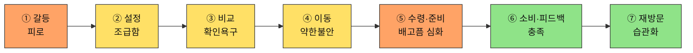

| 단계 | Pain Point | 개선 기회 |
| --- | --- | --- |
| ① | 매번 같은 고민이 반복된다 | 최근 조건 자동 채움([FR-10](../../04.tam-sam-som/1인가구한끼해결-7단계/07-솔루션구체화-SRS.md) 즐겨찾기) |
| ② | 입력 자체가 새로운 결정 부담이다 | 슬라이더 기본값을 최근 패턴으로 사전 설정 |
| ③ | 갱신시각이 지난 정보에 대한 불신 | [NFR-02](../../04.tam-sam-som/1인가구한끼해결-7단계/07-솔루션구체화-SRS.md) 출처·갱신시각 강조 |
| ④ | 이동 직후 가격이 달라질 수 있다는 불확실성 | S4 안내 문구 명확화 |
| ⑤ | 표시 ETA와 실제 도착시간의 차이가 신뢰를 깎는다 | 추정 ETA에 오차 범위 표시 |
| ⑥ | 피드백 입력이 귀찮아 생략된다 | 만족도 1탭 최소 피드백 |
| ⑦ | 새로울 것이 없다는 지루함이 재발할 수 있다 | 주간 지출 요약으로 누적 가치 환기 |

---

### C2 「마감엔 다 필요없다」— 프리랜서 콘텐츠 마케터 · 배달

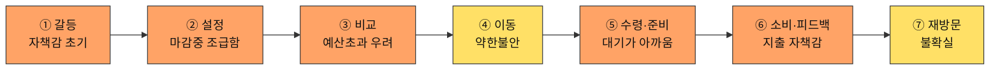

| 단계 | Pain Point | 개선 기회 |
| --- | --- | --- |
| ① | 마감 압박과 식사 결정이 겹쳐 최악의 타이밍에 결정해야 한다 | 원터치 "지금 급함" 모드로 조건 입력 스킵 |
| ② | 조급한 상태에서 입력 절차 자체가 방해로 느껴진다 | 원터치 "지금 급함" 프리셋 |
| ③ | 급할 때일수록 예산을 넘기는 선택을 하게 되고 그걸 알면서도 못 막는다 | 예산 초과 옵션에 경고 배지 강조 |
| ④ | 이동 직후 가격이 달라질 수 있다는 불확실성 | S4 안내 문구 명확화 |
| ⑤ | 마감 중 대기시간은 일반 대기보다 심리적 비용이 더 크다 | 대기 중 알림 방해 안 함 옵션 |
| ⑥ | 예산초과가 반복되면 앱을 탓하게 될 수 있다 | 예산 준수율 주간 피드백 |
| ⑦ | 마감이라는 특수 상황에서만 쓰다 보니 습관으로 자리잡기 어렵다 | 마감형 사용 패턴 인식 후 맞춤 프리셋 유지 |

---

### C3 「매일이 곧 지출이다」— 대기업 사무직 · 배달·편의점 (재분류 Q2)

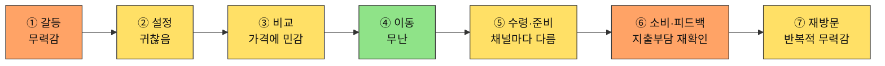

| 단계 | Pain Point | 개선 기회 |
| --- | --- | --- |
| ① | 문제가 급하지 않아 방치되고, 방치될수록 누적 지출이 커진다 | 누적 지출 알림으로 문제 가시화 |
| ② | 매일 같은 입력을 반복하는 것 자체가 피로다 | 원클릭 "오늘도 같은 조건" |
| ③ | 매번 최저가를 찾아야 한다는 부담이 누적 피로로 쌓인다 | 이번 달 대비 저렴한 옵션 우선 정렬 |
| ④ | 채널을 매번 새로 고민해야 한다 | 지난주 채널 선택 패턴 표시 |
| ⑤ | 채널이 바뀔 때마다 수령 방식도 매번 새로 익혀야 하는 느낌 | 채널별 수령 안내를 통일된 아이콘으로 |
| ⑥ | 매 끼니 지출이 누적되는 걸 눈으로 확인하기 전까지는 심각성을 못 느낀다 | 월간 지출 누적 요약 |
| ⑦ | 구조적 문제(혼자라 요리 안 함)가 해결되지 않아 앱 사용이 증상 완화일 뿐이다 | 예산 목표 설정 후 달성률 피드백 |

---

### C4 「기운이 없는데 골라야 한다」— 병원 간호사(낮 근무) · 배달(전화) (재분류 Q3)

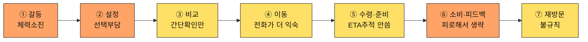

| 단계 | Pain Point | 개선 기회 |
| --- | --- | --- |
| ① | 육체적으로 지친 상태에서 인지적 결정을 요구받는다 | 저에너지 모드 — 최소 입력 즉시 추천 |
| ② | 근무 스케줄이 불규칙해 미리 저장된 조건이 잘 안 맞는다 | 근무 패턴(3교대 등) 선택 시 조건 자동 조정 |
| ③ | 깊게 비교할 여력이 없어 최적 선택을 못 하고 있다는 걸 알면서도 넘어간다 | 피로도 높음 모드에서 카드 1개만 즉시 제시 |
| ④ | 앱의 추천·이동 기능이 전화 주문 습관 앞에서 무용해진다 | 추천 결과에서 원클릭 "전화 연결" 제공 |
| ⑤ | 앱이 제공하는 추적 정보가 전화 주문자에겐 무의미하다 | 전화주문 시에도 예상시간 입력만으로 알림 |
| ⑥ | 피드백을 남길 에너지가 없어 데이터가 거의 수집되지 않는다 | 가장 쉬운 피드백(이모지 1탭)만 제공 |
| ⑦ | 불규칙한 스케줄 자체가 습관 형성을 방해한다 | 재방문을 강요하지 않는 저부담 리마인더 |

---

### C5 「둘 다 없다」— 계약직 사무보조 · 편의점 (순수 Q4)

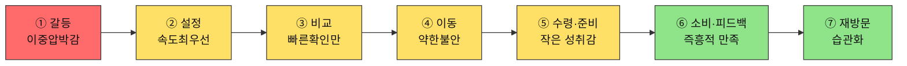

| 단계 | Pain Point | 개선 기회 |
| --- | --- | --- |
| ① | 예산과 시간이 동시에 바닥나 어떤 기준으로도 여유가 없다 | 균형 모드를 기본값으로 자동 제안 |
| ② | 입력을 최소화하고 싶은데 항목이 여전히 많게 느껴진다 | 3항목 이하 초간단 입력 모드 |
| ③ | 빠르게 결정해야 해서 상세 비교를 사실상 못 한다 | 1위 카드에 "지금 이걸로" 원클릭 |
| ④ | 빠른 결정 뒤 이게 최선이었는지 확신이 없다 | 선택 근거 한 줄 재확인 안내 |
| ⑤ | 즉흥 선택이 실제로 괜찮을지 걱정이 가열하는 동안 남는다 | 선택 이유를 다시 보여주는 요약 |
| ⑥ | 만족했지만 왜 만족했는지 기록이 남지 않아 재현하기 어렵다 | 만족한 선택을 "즐겨찾기"로 저장 |
| ⑦ | 습관이 되긴 했지만 매번 즉흥적이라 지출 계획은 없다 | 즉흥 선택 패턴을 모은 사후 지출 요약 |

---

## 🟢 Adjacent — 확장 사용자 3인

### A1 「1인분은 손해다」— 대학생·야간 편의점 알바 · 편의점

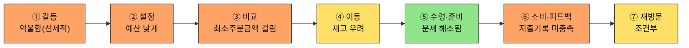

| 단계 | Pain Point | 개선 기회 |
| --- | --- | --- |
| ① | 시작 전부터 실패를 예상하게 된다 | 최소주문금액 이슈 적은 채널 먼저 안내 |
| ② | 낮은 예산에서 옵션이 급감할까 걱정한다 | 예산 구간별 옵션 수 미리보기 |
| ③ | 최소주문금액 미충족 옵션이 섞여 나오면 확인이 시간 낭비다 | [FR-04](../../04.tam-sam-som/1인가구한끼해결-7단계/07-솔루션구체화-SRS.md)에서 미충족 옵션 사전 배제 |
| ④ | 이동한 매장에 실제 재고가 없으면 헛걸음이 된다 | 재고 확인 가능 매장만 필터링 표시 |
| ⑤ | 가열 도구·장소가 없으면 이 단계 자체가 성립하지 않는다 | "가열 가능 여부" 필터 |
| ⑥ | 지출을 기록하고 싶은데 그 기능이 없다 | 간단한 누적 지출 뷰 |
| ⑦ | 예산이 맞지 않는 날은 채널을 매번 다시 고민해야 한다 | 예산 구간별 선호 채널 우선 추천 |

> 📌 A1은 ⑤에서 오히려 점수가 오른다 — 채널 선택 자체가 ③의 Pain Point 회피 전략으로 쓰인다.

---

### A2 「또 그 메뉴다」— 프리랜서 디자이너 · 편의점-HMR(밀키트)

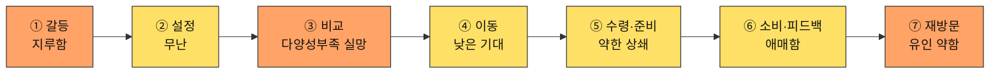

| 단계 | Pain Point | 개선 기회 |
| --- | --- | --- |
| ① | 매번 비슷한 선택으로 귀결될 걸 알고 시작부터 흥이 안 난다 | 오늘의 신규·이색 옵션 먼저 강조 |
| ② | 입력이 매번 같은 결과로 이어질 거란 예상이 의욕을 낮춘다 | 다양성 우선 정렬 토글 |
| ③ | 추천이 매번 비슷해 다양성 결핍이 해결되지 않는다 | 카테고리 강제 다양화 |
| ④ | 기대감이 낮은 상태로 이동하게 된다 | 이동 전 짧은 동기부여 문구 |
| ⑤ | 준비 과정의 재미가 결과물의 반복성을 완전히 상쇄하지 못한다 | 밀키트 레시피에 간단한 변형 팁 |
| ⑥ | 앱 추천과 개인 대체 솔루션(밀키트 비축)을 비교하게 되고 우열이 애매하다 | 밀키트 대비 시간·비용 비교 제시 |
| ⑦ | 다양성 문제가 해결 안되면 재방문 유인이 약하다 | 신규 카테고리 알림 |

---

### A3 「같이 살아도 혼자 먹는다」— 맞벌이 2인가구 · 배달

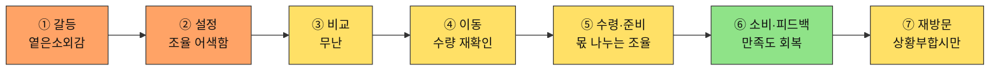

| 단계 | Pain Point | 개선 기회 |
| --- | --- | --- |
| ① | 가구는 2인인데 실제 경험은 1인가구와 같아 이 앱이 나를 위한 게 맞는지 헷갈린다 | "오늘은 혼자" 상황 배지 |
| ② | 1인가구 전제로 설계된 입력 흐름이 2인 상황에는 맞지 않는다 | "혼자 먹는 날" 토글 |
| ③ | 혼자 먹는 양 기준 추천인지 불분명해 확신이 부족하다 | 1인분 기준임을 명시적으로 표시 |
| ④ | 1인분·2인분 수량을 다시 헷갈릴 수 있다 | 이동 전 수량 확인 리마인드 |
| ⑤ | 혼자 먹을 몫과 보관 몫을 매번 다시 나눠야 한다 | 1인분/2인분 선택 시 보관 팁 제공 |
| ⑥ | 만족했다는 걸 공유할 대상(배우자)이 없어 경험이 개인 안에서 끝난다 | 간단한 만족도 기록 |
| ⑦ | 상황(엇갈린 퇴근)이 매번 다르게 발생해 사용이 불규칙하다 | 엇갈린 퇴근 요일 패턴 학습 후 사전 알림 |

---

## 🔴 Extreme — 극단 사용자 2인 (③에서 구조적으로 끊긴다)

### X1 「새벽엔 문 닫은 도시」— 물류센터 야간 교대근무

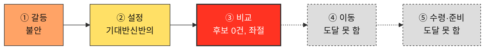

| 단계 | Pain Point | 개선 기회 |
| --- | --- | --- |
| ① | 시간이 아니라 영업시간의 존재 자체가 벽이다 | 야간 시간대 입력 시 기대치 조정 안내 |
| ② | 입력하는 동안에도 결과가 없을 거란 예감을 안고 있다 | 입력 단계에서 데이터 커버리지 수준 미리 표시 |
| ③ | 조건에 맞는 옵션이 0개면 여정이 그대로 끝난다 | 결과 0건일 때 "다음 영업 예상 시각" 안내 |
| ④~⑦ | 비교가 아니라 후보 없음으로 끝난다 — 일반적 UX 개선으로 해결되지 않는다 | 포장 전용 뷰 등 "대안 모드"로 재구성 |

---

### X2 「지도 밖의 동네」— 지방 소도시 원룸 거주 1인가구

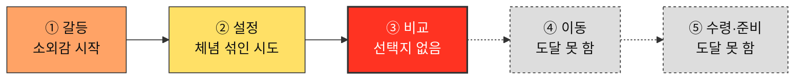

| 단계 | Pain Point | 개선 기회 |
| --- | --- | --- |
| ① | 도시 기준으로 설계된 서비스라 처음부터 기대치가 낮다 | 위치 입력 즉시 지역 커버리지 수준 안내 |
| ② | 이미 여러 번 실망한 경험이 있어 입력하면서도 기대하지 않는다 | 이전 검색 이력 기반 "내 동네 모드" |
| ③ | 선택지가 사실상 없어 "비교"라는 단계 자체가 무의미해진다 | 포장 전용 뷰로 "포장 모드" 재구성 |
| ④~⑦ | 앱이 도와줄 수 있는 게 없다는 걸 매번 재확인하게 된다 | 결과 0건일 때 "포장 가능 매장 지도" 즉시 제공 |

> 📌 X1·X2 둘 다 색이 **③에서 빨강으로 끊기고, 이후는 회색 점선**이다 — 완주하는 8명(위)과 나란히 보면 "여기서 끝난다"는 게 표 없이도 바로 보인다.

---

## ⬜ Non-user — 비활성 사용자 2인 (①에서 앱과 갈라진다)

### N1 「안 시켜도 괜찮다」— 회계사무소 직원 (회피형)

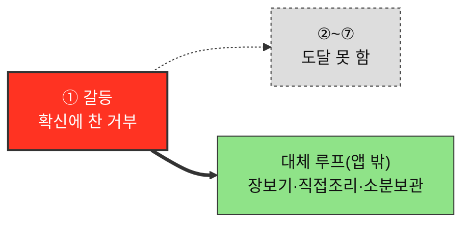

| 구간 | Pain Point | 개선 기회 |
| --- | --- | --- |
| ① 오늘의 갈등 | 불신이 근본 원인이라, UX를 개선해도 애초에 앱을 열지 않는다 | 신뢰 신호는 필요조건이지만, 앱을 열게 만드는 건 별도의 신뢰 획득 문제 |
| 대체 루프(앱 밖) | 이 루프 자체엔 문제가 없다 — 앱이 개입할 지점이 없다는 것이 앱 관점의 한계다 | 이 루프는 개선 대상이 아님 — 신뢰 확보 채널 확보만이 유일한 개입점 |

> 📌 대체 루프는 초록(만족)이다 — N1은 불행한 사람이 아니라 이미 다른 해법에 만족하는 사람이다. 빨강은 오직 "앱과 만나는 지점"에서만 나타난다.

---

### N2 「전화가 더 빠르다」— 개인 사업자 (비접근형)

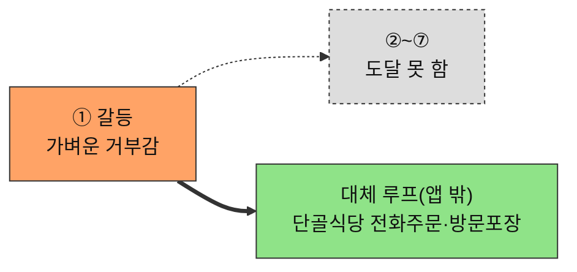

| 구간 | Pain Point | 개선 기회 |
| --- | --- | --- |
| ① 오늘의 갈등 | 앱이라는 형식 자체가 진입장벽이다 | 전화 주문만큼 단순한 진입 경로(문자·전화 연동) 제공 |
| 대체 루프(앱 밖) | 이 루프 자체엔 문제가 없다 — 앱이 개입할 지점이 없다 | 이 루프는 개선 대상이 아님 — 온보딩 단순화만이 유일한 개입점 |

> 📌 N1은 주황(가벼운 거부)으로 시작해 N1보다는 덜 단호하다 — N1은 신뢰 회복이 필요하고, N2는 온보딩 단순화가 필요하다는 차이가 색만 봐도 드러난다.

---

## 12명을 한눈에 — 색상만으로 읽는 요약

| 유형 | 코드 | ①~③ | ④~⑤ | ⑥~⑦ |
| --- | --- | --- | --- | --- |
| Core | C1 | 🟧🟨🟨 | 🟨🟧 | 🟩🟩 |
| Core | C2 | 🟧🟧🟧 | 🟨🟧 | 🟧🟨 |
| Core | C3 | 🟧🟨🟨 | 🟩🟨 | 🟧🟨 |
| Core | C4 | 🟧🟧🟨 | 🟨🟨 | 🟧🟨 |
| Core | C5 | 🟥🟨🟨 | 🟨🟨 | 🟩🟩 |
| Adjacent | A1 | 🟧🟧🟧 | 🟨🟩 | 🟧🟨 |
| Adjacent | A2 | 🟧🟨🟧 | 🟨🟨 | 🟨🟧 |
| Adjacent | A3 | 🟧🟧🟨 | 🟨🟨 | 🟩🟨 |
| Extreme | X1 | 🟧🟨🟥 | ⬜⬜ | ⬜⬜ |
| Extreme | X2 | 🟧🟨🟥 | ⬜⬜ | ⬜⬜ |
| Non-user | N1 | 🟥⬜⬜ | ⬜⬜ | ⬜⬜ (대체 루프 🟩) |
| Non-user | N2 | 🟧⬜⬜ | ⬜⬜ | ⬜⬜ (대체 루프 🟩) |

> 📌 이 표만 봐도 **Extreme·Non-user의 회색이 압도적으로 많다** — 앱이 개입할 수 있는 구간(색이 있는 칸) 자체가 이 두 유형에겐 절반 이하다. Core·Adjacent는 완주하지만 초록이 드문 편이다 — 완주가 만족을 뜻하지 않는다는 [04단계](./04-고객여정지도-수령준비단계.md)의 발견과 일치한다.

---

## 근거 등급

이 문서의 모든 행동·생각·감정·Pain Point는 전량 생성물이다 **(가정)**, Extreme·Non-user의 구조적 종료 판단은 FR-04 필터 로직·02번 문서의 유형 정의에서 논리적으로 추론한 것이다 **(추정)** — [02-페르소나스펙트럼.md](./02-페르소나스펙트럼.md)·[04-고객여정지도-수령준비단계.md](./04-고객여정지도-수령준비단계.md)와 동일한 근거 수준이며, PoC 전까지 의사결정 근거로 인용하지 않는다.
