# 고객 여정지도 — 종합판 (12명 개별 진단 + 통합 분석)

> 입력: [02-페르소나스펙트럼.md](./02-페르소나스펙트럼.md) · 이전 판 [03](./03-고객여정지도.md)(6단계) · [04-고객여정지도-수령준비단계.md](./04-고객여정지도-수령준비단계.md)(대표 4인 + 진단·매트릭스·우선순위)
>
> 04는 대표 4인만 깊게 다루고 진단·매트릭스·우선순위·근거등급을 갖췄고, 12인 전원을 색상 다이어그램으로 다룬 중간 버전(05, `journey` 다이어그램을 쓴 개별 파일 버전 포함)은 그 분석틀이 없어 이 문서에 흡수되며 삭제되었다. 이 문서는 **둘을 합쳐 누락 없이** 재구성한 최종판이다 — 03·04는 그대로 둔다.

---

## 0. 등장 인물 — 12명 전체

| 유형 | 코드 | 별칭 | 직무 | 채널 |
| --- | --- | --- | --- | --- |
| 🔵 Core | C1 | 「퇴근을 예측할 수 없다」 | 스타트업 백엔드 개발자 | 배달 |
| 🔵 Core | C2 | 「마감엔 다 필요없다」 | 프리랜서 콘텐츠 마케터 | 배달 |
| 🔵 Core | C3 | 「매일이 곧 지출이다」 | 대기업 사무직(재분류 Q2) | 배달·편의점 |
| 🔵 Core | C4 | 「기운이 없는데 골라야 한다」 | 병원 간호사(재분류 Q3) | 배달(전화) |
| 🔵 Core | C5 | 「둘 다 없다」 | 계약직 사무보조(순수 Q4) | 편의점 |
| 🟢 Adjacent | A1 | 「1인분은 손해다」 | 대학생·야간 편의점 알바 | 편의점 |
| 🟢 Adjacent | A2 | 「또 그 메뉴다」 | 프리랜서 디자이너 | 편의점-HMR(밀키트) |
| 🟢 Adjacent | A3 | 「같이 살아도 혼자 먹는다」 | 맞벌이 2인가구 | 배달 |
| 🔴 Extreme | X1 | 「새벽엔 문 닫은 도시」 | 물류센터 야간 교대근무 | 편의점(사전구매 지향) |
| 🔴 Extreme | X2 | 「지도 밖의 동네」 | 지방 소도시 원룸 거주 | 포장(지향) |
| ⬜ Non-user | N1 | 「안 시켜도 괜찮다」(회피형) | 회계사무소 직원 | — |
| ⬜ Non-user | N2 | 「전화가 더 빠르다」(비접근형) | 개인 사업자 | — |

> [04](./04-고객여정지도-수령준비단계.md)는 이 중 C1·A1·X1·N1 넷만 대표로 골라 깊게 다뤘다. 이 문서는 **12명 전원**을 같은 깊이로 다룬다.

---

## 1. 단계를 새로 정의한 근거

[00-방법론.md §3](./00-방법론.md)의 경고는 일반형 5단계(`문제 인식 → 탐색 → 의사결정 → 사용 → 유지`)를 그대로 채우지 말고 **서비스의 실제 관문에서 단계를 도출하라**고 요구한다. 그 절이 제시한 질문에 먼저 답한다.

| # | 질문 | 이 서비스의 답 |
| --- | --- | --- |
| **1** | 고객이 실제로 통과하는 관문은? | 일반형에 없는 관문이 셋 있다 — **조건 설정**(예산·시간·우선순위를 매번 새로 입력) · **외부 이동**(결제가 앱 안에 없다 — 반은 관문, 반은 이양) · **수령·준비**(채널마다 완전히 다른 물리적 과정) |
| **2** | 가장 많이 이탈하는 곳은? | **③후보 비교**와 **①오늘의 갈등.** 전자는 조건에 맞는 옵션이 없어 구조적으로 종료되고, 후자는 신뢰·접근 장벽으로 아예 시작되지 않는다 |
| **3** | 외부 이동 **이후에** 더 큰 관문이 있는가? | **있다.** 가구의 `조립·설치`와 같은 위치에 **⑤수령·준비**가 있다. 외부 이동은 결제이지 소비가 아니다 — 배달은 대기, 포장은 왕복 이동, 편의점-HMR은 가열/준비를 거쳐야 실제로 먹을 수 있다 |
| **4** | 페르소나마다 여정이 갈라지는가? | **갈라진다.** 「새벽엔 문 닫은 도시」·「지도 밖의 동네」는 ③에서 여정이 끝나고, 「안 시켜도 괜찮다」·「전화가 더 빠르다」는 ①에서 아예 다른 루프로 샌다. **지도를 넷으로 나눠 그린다** |

### 일반형을 쓰지 않은 이유 — 세 군데가 어긋난다

| 일반형 단계 | 이 서비스에서 어긋나는 지점 |
| --- | --- |
| **문제 인식** | 처음 겪는 문제가 아니다. 매일 재발하는 갈등이므로 '인식'이 아니라 **매번 다시 시작되는 트리거**다 |
| **사용** | 앱 안에서 '사용'이 끝나지 않는다. 결제(외부 이동)는 앱 밖에서 일어나고, 앱은 그 이전(비교)만 담당한다. 그 자리에 **수령·준비**라는 물리적 관문이 남는다 |
| **유지** | '반복 구매'가 아니라 **매일 다시 열지 정하는 습관**이다. 방아쇠는 브랜드 충성이 아니라 그날 압박이 재발하는가다 |

### 이 서비스의 7단계

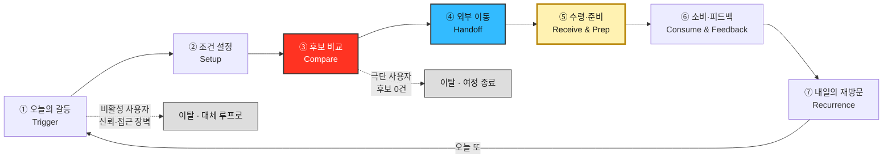

| 표기 | 의미 |
| --- | --- |
| 🔴 빨강 (③) | **이탈 병목.** 극단 사용자의 여정 성패가 여기서 갈린다 |
| 🔵 파랑 (④) | 외부 이동 — **여정의 끝이 아니라 중간**이다(앱 안에 결제가 없다) |
| 🟡 노랑 (⑤) | **가구의 조립·설치와 같은 위치.** 결제가 아니라 여기서 "먹을 수 있는 상태"가 완성된다 |

### 개인별 다이어그램의 색상 범례 (§2~5 공통)

| 색 | 감정 점수 | 의미 |
| --- | --- | --- |
| 🟩 초록 | 4~5 | 편안·만족·습관화 |
| 🟨 노랑 | 3 | 중립·약한 불편(조급함, 확인 욕구) |
| 🟧 주황 | 2 | 불편(피로, 자책감, 지루함, 억울함) |
| 🟥 빨강 | 1 | 매우 괴로움 또는 확신에 찬 거부 — 대개 여정 종료 지점 |
| ⬜ 회색(점선) | — | 이 단계에 도달하지 못함 |

---

## 2. 🔵 Core — 핵심 사용자 5인

### C1 「퇴근을 예측할 수 없다」— 스타트업 백엔드 개발자 · 배달

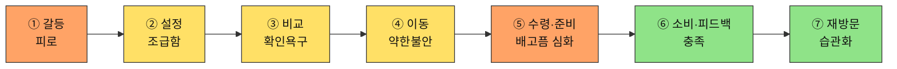

| 단계 | 고객 행동 | 고객 생각 | 감정 | Pain Point | 개선 기회 |
| --- | --- | --- | --- | --- | --- |
| ① 오늘의 갈등 | 퇴근 시각이 다가오며 배고픔을 자각 | "또 정해야 하나" | 피로 | **매번 같은 고민이 반복된다** | 최근 조건 자동 채움([FR-10](../../04.tam-sam-som/1인가구한끼해결-7단계/07-솔루션구체화-SRS.md) 즐겨찾기) |
| ② 조건 설정 | 위치·예산·최대시간을 빠르게 입력 | "이번엔 빨리 끝내고 싶다" | 조급함 | **입력 자체가 새로운 결정 부담이다** | 슬라이더 기본값을 최근 패턴으로 사전 설정 |
| ③ 후보 비교 | 3개 카드와 총비용·총시간을 확인 | "이 숫자를 믿어도 되나" | 확인 욕구 | **갱신시각이 지난 정보에 대한 불신** | [NFR-02 데이터 신뢰성](../../04.tam-sam-som/1인가구한끼해결-7단계/07-솔루션구체화-SRS.md)(출처·갱신시각 강조) |
| ④ 외부 이동 | 원 서비스로 이동해 배달 주문 | "여기서 가격이 바뀌면 어떡하지" | 약한 불안 | **이동 직후 가격이 달라질 수 있다는 불확실성** | S4 안내 문구 명확화("다시 확인" 리마인드) |
| ⑤ 수령·준비 | 배달원 위치추적 + 대기 | "왜 안 오지" | 배고픔 심화 | **표시 ETA와 실제 도착시간의 차이가 클수록 신뢰가 깎인다** | 추정 ETA에 오차 범위 표시 |
| ⑥ 소비·피드백 | 실제로 먹고, 피드백은 대체로 건너뜀 | "예상과 비슷했나" | 충족 | **피드백 입력이 귀찮아 생략된다** | 만족도 1탭만이라도 남기는 최소 피드백 |
| ⑦ 내일의 재방문 | 다음 날도 앱을 다시 여는가 | "어제도 도움이 됐으니 또" | 습관화 시작 | **새로울 것이 없다는 지루함이 재발할 수 있다** | 주간 지출 요약으로 누적 가치 환기 |

> 📌 여정은 끝까지 완주하지만 ①과 ⑤에서 두 번 눌린다 — ①은 앱 밖의 심리적 피로, ⑤는 앱이 직접 통제할 수 없는 외부 서비스의 ETA 정확도 문제다. **완주해도 만족이 보장되지 않는다.**

---

### C2 「마감엔 다 필요없다」— 프리랜서 콘텐츠 마케터 · 배달

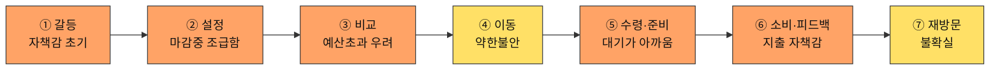

| 단계 | 고객 행동 | 고객 생각 | 감정 | Pain Point | 개선 기회 |
| --- | --- | --- | --- | --- | --- |
| ① 오늘의 갈등 | 재택근무라 규칙적 식사시간이 없고, 마감 직전에 배고픔을 느낌 | "지금 아니면 못 먹는다" | 자책감 초기 | **마감 압박과 식사 결정이 겹쳐 최악의 타이밍에 결정해야 한다** | 원터치 "지금 급함" 모드로 조건 입력 스킵 |
| ② 조건 설정 | 위치·예산·최대시간을 서둘러 입력 | "그냥 빨리 아무거나" | 마감중 조급함 | **조급한 상태에서 입력 절차 자체가 방해로 느껴진다** | 원터치 "지금 급함" 프리셋 |
| ③ 후보 비교 | 카드를 확인하며 예산 초과를 걱정 | "이 돈이면 마감 끝나고 후회할 것 같다" | 예산초과 우려 | **급할 때일수록 예산을 넘기는 선택을 하게 되고 그걸 알면서도 못 막는다** | 예산 초과 옵션에 경고 배지 강조 |
| ④ 외부 이동 | 원 서비스로 이동해 배달 주문 | "여기서 가격 바뀌면 안 되는데" | 약한 불안 | **이동 직후 가격이 달라질 수 있다는 불확실성** | S4 안내 문구 명확화("다시 확인" 리마인드) |
| ⑤ 수령·준비 | 배달원 위치추적 + 대기 | "이 시간에 일을 더 할 수 있는데" | 대기가 아까움 | **마감 중 대기시간은 일반 대기보다 심리적 비용이 더 크다** | 대기 중 알림으로 방해하지 않기 옵션 |
| ⑥ 소비·피드백 | 먹고 나서 지출 초과를 자책 | "또 예산 넘겼네" | 자책감 | **예산초과가 반복되면 앱을 탓하게 될 수 있다** | 예산 준수율을 주간으로 보여주는 긍정적 피드백 |
| ⑦ 내일의 재방문 | 마감 패턴이 불규칙해 재방문도 불규칙 | "다음 마감 때도 또 쓰겠지" | 불확실 | **마감이라는 특수 상황에서만 쓰다 보니 습관으로 자리잡기 어렵다** | 마감형 사용 패턴 인식 후 맞춤 프리셋 유지 |

---

### C3 「매일이 곧 지출이다」— 대기업 사무직 · 배달·편의점 (재분류 Q2)

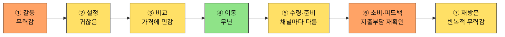

| 단계 | 고객 행동 | 고객 생각 | 감정 | Pain Point | 개선 기회 |
| --- | --- | --- | --- | --- | --- |
| ① 오늘의 갈등 | 매일 반복되는 지출에 대한 무력감을 느낌 | "오늘도 또 나가네" | 무력감 | **문제가 급하지 않아 방치되고, 방치될수록 누적 지출이 커진다** | 누적 지출 알림으로 문제를 가시화 |
| ② 조건 설정 | 담담하게 입력, 큰 기대 없음 | "그냥 늘 하던대로" | 귀찮음 | **매일 같은 입력을 반복하는 것 자체가 피로다** | 원클릭 "오늘도 같은 조건" |
| ③ 후보 비교 | 가격에 평소보다 더 민감하게 확인 | "이번엔 좀 더 싼 데 없나" | 가격에 민감 | **매번 최저가를 찾아야 한다는 부담이 누적 피로로 쌓인다** | 이번 달 대비 저렴한 옵션 우선 정렬 |
| ④ 외부 이동 | 배달 또는 편의점으로 이동 | "오늘은 배달, 아니면 편의점" | 무난 | **채널을 매번 새로 고민해야 한다** | 지난주 채널 선택 패턴 표시 |
| ⑤ 수령·준비 | 채널에 따라 대기 또는 가열/준비 | "이 정도면 됐다" | 중립 | **채널이 바뀔 때마다 수령 방식도 매번 새로 익혀야 하는 느낌** | 채널별 수령 안내를 통일된 아이콘으로 표시 |
| ⑥ 소비·피드백 | 먹고 나서 지출부담을 재확인 | "이번 달도 꽤 썼네" | 무력감 재발 | **매 끼니 지출이 누적되는 걸 눈으로 확인하기 전까지는 심각성을 못 느낀다** | 월간 지출 누적 요약([SHOULD 기능](../../04.tam-sam-som/1인가구한끼해결-7단계/07-솔루션구체화-SRS.md)) |
| ⑦ 내일의 재방문 | 반복적 무력감 속에서도 재방문 | "어쩔 수 없지, 또 쓴다" | 반복적 무력감 | **구조적 문제(혼자라 요리 안 함)가 해결되지 않아 앱 사용이 증상 완화일 뿐 근본 해결은 아니다** | 예산 목표 설정 후 달성률 피드백으로 통제감 부여 |

> 📌 [02번 문서](./02-페르소나스펙트럼.md)에서 이미 지적했듯 C3는 시간은 여유롭고 예산만 압박받는 **Q2**에 실제로는 더 가깝다. Core에 배치됐지만 여정 전체가 "지출 피로"로 일관된다.

---

### C4 「기운이 없는데 골라야 한다」— 병원 간호사(낮 근무) · 배달(전화) (재분류 Q3)

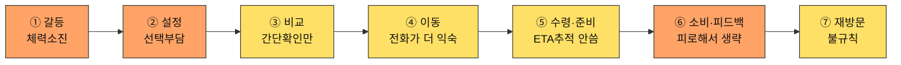

| 단계 | 고객 행동 | 고객 생각 | 감정 | Pain Point | 개선 기회 |
| --- | --- | --- | --- | --- | --- |
| ① 오늘의 갈등 | 육체노동 후 퇴근, 체력이 소진된 채 배고픔을 느낌 | "생각할 힘도 없다" | 체력소진 | **육체적으로 지친 상태에서 인지적 결정을 요구받는다** | 저에너지 모드 — 최소 입력으로 즉시 추천 |
| ② 조건 설정 | 불규칙한 근무 스케줄 탓에 조건을 매번 새로 입력 | "오늘은 또 뭐라고 입력해야 하지" | 선택부담 | **근무 스케줄이 불규칙해 미리 저장된 조건이 잘 안 맞는다** | 근무 패턴(3교대 등) 선택 시 조건 자동 조정 |
| ③ 후보 비교 | 깊게 보지 않고 간단히만 확인 | "그냥 아무거나 빨리" | 간단확인만 | **깊게 비교할 여력이 없어 최적 선택을 못 하고 있다는 걸 알면서도 넘어간다** | 피로도 높음 모드에서는 카드 1개만 즉시 제시 |
| ④ 외부 이동 | 앱 대신 익숙한 전화 주문을 사용 | "그냥 전화하는 게 편하다" | 전화가 더 익숙 | **앱의 추천·이동 기능이 전화 주문 습관 앞에서 무용해진다** | 추천 결과에서 원클릭으로 "전화 연결"도 제공 |
| ⑤ 수령·준비 | ETA 추적 UX를 사용하지 않음 | "전화로 대충 시간 들었으니 됐다" | 무관심 | **앱이 제공하는 추적 정보가 전화 주문자에겐 무의미하다** | 전화 주문 시에도 예상시간 입력만으로 알림 제공 |
| ⑥ 소비·피드백 | 피로해서 피드백을 생략 | "그냥 눕고 싶다" | 피로 | **피드백을 남길 에너지가 없어 데이터가 이 유형에서는 거의 수집되지 않는다** | 가장 쉬운 피드백(이모지 1탭)만 제공 |
| ⑦ 내일의 재방문 | 근무 스케줄에 따라 재방문이 불규칙 | "다음엔 또 어떻게 될지 모르겠다" | 불규칙 | **불규칙한 스케줄 자체가 습관 형성을 방해한다** | 재방문을 강요하지 않는 저부담 리마인더 |

> 📌 [02번 문서](./02-페르소나스펙트럼.md)에서 이미 지적했듯 C4는 예산은 여유롭고 시간(체력)만 압박받는 **Q3**에 실제로는 더 가깝다. ④~⑤에서 앱의 핵심 기능(추천 이동, ETA 추적)이 전화 주문 습관 앞에서 무용해진다는 것이 이 여정만의 독특한 발견이다.

---

### C5 「둘 다 없다」— 계약직 사무보조 · 편의점 (순수 Q4)

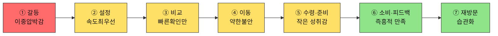

| 단계 | 고객 행동 | 고객 생각 | 감정 | Pain Point | 개선 기회 |
| --- | --- | --- | --- | --- | --- |
| ① 오늘의 갈등 | 소득 불규칙 + 야근으로 예산·시간이 동시에 바닥남을 자각 | "돈도 시간도 없다" | 이중압박감 | **예산과 시간이 동시에 바닥나 어떤 기준으로도 여유가 없다** | 예산·시간 둘 다 낮을 때 "균형" 모드를 기본값으로 자동 제안 |
| ② 조건 설정 | 속도를 최우선으로 빠르게 입력 | "빨리 끝내자" | 속도최우선 | **입력을 최소화하고 싶은데 항목이 여전히 많게 느껴진다** | 3항목 이하 초간단 입력 모드 |
| ③ 후보 비교 | 1위 카드로 바로 결정 | "1등 카드로 바로 가자" | 빠른확인만 | **빠르게 결정해야 해서 상세 비교를 사실상 못 한다** | 1위 카드에 "지금 이걸로" 원클릭 버튼 |
| ④ 외부 이동 | 편의점 채널로 이동 | "그냥 이거면 됐다" | 약한 불안 | **빠른 결정 뒤 이게 최선이었는지 확신이 없다** | 선택 근거를 한 줄로 재확인시켜주는 안내 |
| ⑤ 수령·준비 | 매장 방문 → 구매 → 가열/준비 | "이 정도면 나쁘지 않다" | 작은 성취감 | **즉흥적으로 고른 선택이 실제로 괜찮을지에 대한 걱정이 가열하는 동안 남는다** | 선택 이유를 다시 보여줘 안심시키는 요약 |
| ⑥ 소비·피드백 | 즉흥적 선택에 만족 | "그래도 괜찮았다" | 즉흥적 만족 | **만족했지만 왜 만족했는지 기록이 남지 않아 다음에 재현하기 어렵다** | 만족한 선택을 "즐겨찾기"로 쉽게 저장 |
| ⑦ 내일의 재방문 | 습관으로 자리잡음 | "또 이렇게 하면 되겠다" | 습관화 | **습관이 되긴 했지만 매번 즉흥적이라 지출 계획은 여전히 없다** | 즉흥 선택 패턴을 모아 사후 지출 요약 제공 |

> 📌 C5는 순수 Q4(예산·시간 동시압박)의 전형이며, [04번 문서](./04-고객여정지도-수령준비단계.md)의 "핵심" 대표 후보로도 유력하다. 즉흥성이 강점(빠른 결정)이자 약점(지출 계획 부재)으로 동시에 작동한다.

---

## 3. 🟢 Adjacent — 확장 사용자 3인

### A1 「1인분은 손해다」— 대학생·야간 편의점 알바 · 편의점

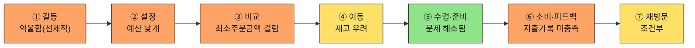

| 단계 | 고객 행동 | 고객 생각 | 감정 | Pain Point | 개선 기회 |
| --- | --- | --- | --- | --- | --- |
| ① 오늘의 갈등 | 배고픔을 느끼며 "또 최소주문금액에 걸리겠지"를 먼저 예상 | "어차피 손해 보겠지" | 억울함(선제적) | **시작 전부터 실패를 예상하게 된다** | 예산 입력 화면에서 최소주문금액 이슈가 적은 채널(편의점 등) 먼저 안내 |
| ② 조건 설정 | 예산을 매우 낮게 설정 | "이 정도면 걸릴 것 같은데" | 방어적 | **낮은 예산에서 옵션이 급감할까 걱정한다** | 예산 구간별 옵션 수 미리보기 |
| ③ 후보 비교 | 1인분 기준 옵션을 확인 | "또 최소주문금액에 걸리겠지" | 억울함 | **최소주문금액 미충족 옵션이 후보에 섞여 나오면 확인 자체가 시간 낭비다** | [FR-04 조건 필터](../../04.tam-sam-som/1인가구한끼해결-7단계/07-솔루션구체화-SRS.md)에서 미충족 옵션 사전 배제 |
| ④ 외부 이동 | 편의점 채널로 이동 | "여긴 최소주문금액이 없으니까" | 안도 | **이동한 매장에 실제 재고가 없으면 헛걸음이 된다** | 재고 확인 가능 매장만 필터링해 표시(재고 미확인 배지) |
| ⑤ 수령·준비 | 매장 방문 → 구매 → 가열/준비 | "이건 내가 골랐다" | 회복(최소주문금액 문제 해소) | **가열 도구·장소가 없는 상황(사무실 등)에서는 이 단계 자체가 성립하지 않을 수 있다** | 조건 입력에 "가열 가능 여부" 필터 |
| ⑥ 소비·피드백 | 실제로 먹지만 지출 기록은 남기지 않음 | "이번 달에 얼마 썼지" | 미충족 | **지출을 기록하고 싶은데 그 기능이 없다** | 간단한 누적 지출 뷰 |
| ⑦ 내일의 재방문 | 예산이 맞으면 재사용 | "편의점으로 가면 되니까" | 조건부 신뢰 | **예산이 맞지 않는 날은 채널 선택을 매번 다시 고민해야 한다** | 예산 구간별 선호 채널을 기억해 다음날 우선 추천 |

> 📌 A1은 ⑤에서 오히려 점수가 오른다 — 편의점 채널을 선택한 순간 ③의 Pain Point(최소주문금액)가 자연히 해소되기 때문이다. **채널 선택 자체가 Pain Point 회피 전략으로 쓰이고 있다.**

---

### A2 「또 그 메뉴다」— 프리랜서 디자이너 · 편의점-HMR(밀키트)

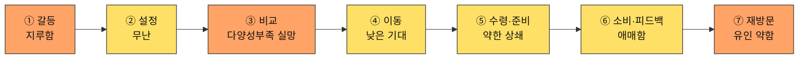

| 단계 | 고객 행동 | 고객 생각 | 감정 | Pain Point | 개선 기회 |
| --- | --- | --- | --- | --- | --- |
| ① 오늘의 갈등 | 배달 앱을 오래 써서 배달 피로감이 쌓인 채로 시작 | "오늘도 그거겠지" | 지루함 | **매번 비슷한 선택으로 귀결될 걸 알고 시작부터 흥이 안 난다** | 오늘의 신규·이색 옵션을 먼저 강조 노출 |
| ② 조건 설정 | 무난하게 조건을 입력 | "그냥 늘 하던 대로" | 무난 | **특별히 불편하진 않지만 입력이 매번 같은 결과로 이어질 거란 예상이 의욕을 낮춘다** | 다양성 우선 정렬 옵션 토글 |
| ③ 후보 비교 | 카드를 보며 반복되는 메뉴를 확인 | "또 그 메뉴들이네" | 다양성부족 실망 | **추천이 매번 비슷해 다양성 결핍이 해결되지 않는다** | 카테고리 강제 다양화 또는 신규 옵션 우선 노출 |
| ④ 외부 이동 | 편의점-HMR(밀키트) 채널로 이동 | "그래도 가보자" | 낮은 기대 | **이동 자체엔 문제 없지만 기대감이 낮은 상태로 이동하게 된다** | 이동 전 "이번엔 새로운 조합" 같은 짧은 동기부여 문구 |
| ⑤ 수령·준비 | 매장 방문 → 구매 → 가열/준비 | "만드는 과정은 그나마 낫다" | 약한 상쇄 | **준비 과정의 소소한 재미가 결과물의 반복성을 완전히 상쇄하지는 못한다** | 밀키트 레시피에 간단한 변형 팁 제공 |
| ⑥ 소비·피드백 | 자신이 비축해둔 밀키트와 비교하게 됨 | "이게 나은가 밀키트가 나은가" | 애매함 | **앱 추천과 개인 대체 솔루션(밀키트 비축)을 비교하게 되고 우열이 애매해 재사용 동기가 약하다** | 밀키트 대비 시간·비용 비교를 명시적으로 제시 |
| ⑦ 내일의 재방문 | 다양성 문제가 남아 재방문 유인이 약함 | "그냥 밀키트 먹지" | 유인 약함 | **다양성 문제가 해결 안되면 재방문 유인이 약하다** | 신규 카테고리 알림으로 재방문 계기 제공 |

> 📌 A2는 완주하는 8명 중 유일하게 **앱 자체(추천 품질)를 원인으로 재방문이 줄어들 위험**을 안고 있다 — 나머지는 상황(예산·시간)이 문제이지 추천 품질이 문제인 경우는 A2뿐이다.

---

### A3 「같이 살아도 혼자 먹는다」— 맞벌이 2인가구 · 배달

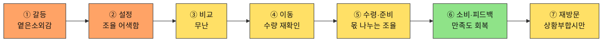

| 단계 | 고객 행동 | 고객 생각 | 감정 | Pain Point | 개선 기회 |
| --- | --- | --- | --- | --- | --- |
| ① 오늘의 갈등 | 배우자와 퇴근시각이 엇갈려 혼자 저녁을 먹게 됨을 자각 | "오늘도 혼자 먹네" | 옅은소외감 | **가구는 2인인데 실제 경험은 1인가구와 같아 이 앱이 나를 위한 게 맞는지 헷갈린다** | "오늘은 혼자" 상황 배지로 공감 표현 |
| ② 조건 설정 | 입력 전 "내 조건으로 입력해도 되나"를 배우자와 조율 | "내 조건으로 입력해도 되나" | 조율 어색함 | **1인가구 전제로 설계된 입력 흐름이 2인 상황에는 맞지 않는다** | "혼자 먹는 날" 토글 등 상황 명시 옵션 |
| ③ 후보 비교 | 카드를 확인 | "이 정도면 됐다" | 무난 | **혼자 먹는 양 기준 추천인지 불분명해 확신이 부족하다** | 1인분 기준임을 명시적으로 표시 |
| ④ 외부 이동 | 배달 채널로 이동 | "이걸로 시키자" | 무난 | **특별한 문제는 없지만 1인분·2인분 수량을 다시 헷갈릴 수 있다** | 이동 전 수량 확인 리마인드 |
| ⑤ 수령·준비 | 2인분을 수령해 혼자 먹을 몫과 보관 몫을 나눔 | "이건 내 몫, 저건 냉장" | 약한 불편 | **혼자 먹을 몫과 나중을 위한 보관 몫을 매번 다시 나눠야 한다** | 1인분/2인분 선택 시 보관 팁 함께 제공 |
| ⑥ 소비·피드백 | 혼자 먹었지만 만족 | "그래도 잘 먹었다" | 만족도 회복 | **혼자 먹었지만 만족했다는 걸 공유할 대상(배우자)이 없어 경험이 개인 안에서 끝난다** | 간단한 만족도만 기록해두면 다음 혼자 먹는 날 참고 가능 |
| ⑦ 내일의 재방문 | 다음에 또 엇갈리는 날에만 재사용 | "다음에 또 혼자면 또 써야지" | 조건부 | **상황(엇갈린 퇴근)이 매번 다르게 발생해 사용이 불규칙하다** | 엇갈린 퇴근이 예상되는 요일 패턴 학습 후 사전 알림 |

> 📌 A3는 **가구 형태(2인가구)가 아니라 상황(엇갈린 퇴근)이 문제를 만든다**는 것을 보여주는 사례다 — Market Segment Map의 두 축(예산×시간) 밖에서 나온 인물이다.

---

## 4. 🔴 Extreme — 극단 사용자 2인 (③에서 구조적으로 끊긴다)

### X1 「새벽엔 문 닫은 도시」— 물류센터 야간 교대근무

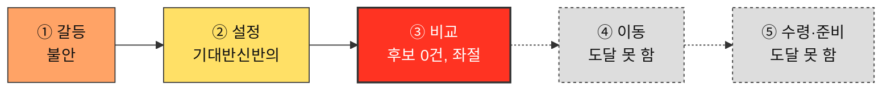

| 단계 | 고객 행동 | 고객 생각 | 감정 | Pain Point | 개선 기회 |
| --- | --- | --- | --- | --- | --- |
| ① 오늘의 갈등 | 새벽 3~4시 퇴근, 배고픔과 함께 "이 시간에 열려 있는 곳이 있을까"라는 의문이 먼저 든다 | "또 아무것도 없겠지" | 불안 | **시간이 아니라 영업시간의 존재 자체가 벽이다** | 야간 시간대 입력 시 "야간 영업 정보가 제한적"이라는 기대치 조정 안내 |
| ② 조건 설정 | 새벽 시간대로 조건을 입력 | "혹시나 하는 마음" | 기대반신반의 | **입력하는 동안에도 이미 결과가 없을 거란 예감을 안고 있다** | 입력 단계에서 야간시간대 데이터 커버리지 수준을 미리 표시 |
| ③ 후보 비교 ⛔ | 추천 카드가 뜨지 않음을 확인 | "그럼 뭘 먹으라는 거지" | 좌절 | **조건에 맞는 옵션이 0개면 여정이 그대로 끝난다** | 결과 0건일 때 "다음 영업 예상 시각" 안내 |
| ④~⑦ | 도달하지 않는다 | — | — | **비교가 아니라 후보 없음으로 끝난다** — 일반적 UX 개선(로딩 속도 등)으로 해결되지 않는다 | 포장 전용 뷰 등 "비교 실패"가 아닌 "대안 모드"로 재구성 |

#### 이 인물이 ④로 넘어가는 조건 — 둘 다 필요하다

| 조건 | 이유 |
| --- | --- |
| ① 야간 영업 정보 자체가 데이터에 존재한다 | 지금은 야간 영업 여부를 신뢰성 있게 표시할 데이터 출처가 확인되지 않았다 |
| ② 결과 0건일 때도 "다음 행동"이 주어진다 | 아무 안내 없이 끝나면 재시도 의욕 자체가 사라진다 |

---

### X2 「지도 밖의 동네」— 지방 소도시 원룸 거주 1인가구

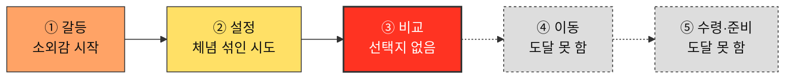

| 단계 | 고객 행동 | 고객 생각 | 감정 | Pain Point | 개선 기회 |
| --- | --- | --- | --- | --- | --- |
| ① 오늘의 갈등 | 배고픔을 느끼며 "여기도 되려나"를 먼저 떠올림 | "여기도 되려나" | 소외감 시작 | **도시 기준으로 설계된 서비스라 처음부터 기대치가 낮다** | 위치 입력 즉시 해당 지역 커버리지 수준을 먼저 안내 |
| ② 조건 설정 | 위치를 입력하지만 큰 기대는 하지 않음 | "일단 넣어보자" | 체념 섞인 시도 | **이미 여러 번 실망한 경험이 있어 입력하면서도 기대하지 않는다** | 이전 검색 이력 기반으로 실제 가능한 옵션만 먼저 보여주는 "내 동네 모드" |
| ③ 후보 비교 ⛔ | 대부분이 "배달 불가"로 표시되고 포장 몇 곳만 남음 | "역시 별로 없네" | 소외감 | **선택지가 사실상 없어 "비교"라는 단계 자체가 무의미해진다** | 포장 전용 뷰로 전환해 "비교 실패"가 아닌 "포장 모드"로 재구성 |
| ④~⑦ | 도달하지 않는다 | — | — | **앱이 도와줄 수 있는 게 없다는 걸 매번 재확인하게 된다** | 결과 0건일 때 "포장 가능 매장 지도"라도 즉시 제공 |

#### 이 인물이 ④로 넘어가는 조건 — 둘 다 필요하다

| 조건 | 이유 |
| --- | --- |
| ① 배달 커버리지가 없는 지역에서도 포장 가능 매장 정보가 정확히 표시된다 | 지금은 "배달 불가"만 표시되고 포장 대안이 명확히 부각되지 않는다 |
| ② 포장 모드로 전환돼도 총비용·총시간 비교가 유지된다 | 그렇지 않으면 지도 앱과 다를 게 없어져 한끼라우터를 쓸 이유가 사라진다 |

> 📌 X1·X2는 [02번 문서](./02-페르소나스펙트럼.md)가 이미 지적한 "완주 채널 중 포장 대표 없음" 공백의 당사자다 — X2가 유일하게 포장을 선호하지만, 정작 앱에서는 ③에서 좌절해 수령·준비(⑤) 단계에 도달하지 못한다. 두 사람 모두 이 지도는 전환 경로가 아니라 **이탈 지도**다 — ④~⑦을 채우려 드는 것 자체가 오독이다.

---

## 5. ⬜ Non-user — 비활성 사용자 2인 (①에서 앱과 갈라진다)

### N1 「안 시켜도 괜찮다」— 회계사무소 직원 (회피형)

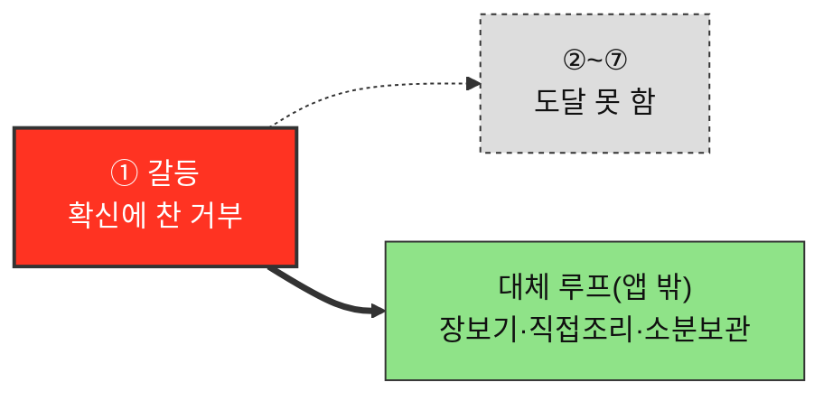

| 단계 | 고객 행동 | 고객 생각 | 감정 | Pain Point | 개선 기회 |
| --- | --- | --- | --- | --- | --- |
| ① 오늘의 갈등 ⛔ | 배고픔은 느끼지만 앱을 열 생각 자체를 안 함 | "배달은 못 믿는다" | 확신에 찬 거부 | **불신이 근본 원인이라, UX를 개선해도 애초에 앱을 열지 않는다** | 신뢰 신호는 필요조건이지만, 앱을 열게 만드는 건 별도의 신뢰 획득 문제 |
| ②~⑦ | 도달하지 않는다 | — | — | **전환 시도 자체가 역효과일 수 있다** | 설득 반복보다 아래 조건 충족이 먼저 |
| *대체 루프(앱 밖)* | 장보기 → 직접 조리 → 소분 보관 | "이게 더 안전하다" | 안정·만족 | **이 루프 자체엔 문제가 없다 — 앱이 개입할 지점이 없다는 것이 앱 관점의 한계다** | 이 루프는 개선 대상이 아님 — 별도의 신뢰 확보 채널 확보만이 유일한 개입점 |

#### 이 인물이 ②로 넘어가는 조건 — 둘 다 필요하다

| 조건 | 이유 |
| --- | --- |
| ① 가격·출처 근거가 우리 채널이 아닌 곳에서 먼저 검증된다 | 앱이 스스로 하는 말은 ①을 통과하지 못한다 |
| ② 한 번 써도 계속 의존을 요구받지 않는다는 것이 분명하다 | 앱 자체에 대한 거부감이 "쓰면 계속 써야 한다"는 오해에서 오는 부분도 있다 |

> 📌 N1은 불행한 사람이 아니라 **이미 다른 해법에 만족하는 사람**이다. 대체 루프에서의 감정은 오히려 안정적이다 — 앱과 만나는 지점(①)에서만 거부가 나타난다.

---

### N2 「전화가 더 빠르다」— 개인 사업자 (비접근형)

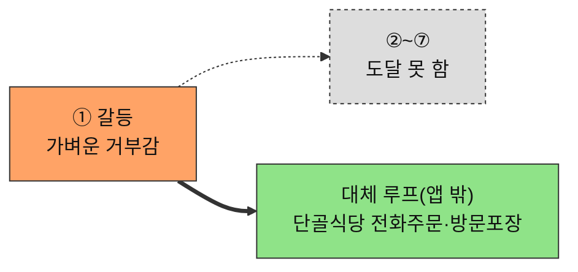

| 단계 | 고객 행동 | 고객 생각 | 감정 | Pain Point | 개선 기회 |
| --- | --- | --- | --- | --- | --- |
| ① 오늘의 갈등 ⛔ | 배고픔을 느끼지만 "새 앱을 배우는 수고"가 기대 이득보다 크다고 판단 | "굳이 배워야 하나" | 가벼운 거부감 | **앱이라는 형식 자체가 진입장벽이다** | 전화 주문만큼 단순한 진입 경로(문자·전화 연동) 제공 |
| ②~⑦ | 도달하지 않는다 | — | — | **새로운 것을 배우는 수고가 기대 이득보다 크다고 판단해 시도 자체가 없다** | [NFR-06 모바일 우선](../../04.tam-sam-som/1인가구한끼해결-7단계/07-솔루션구체화-SRS.md)은 필요조건일 뿐 |
| *대체 루프(앱 밖)* | 단골 식당 인지 → 전화 주문 → 방문 포장 | "이게 훨씬 빠르다" | 만족 | **이 루프 자체엔 문제가 없다 — 앱이 개입할 지점이 없다** | 이 루프는 개선 대상이 아님 — 온보딩 단순화만이 유일한 개입점 |

#### 이 인물이 ②로 넘어가는 조건 — 둘 다 필요하다

| 조건 | 이유 |
| --- | --- |
| ① 앱 사용법을 배우는 데 드는 수고가 체감상 거의 없다 | "전화가 더 빠르다"는 판단을 이기려면 속도가 최소한 동등해야 한다 |
| ② 전화 주문만큼 단순한 진입 경로가 있다 | 표준 앱 온보딩(가입·튜토리얼)은 이 인물에겐 이미 그 자체로 장벽이다 |

> 📌 N1은 신뢰 회복이 필요하고, N2는 온보딩 단순화가 필요하다 — 같은 "미사용"이지만 해법이 다르다.

---

## 6. 이탈 위험 매트릭스와 통찰

### 대표 4인의 단계별 이탈 위험 (정성 등급)

| 단계 | C1 (핵심) | A1 (확장) | X1 (극단) | N1 (비활성) |
| --- | :---: | :---: | :---: | :---: |
| ① 오늘의 갈등 | 중 | 중 | 중 | **최대 ⛔** |
| ② 조건 설정 | 낮 | 중 | 낮 | — |
| ③ 후보 비교 | 낮 | 높 | **최대 ⛔** | — |
| ④ 외부 이동 | 낮 | 낮 | — | — |
| ⑤ 수령·준비 | 중 | 낮(회복) | — | — |
| ⑥ 소비·피드백 | 낮 | 중 | — | — |
| ⑦ 내일의 재방문 | 낮 | 중 | — | — |

### 12명 전체 요약 (색상만으로)

| 유형 | 코드 | ①~③ | ④~⑤ | ⑥~⑦ |
| --- | --- | --- | --- | --- |
| Core | C1 | 🟧🟨🟨 | 🟨🟧 | 🟩🟩 |
| Core | C2 | 🟧🟧🟧 | 🟨🟧 | 🟧🟨 |
| Core | C3 | 🟧🟨🟨 | 🟩🟨 | 🟧🟨 |
| Core | C4 | 🟧🟧🟨 | 🟨🟨 | 🟧🟨 |
| Core | C5 | 🟥🟨🟨 | 🟨🟨 | 🟩🟩 |
| Adjacent | A1 | 🟧🟧🟧 | 🟨🟩 | 🟧🟨 |
| Adjacent | A2 | 🟧🟨🟧 | 🟨🟨 | 🟨🟧 |
| Adjacent | A3 | 🟧🟧🟨 | 🟨🟨 | 🟩🟨 |
| Extreme | X1 | 🟧🟨🟥 | ⬜⬜ | ⬜⬜ |
| Extreme | X2 | 🟧🟨🟥 | ⬜⬜ | ⬜⬜ |
| Non-user | N1 | 🟥⬜⬜ | ⬜⬜ | ⬜⬜ (대체 루프 🟩) |
| Non-user | N2 | 🟧⬜⬜ | ⬜⬜ | ⬜⬜ (대체 루프 🟩) |

### 세로로 읽어서 나오는 것

1. **모든 여정이 ③에서 한 번, ①에서 다시 걸린다.** 두 병목은 서로 다른 결핍이다 — ③은 *"보여줄 옵션이 없다"*, ①은 *"신뢰·의욕이 없다"*. 하나는 데이터 문제, 하나는 채널·신뢰 문제라 **같은 방법으로 풀리지 않는다.**
2. **외부 이동(④)은 어느 여정에서도 최대 병목이 아니다.** 결제 흐름 최적화에 쏟는 노력은 이 서비스에서 우선순위가 낮은 투자다.
3. **완주하는 여정(Core·Adjacent)도 ⑤에서 다시 눌린다.** 완주가 곧 만족을 뜻하지 않는다 — 다만 A1처럼 채널 선택이 이전 단계의 Pain Point를 상쇄하는 경우도 있다.
4. **Extreme·Non-user의 회색(도달 못 함)이 압도적으로 많다** — 앱이 개입할 수 있는 구간 자체가 이 두 유형에겐 절반 이하다.
5. **네 여정의 Pain Point 중 다수가 "정보의 부재·불일치"로 환원된다** — 최소주문금액 미표시, ETA 오차, 영업시간 데이터 부재, 갱신시각 불신. 나머지는 구조적 도달 불가(Extreme)와 근본적 불신·학습비용(Non-user)이다.

### 공통 Pain Point와 해소 지점

| 공통 Pain Point | 걸리는 단계 | 겪는 인물 | 해소하는 것 |
| --- | --- | --- | --- |
| 조건에 안 맞는 정보가 걸러지지 않고 노출된다 | ②③ | C1·A1·X1·X2 | [FR-04 조건 필터](../../04.tam-sam-som/1인가구한끼해결-7단계/07-솔루션구체화-SRS.md) 강화 |
| 정보가 실제와 다를 수 있다(가격·ETA·재고) | ③⑤ | C1·A1 등 Core·Adjacent 전반 | [NFR-02](../../04.tam-sam-som/1인가구한끼해결-7단계/07-솔루션구체화-SRS.md)·[NFR-05](../../04.tam-sam-som/1인가구한끼해결-7단계/07-솔루션구체화-SRS.md), ETA 오차 표시 |
| 애초에 이 정보를 믿지 않거나, 배우는 수고가 아깝다 | ① | N1·N2 | UX 밖의 신뢰 확보·온보딩 단순화 과제 |

> ⚠️ **세 번째 항목이 이 여정의 급소다.** UX로 해결되지 않는 유일한 Pain Point이며, N1·N2는 "설득의 대상"이 아니라 별도의 신뢰 획득·온보딩 채널이 필요한 대상이다.

---

## 7. 개선 우선순위

여정 전체에서 도출된 개선 기회를 **영향 범위 × 선행 조건**으로 줄 세운다.

| 순위 | 개선 항목 | 해소하는 단계 | 영향 받는 인물 | 선행 조건 |
| --- | --- | --- | --- | --- |
| **1** | **결과 0건일 때 대안 안내** (다음 영업 예상 시각 등) | ③ | X1·X2 → 다른 극단 사용자 전체 | 영업시간·배달 커버리지 데이터 확보 |
| **2** | **NFR-02 데이터 신뢰성**(갱신시각·출처 강조) | ③ | C1 등 Core 전반 | 선행 조건 없음 — 바로 가능 |
| **3** | **최소주문금액 미충족 옵션 사전 배제** | ②③ | A1 | 가맹점별 최소주문금액 데이터 |
| **4** | **ETA 오차 범위 표시** | ⑤ | 배달 채널 전반(C1·C2·A3 등) | 외부 서비스의 ETA 데이터 접근(불확실) |
| **5** | **가열 가능 여부 필터** | ⑤ | 편의점-HMR 채널(A1·A2·C5 등) | 조건 입력 UI 확장 |
| **6** | **신뢰 신호(가격·출처 근거) 노출** | ① | N1 | 마케팅·채널 전략 — 제품 밖의 과제 |
| **7** | **포장 채널 대표 페르소나 보완** | — | 스펙트럼 공백(X2가 유일한 포장 선호자이나 완주 못 함) | [02단계 ②평가](./02-페르소나스펙트럼.md) 재개 |

> 📌 **1·2위가 개발 난이도가 아니라 데이터 확보 여부로 정해졌다.** 화면을 잘 만들어도 영업시간·갱신시각 데이터가 정확하지 않으면 ③이 계속 최대 병목으로 남는다.

---

## 8. 근거 등급

| 구성 요소 | 등급 | 비고 |
| --- | --- | --- |
| 7단계 구조(특히 ⑤ 수령·준비의 존재) | **(확인)** | [07단계 SRS 8.3절](../../04.tam-sam-som/1인가구한끼해결-7단계/07-솔루션구체화-SRS.md)의 "가열/준비" 필드 직접 인용 |
| 12명의 정체성 | **(가정)** | [02-페르소나스펙트럼.md](./02-페르소나스펙트럼.md) 원본과 동일한 근거 수준 — 인터뷰 없음 |
| **행동·생각·감정·Pain Point 전체** | **(가정)** | 전량 생성물 |
| **이탈 위험 등급(§6 매트릭스·요약)** | **(가정)** | 로그·퍼널 데이터 없음. **상대 순위로만 읽을 것** |
| Extreme·Non-user의 구조적 종료 판단 | **(추정)** | FR-04 필터 로직·02번 문서 유형 정의에서 논리적으로 추론. 실제 빈 결과 케이스 테스트는 아직 없음 |

> ⚠️ **이 지도에는 실측이 한 줄도 없다.** 특히 §6의 이탈 위험 등급은 실제 퍼널 데이터가 아니라 추론이므로 절대값으로 인용하면 안 된다. 최소 검증은 [07단계 SRS §6 PoC](../../04.tam-sam-som/1인가구한끼해결-7단계/07-솔루션구체화-SRS.md)에서 "어느 단계에서 실제로 멈췄는가"를 결정시간·선택비용 지표와 함께 관찰하는 것이다.

---

## 9. 다음 남는 과제

| 답한 것 | 답하지 못한 것 |
| --- | --- |
| 고객이 어디서 멈추는가(③, ①) | **얼마나 멈추는가** — 단계별 실제 이탈률(로그 데이터 없음) |
| 무엇을 고쳐야 하는가(§7 7개) | **고치는 데 얼마가 드는가** — 개발 비용·기간 |
| ⑤가 만족을 좌우하지만 앱이 직접 통제하지 못한다는 것 | **외부 서비스의 ETA 데이터에 실제로 접근 가능한가** |
| 완주 페르소나 중 포장 대표가 없다는 공백 | [02단계 ②평가](./02-페르소나스펙트럼.md)를 재개해야 채워지는 공백 |

- PoC([07단계 SRS §6](../../04.tam-sam-som/1인가구한끼해결-7단계/07-솔루션구체화-SRS.md))의 결정시간·선택비용 지표에 "어느 단계에서 이탈·불만이 실제로 발생했는가" 관찰 항목을 추가할 것.
- 야간 영업시간·배달 커버리지 데이터 출처를 확보해야 §7 순위 1을 실행할 수 있다 — 현재는 확인되지 않았다.
- 대표 4인의 서사형 진단은 [04](./04-고객여정지도-수령준비단계.md)에 남아 있다 — 이 문서는 04와, 12종을 색상 다이어그램으로 다뤘던 중간 버전들을 하나로 합친 것이다.
