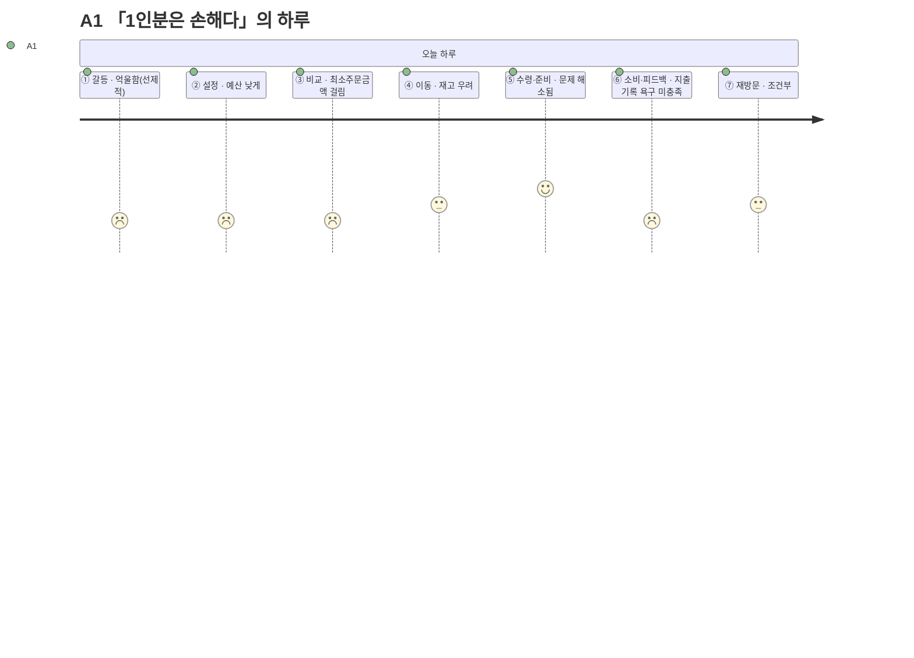

# 고객 여정지도 — A1 「1인분은 손해다」

> 유형: 🟢 Adjacent(확장) · 직무: 대학생·야간 편의점 알바 · 채널: 편의점 · 입력 [02-페르소나스펙트럼.md](../02-페르소나스펙트럼.md) · 7단계 모델 [04-고객여정지도-수령준비단계.md §1](../04-고객여정지도-수령준비단계.md)

## 여정 다이어그램

## 단계별 상세

| 단계 | 행동 | 생각 | 감정 | Pain Point | 개선 기회 |
| --- | --- | --- | --- | --- | --- |
| ① 오늘의 갈등 | 배고픔을 느끼며 "또 최소주문금액에 걸리겠지"를 먼저 예상 | "어차피 손해 보겠지" | 억울함(선제적) | **시작 전부터 실패를 예상하게 된다** | 예산 입력 화면에서 최소주문금액 이슈가 적은 채널(편의점 등) 먼저 안내 |
| ② 조건 설정 | 예산을 매우 낮게 설정 | "이 정도면 걸릴 것 같은데" | 방어적 | **낮은 예산에서 옵션이 급감할까 걱정한다** | 예산 구간별 옵션 수 미리보기 |
| ③ 후보 비교 | 1인분 기준 옵션을 확인 | "또 최소주문금액에 걸리겠지" | 억울함 | **최소주문금액 미충족 옵션이 후보에 섞여 나오면 확인 자체가 시간 낭비다** | [FR-04 조건 필터](../../../04.tam-sam-som/1인가구한끼해결-7단계/07-솔루션구체화-SRS.md)에서 미충족 옵션 사전 배제 |
| ④ 외부 이동 | 편의점 채널로 이동 | "여긴 최소주문금액이 없으니까" | 안도 | **이동한 매장에 실제 재고가 없으면 헛걸음이 된다** | 재고 확인 가능 매장만 필터링해 표시(재고 미확인 배지) |
| ⑤ 수령·준비 | 매장 방문 → 구매 → 가열/준비 | "이건 내가 골랐다" | 회복(최소주문금액 문제 해소) | **가열 도구·장소가 없는 상황(사무실 등)에서는 이 단계 자체가 성립하지 않을 수 있다** | 조건 입력에 "가열 가능 여부" 필터 |
| ⑥ 소비·피드백 | 실제로 먹지만 지출 기록은 남기지 않음 | "이번 달에 얼마 썼지" | 미충족 | **지출을 기록하고 싶은데 그 기능이 없다** | 간단한 누적 지출 뷰 |
| ⑦ 내일의 재방문 | 예산이 맞으면 재사용 | "편의점으로 가면 되니까" | 조건부 신뢰 | **예산이 맞지 않는 날은 채널 선택을 매번 다시 고민해야 한다** | 예산 구간별 선호 채널을 기억해 다음날 우선 추천 |

> 📌 A1은 ⑤에서 오히려 점수가 오른다 — 편의점 채널을 선택한 순간 ③의 Pain Point(최소주문금액)가 자연히 해소되기 때문이다. **채널 선택 자체가 Pain Point 회피 전략으로 쓰이고 있다.**

## 근거 등급

행동·생각·감정·Pain Point는 전량 생성물이다 **(가정)** — [02-페르소나스펙트럼.md](../02-페르소나스펙트럼.md)·[04-고객여정지도-수령준비단계.md](../04-고객여정지도-수령준비단계.md)와 동일한 근거 수준이며, PoC 전까지 의사결정 근거로 인용하지 않는다.
