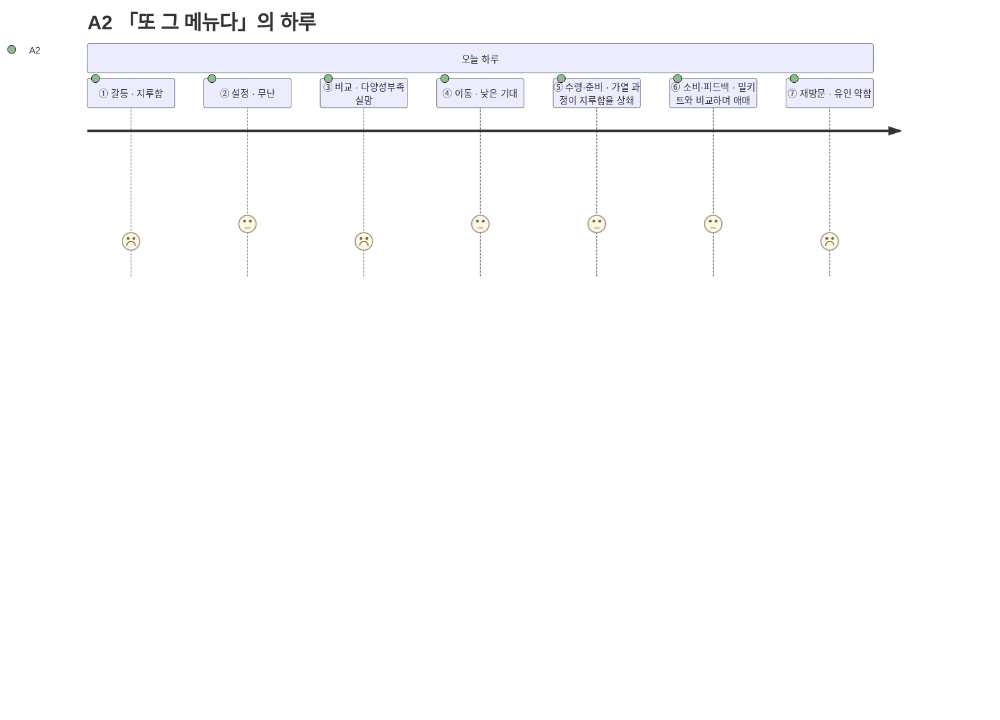

# 고객 여정지도 — A2 「또 그 메뉴다」

> 유형: 🟢 Adjacent(확장) · 직무: 프리랜서 디자이너(인접 연령) · 채널: 편의점-HMR(밀키트) · 입력 [02-페르소나스펙트럼.md](../02-페르소나스펙트럼.md) · 7단계 모델 [04-고객여정지도-수령준비단계.md §1](../04-고객여정지도-수령준비단계.md)

## 여정 다이어그램

## 단계별 상세

| 단계 | 행동 | 생각 | 감정 | Pain Point | 개선 기회 |
| --- | --- | --- | --- | --- | --- |
| ① 오늘의 갈등 | 배달 앱을 오래 써서 배달 피로감이 쌓인 채로 시작 | "오늘도 그거겠지" | 지루함 | **매번 비슷한 선택으로 귀결될 걸 알고 시작부터 흥이 안 난다** | 오늘의 신규·이색 옵션을 먼저 강조 노출 |
| ② 조건 설정 | 무난하게 조건을 입력 | "그냥 늘 하던 대로" | 무난 | **특별히 불편하진 않지만 입력이 매번 같은 결과로 이어질 거란 예상이 의욕을 낮춘다** | 다양성 우선 정렬 옵션 토글 |
| ③ 후보 비교 | 카드를 보며 반복되는 메뉴를 확인 | "또 그 메뉴들이네" | 다양성부족 실망 | **추천이 매번 비슷해 다양성 결핍이 해결되지 않는다** | 카테고리 강제 다양화 또는 신규 옵션 우선 노출 |
| ④ 외부 이동 | 편의점-HMR(밀키트) 채널로 이동 | "그래도 가보자" | 낮은 기대 | **이동 자체엔 문제 없지만 기대감이 낮은 상태로 이동하게 된다** | 이동 전 "이번엔 새로운 조합" 같은 짧은 동기부여 문구 |
| ⑤ 수령·준비 | 매장 방문 → 구매 → 가열/준비 | "만드는 과정은 그나마 낫다" | 약한 상쇄 | **준비 과정의 소소한 재미가 결과물의 반복성을 완전히 상쇄하지는 못한다** | 밀키트 레시피에 간단한 변형 팁 제공 |
| ⑥ 소비·피드백 | 자신이 비축해둔 밀키트와 비교하게 됨 | "이게 나은가 밀키트가 나은가" | 애매함 | **앱 추천과 개인 대체 솔루션(밀키트 비축)을 비교하게 되고 우열이 애매해 재사용 동기가 약하다** | 밀키트 대비 시간·비용 비교를 명시적으로 제시 |
| ⑦ 내일의 재방문 | 다양성 문제가 남아 재방문 유인이 약함 | "그냥 밀키트 먹지" | 유인 약함 | **다양성 문제가 해결 안되면 재방문 유인이 약하다** | 신규 카테고리 알림으로 재방문 계기 제공 |

> 📌 A2는 완주하는 8명(Core 5·Adjacent 3) 중 유일하게 **앱 자체를 원인으로 재방문이 줄어들 위험**을 안고 있다 — 나머지는 상황(예산·시간)이 문제이지 추천 품질이 문제인 경우는 A2뿐이다.

## 근거 등급

행동·생각·감정·Pain Point는 전량 생성물이다 **(가정)** — [02-페르소나스펙트럼.md](../02-페르소나스펙트럼.md)·[04-고객여정지도-수령준비단계.md](../04-고객여정지도-수령준비단계.md)와 동일한 근거 수준이며, PoC 전까지 의사결정 근거로 인용하지 않는다.
