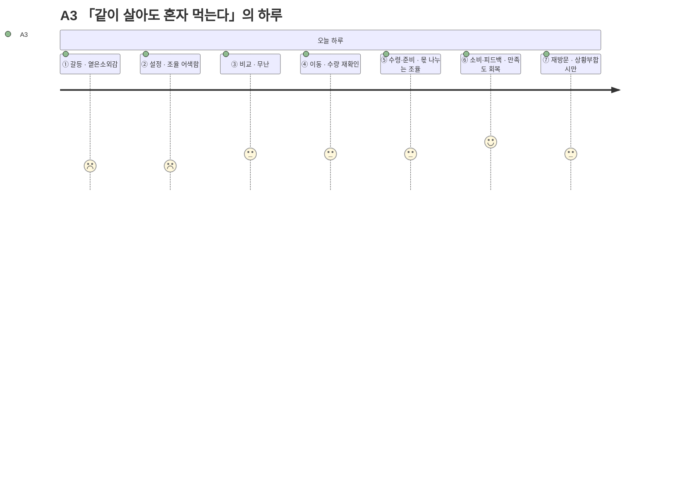

# 고객 여정지도 — A3 「같이 살아도 혼자 먹는다」

> 유형: 🟢 Adjacent(확장) · 직무: 맞벌이 2인가구(퇴근시각 엇갈림) · 채널: 배달 · 입력 [02-페르소나스펙트럼.md](../02-페르소나스펙트럼.md) · 7단계 모델 [04-고객여정지도-수령준비단계.md §1](../04-고객여정지도-수령준비단계.md)

## 여정 다이어그램

## 단계별 상세

| 단계 | 행동 | 생각 | 감정 | Pain Point | 개선 기회 |
| --- | --- | --- | --- | --- | --- |
| ① 오늘의 갈등 | 배우자와 퇴근시각이 엇갈려 혼자 저녁을 먹게 됨을 자각 | "오늘도 혼자 먹네" | 옅은소외감 | **가구는 2인인데 실제 경험은 1인가구와 같아 이 앱이 나를 위한 게 맞는지 헷갈린다** | "오늘은 혼자" 상황 배지로 공감 표현 |
| ② 조건 설정 | 입력 전 "내 조건으로 입력해도 되나"를 배우자와 조율 | "내 조건으로 입력해도 되나" | 조율 어색함 | **1인가구 전제로 설계된 입력 흐름이 2인 상황에는 맞지 않는다** | "혼자 먹는 날" 토글 등 상황 명시 옵션 |
| ③ 후보 비교 | 카드를 확인 | "이 정도면 됐다" | 무난 | **혼자 먹는 양 기준 추천인지 불분명해 확신이 부족하다** | 1인분 기준임을 명시적으로 표시 |
| ④ 외부 이동 | 배달 채널로 이동 | "이걸로 시키자" | 무난 | **특별한 문제는 없지만 1인분·2인분 수량을 다시 헷갈릴 수 있다** | 이동 전 수량 확인 리마인드 |
| ⑤ 수령·준비 | 2인분을 수령해 혼자 먹을 몫과 보관 몫을 나눔 | "이건 내 몫, 저건 냉장" | 약한 불편 | **혼자 먹을 몫과 나중을 위한 보관 몫을 매번 다시 나눠야 한다** | 1인분/2인분 선택 시 보관 팁 함께 제공 |
| ⑥ 소비·피드백 | 혼자 먹었지만 만족 | "그래도 잘 먹었다" | 만족도 회복 | **혼자 먹었지만 만족했다는 걸 공유할 대상(배우자)이 없어 경험이 개인 안에서 끝난다** | 간단한 만족도만 기록해두면 다음 혼자 먹는 날 참고 가능 |
| ⑦ 내일의 재방문 | 다음에 또 엇갈리는 날에만 재사용 | "다음에 또 혼자면 또 써야지" | 조건부 | **상황(엇갈린 퇴근)이 매번 다르게 발생해 사용이 불규칙하다** | 엇갈린 퇴근이 예상되는 요일 패턴 학습 후 사전 알림 |

> 📌 A3는 **가구 형태(2인가구)가 아니라 상황(엇갈린 퇴근)이 문제를 만든다**는 것을 보여주는 사례다 — [02-페르소나스펙트럼.md §2](../02-페르소나스펙트럼.md)가 이미 지적한 대로 Market Segment Map의 두 축(예산×시간) 밖에서 나온 인물이다.

## 근거 등급

행동·생각·감정·Pain Point는 전량 생성물이다 **(가정)** — [02-페르소나스펙트럼.md](../02-페르소나스펙트럼.md)·[04-고객여정지도-수령준비단계.md](../04-고객여정지도-수령준비단계.md)와 동일한 근거 수준이며, PoC 전까지 의사결정 근거로 인용하지 않는다.
