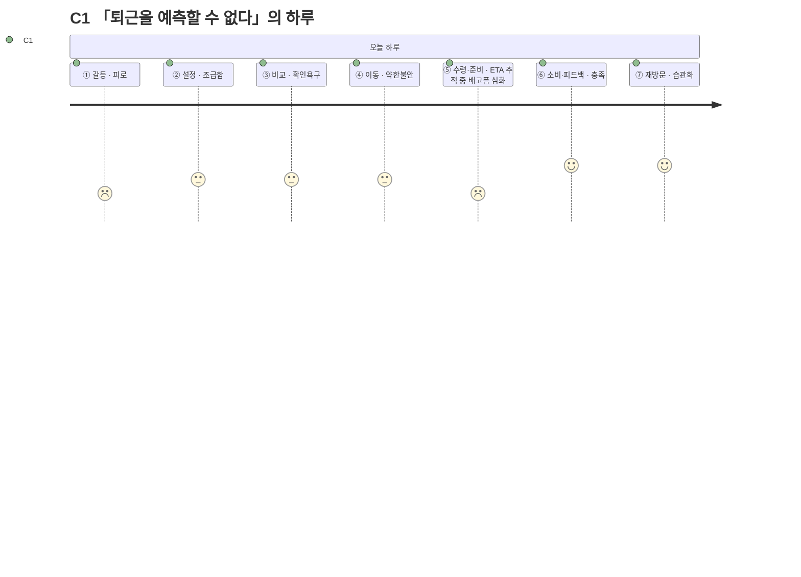

# 고객 여정지도 — C1 「퇴근을 예측할 수 없다」

> 유형: 🔵 Core(핵심) · 직무: 스타트업 백엔드 개발자 · 채널: 배달 · 입력 [02-페르소나스펙트럼.md](../02-페르소나스펙트럼.md) · 7단계 모델 [04-고객여정지도-수령준비단계.md §1](../04-고객여정지도-수령준비단계.md)

## 여정 다이어그램

## 단계별 상세

| 단계 | 행동 | 생각 | 감정 | Pain Point | 개선 기회 |
| --- | --- | --- | --- | --- | --- |
| ① 오늘의 갈등 | 퇴근 시각이 다가오며 배고픔을 자각 | "또 정해야 하나" | 피로 | **매번 같은 고민이 반복된다** | 최근 조건 자동 채움([FR-10](../../../04.tam-sam-som/1인가구한끼해결-7단계/07-솔루션구체화-SRS.md) 즐겨찾기) |
| ② 조건 설정 | 위치·예산·최대시간을 빠르게 입력 | "이번엔 빨리 끝내고 싶다" | 조급함 | **입력 자체가 새로운 결정 부담이다** | 슬라이더 기본값을 최근 패턴으로 사전 설정 |
| ③ 후보 비교 | 3개 카드와 총비용·총시간을 확인 | "이 숫자를 믿어도 되나" | 확인 욕구 | **갱신시각이 지난 정보에 대한 불신** | [NFR-02 데이터 신뢰성](../../../04.tam-sam-som/1인가구한끼해결-7단계/07-솔루션구체화-SRS.md)(출처·갱신시각 강조) |
| ④ 외부 이동 | 원 서비스로 이동해 배달 주문 | "여기서 가격이 바뀌면 어떡하지" | 약한 불안 | **이동 직후 가격이 달라질 수 있다는 불확실성** | S4 안내 문구 명확화("다시 확인" 리마인드) |
| ⑤ 수령·준비 | 배달원 위치추적 + 대기 | "왜 안 오지" | 배고픔 심화 | **표시 ETA와 실제 도착시간의 차이가 클수록 신뢰가 깎인다** | 추정 ETA에 오차 범위 표시 |
| ⑥ 소비·피드백 | 실제로 먹고, 피드백은 대체로 건너뜀 | "예상과 비슷했나" | 충족 | **피드백 입력이 귀찮아 생략된다** | 만족도 1탭만이라도 남기는 최소 피드백 |
| ⑦ 내일의 재방문 | 다음 날도 앱을 다시 여는가 | "어제도 도움이 됐으니 또" | 습관화 시작 | **새로울 것이 없다는 지루함이 재발할 수 있다** | 주간 지출 요약([SHOULD 기능](../../../04.tam-sam-som/1인가구한끼해결-7단계/07-솔루션구체화-SRS.md))으로 누적 가치 환기 |

> 📌 여정은 끝까지 완주하지만 ①과 ⑤에서 두 번 눌린다 — ①은 앱 밖의 심리적 피로, ⑤는 앱이 직접 통제할 수 없는 외부 서비스의 ETA 정확도 문제다.

## 근거 등급

행동·생각·감정·Pain Point는 전량 생성물이다 **(가정)** — [02-페르소나스펙트럼.md](../02-페르소나스펙트럼.md)·[04-고객여정지도-수령준비단계.md](../04-고객여정지도-수령준비단계.md)와 동일한 근거 수준이며, PoC 전까지 의사결정 근거로 인용하지 않는다.
