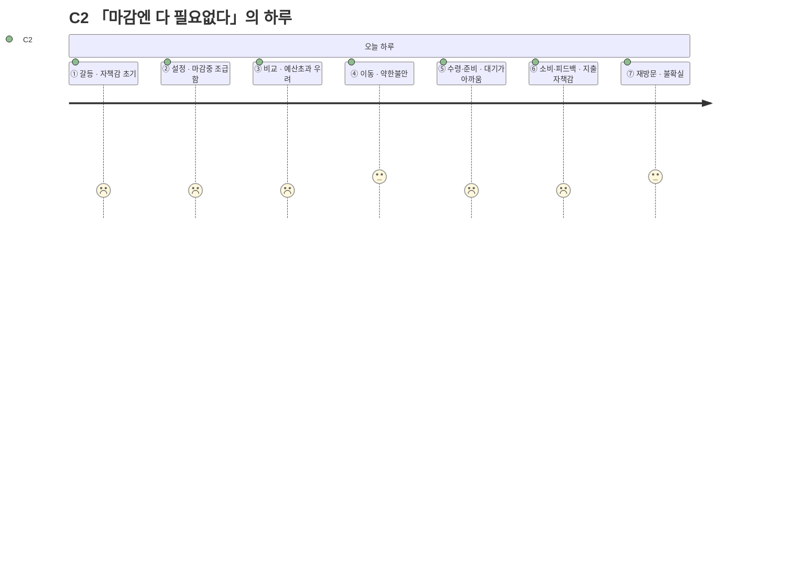

# 고객 여정지도 — C2 「마감엔 다 필요없다」

> 유형: 🔵 Core(핵심) · 직무: 프리랜서 콘텐츠 마케터 · 채널: 배달 · 입력 [02-페르소나스펙트럼.md](../02-페르소나스펙트럼.md) · 7단계 모델 [04-고객여정지도-수령준비단계.md §1](../04-고객여정지도-수령준비단계.md)

## 여정 다이어그램

## 단계별 상세

| 단계 | 행동 | 생각 | 감정 | Pain Point | 개선 기회 |
| --- | --- | --- | --- | --- | --- |
| ① 오늘의 갈등 | 재택근무라 규칙적 식사시간이 없고, 마감 직전에 배고픔을 느낌 | "지금 아니면 못 먹는다" | 자책감 초기 | **마감 압박과 식사 결정이 겹쳐 최악의 타이밍에 결정해야 한다** | 원터치 "지금 급함" 모드로 조건 입력 스킵 |
| ② 조건 설정 | 위치·예산·최대시간을 서둘러 입력 | "그냥 빨리 아무거나" | 마감중 조급함 | **조급한 상태에서 입력 절차 자체가 방해로 느껴진다** | 원터치 "지금 급함" 프리셋 |
| ③ 후보 비교 | 카드를 확인하며 예산 초과를 걱정 | "이 돈이면 마감 끝나고 후회할 것 같다" | 예산초과 우려 | **급할 때일수록 예산을 넘기는 선택을 하게 되고 그걸 알면서도 못 막는다** | 예산 초과 옵션에 경고 배지 강조 |
| ④ 외부 이동 | 원 서비스로 이동해 배달 주문 | "여기서 가격 바뀌면 안 되는데" | 약한 불안 | **이동 직후 가격이 달라질 수 있다는 불확실성** | S4 안내 문구 명확화("다시 확인" 리마인드) |
| ⑤ 수령·준비 | 배달원 위치추적 + 대기 | "이 시간에 일을 더 할 수 있는데" | 대기가 아까움 | **마감 중 대기시간은 일반 대기보다 심리적 비용이 더 크다** | 대기 중 알림으로 방해하지 않기 옵션 |
| ⑥ 소비·피드백 | 먹고 나서 지출 초과를 자책 | "또 예산 넘겼네" | 자책감 | **예산초과가 반복되면 앱을 탓하게 될 수 있다** | 예산 준수율을 주간으로 보여주는 긍정적 피드백 |
| ⑦ 내일의 재방문 | 마감 패턴이 불규칙해 재방문도 불규칙 | "다음 마감 때도 또 쓰겠지" | 불확실 | **마감이라는 특수 상황에서만 쓰다 보니 습관으로 자리잡기 어렵다** | 마감형 사용 패턴 인식 후 맞춤 프리셋 유지 |

> 📌 이 여정은 "마감"이라는 예외 상황에서만 트리거된다 — 습관화(⑦)가 다른 Core 페르소나보다 약한 이유다.

## 근거 등급

행동·생각·감정·Pain Point는 전량 생성물이다 **(가정)** — [02-페르소나스펙트럼.md](../02-페르소나스펙트럼.md)·[04-고객여정지도-수령준비단계.md](../04-고객여정지도-수령준비단계.md)와 동일한 근거 수준이며, PoC 전까지 의사결정 근거로 인용하지 않는다.
