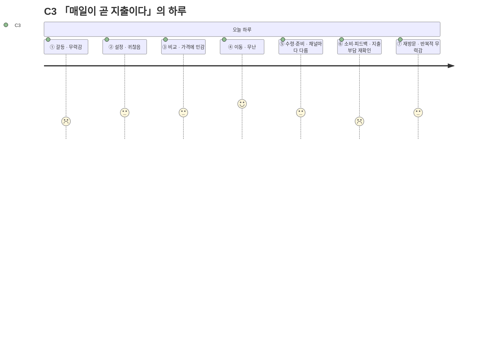

# 고객 여정지도 — C3 「매일이 곧 지출이다」

> 유형: 🔵 Core(핵심, [02번 문서](../02-페르소나스펙트럼.md)에서 Q2로 재분류) · 직무: 제조업 대기업 사무직 · 채널: 배달·편의점 혼용 · 입력 [02-페르소나스펙트럼.md](../02-페르소나스펙트럼.md) · 7단계 모델 [04-고객여정지도-수령준비단계.md §1](../04-고객여정지도-수령준비단계.md)

## 여정 다이어그램

## 단계별 상세

| 단계 | 행동 | 생각 | 감정 | Pain Point | 개선 기회 |
| --- | --- | --- | --- | --- | --- |
| ① 오늘의 갈등 | 매일 반복되는 지출에 대한 무력감을 느낌 | "오늘도 또 나가네" | 무력감 | **문제가 급하지 않아 방치되고, 방치될수록 누적 지출이 커진다** | 누적 지출 알림으로 문제를 가시화 |
| ② 조건 설정 | 담담하게 입력, 큰 기대 없음 | "그냥 늘 하던대로" | 귀찮음 | **매일 같은 입력을 반복하는 것 자체가 피로다** | 원클릭 "오늘도 같은 조건" |
| ③ 후보 비교 | 가격에 평소보다 더 민감하게 확인 | "이번엔 좀 더 싼 데 없나" | 가격에 민감 | **매번 최저가를 찾아야 한다는 부담이 누적 피로로 쌓인다** | 이번 달 대비 저렴한 옵션 우선 정렬 |
| ④ 외부 이동 | 배달 또는 편의점으로 이동 | "오늘은 배달, 아니면 편의점" | 무난 | **채널을 매번 새로 고민해야 한다** | 지난주 채널 선택 패턴 표시 |
| ⑤ 수령·준비 | 채널에 따라 대기 또는 가열/준비 | "이 정도면 됐다" | 중립 | **채널이 바뀔 때마다 수령 방식도 매번 새로 익혀야 하는 느낌** | 채널별 수령 안내를 통일된 아이콘으로 표시 |
| ⑥ 소비·피드백 | 먹고 나서 지출부담을 재확인 | "이번 달도 꽤 썼네" | 무력감 재발 | **매 끼니 지출이 누적되는 걸 눈으로 확인하기 전까지는 심각성을 못 느낀다** | 월간 지출 누적 요약([SHOULD 기능](../../../04.tam-sam-som/1인가구한끼해결-7단계/07-솔루션구체화-SRS.md)) |
| ⑦ 내일의 재방문 | 반복적 무력감 속에서도 재방문 | "어쩔 수 없지, 또 쓴다" | 반복적 무력감 | **구조적 문제(혼자라 요리 안 함)가 해결되지 않아 앱 사용이 증상 완화일 뿐 근본 해결은 아니다** | 예산 목표 설정 후 달성률 피드백으로 통제감 부여 |

> 📌 [02-페르소나스펙트럼.md](../02-페르소나스펙트럼.md)에서 이미 지적했듯 C3는 시간은 여유롭고 예산만 압박받는 **Q2**에 실제로는 더 가깝다. Core에 배치됐지만 여정 전체가 "지출 피로"로 일관된다.

## 근거 등급

행동·생각·감정·Pain Point는 전량 생성물이다 **(가정)** — [02-페르소나스펙트럼.md](../02-페르소나스펙트럼.md)·[04-고객여정지도-수령준비단계.md](../04-고객여정지도-수령준비단계.md)와 동일한 근거 수준이며, PoC 전까지 의사결정 근거로 인용하지 않는다.
