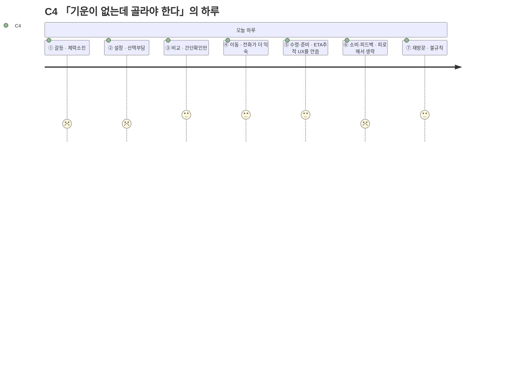

# 고객 여정지도 — C4 「기운이 없는데 골라야 한다」

> 유형: 🔵 Core(핵심, [02번 문서](../02-페르소나스펙트럼.md)에서 Q3로 재분류) · 직무: 병원 간호사(낮 근무) · 채널: 배달(전화 주문 위주) · 입력 [02-페르소나스펙트럼.md](../02-페르소나스펙트럼.md) · 7단계 모델 [04-고객여정지도-수령준비단계.md §1](../04-고객여정지도-수령준비단계.md)

## 여정 다이어그램

## 단계별 상세

| 단계 | 행동 | 생각 | 감정 | Pain Point | 개선 기회 |
| --- | --- | --- | --- | --- | --- |
| ① 오늘의 갈등 | 육체노동 후 퇴근, 체력이 소진된 채 배고픔을 느낌 | "생각할 힘도 없다" | 체력소진 | **육체적으로 지친 상태에서 인지적 결정을 요구받는다** | 저에너지 모드 — 최소 입력으로 즉시 추천 |
| ② 조건 설정 | 불규칙한 근무 스케줄 탓에 조건을 매번 새로 입력 | "오늘은 또 뭐라고 입력해야 하지" | 선택부담 | **근무 스케줄이 불규칙해 미리 저장된 조건이 잘 안 맞는다** | 근무 패턴(3교대 등) 선택 시 조건 자동 조정 |
| ③ 후보 비교 | 깊게 보지 않고 간단히만 확인 | "그냥 아무거나 빨리" | 간단확인만 | **깊게 비교할 여력이 없어 최적 선택을 못 하고 있다는 걸 알면서도 넘어간다** | 피로도 높음 모드에서는 카드 1개만 즉시 제시 |
| ④ 외부 이동 | 앱 대신 익숙한 전화 주문을 사용 | "그냥 전화하는 게 편하다" | 전화가 더 익숙 | **앱의 추천·이동 기능이 전화 주문 습관 앞에서 무용해진다** | 추천 결과에서 원클릭으로 "전화 연결"도 제공 |
| ⑤ 수령·준비 | ETA 추적 UX를 사용하지 않음 | "전화로 대충 시간 들었으니 됐다" | 무관심 | **앱이 제공하는 추적 정보가 전화 주문자에겐 무의미하다** | 전화 주문 시에도 예상시간 입력만으로 알림 제공 |
| ⑥ 소비·피드백 | 피로해서 피드백을 생략 | "그냥 눕고 싶다" | 피로 | **피드백을 남길 에너지가 없어 데이터가 이 유형에서는 거의 수집되지 않는다** | 가장 쉬운 피드백(이모지 1탭)만 제공 |
| ⑦ 내일의 재방문 | 근무 스케줄에 따라 재방문이 불규칙 | "다음엔 또 어떻게 될지 모르겠다" | 불규칙 | **불규칙한 스케줄 자체가 습관 형성을 방해한다** | 재방문을 강요하지 않는 저부담 리마인더 |

> 📌 [02-페르소나스펙트럼.md](../02-페르소나스펙트럼.md)에서 이미 지적했듯 C4는 예산은 여유롭고 시간(체력)만 압박받는 **Q3**에 실제로는 더 가깝다. ④~⑤에서 앱의 핵심 기능(추천 이동, ETA 추적)이 전화 주문 습관 앞에서 무용해진다는 것이 이 여정만의 독특한 발견이다.

## 근거 등급

행동·생각·감정·Pain Point는 전량 생성물이다 **(가정)** — [02-페르소나스펙트럼.md](../02-페르소나스펙트럼.md)·[04-고객여정지도-수령준비단계.md](../04-고객여정지도-수령준비단계.md)와 동일한 근거 수준이며, PoC 전까지 의사결정 근거로 인용하지 않는다.
