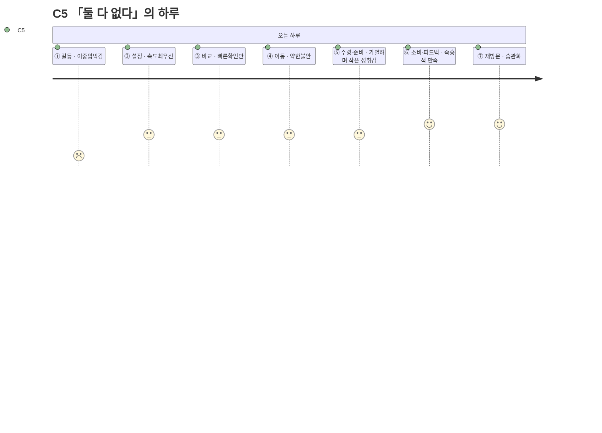

# 고객 여정지도 — C5 「둘 다 없다」

> 유형: 🔵 Core(핵심, 순수 Q4 — 예산·시간 동시압박의 전형) · 직무: 계약직 사무보조 · 채널: 편의점 · 입력 [02-페르소나스펙트럼.md](../02-페르소나스펙트럼.md) · 7단계 모델 [04-고객여정지도-수령준비단계.md §1](../04-고객여정지도-수령준비단계.md)

## 여정 다이어그램

## 단계별 상세

| 단계 | 행동 | 생각 | 감정 | Pain Point | 개선 기회 |
| --- | --- | --- | --- | --- | --- |
| ① 오늘의 갈등 | 소득 불규칙 + 야근으로 예산·시간이 동시에 바닥남을 자각 | "돈도 시간도 없다" | 이중압박감 | **예산과 시간이 동시에 바닥나 어떤 기준으로도 여유가 없다** | 예산·시간 둘 다 낮을 때 "균형" 모드를 기본값으로 자동 제안 |
| ② 조건 설정 | 속도를 최우선으로 빠르게 입력 | "빨리 끝내자" | 속도최우선 | **입력을 최소화하고 싶은데 항목이 여전히 많게 느껴진다** | 3항목 이하 초간단 입력 모드 |
| ③ 후보 비교 | 1위 카드로 바로 결정 | "1등 카드로 바로 가자" | 빠른확인만 | **빠르게 결정해야 해서 상세 비교를 사실상 못 한다** | 1위 카드에 "지금 이걸로" 원클릭 버튼 |
| ④ 외부 이동 | 편의점 채널로 이동 | "그냥 이거면 됐다" | 약한 불안 | **빠른 결정 뒤 이게 최선이었는지 확신이 없다** | 선택 근거를 한 줄로 재확인시켜주는 안내 |
| ⑤ 수령·준비 | 매장 방문 → 구매 → 가열/준비 | "이 정도면 나쁘지 않다" | 작은 성취감 | **즉흥적으로 고른 선택이 실제로 괜찮을지에 대한 걱정이 가열하는 동안 남는다** | 선택 이유를 다시 보여줘 안심시키는 요약 |
| ⑥ 소비·피드백 | 즉흥적 선택에 만족 | "그래도 괜찮았다" | 즉흥적 만족 | **만족했지만 왜 만족했는지 기록이 남지 않아 다음에 재현하기 어렵다** | 만족한 선택을 "즐겨찾기"로 쉽게 저장 |
| ⑦ 내일의 재방문 | 습관으로 자리잡음 | "또 이렇게 하면 되겠다" | 습관화 | **습관이 되긴 했지만 매번 즉흥적이라 지출 계획은 여전히 없다** | 즉흥 선택 패턴을 모아 사후 지출 요약 제공 |

> 📌 C5는 [02-페르소나스펙트럼.md](../02-페르소나스펙트럼.md)에서 확인된 순수 Q4(예산·시간 동시압박)의 전형이며, [04번 문서](../04-고객여정지도-수령준비단계.md)의 "핵심" 대표 후보로도 유력하다. 즉흥성이 강점(빠른 결정)이자 약점(지출 계획 부재)으로 동시에 작동하는 것이 특징이다.

## 근거 등급

행동·생각·감정·Pain Point는 전량 생성물이다 **(가정)** — [02-페르소나스펙트럼.md](../02-페르소나스펙트럼.md)·[04-고객여정지도-수령준비단계.md](../04-고객여정지도-수령준비단계.md)와 동일한 근거 수준이며, PoC 전까지 의사결정 근거로 인용하지 않는다.
