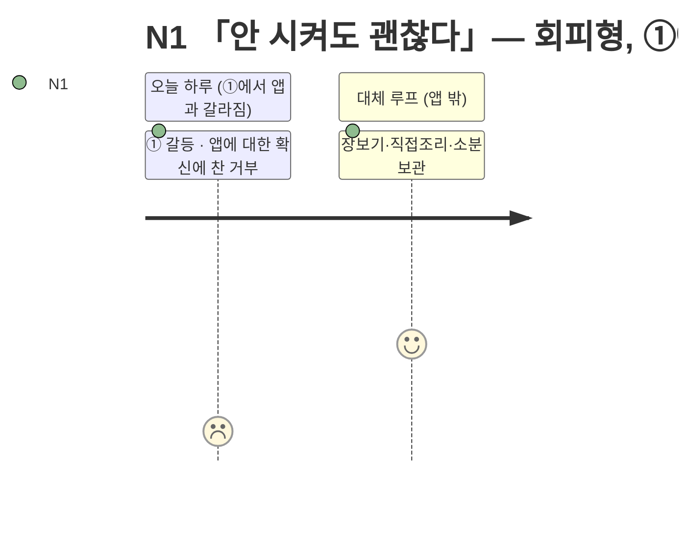

# 고객 여정지도 — N1 「안 시켜도 괜찮다」

> 유형: ⬜ Non-user(비활성, 회피형) · 직무: 회계사무소 직원 · 여정이 ①에서 앱과 갈라진다 · 입력 [02-페르소나스펙트럼.md](../02-페르소나스펙트럼.md) · 7단계 모델 [04-고객여정지도-수령준비단계.md §1](../04-고객여정지도-수령준비단계.md)

## 여정 다이어그램

## 단계별 상세

| 단계 | 행동 | 생각 | 감정 | Pain Point | 개선 기회 |
| --- | --- | --- | --- | --- | --- |
| ① 오늘의 갈등 ⛔ | 배고픔은 느끼지만 앱을 열 생각 자체를 안 함 | "배달은 못 믿는다" | 확신에 찬 거부 | **불신이 근본 원인이라, UX를 개선해도 애초에 앱을 열지 않는다** | 신뢰 신호는 필요조건이지만, 앱을 열게 만드는 건 별도의 신뢰 획득 문제 |
| ②~⑦ | 도달하지 않는다 | — | — | **전환 시도 자체가 역효과일 수 있다** | 설득 반복보다 아래 조건 충족이 먼저 |
| *(대체 루프, 앱 밖)* | 장보기 → 직접 조리 → 소분 보관 | "이게 더 안전하다" | 안정·만족 | **이 루프 자체엔 문제가 없다 — 앱이 개입할 지점이 없다는 것이 앱 관점의 한계다** | 이 루프는 개선 대상이 아님 — 별도의 신뢰 확보 채널 확보만이 유일한 개입점 |

### 이 인물이 ②로 넘어가는 조건 — 둘 다 필요하다

| 조건 | 이유 |
| --- | --- |
| ① 가격·출처 근거가 우리 채널이 아닌 곳에서 먼저 검증된다 | 앱이 스스로 하는 말은 ①을 통과하지 못한다 |
| ② 한 번 써도 계속 의존을 요구받지 않는다는 것이 분명하다 | 앱 자체에 대한 거부감이 "쓰면 계속 써야 한다"는 오해에서 오는 부분도 있다 |

> 📌 N1은 불행한 사람이 아니라 **이미 다른 해법에 만족하는 사람**이다. 대체 루프(장보기·직접조리)에서의 감정은 오히려 안정적이다 — 앱과 만나는 지점(①)에서만 거부가 나타난다.

## 근거 등급

행동·생각·감정·Pain Point는 전량 생성물이다 **(가정)**, "①에서 미시작"이라는 구조적 판단은 [02-페르소나스펙트럼.md §2](../02-페르소나스펙트럼.md)의 회피형 정의에서 논리적으로 도출한 것이다 **(추정)** — PoC 전까지 의사결정 근거로 인용하지 않는다.
