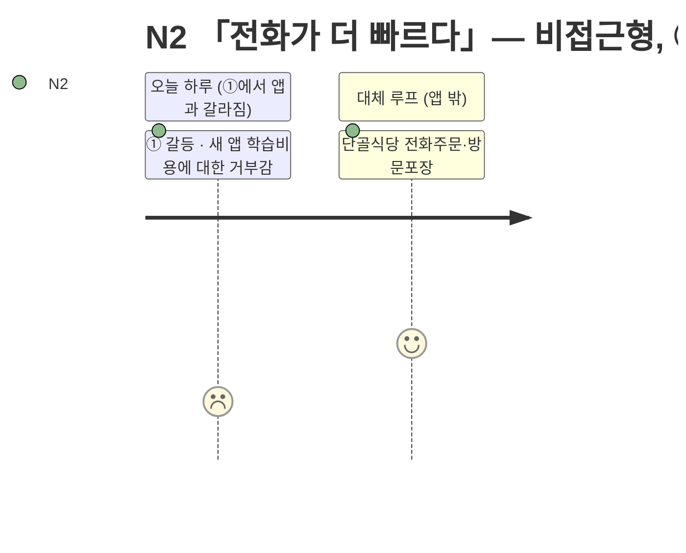

# 고객 여정지도 — N2 「전화가 더 빠르다」

> 유형: ⬜ Non-user(비활성, 비접근형) · 직무: 개인 사업자 · 여정이 ①에서 앱과 갈라진다 · 입력 [02-페르소나스펙트럼.md](../02-페르소나스펙트럼.md) · 7단계 모델 [04-고객여정지도-수령준비단계.md §1](../04-고객여정지도-수령준비단계.md)

## 여정 다이어그램

## 단계별 상세

| 단계 | 행동 | 생각 | 감정 | Pain Point | 개선 기회 |
| --- | --- | --- | --- | --- | --- |
| ① 오늘의 갈등 ⛔ | 배고픔을 느끼지만 "새 앱을 배우는 수고"가 기대 이득보다 크다고 판단 | "굳이 배워야 하나" | 가벼운 거부감 | **앱이라는 형식 자체가 진입장벽이다** | 전화 주문만큼 단순한 진입 경로(문자·전화 연동) 제공 |
| ②~⑦ | 도달하지 않는다 | — | — | **새로운 것을 배우는 수고가 기대 이득보다 크다고 판단해 시도 자체가 없다** | [NFR-06 모바일 우선](../../../04.tam-sam-som/1인가구한끼해결-7단계/07-솔루션구체화-SRS.md)은 필요조건일 뿐, 전화만큼 쉬운 대안 채널 없이는 근본 해결이 안 될 수 있음 |
| *(대체 루프, 앱 밖)* | 단골 식당 인지 → 전화 주문 → 방문 포장 | "이게 훨씬 빠르다" | 만족 | **이 루프 자체엔 문제가 없다 — 앱이 개입할 지점이 없다** | 이 루프는 개선 대상이 아님 — 온보딩 단순화만이 유일한 개입점 |

### 이 인물이 ②로 넘어가는 조건 — 둘 다 필요하다

| 조건 | 이유 |
| --- | --- |
| ① 앱 사용법을 배우는 데 드는 수고가 체감상 거의 없다 | "전화가 더 빠르다"는 판단을 이기려면 속도가 최소한 동등해야 한다 |
| ② 전화 주문만큼 단순한 진입 경로가 있다 | 표준 앱 온보딩(가입·튜토리얼)은 이 인물에겐 이미 그 자체로 장벽이다 |

> 📌 N2는 N1과 달리 **불신이 아니라 학습비용**이 장벽이다. 같은 "미사용"이지만 해법이 다르다 — N1은 신뢰 확보, N2는 온보딩 단순화가 필요하다.

## 근거 등급

행동·생각·감정·Pain Point는 전량 생성물이다 **(가정)**, "①에서 미시작"이라는 구조적 판단은 [02-페르소나스펙트럼.md §2](../02-페르소나스펙트럼.md)의 비접근형 정의에서 논리적으로 도출한 것이다 **(추정)** — PoC 전까지 의사결정 근거로 인용하지 않는다.
