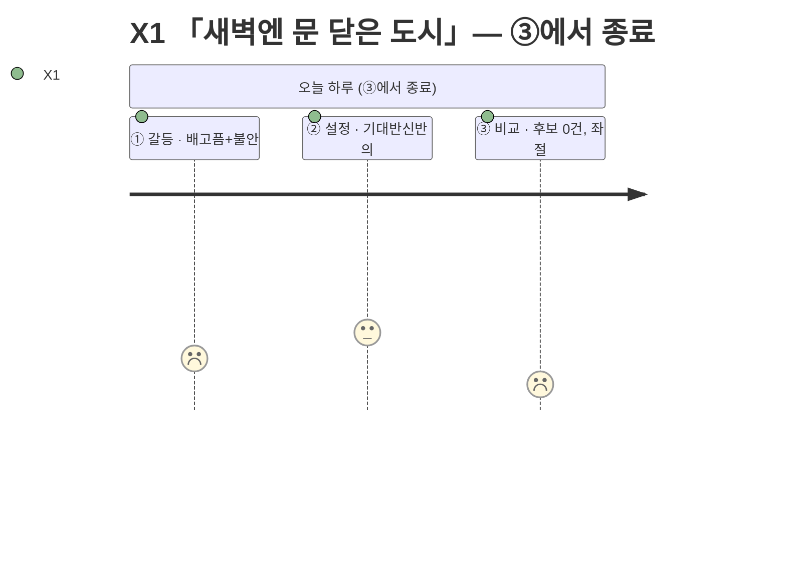
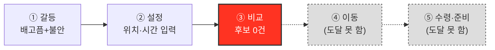

# 고객 여정지도 — X1 「새벽엔 문 닫은 도시」

> 유형: 🔴 Extreme(극단) · 직무: 물류센터 야간 교대근무 · 여정이 ③에서 구조적으로 끊긴다 · 입력 [02-페르소나스펙트럼.md](../02-페르소나스펙트럼.md) · 7단계 모델 [04-고객여정지도-수령준비단계.md §1](../04-고객여정지도-수령준비단계.md)

## 여정 다이어그램

## 단계별 상세

| 단계 | 행동 | 생각 | 감정 | Pain Point | 개선 기회 |
| --- | --- | --- | --- | --- | --- |
| ① 오늘의 갈등 | 새벽 3~4시 퇴근, 배고픔과 함께 "이 시간에 열려 있는 곳이 있을까"라는 의문이 먼저 든다 | "또 아무것도 없겠지" | 불안 | **시간이 아니라 영업시간의 존재 자체가 벽이다** | 야간 시간대 입력 시 "야간 영업 정보가 제한적"이라는 기대치 조정 안내 |
| ② 조건 설정 | 새벽 시간대로 조건을 입력 | "혹시나 하는 마음" | 기대반신반의 | **입력하는 동안에도 이미 결과가 없을 거란 예감을 안고 있다** | 입력 단계에서 야간시간대 데이터 커버리지 수준을 미리 표시 |
| ③ 후보 비교 ⛔ | 추천 카드가 뜨지 않음을 확인 | "그럼 뭘 먹으라는 거지" | 좌절 | **조건에 맞는 옵션이 0개면 여정이 그대로 끝난다** | 결과 0건일 때 "다음 영업 예상 시각" 안내 |
| ④~⑦ | 도달하지 않는다 | — | — | **비교가 아니라 후보 없음으로 끝난다** — 일반적 UX 개선(로딩 속도 등)으로 해결되지 않는다 | 포장 전용 뷰 등 "비교 실패"가 아닌 "대안 모드"로 재구성 |

### 이 인물이 ④로 넘어가는 조건 — 둘 다 필요하다

| 조건 | 이유 |
| --- | --- |
| ① 야간 영업 정보 자체가 데이터에 존재한다 | 지금은 야간 영업 여부를 신뢰성 있게 표시할 데이터 출처가 확인되지 않았다 |
| ② 결과 0건일 때도 "다음 행동"이 주어진다 | 아무 안내 없이 끝나면 재시도 의욕 자체가 사라진다 |

> 📌 이 지도는 전환 경로가 아니라 **이탈 지도**다. ④~⑦을 채우려 드는 것 자체가 오독이며, 이 지도의 용도는 "야간 시간대 커버리지 없이는 이 세그먼트에 투자하지 말라"는 판정이다.

## 근거 등급

행동·생각·감정·Pain Point는 전량 생성물이다 **(가정)**, "③에서 종료"라는 구조적 판단은 FR-04 필터 로직상 발생 가능한 결과를 논리적으로 추론한 것이다 **(추정)** — [02-페르소나스펙트럼.md](../02-페르소나스펙트럼.md)·[04-고객여정지도-수령준비단계.md](../04-고객여정지도-수령준비단계.md)와 동일한 근거 수준이며, 실제 빈 결과 케이스 테스트는 아직 없다.
