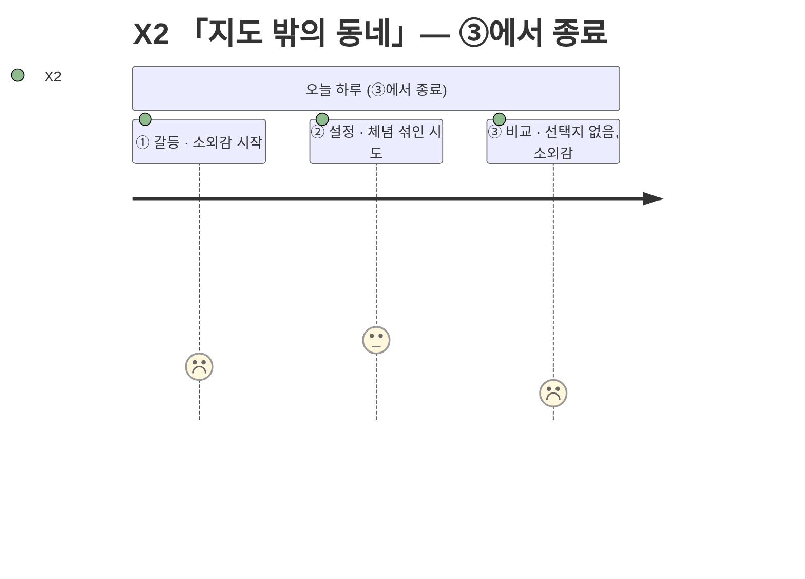
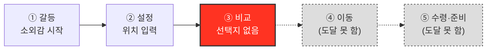

# 고객 여정지도 — X2 「지도 밖의 동네」

> 유형: 🔴 Extreme(극단) · 직무: 지방 소도시 원룸 거주 1인가구 · 여정이 ③에서 구조적으로 끊긴다 · 입력 [02-페르소나스펙트럼.md](../02-페르소나스펙트럼.md) · 7단계 모델 [04-고객여정지도-수령준비단계.md §1](../04-고객여정지도-수령준비단계.md)

## 여정 다이어그램

## 단계별 상세

| 단계 | 행동 | 생각 | 감정 | Pain Point | 개선 기회 |
| --- | --- | --- | --- | --- | --- |
| ① 오늘의 갈등 | 배고픔을 느끼며 "여기도 되려나"를 먼저 떠올림 | "여기도 되려나" | 소외감 시작 | **도시 기준으로 설계된 서비스라 처음부터 기대치가 낮다** | 위치 입력 즉시 해당 지역 커버리지 수준을 먼저 안내 |
| ② 조건 설정 | 위치를 입력하지만 큰 기대는 하지 않음 | "일단 넣어보자" | 체념 섞인 시도 | **이미 여러 번 실망한 경험이 있어 입력하면서도 기대하지 않는다** | 이전 검색 이력 기반으로 실제 가능한 옵션만 먼저 보여주는 "내 동네 모드" |
| ③ 후보 비교 ⛔ | 대부분이 "배달 불가"로 표시되고 포장 몇 곳만 남음 | "역시 별로 없네" | 소외감 | **선택지가 사실상 없어 "비교"라는 단계 자체가 무의미해진다** | 포장 전용 뷰로 전환해 "비교 실패"가 아닌 "포장 모드"로 재구성 |
| ④~⑦ | 도달하지 않는다 | — | — | **앱이 도와줄 수 있는 게 없다는 걸 매번 재확인하게 된다** | 결과 0건일 때 "포장 가능 매장 지도"라도 즉시 제공 |

> 📌 X2는 [02-페르소나스펙트럼.md](../02-페르소나스펙트럼.md)에서 포장을 선호 채널로 기록한 유일한 인물이지만, 정작 앱에서는 ③에서 좌절해 포장 단계(⑤)에 도달하지 못한다 — [04-고객여정지도-수령준비단계.md §2](../04-고객여정지도-수령준비단계.md)가 지적한 "완주 채널 중 포장 대표 없음" 공백의 원인이 바로 이 사람이다.

## 근거 등급

행동·생각·감정·Pain Point는 전량 생성물이다 **(가정)**, "③에서 종료"라는 구조적 판단은 FR-04 필터 로직상 발생 가능한 결과를 논리적으로 추론한 것이다 **(추정)** — [02-페르소나스펙트럼.md](../02-페르소나스펙트럼.md)·[04-고객여정지도-수령준비단계.md](../04-고객여정지도-수령준비단계.md)와 동일한 근거 수준이며, 실제 빈 결과 케이스 테스트는 아직 없다.
