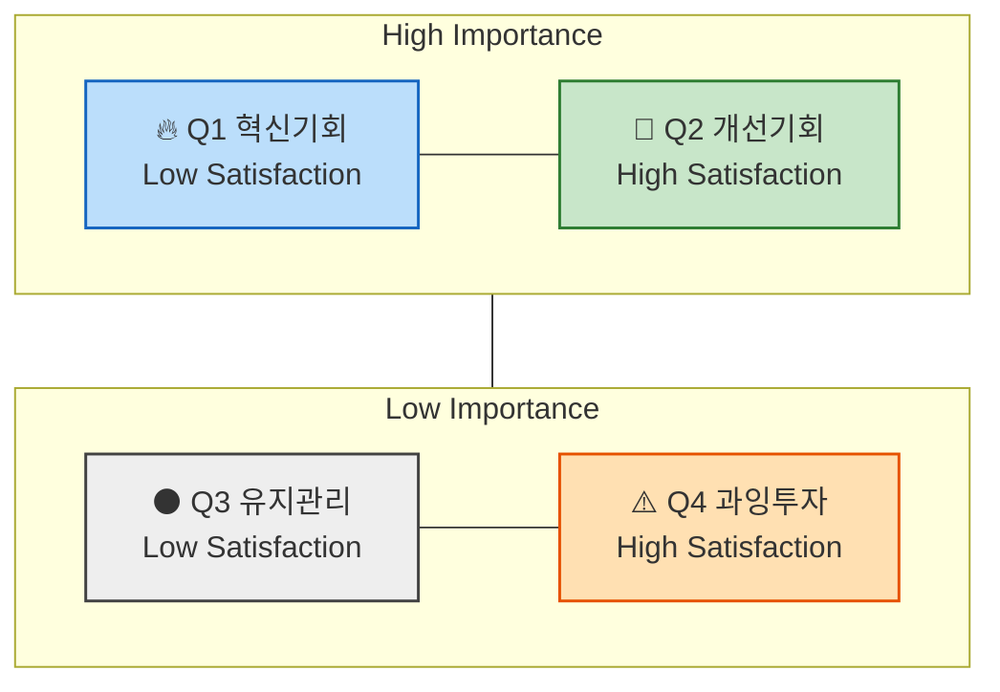
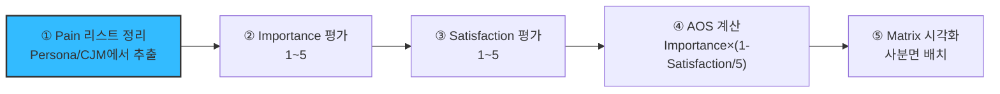
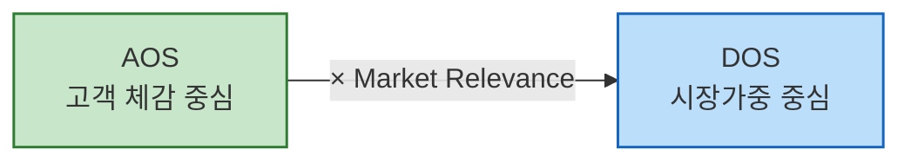

# 06 - 시장기회 분석 : 기회점수(OS) 기반 우선순위 판단

> 이 단계는 [05.persona-journey-map](../../05.persona-journey-map/1인가구한끼해결-페르소나여정/)에서 확정한 페르소나 스펙트럼([02](../../05.persona-journey-map/1인가구한끼해결-페르소나여정/02-페르소나스펙트럼.md))과 고객 여정지도([06번 종합판](../../05.persona-journey-map/1인가구한끼해결-페르소나여정/06-고객여정지도-종합판.md))를 이어받아, "어떤 Pain/Goal에 먼저 투자해야 하는가"를 정량적 숫자(시장 기회 점수)로 판단하는 단계다.

## 1. 기회점수(OS, Opportunity Score)와 조정형 기회점수(AOS, Adjusted Opportunity Score)

### 전통적 OS의 문제 — Importance가 두 번 반영된다

전통적 `기회점수(OS)`의 수식은 고객의 불만족 수준을 계산할 때 고객의 기대치(`중요도`)와 만족도 지표를 직접 사용한다. 이 경우 고객이 문제(Pain, Goal, Job)에 대해 가지고 있는 기대치(`중요도`)가 **두 번 반영**된다.

```
OS = Importance(기대치) + (Importance(기대치) - Satisfaction(만족도))(불만족도)
   = Importance × 2 - Satisfaction(만족도)
```

Importance가 두 번 반영되면 실제 시장감각을 왜곡하는 문제가 발생한다.

### 조정형 AOS — 비율 계산으로 개선

`조정형 기회점수(AOS)`는 고객의 불만족 수준을 고객의 기대치·중요도와 관계없는 방법으로, **비율 계산 형태**(`1 − Satisfaction/5`)로 먼저 도출한 뒤, 거기에 `Importance`를 곱해 **현실적 혁신기회 강도**를 산출한다.

```
AOS = Importance × (1 - Satisfaction(rate) / 5)
```

이 수식을 쓰면 실제 시장감각에 더 가까운 계산이 가능하다.

### AOS의 정의

| 항목 | 설명 |
| --- | --- |
| Importance | 고객에게 Pain/Goal이 얼마나 중요한가 (1~5점) |
| Satisfaction | 현재 이 Pain이 얼마나 잘 해결되고 있는가 (1~5점) |
| 1 − Satisfaction/5 | 충족되지 않은 영역(Unmet Need)의 비율 |
| AOS | "중요하지만 덜 해결된 문제"의 강도 |

### 점수 해석 예시

| Pain / Goal | Importance | Satisfaction | 1-Satisfaction(rate) | AOS | 해석 |
| --- | --- | --- | --- | --- | --- |
| 리포트 자동화의 한계 | 5 | 2(40%) | 0.6 | 5×(1−0.4)=3.0 | 명확한 혁신 기회 |
| AI 학습 피로감 | 3 | 2 | 0.6 | 3×(1−0.4)=1.8 | 부분적 개선 기회 |
| 데이터 공유 비효율 | 4 | 3(60%) | 0.4 | 4×(1−0.6)=1.6 | 유지관리 대상 |
| 신뢰 부족 | 2 | 4 | 0.2 | 2×(1−0.8)=0.4 | 저기회 영역 |

> 위 표는 강의 원본 예시(리포트 자동화 서비스 사례)다. 우리 프로젝트(한끼라우터)의 Pain List에 실제로 적용하는 것은 §3 워크플로우에서 별도로 수행한다.

### AOS 시각화 구조



- **사분면 형태로 시각화**: `X축` = Satisfaction(충족도), `Y축` = Importance(중요도)

### 사분면 해석 방법

| 사분면 | 조건 | 의미 | 전략 행동 |
| --- | --- | --- | --- |
| Q1 | High AOS | 혁신기회(High Importance + Low Satisfaction) | JTBD 인터뷰 대상, MVP 실험 우선 |
| Q2 | 중간 AOS | 개선기회 | 지속적 개선 필요 |
| Q3 | Low AOS | 유지/보완 | UX·마케팅 최적화 중심 |
| Q4 | 0 근처 | 과잉투자 위험 | 자원 분배 재검토 |

### [참고] 매트릭스에서 사분면 상하·좌우를 가르는 수치 기준점은 어디인가?

#### A. 점수 척도 기반 단순 기준점 수립 (최초 분석·설계를 위한 분석)

가장 단순하고 직관적인 방식. Likert 5점 척도(1~5)를 그대로 쓰고, 중간값 3.0을 중심선으로 삼는다.

| 축 | 기준점 | 의미 |
| --- | --- | --- |
| Satisfaction | 3.0 | 이 이상은 "대체로 만족" |
| Importance | 3.0 | 이 이상은 "대체로 중요" |
| AOS | 2.0~2.5 | 중요도·불만족의 평균 이상 |

**활용법**: 문제의식 및 솔루션의 유형에 따라 기준을 조정해도 괜찮다 — 예: "Importance가 4 이상인 Pain만 상단으로 올리자." 목표는 구조적 사고 훈련이며, 문제 해결을 구조화하는 데 초점을 둔다.

#### B. 기존 사업에서의 데이터 분포에 따라 수립

이미 사업 운영 중에 있고 여러 차례 도출된 점수 분포가 존재하는 경우, 평균값과 표준편차를 이용해 사분면을 데이터 기반으로 자동 구분할 수 있다.

| 항목 | 계산 | 해석 |
| --- | --- | --- |
| Importance 기준선 | 전체 Importance 평균(μ₁) | 평균 이상 → 상단 |
| Satisfaction 기준선 | 전체 Satisfaction 평균(μ₂) | 평균 이하 → 좌측 |
| AOS 기준선 | 전체 AOS 평균 + 0.5σ | 이 값 이상 → "기회 영역" |

**예시**: Importance 평균 = 3.6, Satisfaction 평균 = 2.9, AOS 평균 = 2.1 → Y축 기준(Importance) 3.6 / X축 기준(Satisfaction) 2.9 / 버블 경계(AOS) 2.1.

**해석 포인트**: "우리 사업의 실제 평가 분포"에 맞게 사분면이 형성되므로 페르소나나 산업별 편향을 줄일 수 있다.

> 이 프로젝트가 실제로 §3에서 적용한 방식은 A·B 어느 쪽도 아닌 **중앙값(median) 기준**이다 — [02-AOS매트릭스.md §2](./02-AOS매트릭스.md)에서 실제 32개 값의 중앙값(Importance 4.0·Satisfaction 3.0)을 직접 계산해 경계로 썼다. 평균 대신 중앙값을 쓴 이유는 이 프로젝트의 점수 분포가 정수 1~5에 몰려 있어(예: Importance=4가 12개) 평균보다 중앙값이 실제 데이터 밀집 구간을 더 정확히 반영하기 때문이다.

---

## 2. 평가 대상 정의 — 무엇을(재료로) 점수화하는가?

- **우리가 설계한 솔루션**에 대한 **페르소나 스펙트럼과 고객 여정지도**에 대하여
- **기존 솔루션 생태계** 하에서 **고객이 겪고 있는 Pain/Job 상황**을 평가한다.

| 분석 단계 | 평가 단위 = 고객 타깃 | 평가 대상 = Pain 정의 내용 |
| --- | --- | --- |
| 페르소나 단계 | 각 페르소나의 주요 Pain·Goal | "이 사람에게 가장 중요한 고통은 무엇인가?" |
| 고객 여정지도 | 여정 단계별 Pain Point / 개선기회 | "고객 여정 중 어디서 좌절이 가장 큰가?" |
| ~~JTBD 인터뷰 사전 단계~~ | ~~Job Statement 단위~~ | ~~"이 고객이 진보를 이루기 위해 수행하는 일(Job)은 무엇인가?"~~ |

> ✅ **앞선 분석 결과 중 무엇을 사용하는가?**
> - 페르소나가 도출되기 전, "문제정의"·"Segment" 단계의 Pain List를 사용하면 어떻게 될까?
> - 페르소나 스펙트럼 4가지(Core/Adjacent/Extreme/Non-user) 중 어떤 페르소나가 가진 Pain List를 사용해야 할까?
>
> 이 두 질문은 §3에서 우리 프로젝트의 실제 자료(어느 문서·어느 유형)를 고르는 판단으로 이어진다.

> 분석·기획 단계에서는 최대한 많은 **"유효한"** 문제들에 시장기회 점수를 매겨서 내림차순으로 정렬해 본다.

---

## 3. AOS 산출 5단계 워크플로우 (Step-by-Step)



| 단계 | 설명 | AI 지원 프롬프트 | 산출물 |
| --- | --- | --- | --- |
| ① Pain 리스트 정리 | Persona/CJM에서 Pain·Goal 정리 | "각 페르소나의 주요 Pain/Goal을 표로 정리해줘." | Pain List |
| ② Importance 평가 | 고객 입장에서 중요도 평가(1~5) | "각 Pain이 고객의 목표 달성에 얼마나 중요한지 1~5로 평가해줘." | Importance Table |
| ③ Satisfaction 평가 | 현재 충족 수준 평가(1~5) | "현재 사용 중인 대체 솔루션의 만족도를 1~5로 평가해줘." | Satisfaction Table |
| ④ AOS 계산 | AOS = Importance × (1 − Satisfaction/5) | "위 표에 AOS 계산식을 적용하고 결과를 내줘." | AOS Table |
| ⑤ Matrix 시각화 | (X: Satisfaction, Y: Importance, Bubble: AOS) | "AOS 기준으로 기회가 큰 항목 순으로 정렬하고, Matrix 사분면에 배치해줘." | (Adjusted) Opportunity Score Matrix |

> ⚠️ 이 5단계도 [05단계의 페르소나 생성 워크플로우](../../05.persona-journey-map/1인가구한끼해결-페르소나여정/00-방법론.md)와 마찬가지로 **인간용 순차 워크플로우**로 다룬다 — 한 번에 5단계를 전부 자동 실행하지 않고, 단계마다 산출물을 확인한 뒤 다음 단계를 지시한다.

---

## 4. AOS에서 시장 가중형 점수 DOS로 확장하기 — VC들이 실제로 사용하는 시장가중형 분석

AOS는 고객 한 명의 중요도를 반영한 지표이고, DOS는 **시장 규모와 맥락을 곱해 "발견된 기회(Discovered Opportunity Score)"를 산출**한다 — *기회 점수 = 고객 미충족 × 시장 파급력* (실제 VC·PM들이 쓰는 구조와 유사).

### AOS vs. DOS 비교

| 구분 | AOS | DOS |
| --- | --- | --- |
| 계산기준 | 고객 체감 중심 | 시장가중 중심 |
| 데이터 출처 | 페르소나, 인터뷰 | TAM/SAM, 산업 리서치 |
| 목적 | 혁신 아이디어 탐색 | 시장 확장성 검증 |
| 적용 시점 | 리서치 초기 | 비즈니스 모델 검증 |
| AI 활용 | 중요도·만족도 평가 | 시장 규모 가중치 계산 |

### DOS(Discovered Opportunity Simulation)의 개념

"고객의 미충족 × 시장 가치"의 교차점이 **진짜 기회 영역**이다.

```
DOS = (Importance - Satisfaction) × Market Relevance
```

- `Market Relevance`는 시장 파급력 — **TAM-SAM-SOM에 대해 해당 Pain이 갖는 상대적 비중(%)**을 사용하거나, 시장 성장률·채택난이도·확산성 등을 추가로 고려해 평가한다.
- 지금까지 수행한 시장분석 자료([04.tam-sam-som](../../04.tam-sam-som/1인가구한끼해결-7단계/))를 AI에 투입하면 "기회 강도 × 시장 확산성"을 손쉽고 정확하게 도출할 수 있다.

### DOS 계산식 적용 예시

| Pain | Importance | Satisfaction | TAM-SAM-SOM(%) | DOS |
| --- | --- | --- | --- | --- |
| 자동화 한계 | 5 | 2 | 0.8 | (5−2)×0.8 = 2.4 |
| AI 학습 피로 | 3 | 2 | 0.6 | (3−2)×0.6 = 0.6 |
| 신뢰 부족 | 2 | 4 | 0.7 | (2−4)×0.7 = -1.4 |

> 위 표도 강의 원본 예시다. `TAM-SAM-SOM(%)`은 "TAM-SAM-SOM 중 적정 모수에 대한 해당 Pain/Goal의 비중"을 뜻한다 — 우리 프로젝트에서는 [08-TAMSAMSOM단계별대응구조.md](../../04.tam-sam-som/1인가구한끼해결-7단계/08-TAMSAMSOM단계별대응구조.md)의 SAM(9.02조원)·SOM(3.1만 가구) 확정치를 분모로 쓸 수 있는지를 §3 실제 적용 때 판단한다.



---

## 5. DOS 시뮬레이션 프롬프트 템플릿

### AI 활용 "시장가중형 기회 분석" 프롬프트 예시

```markdown
# Context
나는 [산업/분야명] 시장에서 [타깃 페르소나/고객유형]을 대상으로
신규 서비스 기획을 진행 중이다.

# Task
아래 Pain/Goal 목록에 대해
각 항목별로 다음 항목을 평가하고 DOS 점수를 계산하라.

| Pain/Goal | Importance(1~5) | Satisfaction(1~5) | Market Relevance(0.1~1.0) | DOS |

# Rules
1. DOS = (Importance - Satisfaction) × Market Relevance
2. Market Relevance는 TAM-SAM-SOM(페르소나 또는 페인포인트가 포함되는 구체적 영역을 하나로 고정하여 분석 진행), 성장률, 채택난이도, 확산성 등을 고려해 평가하라.
3. 점수가 높을수록 혁신기회가 큼.
4. 결과를 DOS 내림차순으로 정렬하라.
5. 표의 마지막 열에 "기회 해석(Insight)" 항목을 추가해, 각 Pain이 가지는 의미를 설명하라.

# Output Format
| Pain/Goal | Importance | Satisfaction | Market Relevance | DOS | Insight |
```

### AI 평가 결과 예시 (강의 원본 — 인공지능 기반 보고서 자동화 서비스의 DOS 점수 도출)

| Pain/Goal | Imp | Sat | Market Rel | DOS | Insight |
| --- | --- | --- | --- | --- | --- |
| 리포트 자동화 한계 | 5 | 2 | 0.9 | 2.7 | SaaS 자동화 시장의 고성장 트렌드와 맞물림 |
| AI 학습 피로감 | 3 | 2 | 0.7 | 0.7 | 유저 피로 문제는 UX 개선 필요하지만 확산 제한적 |
| 신뢰 부족 | 2 | 4 | 0.8 | -1.6 | 기술 수용성 문제, 단기 개선 효과 낮음 |

---

## 6. 시장 기회의 크기에 대해 토론해 보기

> "AOS로는 혁신의 가능성을, DOS로는 시장의 현실성을 본다면, 두 지표가 충돌할 때 우리는 무엇을 우선해야 할까?"
>
> **`제품→고객` 적합성을 `제품→시장` 적합성, 즉 PMF(Product–Market Fit) 개념으로 확장하는 핵심 단계다.**

| AOS | DOS | 해석 | 전략 |
| --- | --- | --- | --- |
| 높다 | 높다 | **BEST CASE** | 고민할 것이 없음, 타게팅 시작 |
| 높다 | 낮다 | 고객은 고통스럽지만 시장은 작다 | 반복적으로 고객을 확보·유지하는 데 용이한 비즈니스 → Q2 타게팅 매력도/효과성 높음 |
| 낮다 | 높다 | 시장은 크지만 고객은 덜 고통스럽다 | 비즈니스 확장 차원에서 시장의 다이나믹한 변화를 전제로 고객 센티먼트 추적 관찰 가치 있음 → Q3 탐색적 고객분석 수행 가치 있음 |

---

## 다음 작업

| 단계 | 상태 |
| --- | --- |
| ① Pain 리스트 정리 | **완료** — [01-Pain리스트.md](./01-Pain리스트.md). §2의 두 질문에 대한 결정: 고객 여정지도(CJM)의 Pain Point를 자료로 쓰고, 스펙트럼 12명 전원(하나의 유형만 고르지 않음) 각자의 대표 Pain 3개(가능한 경우)를 뽑았다 |
| ②~⑤ Importance·Satisfaction·AOS·Matrix | **완료(한 번에 수행)** — [02-AOS매트릭스.md](./02-AOS매트릭스.md). 사분면 경계는 중앙값(Importance 4.0·Satisfaction 3.0) 기준 |
| DOS(§4~5, 시장가중 확장) | **완료** — [03-DOS매트릭스.md](./03-DOS매트릭스.md). Market Relevance는 Q4 프록시(30대 1인가구, 1.76조원·144.3만 가구)로 고정해 32개 전부 산정 |
