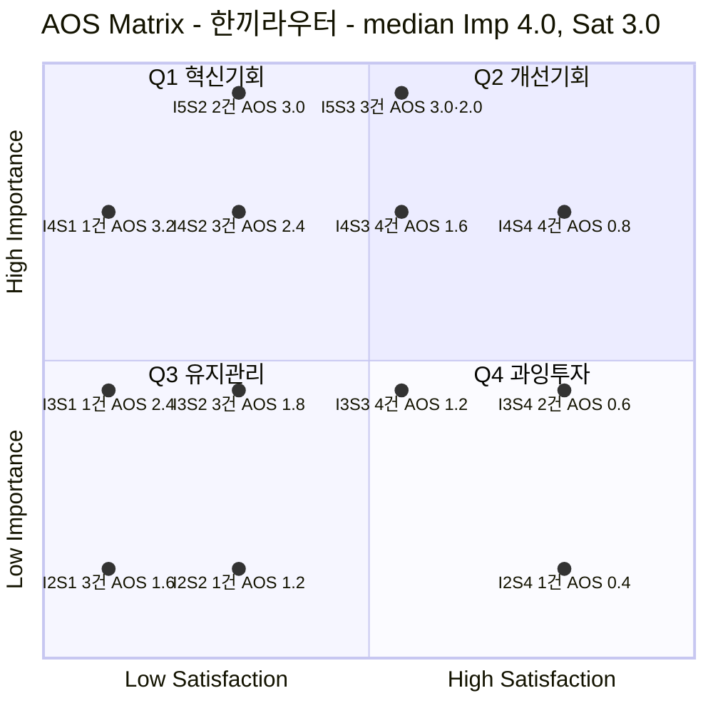

# 시장기회 분석 — 한끼라우터 (1인 가구 한 끼 해결 플랫폼)

> [방법론](./00-방법론.md) · 입력 [Pain 리스트 — 대표 Pain Point 32개](./01-Pain리스트.md) · 상위 [05.persona-journey-map 고객 여정지도](../../05.persona-journey-map/1인가구한끼해결-페르소나여정/06-고객여정지도-종합판.md)

> 📊 **산출.** 대표 Pain Point 32개에 Importance·Satisfaction을 매기고 **AOS = Importance × (1 − Satisfaction/5)**로 계산해 내림차순 정렬하고 사분면에 배치했다.
>
> ⚠️ **채점값은 전부 추정이다.** 인터뷰·설문이 없다. 근거 등급은 §6 참조.

---

## 0. 채점 규칙

### 두 지표의 앵커

| 점수 | **Importance** — 그 사람의 Goal 달성에 이 Pain 해소가 얼마나 중요한가 | **Satisfaction** — 지금 쓰는 **대체 솔루션**이 그 Goal을 얼마나 달성시켜 주는가 |
| :---: | --- | --- |
| **5** | 막히면 여정이 종료된다 | 대체 솔루션이 충분히 해결하고 있다 |
| **4** | 크게 지연·왜곡되고 상당수가 이탈한다 | 대체로 해결되며 약간 아쉬운 정도다 |
| **3** | 불편하지만 우회할 수 있다 | 절반쯤 해결된다 |
| **2** | 있으면 좋은 수준이다 | 거의 해결되지 않는다 |
| **1** | 거의 영향이 없다 | 전혀 해결되지 않는다 |

> 📌 **Satisfaction의 대상은 우리 서비스(한끼라우터)가 아니다.** 방법론 §2가 규정한 대로 *"기존 솔루션 생태계 하에서"* 매긴다. 즉 **지금 그 사람이 실제로 쓰고 있는 것**([02-페르소나스펙트럼.md](../../05.persona-journey-map/1인가구한끼해결-페르소나여정/02-페르소나스펙트럼.md)의 "대체 솔루션" — 배달앱 여러 개 비교, 재주문, 편의점 직접 방문, 전화 단골집, 직접 조리 등)이 `막히는 Goal`을 얼마나 채워 주는지를 본다. 대체 솔루션이 잘하고 있으면 우리에게는 기회가 아니다.

### 사분면 기준선 — 지정: 중앙값

방법론 §1 [참고] 절의 **중앙값 기준**을 적용한다(사용자 지정).

| 항목 | 계산 | **기준선** |
| --- | --- | :---: |
| **Importance 기준선** | 32개 값의 중앙값(16·17번째 값) | **4.0** |
| **Satisfaction 기준선** | 32개 값의 중앙값(16·17번째 값) | **3.0** |
| **AOS 기회 경계** | 참고용 — 방법론 B(평균+0.5σ) 계산 시 | **2.09** |

**경계 처리** — Importance **4.0 이상**이 상단, Satisfaction **3.0 이상**이 우측(High Satisfaction)이다. 5점 척도는 정수만 나오므로 실제로는 다음과 같이 갈린다.

| 축 | 상단 / 우측 | 하단 / 좌측 |
| --- | --- | --- |
| Importance (기준 4.0) | **4점·5점** (17개) | 2점·3점 (15개) |
| Satisfaction (기준 3.0) | **3점·4점** (18개) | 1점·2점 (14개) |

### 기준을 바꾸면 결과가 얼마나 달라지는가

| 기준 | 값 | Q1 혁신기회 | Q2 개선기회 | Q3 유지관리 | Q4 과잉투자 |
| --- | --- | :---: | :---: | :---: | :---: |
| A. 고정 3.0 | Imp 3.0 · Sat 3.0 | **10** | 17 | 4 | 1 |
| B. 평균 기반 | Imp 3.53 · Sat 2.63 | **6** | 11 | 8 | 7 |
| **적용 — 중앙값** | **Imp 4.0 · Sat 3.0** | **6** | 11 | 8 | 7 |

- **A(고정 3.0)** — Importance 최솟값이 2뿐이라 대부분(27개)이 상단에 몰린다. Q3·Q4가 거의 비어 상하 구분이 무의미해진다.
- **B(평균 기반)와 중앙값이 이번 데이터에서는 정확히 같은 결과를 낸다** — 평균(Imp 3.53·Sat 2.63)과 중앙값(Imp 4.0·Sat 3.0)이 둘 다 정수 척도의 같은 정수 간격(3↔4, 2↔3) 사이에 떨어지기 때문이다. 참고([①증명체계 사례 참고 문서](https://github.com/wild-mental/business-research-practice-2026-sesac/blob/main/06-opportunity-score/%EB%B6%84%EC%84%9D-03-%EC%8B%9D%EB%9F%89-%EC%9E%AC%EB%B6%84%EB%B0%B0-%ED%94%8C%EB%9E%AB%ED%8F%BC.md))에서는 A·중앙값이 같고 B가 갈렸는데, 이 데이터에서는 **B·중앙값이 같고 A가 갈린다** — 어느 지표든 실제로 계산해 보지 않으면 어느 둘이 일치할지 예측할 수 없다는 뜻이다.

> 📌 **세 기준 모두에서 Q1을 벗어나지 않는 6개** — P01 · P02 · P07 · P20 · P25 · P26 — **이것이 이 분석에서 가장 흔들리지 않는 결론이다.** A의 10개가 중앙값의 6개를 완전히 포함하며, 나머지 4개(P05·P09·P19·P21)는 중앙값 기준에서 Importance가 4에 못 미쳐 밀려난 것뿐이다.

---

## 1. ② Importance Table

| ID | 인물 | 막히는 Goal (요약) | **Imp** | 판정 근거 |
| --- | --- | --- | :---: | --- |
| P01 | C1 「퇴근을 예측할 수 없다」 | 매번 새로 결정하지 않고 즉시 확정 | **5** | 이 사람의 매일 반복되는 트리거 자체 — 해결 안 되면 매일 재발한다 |
| P02 | C1 「퇴근을 예측할 수 없다」 | 화면 정보를 믿고 바로 선택 | **4** | 신뢰가 없으면 비교에 시간이 더 들지만 우회(직접 확인)는 가능하다 |
| P03 | C1 「퇴근을 예측할 수 없다」 | 정확한 대기시간을 알고 배고픔 관리 | **3** | 불편하지만 결과적으로는 먹게 된다 |
| P04 | C2 「마감엔 다 필요없다」 | 방해받지 않으면서 끼니 챙기기 | **4** | 마감 중 반복되는 갈등이라 지연·이탈 유발 |
| P05 | C2 「마감엔 다 필요없다」 | 마감 중에도 예산 유지 | **3** | 넘겨도 여정 자체는 끝까지 간다 |
| P06 | C2 「마감엔 다 필요없다」 | 대기시간 낭비하지 않기 | **2** | 있으면 좋지만 핵심 결정에는 영향이 작다 |
| P07 | C3 「매일이 곧 지출이다」 | 지출이 쌓이는 걸 미리 인지·조절 | **4** | 이 페르소나의 정체성(Q2, 지출 피로)에 직접 닿아 있다 |
| P08 | C3 「매일이 곧 지출이다」 | 고민 없이 자동으로 저렴한 옵션 | **4** | 매일 반복되는 부담이라 지연·피로 누적 |
| P09 | C3 「매일이 곧 지출이다」 | 누적 지출을 눈으로 확인해 통제 | **3** | 불편하지만 지출은 어차피 발생, 우회 가능 |
| P10 | C4 「기운이 없는데 골라야 한다」 | 생각 없이 확신되는 답 하나 | **4** | 체력이 없는 상태에서의 결정 부담은 크다 |
| P11 | C4 「기운이 없는데 골라야 한다」 | 스케줄 따라 조건 자동 조정 | **3** | 불편하지만 전화 습관으로 우회 가능 |
| P12 | C4 「기운이 없는데 골라야 한다」 | 최소 노력으로 다음 추천 개선 | **2** | 있으면 좋은 수준의 개인화 요소 |
| P13 | C5 「둘 다 없다」 | 예산·시간 둘 다 만족하는 즉시 답 | **5** | 이 페르소나가 곧 한끼라우터의 핵심 타깃 정의(Q4) 그 자체 |
| P14 | C5 「둘 다 없다」 | 비교 없이 이미 걸러진 최선의 답 | **4** | 시간이 없다는 조건에서 비교 단계 자체가 부담 |
| P15 | C5 「둘 다 없다」 | 빠른 선택이 맞았다는 확신 | **2** | 사후 확인이라 결정 자체는 이미 끝난 뒤의 부가 요소 |
| P16 | A1 「1인분은 손해다」 | 최소주문금액 걱정 없이 탐색 시작 | **4** | 시작 전부터 실패를 예상하게 만드는 진입 장벽 |
| P17 | A1 「1인분은 손해다」 | 1인분 가능 옵션만 필터 | **4** | FR-04로 직접 대응 가능한, 반복적으로 겪는 문제 |
| P18 | A1 「1인분은 손해다」 | 적은 지출도 기록해 절약 체감 | **2** | 있으면 좋은 수준의 부가 기능 |
| P19 | A2 「또 그 메뉴다」 | 이번엔 다를 거라는 기대 | **3** | 불편하지만 밀키트 등으로 우회 가능 |
| P20 | A2 「또 그 메뉴다」 | 매번 다른 선택지를 추천 | **4** | 이 페르소나를 정의하는 문제(선택 다양성 결핍) 그 자체 |
| P21 | A2 「또 그 메뉴다」 | 새로움으로 재방문 유도 | **3** | 해결 안 돼도 다른 대안(밀키트)으로 이탈만 할 뿐 여정이 끊기진 않는다 |
| P22 | A3 「같이 살아도 혼자 먹는다」 | 내 가구 상황에도 맞는 서비스 확신 | **3** | 불편하지만 사용 자체를 막지는 않는다 |
| P23 | A3 「같이 살아도 혼자 먹는다」 | "오늘은 혼자" 쉽게 반영 | **3** | 매번 조율해야 하지만 우회(수동 입력) 가능 |
| P24 | A3 「같이 살아도 혼자 먹는다」 | 수령 후 나눔 과정 편하게 | **2** | 있으면 좋은 수준의 물리적 불편 |
| P25 | X1 「새벽엔 문 닫은 도시」 | 활동 시간대 이용 가능한 곳 미리 알기 | **5** | 이 사람의 여정 전체가 여기서 막힌다 — 존재론적 관문 |
| P26 | X1 「새벽엔 문 닫은 도시」 | 입력 전 커버리지 신뢰 | **4** | 신뢰가 없으면 시도 자체의 의욕이 크게 꺾인다 |
| P27 | X1 「새벽엔 문 닫은 도시」 | 결과 없어도 다음 행동 알기 | **5** | 안내가 없으면 여정이 그대로 종료된다 |
| P28 | X2 「지도 밖의 동네」 | 내 지역에서도 통할 신뢰 | **4** | 신뢰 부재가 시도 자체를 꺾는다 |
| P29 | X2 「지도 밖의 동네」 | 입력 전 가능 범위 미리 알기 | **4** | 알 수 없으면 매번 새로 실망하는 구조가 반복된다 |
| P30 | X2 「지도 밖의 동네」 | 포장이라도 명확히 안내 | **5** | 안내가 없으면 "비교"라는 앱의 핵심 기능 자체가 무의미해진다 |
| P31 | N1 「안 시켜도 괜찮다」 | 믿을 근거 있을 때만 판단 | **3** | 본인 가치관에는 중요하지만, 대체 수단(직접 조리)으로 이미 완전히 우회 중 |
| P32 | N2 「전화가 더 빠르다」 | 새로 배우지 않고도 빠르게 주문 | **3** | 본인에게는 중요하지만, 전화 주문으로 이미 완전히 우회 중 |

---

## 2. ③ Satisfaction Table

**지금 그 사람이 쓰고 있는 대체 솔루션**을 명시하고, 그것이 `막히는 Goal`을 얼마나 달성시켜 주는지 매겼다.

| ID | 현재 쓰는 대체 솔루션 | **Sat** | 판정 근거 |
| --- | --- | :---: | --- |
| P01 | 배달앱 3개를 번갈아 켜서 가격을 눈으로 비교 | **2** | 비교 행위 자체가 재결정을 반복시켜 오히려 목표와 반대로 작동 |
| P02 | 위와 동일(직접 눈으로 대조) | **2** | 신뢰를 얻긴 하지만 "그대로 믿고"가 아니라 "직접 검증해서"다 |
| P03 | 주요 배달앱의 실시간 배달원 위치추적 | **3** | 업계 표준 기능이라 어느 정도 해결되어 있다 |
| P04 | 최근 주문 목록에서 고민 없이 재주문 | **4** | 실제로 빠르고 편해 목표를 상당히 달성시킨다 |
| P05 | 위와 동일(재주문은 예산 통제와 무관) | **2** | 재주문은 속도만 해결하고 예산 관리 기능은 없다 |
| P06 | 대기 중 다른 작업(멀티태스킹) | **2** | 임시방편일 뿐 구조적 해결은 아니다 |
| P07 | 편의점 도시락으로 며칠 버티다 배달로 복귀 | **2** | 임시 전환이라 지출을 가시화·통제해 주지는 않는다 |
| P08 | 위와 동일(편의점 전환) | **3** | 전환 자체가 상대적으로 저렴해 절반쯤은 해결된다 |
| P09 | 없음 — 지출 확인 도구 부재 | **1** | 어떤 대체 수단에도 지출 시각화 기능이 없다 |
| P10 | 병원 근처 익숙한 가게 몇 곳을 번갈아 전화주문 | **4** | 습관화된 신뢰 관계라 저부담 확신을 충분히 준다 |
| P11 | 위와 동일(전화 습관) | **3** | 자동은 아니지만 익숙함으로 어느 정도 유연하게 대응된다 |
| P12 | 없음 — 전화 주문에는 피드백 경로가 없음 | **1** | 개선 반영 경로 자체가 존재하지 않는다 |
| P13 | 편의점에서 가장 싼 상품을 즉흥적으로 선택 | **3** | 실제로 빠르고 저렴해 절반 이상은 해결된다 |
| P14 | 위와 동일(즉흥 선택) | **3** | 즉흥 선택이 곧 "비교 없음" 상태를 만족시킨다 |
| P15 | 없음 — 선택 근거를 재확인할 수단 없음 | **1** | 산 뒤에는 되돌릴 방법이 없다 |
| P16 | 알바지 편의점 상품으로 직접 해결 | **4** | 근무지가 편의점이라 최소주문금액 문제가 원천적으로 없다 |
| P17 | 위와 동일 | **4** | 같은 이유로 1인분 문제도 실질적으로 해소된다 |
| P18 | 없음 — 별도 지출 기록 도구 부재 | **1** | 어떤 대체 수단에도 기록 기능이 없다 |
| P19 | 밀키트를 대량구매해 냉동보관 후 조리 | **2** | 한 번의 선택을 반복 소비하는 구조라 기대감을 주지 못한다 |
| P20 | 위와 동일(비축 밀키트) | **2** | 비축한 밀키트도 결국 반복적이라 다양성을 해결하지 못한다 |
| P21 | 위와 동일 | **2** | 다양성이 없으니 재방문 유인도 낮게 유지된다 |
| P22 | 한 명이 미리 2인분을 시켜 냉장보관 | **3** | 물리적 문제는 대응되나 "맞는 서비스"라는 확신까지는 못 준다 |
| P23 | 위와 동일 | **3** | 상황 반영은 습관적으로 가능하나 자동화되어 있지 않다 |
| P24 | 위와 동일(사전 소분·냉장) | **4** | 이 부분은 실질적으로 잘 해결되고 있다 |
| P25 | 퇴근 전 편의점에서 미리 사둔 상온 보관 식품 | **2** | 회피책일 뿐 "실제로 열려 있는 곳" 확인은 아니다 |
| P26 | 없음 — 커버리지 신뢰를 줄 도구 전혀 없음 | **1** | 야간 영업 정보 자체가 어디에도 없다 |
| P27 | 위와 동일(사전구매 습관) | **3** | 스스로 만든 습관이 대안 역할을 절반쯤 해낸다 |
| P28 | 포장 가능한 가까운 몇 곳만 기억해 반복 방문 | **3** | 개인이 축적한 지식이 신뢰를 절반쯤 대체한다 |
| P29 | 위와 동일(기억에 의존) | **3** | 같은 이유로 예측 가능성도 어느 정도 확보된다 |
| P30 | 위와 동일 | **3** | 익숙한 곳으로 실질적 대응은 되나 새 지역 탐색에는 무력하다 |
| P31 | 장보기 → 직접 조리 → 소분 보관 | **4** | 스스로 조리하므로 신뢰 문제를 원천적으로 차단한다 |
| P32 | 단골 식당 전화 주문, 안 되면 직접 방문 포장 | **4** | 전화 주문이 이미 목표(빠르고 쉬움)를 정확히 충족한다 |

---

## 3. ④ AOS Table — 내림차순

**AOS = Importance × (1 − Satisfaction / 5)**

`★` = AOS 기회 경계(**2.09**, 방법론 B 계산값) 이상. 사분면은 이번 프로젝트가 적용한 **중앙값 기준**(Imp 4.0 · Sat 3.0)이다.

| 순위 | ID | 인물 | Pain Point (요약) | Imp | Sat | **AOS** | 사분면 |
| :---: | --- | --- | --- | :---: | :---: | :---: | :---: |
| 1 | **P26** | X1 | 입력하는 동안에도 결과 없을 예감 (커버리지 신뢰 부재) | 4 | 1 | **3.2** ★ | 🔥 Q1 |
| 2 | **P01** | C1 | 매번 같은 고민이 반복된다 | 5 | 2 | **3.0** ★ | 🔥 Q1 |
| 2 | **P25** | X1 | 영업시간의 존재 자체가 벽이다 | 5 | 2 | **3.0** ★ | 🔥 Q1 |
| 2 | **P27** | X1 | 조건에 맞는 옵션이 0개면 여정이 끝난다 | 5 | 3 | **3.0** ★ | 💎 Q2 |
| 2 | **P30** | X2 | 선택지가 없어 "비교"가 무의미해진다 | 5 | 3 | **3.0** ★ | 💎 Q2 |
| 6 | **P02** | C1 | 갱신시각이 지난 정보에 대한 불신 | 4 | 2 | **2.4** ★ | 🔥 Q1 |
| 6 | **P07** | C3 | 방치될수록 누적 지출이 커진다 | 4 | 2 | **2.4** ★ | 🔥 Q1 |
| 6 | **P09** | C3 | 지출 누적을 확인 전까지 심각성을 못 느낀다 | 3 | 1 | **2.4** ★ | ⚫ Q3 |
| 6 | **P20** | A2 | 추천이 매번 비슷해 다양성이 해결 안 된다 | 4 | 2 | **2.4** ★ | 🔥 Q1 |
| 10 | **P13** | C5 | 예산·시간 동시압박, 기준을 못 잡는다 | 5 | 3 | **2.0** | 💎 Q2 |
| 11 | **P05** | C2 | 예산 초과를 알면서도 못 막는다 | 3 | 2 | **1.8** | ⚫ Q3 |
| 11 | **P19** | A2 | 시작부터 흥이 안 난다 | 3 | 2 | **1.8** | ⚫ Q3 |
| 11 | **P21** | A2 | 재방문 유인이 약하다 | 3 | 2 | **1.8** | ⚫ Q3 |
| 14 | **P08** | C3 | 최저가를 매번 찾아야 하는 부담 | 4 | 3 | **1.6** | 💎 Q2 |
| 14 | **P12** | C4 | 피드백 남길 에너지가 없다 | 2 | 1 | **1.6** | ⚫ Q3 |
| 14 | **P14** | C5 | 상세 비교를 사실상 못 한다 | 4 | 3 | **1.6** | 💎 Q2 |
| 14 | **P15** | C5 | 선택이 맞았는지 확신이 남지 않는다 | 2 | 1 | **1.6** | ⚫ Q3 |
| 14 | **P18** | A1 | 지출 기록 기능이 없다 | 2 | 1 | **1.6** | ⚫ Q3 |
| 14 | **P28** | X2 | 처음부터 기대치가 낮다 | 4 | 3 | **1.6** | 💎 Q2 |
| 14 | **P29** | X2 | 입력해도 기대하지 않는다 | 4 | 3 | **1.6** | 💎 Q2 |
| 21 | **P03** | C1 | ETA 오차가 신뢰를 깎는다 | 3 | 3 | **1.2** | ⚠️ Q4 |
| 21 | **P06** | C2 | 대기시간이 심리적으로 아깝다 | 2 | 2 | **1.2** | ⚫ Q3 |
| 21 | **P11** | C4 | 조건이 스케줄에 안 맞는다 | 3 | 3 | **1.2** | ⚠️ Q4 |
| 21 | **P22** | A3 | 이 앱이 나를 위한 게 맞는지 헷갈린다 | 3 | 3 | **1.2** | ⚠️ Q4 |
| 21 | **P23** | A3 | 1인가구 전제 흐름이 안 맞는다 | 3 | 3 | **1.2** | ⚠️ Q4 |
| 26 | **P04** | C2 | 마감과 식사 결정이 겹친다 | 4 | 4 | **0.8** | 💎 Q2 |
| 26 | **P10** | C4 | 지친 상태에서 결정을 요구받는다 | 4 | 4 | **0.8** | 💎 Q2 |
| 26 | **P16** | A1 | 시작 전부터 실패를 예상한다 | 4 | 4 | **0.8** | 💎 Q2 |
| 26 | **P17** | A1 | 미충족 옵션이 섞여 확인이 낭비된다 | 4 | 4 | **0.8** | 💎 Q2 |
| 30 | **P31** | N1 | UX 개선으로도 애초에 앱을 안 연다 | 3 | 4 | **0.6** | ⚠️ Q4 |
| 30 | **P32** | N2 | 앱이라는 형식 자체가 진입장벽이다 | 3 | 4 | **0.6** | ⚠️ Q4 |
| 32 | **P24** | A3 | 몫을 매번 다시 나눠야 한다 | 2 | 4 | **0.4** | ⚠️ Q4 |

> ⚠️ **순위와 사분면이 어긋나는 자리가 하나 있다.** 6위인 **P09(AOS 2.4)**는 AOS 기회 경계(2.09)를 넘어 `★`를 받았지만 사분면은 **Q3 유지관리**다. Importance가 3점이라 기준선 4.0에 미달했기 때문이다.
>
> **이럴 때는 AOS 값을 따른다.** 사분면은 두 축을 각각 이분한 요약이고, AOS는 두 축을 곱해 강도를 직접 잰 값이다. **P09는 6번째로 큰 기회이며 '유지관리'로 다룰 항목이 아니다.**
>
> 또한 **P27·P30(둘 다 AOS 3.0, 공동 2위)이 사분면상 Q2에 있다**는 점도 눈여겨봐야 한다 — Satisfaction이 3점(자가 개발한 우회 습관)이라 "High Satisfaction" 쪽으로 분류됐을 뿐, 실제로는 X1·X2의 여정이 구조적으로 종료되는 지점이다.

---

## 4. ⑤ Matrix — 사분면 배치

### 셀 매트릭스 (행 = Importance, 열 = Satisfaction)

기준선: **Importance 4.0 · Satisfaction 3.0**(중앙값). `★`는 AOS 기회 경계 **2.09** 이상.

| Imp \ Sat | **1** | **2** | ┃ | **3** | **4** |
| :---: | --- | --- | :---: | --- | --- |
| **5** | — | 🔥 ★ P01 · P25 *AOS 3.0* | ┃ | 💎 ★ P27 · P30 *AOS 3.0* 💎 P13 *AOS 2.0* | — |
| ━━ | ━━ | ━━ | ╋ | ━━ | ━━ |
| **4** | 🔥 ★ P26 *AOS 3.2* | 🔥 ★ P02 · P07 · P20 *AOS 2.4* | ┃ | 💎 P08 · P14 · P28 · P29 *AOS 1.6* | 💎 P04 · P10 · P16 · P17 *AOS 0.8* |
| **3** | ⚫ ★ P09 *AOS 2.4* | ⚫ P05 · P19 · P21 *AOS 1.8* | ┃ | ⚠️ P03 · P11 · P22 · P23 *AOS 1.2* | ⚠️ P31 · P32 *AOS 0.6* |
| **2** | ⚫ P12 · P15 · P18 *AOS 1.6* | ⚫ P06 *AOS 1.2* | ┃ | — | ⚠️ P24 *AOS 0.4* |

| 기호 | 사분면 | 조건 | 개수 |
| :---: | --- | --- | :---: |
| 🔥 | **Q1 혁신기회** | Imp ≥ 4 + Sat ≤ 2 | **6** |
| 💎 | **Q2 개선기회** | Imp ≥ 4 + Sat ≥ 3 | **11** |
| ⚫ | **Q3 유지관리** | Imp ≤ 3 + Sat ≤ 2 | **8** |
| ⚠️ | **Q4 과잉투자** | Imp ≤ 3 + Sat ≥ 3 | **7** |
| ★ | **AOS 기회 영역** | AOS ≥ 2.09 *(사분면과 별개 판정)* | **9** |

### 버블 매트릭스

> 🖊️ *점은 개별 Pain이 아니라 **동일 좌표에 겹치는 항목을 묶은 셀**이다(32개 중 다수가 좌표를 공유한다). 축 간격은 판독을 위해 조정했으며 정확한 값은 §3~4 표에 있다. `I5S2` = Importance 5 · Satisfaction 2.*

---

## 5. 해석

### 5-1. 최상위권 — "야간·지역 커버리지"가 대체 솔루션이 아예 없는 자리

AOS 최상위 3점대에 오른 다섯(P26·P01·P25·P27·P30) 중 **셋(P25·P26·P27)이 X1 한 명**에서, **하나(P30)가 X2**에서 나왔다. 이 넷의 공통점은 Satisfaction 1~3점 — 지금 그 일을 해 주는 것이 시장에 거의 없다.

| ID | 무엇이 없는가 |
| --- | --- |
| **P26** | 야간 시간대의 **영업 여부를 미리 알려주는** 데이터·도구가 어디에도 없다 |
| **P25·P27** | 결과가 없을 때 **"다음엔 뭘 해야 하는지"** 안내하는 서비스가 없다 |
| **P30** | 배달이 안 되는 지역에서 **"포장이라도 되는 곳"**을 명확히 걸러 주는 도구가 없다 |

> 📌 **넷 다 '더 잘 추천하는 것'이 아니라 '아무도 안 하는 것'이다.** 기존 배달앱과 같은 추천을 더 잘해서 이기는 그림이 아니라, **"조건에 안 맞는 지역·시간대"라는 빈 칸을 차지하는 그림**이다. [04-고객여정지도-수령준비단계.md §7](../../05.persona-journey-map/1인가구한끼해결-페르소나여정/04-고객여정지도-수령준비단계.md)의 개선우선순위 1위와 정확히 같은 결론에 AOS 계산이 독립적으로 도달했다.

### 5-2. Q2 11개 — 잘해도 이기지 못하는 영역

Q2(High Importance + High Satisfaction)에는 **중요하지만 기존 대체 솔루션이 이미 절반 이상 해결하는** 항목이 모였다. 재주문 편의(P04), 단골 전화주문의 확신(P10), 알바 근무지 편의점의 MOQ 회피(P16·P17)가 여기 있다.

> ⚠️ **AOS가 낮다고 해서 안 만들어도 된다는 뜻이 아니다.** 이들은 **위생 요인**이다 — 갖춰도 차별화되지 않지만, 기존 대체 솔루션보다 못하면 그 자리에서 탈락한다. **AOS는 "무엇으로 이길 것인가"를 알려주지 "무엇을 안 만들어도 되는가"를 알려주지 않는다.**
>
> 📌 **P27·P30처럼 AOS 최상위권인데 Q2에 앉은 항목도 있다** — §3의 주석대로, 이건 대체 솔루션이 실제로 좋아서가 아니라 "자가 개발한 우회 습관"이 통계적으로 중간값을 넘겼을 뿐이다. Q2를 "위생 요인 칸"으로만 읽으면 X1·X2의 구조적 이탈을 놓친다 — **AOS 순위를 항상 함께 봐야 한다.**

### 5-3. Q3 8개 — 이름을 그대로 믿으면 안 되는 칸

Low Importance + Low Satisfaction 칸에 여덜이 들어갔다. 그런데 이 중 **P09(AOS 2.4)는 전체 6위**로, Q1의 하위권 항목들과 AOS가 동일하다.

| ID | AOS | 사분면 | 실제 성격 |
| --- | :---: | :---: | --- |
| P09 | **2.4** ★ | Q3 | 대체 솔루션이 **전혀 없는**(Sat 1) 영역. Importance가 3이라 이름만 유지관리다 |
| P05·P19·P21 | **1.8** | Q3 | AOS 기회 경계(2.09) 바로 아래. 경계값이 조금만 움직여도 ★가 붙는다 |

> ⚠️ **Q3에 떨어진 이유는 중요도가 낮아서가 아니라 Importance가 4점 이상이 아니어서다.** 중앙값 4.0이 3과 4 사이를 자르기 때문에 3점 항목은 무조건 하단으로 간다. **이 칸의 이름을 "유지관리"로 읽고 후순위로 넘기면 6번째로 큰 기회(P09, C3의 "지출 누적 확인")를 버리게 된다.**

### 5-4. Non-user(N1·N2) — 채점이 정확히 작동한 사례

P31·P32가 하위권(0.6)이다. 이 두 사람의 Goal은 각각 *"믿을 근거 있을 때만 판단"*, *"새로 배우지 않고도 빠르게"*이고, 지금 그 Goal은 **대체 솔루션(직접 조리·전화 주문)으로 이미 잘 달성되고 있다**(Satisfaction 4).

> 📌 **채점이 정확히 작동했다.** 방법론대로 "그 사람에게" 매기면 이 두 사람에 대한 제품 기회는 낮게 나온다. 이는 마케팅·개발 자원을 여기에 쓰지 말라는 판정이며, [06-고객여정지도-종합판.md §5](../../05.persona-journey-map/1인가구한끼해결-페르소나여정/06-고객여정지도-종합판.md)가 이미 "①(Trigger)은 앱 밖의 심리이고 Non-user는 애초에 여기서 갈라진다"고 한 것과 정확히 일치한다.
>
> 다만 두 사람의 Importance는 여전히 3점(0은 아님)이다 — 완전히 무의미하지는 않다는 뜻이며, [01-Pain리스트.md 해설](./01-Pain리스트.md)이 이미 짚었듯 **이들을 여는 길은 제품 기능이 아니라 신뢰 확보·온보딩 단순화라는 제품 밖의 과제**다.

### 5-5. 수혜형 분리 — 이번 데이터에는 해당 없음

참고한 [식량 재분배 플랫폼 사례](https://github.com/wild-mental/business-research-practice-2026-sesac/blob/main/06-opportunity-score/%EB%B6%84%EC%84%9D-03-%EC%8B%9D%EB%9F%89-%EC%9E%AC%EB%B6%84%EB%B0%B0-%ED%94%8C%EB%9E%AB%ED%8F%BC.md)는 "돈을 내지 않는 수혜자"(위기 가구)를 목록에서 분리해야 했다. **한끼라우터에는 이 구분이 적용되지 않는다** — [07단계 SRS §6](../../04.tam-sam-som/1인가구한끼해결-7단계/07-솔루션구체화-SRS.md)이 이미 밝힌 대로 이 서비스는 아직 수익모델(수수료/구독/광고)을 확정하지 않아 **12명 중 누구도 앱에 직접 돈을 내지 않는다.** 그래서 이번 32개는 모두 "같은 층위의 고객"으로 다룰 수 있으며 별도 분리가 필요 없다.

### 5-6. 기능 단위로 환원 — AOS 2.0 이상 9개

개별 Pain 9개를 처방이 같은 것끼리 묶으면 **네 덩어리**가 된다.

| 기능 | 포함 Pain | 항목 수 | **AOS 합** |
| --- | --- | :---: | :---: |
| **① 가능 여부 사전 확인** — 야간 영업·배달 커버리지·결과 0건 대안 안내 | P25 · P26 · P27 · P30 | 4 | **12.2** |
| **② 즉시 결정 지원** — 반복 결정 없이 확정, 예산·시간 동시 만족 | P01 · P13 | 2 | **5.0** |
| **③ 지출 가시화** — 방치되는 지출 인지·확인 | P07 · P09 | 2 | **4.8** |
| **④ 정보 신뢰성 표시** — 갱신시각·출처 강조 | P02 | 1 | **2.4** |
| *(참고)* **다양성** — 반복 추천 문제 | P20 | 1 | **2.4** |

> 📌 **"가능 여부 사전 확인"이 12.2로 2위(5.0)의 두 배 이상이다.** X1·X2라는 서로 다른 두 극단 사용자가 서로 다른 이유(야간 영업 / 배달 커버리지)로 **같은 종류의 기능 하나**를 요구한다 — *조건에 안 맞을 때 즉시, 명확하게 알려주는 것.* 페르소나 스펙트럼([02](../../05.persona-journey-map/1인가구한끼해결-페르소나여정/02-페르소나스펙트럼.md)) · 고객 여정지도([04](../../05.persona-journey-map/1인가구한끼해결-페르소나여정/04-고객여정지도-수령준비단계.md)) · 기회점수(이 문서) 세 경로가 전부 같은 결론에 도달했다.
>
> ⚠️ **다만 그 기능의 원천 데이터를 한끼라우터가 소유하지 않는다.** 야간 영업 여부·배달 커버리지는 가맹점·배달 플랫폼 쪽 데이터이며, [07단계 SRS §9](../../04.tam-sam-som/1인가구한끼해결-7단계/07-솔루션구체화-SRS.md)가 이미 지적한 대로 이런 실시간 데이터를 범용으로 가져올 공개 API는 확인되지 않았다. **AOS 1위 기능의 구현 조건이 UI 개발이 아니라 데이터 확보(제휴 또는 수동 큐레이션)**라는 뜻이다.

---

## 6. 근거 등급

| 구성 요소 | 등급 | 비고 |
| --- | --- | --- |
| AOS 계산식과 사분면 기준선(중앙값) | **(확인)** | 방법론 §1의 정의와 사용자 지정 기준 |
| Satisfaction 항목의 **대체 솔루션 존재·성격** | **(추정)** | [02-페르소나스펙트럼.md](../../05.persona-journey-map/1인가구한끼해결-페르소나여정/02-페르소나스펙트럼.md)에 이미 기록된 대체 솔루션에서 판단. 실제 충족도는 미검증 |
| **Importance 32개 전부** | **(가정)** | 인터뷰·설문 없음. 고객 여정지도의 병목 판정에서 도출 |
| **Satisfaction 32개 전부** | **(가정)** | 대체 솔루션의 실제 충족도를 측정한 것이 아니다 |
| 사분면 배치와 순위 | **(가정)** | 위 두 값의 산물이므로 같은 등급 |

> ⚠️ **AOS 순위는 "무엇을 먼저 만들지"가 아니라 "무엇을 먼저 검증할지"의 순서다.** 채점값이 전부 가정이므로, 상위 항목은 확신의 목록이 아니라 검증 대상의 목록이다.
>
> **가장 흔들리기 쉬운 값은 Satisfaction 1점 항목(P09·P12·P15·P18·P26)이다.** "대체 솔루션이 없다"는 판단은 조사 범위가 좁으면 쉽게 뒤집힌다 — 특히 P26(야간 영업 정보)은 지역 커뮤니티 앱·지도 서비스 리뷰 등에 부분적으로 존재할 가능성이 있어 최우선 재조사 대상이다.

---

## 7. 다음 단계

### 7-1. 이 챕터에서 바로 이어지는 작업

| 순위 | 할 일 | 대상 | 이유 | 산출물 |
| :---: | --- | --- | --- | --- |
| **1** | **대체재 재조사** | Satisfaction 1점 5개 — P09·P12·P15·P18·P26 | "대체 솔루션이 없다"는 판단에 상위 순위 다수가 걸려 있다 | 경쟁·대체재 대조표 |
| **2** | **야간 영업·배달 커버리지 데이터 확보 가능성 확인** | 가맹점·배달 플랫폼 제휴 또는 수동 큐레이션 | AOS 1위 기능(합 12.2)의 선행 조건이 UI가 아니라 **데이터**다 | 데이터 소스 조사 결과 |
| **3** | **최소 요건 목록 작성** | Q2 11개 중 위생 요인(P04·P10·P16·P17 등) | 차별화 항목이 아니라 **탈락 방지 항목**으로 별도 관리 | 최소 요건 체크리스트 |
| **4** | **채점 재실시** | 1·2의 결과 반영 | 지금 값은 전부 인터뷰 없는 추정이다 | AOS Table v2 |

### 7-2. 다음 인터뷰·검증으로 넘기는 것

방법론 §1은 **Q1을 "JTBD 인터뷰 대상"**으로 지정한다. 다만 §5-3에서 확인한 대로 중앙값 기준에서는 **Q1(6개)만으로는 부족하고 ★ 표시(AOS ≥ 2.09) 9개**를 함께 넘겨야 한다.

| 인터뷰 대상 인물 | 넘기는 항목 | 파고들 질문 |
| --- | --- | --- |
| **C1** 「퇴근을 예측할 수 없다」 | P01·P02(반복 결정·정보 신뢰) | 정보를 매번 직접 비교해야 믿을 수 있다면, 이 사람이 진짜로 사려는 것은 '한 끼 정보'가 아니라 **'다시 고민하지 않아도 되는 상태'**인가? |
| **C3** 「매일이 곧 지출이다」 | P07·P09(지출 방치·확인) | 매일 반복되는 지출을 인지하지 못하는 게 문제라면, 필요한 건 '더 싼 추천'이 아니라 **'지출을 보게 만드는 장치'**가 아닌가? |
| **A2** 「또 그 메뉴다」 | P20(다양성) | 다양성 부족이 재방문을 막는다면, 이 사람이 고용하려는 일은 '새 메뉴'가 아니라 **'고민 없이도 질리지 않는 상태'**를 사는 것 아닌가? |
| **X1** 「새벽엔 문 닫은 도시」 | P25·P26·P27(존재 확인·신뢰·대안 없음) | 야간에 옵션이 없다는 걸 미리 알기만 해도 충분한가, 아니면 앱이 **대안(사전구매 등)까지 제안**해야 하는가? |
| **X2** 「지도 밖의 동네」 | P30(선택지 없음) | 배달 불가 지역에서 비교가 무의미해진다면, 필요한 건 비교 도구가 아니라 **'내 동네에서 되는 것 목록'** 자체 아닌가? |

> ⚠️ **다섯 중 X1·X2는 [04번 문서](../../05.persona-journey-map/1인가구한끼해결-페르소나여정/04-고객여정지도-수령준비단계.md)에서 이미 "이탈 지도"로 규정된 인물이다.** 대표 4종(C1·A1·X1·N1)만 인터뷰하면 AOS 상위권 절반(C3·A2·X2 관련 4건)을 검증하지 못한다 — **기회점수가 대표 선별을 한 번 더 좁힌다.**

### 7-3. 이 챕터 밖으로 넘기는 것

| 넘길 곳 | 항목 | 사유 |
| --- | --- | --- |
| **데이터 확보 트랙** | P25·P26·P27·P30(가능 여부 사전 확인) | 제품 개발로 풀리지 않는다. 제휴·데이터 큐레이션의 문제 |
| **신뢰·온보딩 트랙** | P31·P32(N1·N2) | [01번 문서 해설](./01-Pain리스트.md)이 이미 밝힌 대로 제품 밖의 과제 |
| **UX 최적화(후순위)** | Q3의 지출기록·피드백류(P12·P15·P18) | Importance가 낮아 부가 기능 수준으로 충분 |

### 7-4. 커리큘럼 상의 다음 챕터

**→ 07 JTBD(Jobs-To-Be-Done) 분석.** 7-2의 다섯 인물과 그 질문을 입력으로 받는다. 이 챕터가 *"어느 문제가 큰가"*에 답했다면, 다음 챕터는 *"그 문제 뒤에서 고객이 고용하려는 일은 무엇인가"*에 답한다 — 아직 이 리포지토리에 07 챕터 폴더는 없으므로, 이어서 만들지는 별도 지시로 결정한다.
