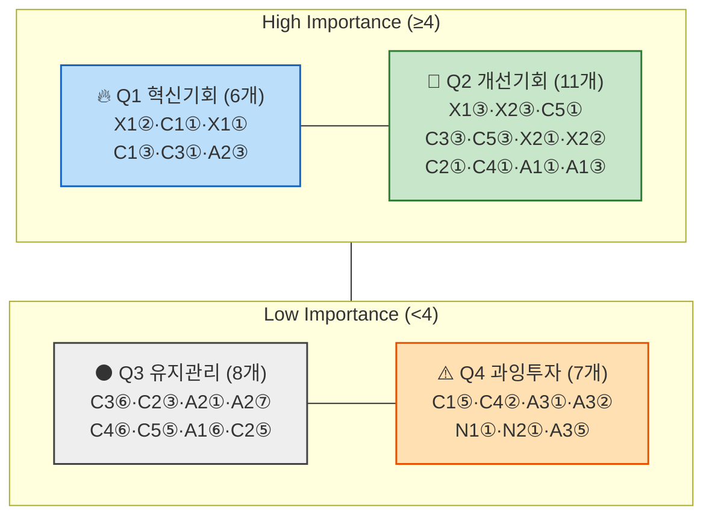

# AOS 매트릭스 — Importance·Satisfaction·AOS 산출 및 사분면 배치

> 입력: [01-Pain리스트.md](./01-Pain리스트.md)(12명·32개 Pain Point + Goal) · 방법론 [00-방법론.md §1·§3](./00-방법론.md)
>
> §3 워크플로우의 **②Importance평가 → ③Satisfaction평가 → ④AOS계산 → ⑤Matrix시각화**를 한 번에 수행한 결과다. 사분면 경계는 지시에 따라 **Importance·Satisfaction 각각의 중앙값**을 사용한다(척도 중간값 3.0이 아니라 실제 32개 값의 중앙값).

## 0. 평가 기준

- **Importance(1~5)**: [01번 문서](./01-Pain리스트.md)에서 추론한 "이 Pain이 가로막는 구체적 Goal"이 그 사람의 전체 Goal(Job)에 얼마나 중심적인가.
- **Satisfaction(1~5)**: 그 구체적 Goal이 **지금(대체 솔루션 포함)** 얼마나 잘 채워지고 있는가. 근거는 [02-페르소나스펙트럼.md](../../05.persona-journey-map/1인가구한끼해결-페르소나여정/02-페르소나스펙트럼.md)의 "대체 솔루션" 칸이다 — 앱이 아직 없다는 이유로 전부 낮게 매기지 않는다. 대체 솔루션이 그 좁은 Goal을 실제로 잘 채워주고 있다면 Satisfaction은 높다(예: N1의 "직접 조리"는 그의 신뢰 Goal을 완전히 충족한다).
- 이 기준 때문에 Non-user(N1·N2)와 Extreme 일부의 Satisfaction이 예상보다 높게 나온다 — 이것이 실제로 §6("AOS는 높은데 DOS·전환 가능성은 낮을 수 있다")의 핵심 논점과 맞닿아 있다.

---

## 1. Importance · Satisfaction · AOS 통합표 (AOS 내림차순)

| 순위 | 코드 | 단계 | Pain Point | Imp. | Sat. (근거) | AOS | 사분면 |
| --- | --- | --- | --- | --- | --- | --- | --- |
| 1 | X1 | ② | 입력하는 동안에도 이미 결과가 없을 거란 예감을 안고 있다 | 4 | 1 (커버리지 신뢰를 줄 도구가 전혀 없음) | **3.2** | Q1 |
| 2 | C1 | ① | 매번 같은 고민이 반복된다 | 5 | 2 (앱 전환 비교가 오히려 재결정을 반복시킴) | **3.0** | Q1 |
| 2 | X1 | ① | 시간이 아니라 영업시간의 존재 자체가 벽이다 | 5 | 2 (사전구매는 회피책일 뿐 실제 확인은 아님) | **3.0** | Q1 |
| 2 | X1 | ③ | 조건에 맞는 옵션이 0개면 여정이 그대로 끝난다 | 5 | 3 (스스로 만든 '사전구매' 습관이 대안 역할) | **3.0** | Q2 |
| 2 | X2 | ③ | 선택지가 사실상 없어 "비교"라는 단계 자체가 무의미해진다 | 5 | 3 (익숙한 곳 몇 곳으로 실질 대응 중) | **3.0** | Q2 |
| 6 | C1 | ③ | 갱신시각이 지난 정보에 대한 불신 | 4 | 2 (직접 비교해야 신뢰 확보, 자동으로는 안 됨) | **2.4** | Q1 |
| 6 | C3 | ① | 문제가 급하지 않아 방치되고, 방치될수록 누적 지출이 커진다 | 4 | 2 (임시 전환일 뿐 지출 가시화는 안 됨) | **2.4** | Q1 |
| 6 | C3 | ⑥ | 매 끼니 지출이 누적되는 걸 눈으로 확인하기 전까지는 심각성을 못 느낀다 | 3 | 1 (지출 확인 도구 전혀 없음) | **2.4** | Q3 |
| 6 | A2 | ③ | 추천이 매번 비슷해 다양성 결핍이 해결되지 않는다 | 4 | 2 (비축 밀키트도 결국 반복적) | **2.4** | Q1 |
| 10 | C5 | ① | 예산과 시간이 동시에 바닥나 어떤 기준으로도 여유가 없다 | 5 | 3 (즉흥 편의점 선택이 실제로 빠르고 쌈) | **2.0** | Q2 |
| 11 | C2 | ③ | 급할 때일수록 예산을 넘기는 선택을 하게 되고 그걸 알면서도 못 막는다 | 3 | 2 (예산 통제 장치 없음) | **1.8** | Q3 |
| 11 | A2 | ① | 매번 비슷한 선택으로 귀결될 걸 알고 시작부터 흥이 안 난다 | 3 | 2 (밀키트 비축이 오히려 다양성을 저해) | **1.8** | Q3 |
| 11 | A2 | ⑦ | 다양성 문제가 해결 안되면 재방문 유인이 약하다 | 3 | 2 (다양성 미해결로 재사용 동기 약함) | **1.8** | Q3 |
| 14 | C3 | ③ | 매번 최저가를 찾아야 한다는 부담이 누적 피로로 쌓인다 | 4 | 3 (편의점 전환으로 어느 정도 저렴함 확보) | **1.6** | Q2 |
| 14 | C4 | ⑥ | 피드백을 남길 에너지가 없어 데이터가 거의 수집되지 않는다 | 2 | 1 (피드백 경로 자체가 없음) | **1.6** | Q3 |
| 14 | C5 | ③ | 빠르게 결정해야 해서 상세 비교를 사실상 못 한다 | 4 | 3 (즉흥 선택이 곧 무비교 상태를 만족) | **1.6** | Q2 |
| 14 | C5 | ⑤ | 즉흥적으로 고른 선택이 실제로 괜찮을지에 대한 걱정이 가열하는 동안 남는다 | 2 | 1 (선택 근거 재확인 수단 없음) | **1.6** | Q3 |
| 14 | A1 | ⑥ | 지출을 기록하고 싶은데 그 기능이 없다 | 2 | 1 (지출 기록 도구 없음) | **1.6** | Q3 |
| 14 | X2 | ① | 도시 기준으로 설계된 서비스라 처음부터 기대치가 낮다 | 4 | 3 (기억해둔 몇 곳이 나름의 신뢰 기반이 됨) | **1.6** | Q2 |
| 14 | X2 | ② | 이미 여러 번 실망한 경험이 있어 입력하면서도 기대하지 않는다 | 4 | 3 (같은 이유로 어느 정도 예측 가능) | **1.6** | Q2 |
| 21 | C1 | ⑤ | 표시 ETA와 실제 도착시간의 차이가 클수록 신뢰가 깎인다 | 3 | 3 (배달앱들이 실시간 추적은 이미 제공) | **1.2** | Q4 |
| 21 | C2 | ⑤ | 마감 중 대기시간은 일반 대기보다 심리적 비용이 더 크다 | 2 | 2 (대기시간 활용 수단 없음) | **1.2** | Q3 |
| 21 | C4 | ② | 근무 스케줄이 불규칙해 미리 저장된 조건이 잘 안 맞는다 | 3 | 3 (전화 습관이 스케줄 변화에 어느 정도 유연) | **1.2** | Q4 |
| 21 | A3 | ① | 가구는 2인인데 실제 경험은 1인가구와 같아 이 앱이 나를 위한 게 맞는지 헷갈린다 | 3 | 3 (사전 2인분 주문이 부분적으로만 대응) | **1.2** | Q4 |
| 21 | A3 | ② | 1인가구 전제로 설계된 입력 흐름이 2인 상황에는 맞지 않는다 | 3 | 3 (같은 습관이 '오늘 혼자'엔 유연하게 대응) | **1.2** | Q4 |
| 26 | C2 | ① | 마감 압박과 식사 결정이 겹쳐 최악의 타이밍에 결정해야 한다 | 4 | 4 (재주문이 실제로 빠르고 편함) | **0.8** | Q2 |
| 26 | C4 | ① | 육체적으로 지친 상태에서 인지적 결정을 요구받는다 | 4 | 4 (단골 전화주문이 이미 저부담 확신을 줌) | **0.8** | Q2 |
| 26 | A1 | ① | 시작 전부터 실패를 예상하게 된다 | 4 | 4 (직장이 편의점이라 MOQ 문제 자체가 없음) | **0.8** | Q2 |
| 26 | A1 | ③ | 최소주문금액 미충족 옵션이 후보에 섞여 나오면 확인 자체가 시간 낭비다 | 4 | 4 (같은 이유로 1인분 문제 실질 해소) | **0.8** | Q2 |
| 30 | N1 | ① | 불신이 근본 원인이라, UX를 개선해도 애초에 앱을 열지 않는다 | 3 | 4 (직접 조리가 신뢰 문제를 원천 차단, 완전 해결) | **0.6** | Q4 |
| 30 | N2 | ① | 앱이라는 형식 자체가 진입장벽이다 | 3 | 4 (전화 주문이 이미 목표를 정확히 충족) | **0.6** | Q4 |
| 32 | A3 | ⑤ | 혼자 먹을 몫과 나중을 위한 보관 몫을 매번 다시 나눠야 한다 | 2 | 4 (사전 소분·냉장 보관이 실질적으로 잘 해결) | **0.4** | Q4 |

---

## 2. Matrix 시각화 — 사분면 배치

**경계값(중앙값 기준)**: Importance 중앙값 = **4.0** (32개 값의 16·17번째가 모두 4) · Satisfaction 중앙값 = **3.0** (16·17번째가 모두 3). High = 중앙값 이상, Low = 중앙값 미만으로 나눴다.

> 가로축(Satisfaction)·세로축(Importance) 둘 다 **중앙값 경계**라서, 값이 정확히 중앙값과 같은 항목(예: Importance=4, Satisfaction=3인 항목들)은 "High" 쪽으로 분류했다 — 그 결과 Q2(개선기회)가 11개로 가장 크다. 이는 척도 자체가 1~5 정수라 값이 몰리기 때문이며(Importance는 4가 12개, Satisfaction은 3이 11개), **경계에 걸린 항목은 여유를 두고 해석**해야 한다.

### Q1 — 혁신기회 (High Importance · Low Satisfaction) — 6개

| 코드·단계 | Pain | AOS |
| --- | --- | --- |
| X1② | 입력하는 동안에도 이미 결과가 없을 거란 예감을 안고 있다 | 3.2 |
| C1① | 매번 같은 고민이 반복된다 | 3.0 |
| X1① | 시간이 아니라 영업시간의 존재 자체가 벽이다 | 3.0 |
| C1③ | 갱신시각이 지난 정보에 대한 불신 | 2.4 |
| C3① | 문제가 급하지 않아 방치되고, 방치될수록 누적 지출이 커진다 | 2.4 |
| A2③ | 추천이 매번 비슷해 다양성 결핍이 해결되지 않는다 | 2.4 |

> 📌 **6개 중 3개(X1①·X1②·C1①)가 이 프로젝트의 두 핵심 세그먼트(Extreme·1차 타깃 Core)에서 나왔다.** X1의 두 Pain은 §7 개선우선순위([04-고객여정지도-수령준비단계.md](../../05.persona-journey-map/1인가구한끼해결-페르소나여정/04-고객여정지도-수령준비단계.md))에서 이미 1순위로 지정된 "결과 0건 대안 안내"와 정확히 같은 지점이다 — 두 방법(CJM 우선순위, AOS)이 독립적으로 같은 결론에 도달했다.

### Q2 — 개선기회 (High Importance · High Satisfaction) — 11개

| 코드·단계 | Pain | AOS |
| --- | --- | --- |
| X1③ | 조건에 맞는 옵션이 0개면 여정이 그대로 끝난다 | 3.0 |
| X2③ | 선택지가 사실상 없어 "비교"라는 단계 자체가 무의미해진다 | 3.0 |
| C5① | 예산과 시간이 동시에 바닥나 어떤 기준으로도 여유가 없다 | 2.0 |
| C3③ | 매번 최저가를 찾아야 한다는 부담이 누적 피로로 쌓인다 | 1.6 |
| C5③ | 빠르게 결정해야 해서 상세 비교를 사실상 못 한다 | 1.6 |
| X2① | 도시 기준으로 설계된 서비스라 처음부터 기대치가 낮다 | 1.6 |
| X2② | 이미 여러 번 실망한 경험이 있어 입력하면서도 기대하지 않는다 | 1.6 |
| C2① | 마감 압박과 식사 결정이 겹쳐 최악의 타이밍에 결정해야 한다 | 0.8 |
| C4① | 육체적으로 지친 상태에서 인지적 결정을 요구받는다 | 0.8 |
| A1① | 시작 전부터 실패를 예상하게 된다 | 0.8 |
| A1③ | 최소주문금액 미충족 옵션이 후보에 섞여 나오면 확인 자체가 시간 낭비다 | 0.8 |

> ⚠️ **여기서 "High Satisfaction"은 대체 솔루션(전화 단골집, 즉흥 편의점 선택, 기억해둔 포장 매장)이 잘 작동하고 있다는 뜻이지 앱이 잘하고 있다는 뜻이 아니다.** X1③·X2③처럼 AOS 자체는 최상위권(3.0)인데 Q2로 분류된 항목은 "**개인이 스스로 만든 우회 습관이 이미 꽤 효과적**"이라는 신호로 읽어야 한다 — 앱이 그 우회 습관을 대체할 만큼 좋아야 한다는 더 높은 기준을 뜻한다.

### Q3 — 유지관리 (Low Importance · Low Satisfaction) — 8개

| 코드·단계 | Pain | AOS |
| --- | --- | --- |
| C3⑥ | 매 끼니 지출이 누적되는 걸 눈으로 확인하기 전까지는 심각성을 못 느낀다 | 2.4 |
| C2③ | 급할 때일수록 예산을 넘기는 선택을 하게 되고 그걸 알면서도 못 막는다 | 1.8 |
| A2① | 매번 비슷한 선택으로 귀결될 걸 알고 시작부터 흥이 안 난다 | 1.8 |
| A2⑦ | 다양성 문제가 해결 안되면 재방문 유인이 약하다 | 1.8 |
| C4⑥ | 피드백을 남길 에너지가 없어 데이터가 거의 수집되지 않는다 | 1.6 |
| C5⑤ | 즉흥적으로 고른 선택이 실제로 괜찮을지에 대한 걱정이 가열하는 동안 남는다 | 1.6 |
| A1⑥ | 지출을 기록하고 싶은데 그 기능이 없다 | 1.6 |
| C2⑤ | 마감 중 대기시간은 일반 대기보다 심리적 비용이 더 크다 | 1.2 |

> Importance가 낮다고 완전히 무시할 항목은 아니다 — C3⑥(2.4)처럼 AOS는 중상위권인 것도 있다. 다만 "그 사람의 전체 Goal 달성에 결정적이지는 않은" 부가 기능(지출기록, 피드백 등) 위주라 UX·마케팅 최적화 수준으로 다루는 것이 맞다.

### Q4 — 과잉투자 위험 (Low Importance · High Satisfaction) — 7개

| 코드·단계 | Pain | AOS |
| --- | --- | --- |
| C1⑤ | 표시 ETA와 실제 도착시간의 차이가 클수록 신뢰가 깎인다 | 1.2 |
| C4② | 근무 스케줄이 불규칙해 미리 저장된 조건이 잘 안 맞는다 | 1.2 |
| A3① | 가구는 2인인데 실제 경험은 1인가구와 같아 이 앱이 나를 위한 게 맞는지 헷갈린다 | 1.2 |
| A3② | 1인가구 전제로 설계된 입력 흐름이 2인 상황에는 맞지 않는다 | 1.2 |
| N1① | 불신이 근본 원인이라, UX를 개선해도 애초에 앱을 열지 않는다 | 0.6 |
| N2① | 앱이라는 형식 자체가 진입장벽이다 | 0.6 |
| A3⑤ | 혼자 먹을 몫과 나중을 위한 보관 몫을 매번 다시 나눠야 한다 | 0.4 |

> 📌 **N1·N2가 여기 있다는 것 자체가 중요한 결과다.** [01번 문서의 해설](./01-Pain리스트.md)이 이미 예견한 대로, Non-user는 자신의 대체 루프(직접조리·전화주문)에 이미 만족하고 있어 AOS가 낮게 나온다 — **숫자만 보면 "투자 우선순위 최하위"이지만, 이건 "제품으로 풀 수 없다"는 뜻이지 "중요하지 않다"는 뜻이 아니다.** §6에서 논의할 AOS/DOS 충돌의 정확한 사례다.

---

## 3. 전략 행동 요약

| 사분면 | 의미 | 이번 프로젝트에서의 전략 행동 |
| --- | --- | --- |
| Q1 (혁신기회) | High Importance + Low Satisfaction | X1·C1·C3·A2 계열 — MVP 최우선 실험 대상. 특히 "결과 0건 안내"(X1)와 "정보 신뢰 표시"(C1)는 이미 [04번 문서 §7](../../05.persona-journey-map/1인가구한끼해결-페르소나여정/04-고객여정지도-수령준비단계.md) 개선 우선순위와 겹친다 |
| Q2 (개선기회) | High Importance + High Satisfaction | 앱이 "대체 습관보다 낫다"는 걸 증명해야 하는 항목들 — 우회 습관이 이미 강력한 X2·C5·A1이 특히 여기 해당. 지속적 개선 |
| Q3 (유지관리) | Low Importance + Low Satisfaction | 지출기록·피드백 등 부가 기능. UX 다듬기 수준으로 후순위 처리 |
| Q4 (과잉투자 위험) | Low Importance + High Satisfaction | N1·N2를 포함 — 제품 기능으로 자원을 더 쓰지 않는다. N1·N2는 신뢰·온보딩이라는 **제품 밖의 과제**로 넘긴다 |

---

## 4. 근거 등급

| 구성 요소 | 등급 | 비고 |
| --- | --- | --- |
| Pain·Goal 원본 | **(가정)** | [01-Pain리스트.md](./01-Pain리스트.md)와 동일 — 인터뷰 없는 생성물 |
| Importance·Satisfaction 점수 32개 | **(가정)** | 이 문서에서 처음 매긴 값. "대체 솔루션이 얼마나 잘 채우는가"라는 일관된 기준을 적용했지만, 실측 설문·인터뷰 없이 추론했다 |
| AOS 계산값 | **(확인)** | 점수만 확정되면 산식(Importance×(1−Satisfaction/5))은 기계적으로 정확 |
| 사분면 경계(중앙값) | **(확인)** | 32개 값을 직접 정렬해 계산 — 임의 기준이 아니라 실제 분포에서 도출 |

> ⚠️ **Importance·Satisfaction 점수 자체가 이 문서의 가장 약한 고리다.** 특히 Satisfaction은 "대체 솔루션이 얼마나 잘 작동하는가"를 이 문서 작성자가 추론한 것이라, 실제 사용자 설문으로 이 32개 점수를 재검증하는 것이 PoC 이전 최우선 확인 과제다.

---

## 5. 다음 작업

[00-방법론.md §4~5](./00-방법론.md)의 **DOS(시장가중형 확장)**로 이어갈 수 있다 — Market Relevance(TAM-SAM-SOM 비중)를 곱해 "고객 체감 기회"와 "시장 확산성"을 함께 보려면 별도 지시로 진행한다.
