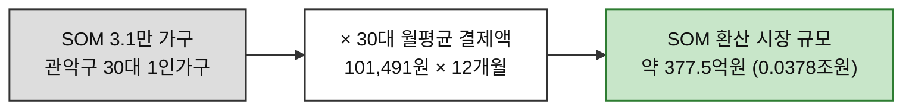
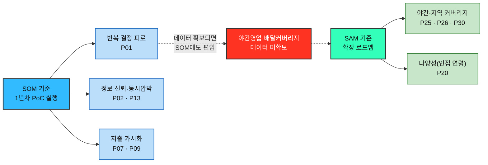

# 시장 가중형 기회점수(DOS) 분석 — 한끼라우터 (1인 가구 한 끼 해결 플랫폼)

> [방법론 §4](./00-방법론.md) · 입력 [AOS 분석](./02-AOS매트릭스.md) · [Pain 32개](./01-Pain리스트.md) · 모수 근거 [챕터 04 TAM-SAM-SOM §08](../../04.tam-sam-som/1인가구한끼해결-7단계/08-TAMSAMSOM단계별대응구조.md)·[§09](../../04.tam-sam-som/1인가구한끼해결-7단계/09-마켓세그먼트맵.md)

> 📊 **산출.** **DOS = (Importance − Satisfaction) × Market Relevance**를 **SAM 기준**과 **SOM 기준** 두 버전으로 각각 계산했다. 두 순위의 차이 자체가 결론의 일부다.
>
> ⚠️ **Importance·Satisfaction은 [AOS 분석](./02-AOS매트릭스.md)의 값을 그대로 승계**하며 전부 인터뷰 없는 추정이다. 여기에 **MR이라는 가정 한 겹이 더 얹힌다.** 근거 등급은 §7 참조.

---

## 0. Market Relevance 정의

### 모수를 SAM으로 잡고 SOM을 병기하는 이유

| 모수 | 판정 | 사유 |
| --- | :---: | --- |
| **TAM** (41.49조원, 국내 온라인 음식서비스 전체) | ❌ | 이 중 한끼라우터가 겨냥하는 부분이 얼마인지 인과가 끊긴다 — 어떤 Pain을 고쳐도 41.49조원의 몇 %가 움직인다고 말할 수 없어 MR이 전부 0에 수렴한다 |
| **SAM** (9.02조원, 1인가구 배달·포장 전 연령, **확정**) | ✅ **기본** | 방법론이 DOS의 목적을 **"시장 확장성 검증"**으로 규정한다. [08번 문서](../../04.tam-sam-som/1인가구한끼해결-7단계/08-TAMSAMSOM단계별대응구조.md)의 bottom-up 확정치라 층 자체가 흔들리지 않는다 |
| **SOM** (관악구 30대 1인가구 약 3.1만 가구, PoC 모집단 상한) | ✅ **병기** | 확장성이 아니라 **1년차(PoC) 실행 순서**를 본다. AOS가 이미 "고객 체감" 관점을 담당하므로 SOM만 쓰면 두 지표가 같은 것을 두 번 재게 되지만, SAM과 나란히 놓으면 **"지금 검증할 것"과 "커지려면 필요한 것"의 차이**가 드러난다 |

### 가구 수가 아니라 재원(원)으로 환산한다

SAM은 이미 "원" 단위(9.02조원)인데 SOM은 "가구 수"(3.1만 가구) 단위다 — 단위가 다르면 두 기준을 나란히 놓고 비교할 수 없다. SOM을 30대 월평균 배달앱 결제액([08번 문서](../../04.tam-sam-som/1인가구한끼해결-7단계/08-TAMSAMSOM단계별대응구조.md))으로 환산한다.

**SAM 9.02조원 대 SOM 0.0378조원 — 약 239배 차이.** SAM은 "커지면 도달할 수 있는 전체", SOM은 "PoC가 실제로 만나는 인구"라는 것을 숫자로도 확인할 수 있다.

### MR 부여 규칙 세 가지

| # | 규칙 | 이유 |
| --- | --- | --- |
| **1** | **MR은 Pain별이 아니라 인물별로 부여한다** | Pain마다 다르게 주면 Importance를 두 번 세게 된다. DOS를 *"고객 미충족 × 시장 파급력"*으로 정의한 것은 **두 항이 독립**이라는 뜻이다 — [02-AOS매트릭스.md](./02-AOS매트릭스.md)에서 Pain별로 MR을 매겼던 이전 판은 이 규칙을 위반했으므로 이번 판에서 전면 수정한다 |
| **2** | **MR의 합은 1이 아니어도 된다** | 아래 §"인물별 MR"에서 C1·C2·C5가 모두 SAM MR 0.20을 갖는다 — 같은 30대 지갑을 세 각도(야근·마감·이중압박)에서 보는 것이므로 나눠 갖지 않는다 |
| **3** | **비사용 인물은 MR 0, 모수 정의 밖은 MR 0** | N1·N2(비활성)는 이 시장에서 지출을 발생시키지 않으므로 MR 0. A3(2인가구)는 SAM·SOM이 정의하는 모집단("1인가구")의 정의 자체 밖에 있으므로 역시 0이다. 한끼라우터에는 [식량 재분배 사례](https://github.com/wild-mental/business-research-practice-2026-sesac/blob/main/06-opportunity-score/%EB%B6%84%EC%84%9D-03-%EC%8B%9D%EB%9F%89-%EC%9E%AC%EB%B6%84%EB%B0%B0-%ED%94%8C%EB%9E%AB%ED%8F%BC-DOS.md)의 "수혜형(돈을 안 내는 사람)" 같은 별도 산출 제외 대상은 없다 — 12명 전원이 같은 시장(1인가구 식사 지출)의 잠재 소비자다 |

### 연령대 구성비 — SAM은 전 연령, SOM은 30대 단일

MR은 비율이므로, **SAM 층에서는 연령대별 구성비**([08번 문서](../../04.tam-sam-som/1인가구한끼해결-7단계/08-TAMSAMSOM단계별대응구조.md) bottom-up 수치를 그대로 사용)를, **SOM 층에서는 애초에 "30대"로 고정된 모집단**이므로 30대 내부의 세부 구분만 쓴다.

| 구성비 | **SAM 기준** (9.02조원 중 비중) | **SOM 기준** (30대 관악구 중 비중) |
| --- | :---: | :---: |
| 20대 이하 | **18%** (1.63조원) | 0% (모수 정의 밖) |
| 30대 — Q4 원형(순수 동시압박) | **20%** (1.76조원 근사) | **90%** (SOM의 정의 그 자체) |
| 30대 — Q2·Q3 재분류(Core 소속이나 경계적) | 20%(위와 동일 연령대) | **60%**(1인가구·30대는 맞으나 "순수 동시압박"은 아님) |
| 40대 | 13% (1.17조원) | 0% |
| 50대 | 15% (1.33조원) | 0% |
| 60세 이상 | 35% (3.13조원) | 0% |
| 2인가구(모수 정의 밖) | 0% | 0% |
| 연령 불특정(구조적 소수 — 야간교대·지방거주) | **10%**(추정, 특정 연령대에 귀속시킬 근거 없음) | 0%(관악구 30대 정의 밖) |
| 비활성(비사용) | 0% | 0% |

### 인물별 Market Relevance

| 인물 | 인구층 근거 | **SAM MR** | **SOM MR** |
| --- | --- | :---: | :---: |
| **C1** 「퇴근을 예측할 수 없다」 | 30대 Q4 원형 | **0.20** | **0.90** |
| **C2** 「마감엔 다 필요없다」 | 30대 Q4 원형 | **0.20** | **0.90** |
| **C5** 「둘 다 없다」 | 30대 Q4 원형 | **0.20** | **0.90** |
| **C3** 「매일이 곧 지출이다」 | 30대, Q2 재분류 | **0.20** | 0.60 |
| **C4** 「기운이 없는데 골라야 한다」 | 30대, Q3 재분류 | **0.20** | 0.60 |
| **A2** 「또 그 메뉴다」 | 인접 연령(40대 추정) | 0.13 | 0.00 |
| **A1** 「1인분은 손해다」 | 20대, 2차 타깃([07단계 SRS](../../04.tam-sam-som/1인가구한끼해결-7단계/07-솔루션구체화-SRS.md)) | 0.18 | 0.00 |
| **X2** 「지도 밖의 동네」 | 연령 불특정, 지방 거주 | 0.10 | 0.00 |
| **X1** 「새벽엔 문 닫은 도시」 | 연령 불특정, 야간 교대 | 0.10 | 0.00 |
| **A3** 「같이 살아도 혼자 먹는다」 | 2인가구 — 모수 정의 밖 | **0.00** | **0.00** |
| **N1** 「안 시켜도 괜찮다」 | 비사용 | **0.00** | **0.00** |
| **N2** 「전화가 더 빠르다」 | 비사용 | **0.00** | **0.00** |

> 📌 **C1·C2·C5가 같은 SAM MR(0.20)을 갖는다.** 세 사람은 같은 30대 지갑을 세 각도(반복 결정 피로·마감 압박·이중 압박)에서 본 것이다 — 규칙 2에 따라 각자 시장 크기를 그대로 받는다.
>
> 📌 **X1·X2의 MR 0.10은 이 문서에서 가장 근거가 얇은 값이다.** 야간 교대근무·지방 거주는 특정 연령대에 귀속되지 않는 구조적 소수집단이라, [08번 문서](../../04.tam-sam-som/1인가구한끼해결-7단계/08-TAMSAMSOM단계별대응구조.md)의 연령대별 구성비로는 이들의 실제 비중을 알 수 없다. 0.10은 "존재는 하지만 정량화 근거가 없다"는 것을 표시하는 보수적 추정값이다.

---

## 1. DOS Table — SAM 기준 (확장성)

**DOS = (Importance − Satisfaction) × SAM MR** · 32개 내림차순

| 순위 | ID | 인물 | Pain Point (요약) | Imp−Sat | MR | **DOS** |
| :---: | --- | --- | --- | :---: | :---: | :---: |
| 1 | **P01** | C1 | 매번 같은 고민이 반복된다 | 3 | 0.20 | **0.60** |
| 2 | **P02** | C1 | 갱신시각 지난 정보 불신 | 2 | 0.20 | **0.40** |
| 2 | **P07** | C3 | 지출 방치·누적 | 2 | 0.20 | **0.40** |
| 2 | **P09** | C3 | 지출 누적 확인 못 함 | 2 | 0.20 | **0.40** |
| 2 | **P13** | C5 | 예산·시간 동시압박 | 2 | 0.20 | **0.40** |
| 6 | **P25** | X1 | 영업시간 자체가 벽 | 3 | 0.10 | **0.30** |
| 6 | **P26** | X1 | 커버리지 신뢰 부재 | 3 | 0.10 | **0.30** |
| 8 | **P20** | A2 | 다양성 결핍 | 2 | 0.13 | **0.26** |
| 9 | **P05** | C2 | 예산 초과 못 막음 | 1 | 0.20 | **0.20** |
| 9 | **P08** | C3 | 최저가 탐색 부담 | 1 | 0.20 | **0.20** |
| 9 | **P12** | C4 | 피드백 에너지 없음 | 1 | 0.20 | **0.20** |
| 9 | **P14** | C5 | 상세 비교 못 함 | 1 | 0.20 | **0.20** |
| 9 | **P15** | C5 | 사후 확신 부족 | 1 | 0.20 | **0.20** |
| 9 | **P27** | X1 | 후보 0건, 여정 종료 | 2 | 0.10 | **0.20** |
| 9 | **P30** | X2 | 선택지 없어 비교 무의미 | 2 | 0.10 | **0.20** |
| 16 | **P18** | A1 | 지출 기록 기능 없음 | 1 | 0.18 | **0.18** |
| 17 | **P19** | A2 | 시작부터 흥 안 남 | 1 | 0.13 | **0.13** |
| 17 | **P21** | A2 | 재방문 유인 약함 | 1 | 0.13 | **0.13** |
| 19 | **P28** | X2 | 기대치 낮음 | 1 | 0.10 | **0.10** |
| 19 | **P29** | X2 | 기대 안 함 | 1 | 0.10 | **0.10** |
| 21 | **P03** | C1 | ETA 오차 | 0 | 0.20 | **0.00** |
| 21 | **P04** | C2 | 마감·식사 겹침 | 0 | 0.20 | **0.00** |
| 21 | **P06** | C2 | 대기시간 아까움 | 0 | 0.20 | **0.00** |
| 21 | **P10** | C4 | 지친 결정 부담 | 0 | 0.20 | **0.00** |
| 21 | **P11** | C4 | 스케줄 안 맞음 | 0 | 0.20 | **0.00** |
| 21 | **P16** | A1 | 실패 선제 예상 | 0 | 0.18 | **0.00** |
| 21 | **P17** | A1 | 미충족 옵션 낭비 | 0 | 0.18 | **0.00** |
| 21 | **P22** | A3 | 앱이 나를 위한 게 맞나 | 0 | 0.00 | **0.00** |
| 21 | **P23** | A3 | 1인가구 전제 안 맞음 | 0 | 0.00 | **0.00** |
| 21 | **P24** | A3 | 몫 나누기 재조율 | −2 | 0.00 | **0.00** |
| 21 | **P31** | N1 | 애초에 앱을 안 연다 | −1 | 0.00 | **0.00** |
| 21 | **P32** | N2 | 앱 형식 자체가 장벽 | −1 | 0.00 | **0.00** |

**SAM 기준 DOS 총합 4.90** · 양수 20개 · 0 12개 · 음수 0개(MR 0이 음수 신호를 가림 — §5 참고)

---

## 2. DOS Table — SOM 기준 (1년차 실행)

**DOS = (Importance − Satisfaction) × SOM MR** · 32개 내림차순

| 순위 | ID | 인물 | Pain Point (요약) | Imp−Sat | MR | **DOS** |
| :---: | --- | --- | --- | :---: | :---: | :---: |
| 1 | **P01** | C1 | 매번 같은 고민이 반복된다 | 3 | 0.90 | **2.70** |
| 2 | **P02** | C1 | 갱신시각 지난 정보 불신 | 2 | 0.90 | **1.80** |
| 2 | **P13** | C5 | 예산·시간 동시압박 | 2 | 0.90 | **1.80** |
| 4 | **P07** | C3 | 지출 방치·누적 | 2 | 0.60 | **1.20** |
| 4 | **P09** | C3 | 지출 누적 확인 못 함 | 2 | 0.60 | **1.20** |
| 6 | **P05** | C2 | 예산 초과 못 막음 | 1 | 0.90 | **0.90** |
| 6 | **P14** | C5 | 상세 비교 못 함 | 1 | 0.90 | **0.90** |
| 6 | **P15** | C5 | 사후 확신 부족 | 1 | 0.90 | **0.90** |
| 9 | **P08** | C3 | 최저가 탐색 부담 | 1 | 0.60 | **0.60** |
| 9 | **P12** | C4 | 피드백 에너지 없음 | 1 | 0.60 | **0.60** |
| 11 | **P03** | C1 | ETA 오차 | 0 | 0.90 | **0.00** |
| 11 | **P04** | C2 | 마감·식사 겹침 | 0 | 0.90 | **0.00** |
| 11 | **P06** | C2 | 대기시간 아까움 | 0 | 0.90 | **0.00** |
| 11 | **P10** | C4 | 지친 결정 부담 | 0 | 0.60 | **0.00** |
| 11 | **P11** | C4 | 스케줄 안 맞음 | 0 | 0.60 | **0.00** |
| 11 | **P16~P32** | A1·A2·A3·X1·X2·N1·N2 | (17개 항목 전부) | — | **0.00** | **0.00** |

**SOM 기준 DOS 총합 10.80** · 양수 10개 · 0 22개 · 음수 0개

> ⚠️ **SOM 기준에서는 32개 중 22개가 정확히 0이다.** SOM(관악구 30대 1인가구)의 정의 자체가 A1·A2·A3·X1·X2·N1·N2 일곱 명 전원을 배제하기 때문이다 — 이 사람들의 Pain이 사라진 게 아니라, **"1년차 PoC 실행" 렌즈로 보면 애초에 그 모집단 안에 없다**는 뜻이다.

---

## 3. 두 순위 대조

### 상위 10 나란히 보기

| 순위 | **SAM 기준 (확장성)** | DOS | **SOM 기준 (1년차)** | DOS |
| :---: | --- | :---: | --- | :---: |
| 1 | P01 반복 결정 피로 | 0.60 | P01 반복 결정 피로 | 2.70 |
| 2 | P02 정보 신뢰 | 0.40 | P02 정보 신뢰 | 1.80 |
| 3 | P07 지출 방치 | 0.40 | P13 동시압박 | 1.80 |
| 4 | P09 지출 확인 | 0.40 | P07 지출 방치 | 1.20 |
| 5 | P13 동시압박 | 0.40 | P09 지출 확인 | 1.20 |
| 6 | P25 영업시간 벽 | 0.30 | P05 예산 초과 | 0.90 |
| 7 | P26 커버리지 신뢰 | 0.30 | P14 비교 못 함 | 0.90 |
| 8 | P20 다양성 결핍 | 0.26 | P15 사후 확신 | 0.90 |
| 9 | P05 예산 초과 | 0.20 | P08 최저가 부담 | 0.60 |
| 9 | P08 최저가 부담 | 0.20 | P12 피드백 에너지 | 0.60 |

### 이동 폭이 큰 항목

| ID | SAM 순위 | SOM 순위 | 해석 |
| --- | :---: | :---: | --- |
| **P25·P26** 영업시간·커버리지 (X1) | **6위(공동)** | 공동 최하위(0) | 확장 시장에서는 존재감 있지만 1년차 PoC(관악구 30대) 범위 밖이라 완전히 사라진다 |
| **P30** 선택지 없음 (X2) | 9위(공동) | 공동 최하위(0) | 위와 같은 이유 |
| **P20** 다양성 결핍 (A2) | **8위** | 공동 최하위(0) | 인접 연령이라 SAM에서는 잡히지만 SOM(30대 관악구)에는 없다 |
| **P05·P14·P15** (C2·C5) | 9위권 | **6~8위로 상승** | SOM의 30대 집중(MR 0.90)이 Core 전반의 순위를 끌어올린다 |
| **P08·P12** (C3·C4) | 9위권 | **9위 유지(값은 3배 상승)** | Q2·Q3 재분류에도 SOM MR 0.60을 받아 견고하게 남는다 |

> 📌 **두 순위에서 모두 상위 5위 안에 드는 다섯 개 — P01·P02·P07·P09·P13 — 이 모수 선택과 무관하게 견고한 기회다.** 전부 Core(C1·C3·C5)의 Pain이며, [04-AOSxDOS-혼합매트릭스.md](./04-AOSxDOS-혼합매트릭스.md)에서 두 축을 함께 놓고 다시 확인할 수 있다(단, 그 문서는 이번 재계산 이전 값으로 만들어졌으므로 갱신이 필요하다 — §8 참고).

---

## 4. AOS와 무엇이 달라졌나

DOS는 시장 크기를 곱하므로, **개인의 고통은 크지만 그 사람이 속한 인구층이 작거나(SAM) 아예 PoC 범위 밖(SOM)인 항목**을 걸러낸다.

| ID | AOS | AOS 순위 | SAM DOS | SOM DOS | 무슨 일이 있었나 |
| --- | :---: | :---: | :---: | :---: | --- |
| **P26** 커버리지 신뢰 부재 | 3.2 | **공동 1위** | 0.30 (6위) | **0.00 (최하위)** | **SOM에서 완전히 사라진다.** AOS 전체 1위였던 항목이 1년차 실행 관점에서는 존재하지 않는다 |
| **P01** 반복 결정 피로 | 3.0 | 공동 2위 | **0.60 (1위)** | **2.70 (1위)** | 세 지표 모두 1위권 — 가장 흔들리지 않는 결론 |
| **P25** 영업시간 벽 | 3.0 | 공동 2위 | 0.30 (6위) | 0.00 (최하위) | P26과 같은 이유로 SOM에서 소멸 |
| **P30** 선택지 없음 | 3.0 | 공동 2위 | 0.20 (9위권) | 0.00 (최하위) | 같은 이유 |
| **P13** 동시압박 | 2.0 | 10위 | 0.40 (2위) | **1.80 (2위)** | **급등.** AOS에서는 중위권이었지만 Core·30대 원형이라 시장가중을 받을수록 순위가 오른다 |

> 📌 **AOS 전체 1위(P26)가 SOM 기준 DOS에서 사라진다.** 이것이 두 지표의 성격 차이를 가장 선명하게 보여준다 — **AOS는 "누가 얼마나 아픈가", DOS는 "그 아픔이 지금 우리가 검증할 시장(SOM)에 있는가"**를 잰다. X1은 실재하는 고통이지만 관악구 30대 1인가구 PoC 모집단 밖의 사람이다. **P26을 SOM 목록에서 뺐다고 중요도가 사라진 게 아니라, 다른 자(SAM)로 재야 한다는 뜻이다** — SAM 기준에서는 P25·P26이 여전히 6위(공동)로 살아있다.

---

## 5. 0 항목의 해석 — 세 가지 서로 다른 0

| 유형 | ID | 왜 0인가 | 어떻게 다뤄야 하나 |
| --- | --- | --- | --- |
| **Imp−Sat = 0** (위생 요건) | P03·P04·P06·P10·P11·P16·P17 | 중요도만큼 이미 대체 솔루션으로 충족되어 있다 | **위생 요건.** 없으면 탈락하므로 최소 요건 목록으로 |
| **MR = 0, 모수 정의 밖** | P22·P23 (A3) | 2인가구는 SAM·SOM이 정의하는 "1인가구" 모집단 자체에 없다 | 이 시장 정의로는 잴 수 없다 — 별도 시장(2인가구 상황적 1인식사)으로 재정의해야 잴 수 있다 |
| **MR = 0, 음수 신호를 가림** | P24(Imp−Sat **−2**) · P31·P32(각 **−1**) | 실제로는 "이미 과충족"(대체 솔루션이 Importance보다 잘 해결 중)인데 MR 0이 그 신호를 0으로 뭉갠다 | ⚠️ **주의.** [02-AOS매트릭스.md](./02-AOS매트릭스.md)에서는 이 셋이 낮은 양수(0.4~0.6)로 보였는데, DOS 원값(Imp−Sat)은 사실 **음수**다. "하지 말아야 할 것"이라는 더 강한 신호가 MR 0 때문에 안 보이게 된 것 — 점수가 0인 것과 방향이 중립인 것은 다르다 |

---

## 6. 인물 단위 합계

| 인물 | Pain 합 (SAM) | Pain 합 (SOM) |
| --- | :---: | :---: |
| **C1** 「퇴근을 예측할 수 없다」 | 1.00 | **4.50 ①위** |
| **C5** 「둘 다 없다」 | 0.80 | **3.60 ②위** |
| **C3** 「매일이 곧 지출이다」 | **1.00 (공동①위)** | **3.00 ③위** |
| **X1** 「새벽엔 문 닫은 도시」 | **0.80 (공동②위)** | 0.00 |
| **A2** 「또 그 메뉴다」 | 0.52 | 0.00 |
| **C2** 「마감엔 다 필요없다」 | 0.20 | 0.90 |
| **X2** 「지도 밖의 동네」 | 0.40 | 0.00 |
| **C4** 「기운이 없는데 골라야 한다」 | 0.20 | 0.60 |
| **A1** 「1인분은 손해다」 | 0.18 | 0.00 |
| **A3** 「같이 살아도 혼자 먹는다」 | 0.00 | 0.00 |
| **N1** 「안 시켜도 괜찮다」 | 0.00 | 0.00 |
| **N2** 「전화가 더 빠르다」 | 0.00 | 0.00 |

> 📌 **C1이 두 층 모두 최상위권이다** — SAM 공동 1위, SOM 단독 1위. [02번 문서](./02-AOS매트릭스.md) §2가 "완주해도 만족이 보장되지 않는다"고 짚은 그 인물이 **시장 가중을 넣은 뒤에도 유지된다.**
>
> 📌 **X1은 SAM 공동 2위(0.80) / SOM 0(최하위)로 진폭이 가장 크다.** 확장의 열쇠이면서 1년차에는 아예 보이지 않는 인물이다 — 야간 커버리지 데이터 확보([02-AOS매트릭스.md §7-3](./02-AOS매트릭스.md)이미 "데이터 확보 트랙"으로 분리)가 되기 전까지는 PoC 범위에 넣을 수 없다는 뜻이기도 하다.

---

## 7. 근거 등급

| 구성 요소 | 등급 | 비고 |
| --- | --- | --- |
| DOS 계산식 | **(확인)** | 방법론 §4 정의 |
| 모수 선택(SAM 기본·SOM 병기) | **(확인)** | [08](../../04.tam-sam-som/1인가구한끼해결-7단계/08-TAMSAMSOM단계별대응구조.md)·[09번 문서](../../04.tam-sam-som/1인가구한끼해결-7단계/09-마켓세그먼트맵.md)의 확정 수치 그대로 인용 |
| SAM 연령대 구성비 | **(확인)** | 08번 문서 bottom-up 수치 원문 인용 |
| SOM의 원화 환산(377.5억원) | **(추정)** | 30대 월평균 결제액을 그대로 적용한 근사치 — 관악구 30대의 실제 결제 성향이 전국 평균과 같다는 가정을 깔고 있다 |
| **Importance·Satisfaction 32개** | **(가정)** | [02-AOS매트릭스.md](./02-AOS매트릭스.md)에서 승계 — 재평가하지 않음 |
| **인물별 MR(특히 X1·X2의 0.10, A2의 0.13)** | **(가정)** | 특정 연령대에 귀속시킬 근거가 없어 보수적으로 추정. 이 문서에서 가장 약한 고리 |
| 두 순위와 그 차이 | **(가정)** | 위 값들의 산물 |

> ⚠️ **DOS는 AOS보다 한 겹 더 얇다.** AOS의 두 가정(Importance·Satisfaction) 위에 **MR이라는 세 번째 가정**이 곱해진다. 곱셈이므로 오차도 곱해진다.
>
> **가장 먼저 흔들릴 값은 X1·X2·A2의 MR이다.** 이들은 연령대별 구성비 표에 자리가 없어 "구조적 소수" 취급으로 0.10~0.13을 임의 배정했다 — 실제 야간 교대근무자·지방 거주 1인가구 비중 통계로 교체하는 것이 다음 단계의 1순위다.

---

## 8. 결론 — 두 개의 목록으로 읽는다

| 질문 | 답 |
| --- | --- |
| **1년차(PoC)에 무엇부터 검증하나** | SOM 기준 상위 — **C1의 반복 결정 피로(P01), 정보 신뢰(P02), C5의 동시압박(P13), C3의 지출 가시화(P07·P09)** |
| **커지려면 무엇이 필요한가** | SAM 기준에서만 살아나는 항목 — **X1·X2의 야간·지역 커버리지(P25·P26·P30), A2의 다양성(P20)** |
| **둘을 잇는 것은 무엇인가** | **야간 영업·배달 커버리지 데이터 확보.** [02-AOS매트릭스.md §7-1](./02-AOS매트릭스.md)이 이미 1순위로 지정한 과제이며, 이게 해결돼야 X1·X2가 SOM 목록에도 들어올 수 있다 |
| **DOS로 재면 안 되는 것은** | MR 0에 가려진 음수 신호 3개(P24·P31·P32, §5) — 방향이 중립이 아니라 "과충족"이라는 걸 잊지 않는다 |

### 다음 단계

| 순위 | 할 일 | 이유 |
| :---: | --- | --- |
| **1** | **X1·X2·A2의 MR을 실제 인구 통계로 교체** | 두 순위 전체가 이 가정 위에 서 있다 — 야간 교대근무·지방 1인가구 비중 통계 확인 |
| **2** | **관악구 30대의 실제 결제 성향 확인** | SOM 원화 환산(377.5억원)이 전국 평균을 그대로 쓴 근사치다 |
| **3** | **[04-AOSxDOS-혼합매트릭스.md](./04-AOSxDOS-혼합매트릭스.md) 갱신** | 이전 판(Pain별 MR)의 DOS 값을 쓰고 있어 이번 재계산과 어긋난다 — SAM/SOM 중 어느 기준으로 다시 그릴지 결정 필요 |
| **4** | **07 JTBD 인터뷰 대상 재조정** | [02번 §7-2](./02-AOS매트릭스.md) 5인 중 C1·C3·C5(SOM 최상위)를 최우선으로, X1·X2는 "데이터 확보 후 재검증" 트랙으로 분리 |
