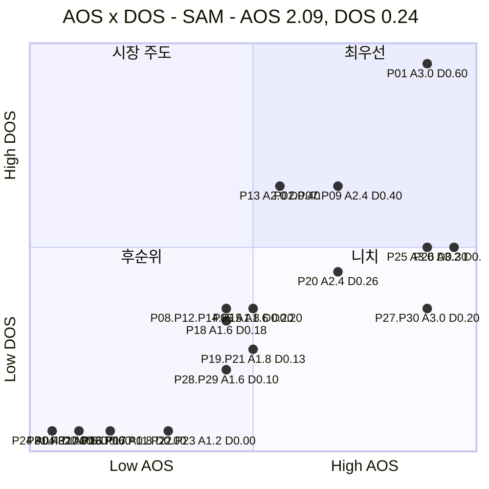
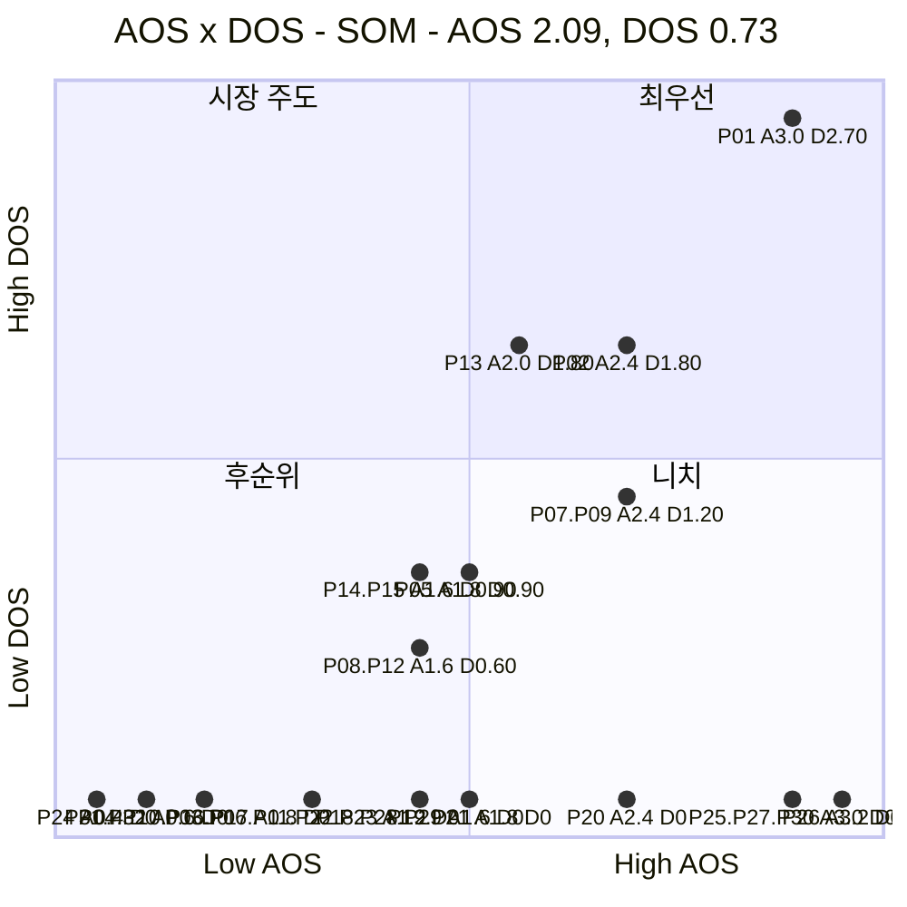

# AOS × DOS 혼합 매트릭스 — 한끼라우터 (1인 가구 한 끼 해결 플랫폼)

> 입력 [AOS 분석](./02-AOS매트릭스.md) · [DOS 분석](./03-DOS매트릭스.md) · [방법론](./00-방법론.md)

> 📊 **산출.** 두 점수를 한 평면에 놓는다. **X축 = AOS**(고객이 얼마나 아픈가), **Y축 = DOS**(그 아픔이 얼마나 많은 시장에 닿는가). DOS가 두 버전(SAM·SOM)이므로 매트릭스도 **SAM 기준·SOM 기준 두 장**이다.

---

## 0. 축 정의와 기준선

### 왜 이 배치인가

| 축 | 지표 | 재는 것 | 출처 |
| --- | --- | --- | --- |
| **X (가로)** | **AOS** = Imp × (1 − Sat/5) | **고객 미충족의 강도** — 그 사람이 얼마나 아픈가 | [AOS 분석 §3](./02-AOS매트릭스.md) |
| **Y (세로)** | **DOS** = (Imp − Sat) × MR | **시장 파급력** — 그 아픔이 닿는 시장의 크기 | [DOS 분석 §1·§2](./03-DOS매트릭스.md) |

두 지표는 Importance·Satisfaction을 공유하지만 **Market Relevance의 유무**가 다르다. 따라서 이 평면의 세로 위치는 사실상 **MR이 만드는 차이**이고, **가로에서 오른쪽인데 세로에서 아래**인 항목이 곧 *"개인에게는 절실하나 시장이 작은"* 니치다.

### 기준선

| 축 | 기준값 | 산출 |
| --- | :---: | --- |
| **AOS** | **2.09** | [AOS 분석](./02-AOS매트릭스.md)에서 확정한 기회 경계(방법론 B, 32개 기준 평균 + 0.5σ)를 그대로 승계 |
| **DOS (SAM)** | **0.24** | 32개 기준 평균 0.159 + 0.5σ(0.158) |
| **DOS (SOM)** | **0.73** | 32개 기준 평균 0.394 + 0.5σ(0.681) |

> 🖊️ *참고한 [식량 재분배 사례](https://github.com/wild-mental/business-research-practice-2026-sesac/blob/main/06-opportunity-score/%EB%B6%84%EC%84%9D-03-%EC%8B%9D%EB%9F%89-%EC%9E%AC%EB%B6%84%EB%B0%B0-%ED%94%8C%EB%9E%AB%ED%8F%BC-%ED%98%BC%ED%95%A9%EB%A7%A4%ED%8A%B8%EB%A6%AD%EC%8A%A4.md)는 AOS가 36개, DOS가 33개 기준이라 카운트가 어긋났다. **이 프로젝트는 AOS·DOS 모두 같은 32개 Pain을 쓰므로 그 문제가 없다** — 수혜형처럼 산출에서 빠지는 항목이 없기 때문이다([03번 §0](./03-DOS매트릭스.md) 규칙 3 참고).
>
> ⚠️ **선 위에 걸친 항목들.** SAM DOS 기준(0.24)에는 0.20인 6개(P08·P12·P14·P15·P27·P30)와 0.26인 P20이 양쪽에서 근접해 있다 — 자금 구성비 가정이 조금만 바뀌어도 사분면이 뒤집힐 수 있다. AOS 기준(2.09)에는 P13(2.0)이 가장 가깝다.

### 사분면의 의미

| 사분면 | 조건 | 이름 | 뜻 |
| --- | --- | --- | --- |
| **우상단** | AOS ↑ · DOS ↑ | 🔥 **최우선** | 고객도 아프고 시장도 크다 |
| **좌상단** | AOS ↓ · DOS ↑ | 💰 **시장 주도** | 개인의 고통은 덜하지만 시장 규모가 크다 |
| **우하단** | AOS ↑ · DOS ↓ | 🎯 **니치** | 절실하지만 그 시장이 작다 |
| **좌하단** | AOS ↓ · DOS ↓ | ⬜ **후순위** | 둘 다 작다 |

---

## 1. 혼합 매트릭스 — SAM 기준 (확장성)

| 사분면 | 개수 | 항목 |
| --- | :---: | --- |
| 🔥 **최우선** | **7** | **P01** 반복 결정 피로 · **P02** 정보 신뢰 · **P07** 지출 방치 · **P09** 지출 확인 · **P20** 다양성 결핍 · **P25** 영업시간 벽 · **P26** 커버리지 신뢰 |
| 💰 **시장 주도** | **1** | **P13** 동시압박(Q4 원형) |
| 🎯 **니치** | **2** | **P27** 후보 0건 종료 · **P30** 선택지 없음 |
| ⬜ **후순위** | **22** | P03·P04·P05·P06·P08·P10·P11·P12·P14·P15·P16·P17·P18·P19·P21·P22·P23·P24·P28·P29·P31·P32 |

---

## 2. 혼합 매트릭스 — SOM 기준 (1년차 실행)

| 사분면 | 개수 | 항목 |
| --- | :---: | --- |
| 🔥 **최우선** | **4** | **P01** 반복 결정 피로 · **P02** 정보 신뢰 · **P07** 지출 방치 · **P09** 지출 확인 |
| 💰 **시장 주도** | **4** | **P13** 동시압박 · **P05** 예산 초과 · **P14** 비교 못 함 · **P15** 사후 확신 부족 |
| 🎯 **니치** | **5** | **P20** 다양성 결핍 · **P25** 영업시간 벽 · **P26** 커버리지 신뢰 · **P27** 후보 0건 종료 · **P30** 선택지 없음 |
| ⬜ **후순위** | **19** | P03·P04·P06·P08·P10·P11·P12·P16·P17·P18·P19·P21·P22·P23·P24·P28·P29·P31·P32 |

---

## 3. 두 매트릭스 대조

### 어느 칸에서 어느 칸으로 움직였나

| ID | 항목 | SAM | SOM | 왜 움직였나 |
| --- | --- | --- | --- | --- |
| **P25·P26** 영업시간·커버리지(X1) | 🔥 최우선 | → | 🎯 **니치** | X1의 SOM MR이 0이다 — 확장 시장(SAM)에서는 존재감 있지만 1년차 PoC(관악구 30대) 밖이라 시장 크기가 사라진다 |
| **P20** 다양성 결핍(A2) | 🔥 최우선 | → | 🎯 **니치** | A2도 SOM MR 0 — 인접 연령이라 SAM에서는 잡히지만 SOM에는 없다 |
| **P05·P14·P15** (C2·C5) | ⬜ 후순위 | → | 💰 **시장 주도** | SOM의 30대 집중(MR 0.90)이 Core 전반의 Y값을 크게 밀어올린다 |
| **P13** 동시압박(C5) | 💰 시장 주도 | = | 💰 시장 주도 | AOS 2.0이 기준선(2.09)에 못 미쳐 두 매트릭스 모두 "시장은 큰데 개인 고통은 상대적으로 낮게 측정됨" 칸에 남는다 |

**네 개는 두 매트릭스 모두 🔥 최우선에 남는다.**

| ID | 항목 | 계열 |
| --- | --- | --- |
| **P01** | 반복 결정 피로 | 즉시 결정 지원 |
| **P02** | 정보 갱신시각 불신 | 정보 신뢰성 |
| **P07** | 지출 방치·누적 | 지출 가시화 |
| **P09** | 지출 누적 확인 못 함 | 지출 가시화 |

> 📌 **넷 중 셋(P02·P07·P09)이 Core(C1·C3)에서, 나머지 하나(P01)도 Core(C1)에서 나왔다.** 페르소나 스펙트럼 · 고객 여정지도 · AOS · DOS · 혼합 매트릭스 — **다섯 경로가 전부 Core(C1·C3)의 같은 두 덩어리(즉시성·지출가시화)를 가리킨다.** 모수 선택도, 축 조합도 이 결론을 바꾸지 못했다.

### 우하단(니치)에 고정된 둘

**P27**(후보 0건 종료)과 **P30**(선택지 없음, 둘 다 X1·X2)은 두 매트릭스 모두 🎯 니치다. AOS 3.0으로 상위권인데 DOS는 SAM 0.20, SOM 0에 그친다.

> 📌 **혼합 매트릭스가 가장 잘 하는 일이 이것이다.** AOS만 보면 이 둘은 상위권이었고, DOS만 보면 중하위권이었다. **두 축을 함께 놓아야 "절실한데 시장이 작다"가 한눈에 보인다.** 버릴 항목이 아니라 **야간 영업·배달 커버리지 데이터가 확보되면 위로 올라올 항목**이다.

---

## 4. 사분면별 행동 지침

| 사분면 | 무엇을 하나 | 이유 |
| --- | --- | --- |
| 🔥 **최우선** | **MVP 범위로 확정한다.** [02번 §7-2](./02-AOS매트릭스.md) JTBD 인터뷰의 1순위 대상 | 고객 미충족과 시장 크기가 동시에 확인된 유일한 칸 |
| 💰 **시장 주도** | **Core 세그먼트 심화 검증으로 다룬다** — 제품 신규 기능보다 기존 기능의 완성도 문제일 수 있다 | 개인 고통은 상대적으로 낮게 측정됐지만(AOS<2.09) 시장 크기(Core·30대)가 이미 크다. P13(동시압박)이 전형이다 |
| 🎯 **니치** | **로드맵 뒤로 미루되 버리지 않는다** — 야간·지역 커버리지 데이터 확보 과제와 묶어 관리 | 절실한 사용자(X1·X2·A2)가 실재하므로, 데이터가 확보되면 최우선으로 올라온다 |
| ⬜ **후순위** | **세 갈래로 나눠 처리한다** | ① `Imp−Sat = 0`인 위생 요건(P03·P04·P06·P10·P11·P16·P17)은 **최소 요건 목록**으로 ② MR 0가 음수 신호를 가린 항목(P22·P23·P24·P31·P32, [03번 §5](./03-DOS매트릭스.md))은 **과잉충족 — 투자 금지 신호**로 ③ 나머지(P08·P12·P18·P19·P21·P28·P29)는 **진짜 후순위** |

> ⚠️ **후순위 19~22개를 한 덩어리로 처리하면 안 된다.** 이 칸에는 성격이 다른 셋이 섞여 있다 — 위생 요건, MR 0로 가려진 과잉충족 신호, 진짜 저우선순위.

---

## 5. 근거 등급

| 구성 요소 | 등급 | 비고 |
| --- | --- | --- |
| 축 배치와 사분면 정의 | **(확인)** | 두 지표의 정의에서 직접 도출 |
| AOS 기준선 2.09 | **(확인)** | [02번 문서](./02-AOS매트릭스.md)에서 32개 기준으로 산출, 그대로 승계 |
| DOS 기준선 0.24·0.73 | **(확인)** | [03번 문서](./03-DOS매트릭스.md)의 SAM·SOM DOS 32개 분포에서 이번에 새로 계산(평균 + 0.5σ) |
| **좌표를 이루는 Imp·Sat·MR** | **(가정)** | AOS·DOS 분석에서 승계. 인터뷰·실측 없음 |
| 사분면 배치 결과 | **(가정)** | 위 값들의 산물 |

> ⚠️ **이 매트릭스는 두 개의 파생 지표를 다시 조합한 3차 산출물이다.** AOS의 가정(Imp·Sat) 위에 DOS의 가정(MR)이 곱해지고, 그 둘을 다시 두 축으로 배치했다. **점의 정확한 위치를 믿지 말고 칸의 소속만 읽어야 하며**, 그마저도 §0에서 짚은 선 위에 걸친 항목(P08·P12·P14·P15·P20·P27·P30·P13)은 흔들린다.

---

## 6. 다음 단계

| 순위 | 할 일 | 이유 |
| :---: | --- | --- |
| **1** | 🔥 **최우선 4개(P01·P02·P07·P09)를 MVP 범위로 확정** | 두 매트릭스 교집합 — 모수·축 조합에 흔들리지 않는다 |
| **2** | **X1·X2·A2의 MR을 실제 인구 통계로 교체 후 재배치** | 🎯 니치 칸 전체(P20·P25·P26·P27·P30)가 이 가정 위에 있다 |
| **3** | 💰 **시장 주도 칸(P13·P05·P14·P15)을 Core 심화 검증 과제로 이관** | 신규 기능이 아니라 기존 핵심 기능의 완성도 문제일 가능성 |
| **4** | ⬜ **후순위를 세 갈래로 재분류** | 위생 요건 / MR 0로 가려진 과잉충족 / 진짜 후순위 |

이후는 07 챕터(JTBD, 아직 폴더 없음)로 이어갈 수 있다. 인터뷰 우선순위는 🔥 최우선 4개를 보유한 **C1**(P01·P02)과 **C3**(P07·P09)이며, 이는 [03번 문서 §6](./03-DOS매트릭스.md) 인물 단위 합계 상위와도 일치한다 — 별도 지시로 진행한다.
