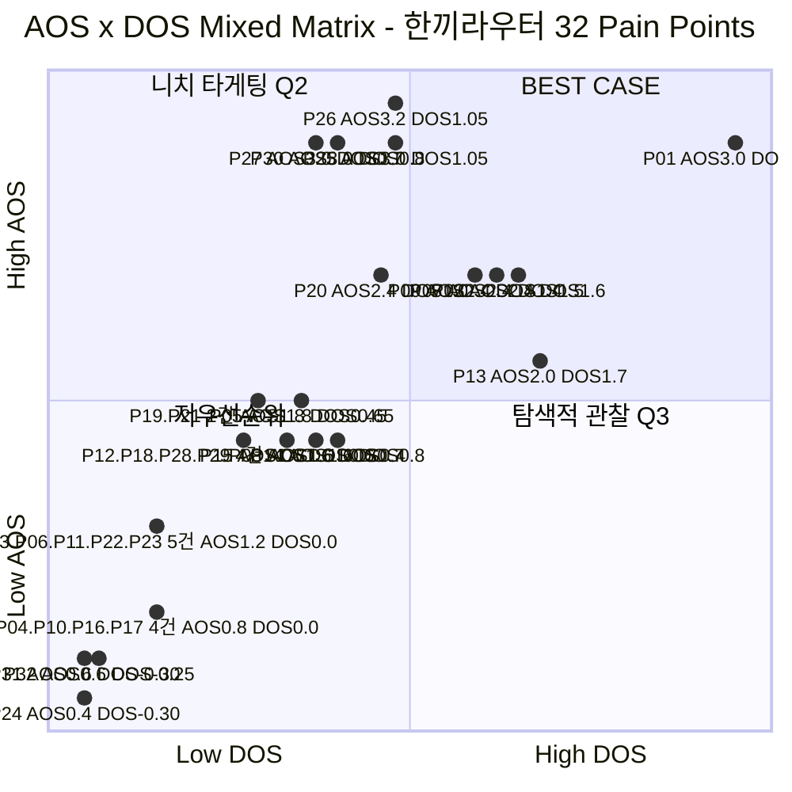

# AOS × DOS 혼합 매트릭스

> 입력: [02-AOS매트릭스.md](./02-AOS매트릭스.md)(32개 AOS) · [03-DOS매트릭스.md §2](./03-DOS매트릭스.md)(32개 DOS) · 토론 틀 [00-방법론.md §6](./00-방법론.md)
>
> Y축 = **AOS**(고객 체감 — 혁신 가능성), X축 = **DOS**(시장가중 — 현실성). [00-방법론.md §6](./00-방법론.md)의 "AOS/DOS 충돌" 토론을 좌표로 직접 그린 것이다.

## 좌표 읽는 법

두 축 모두 **32개 실제 값의 최소~최대를 0.05~0.95로 정규화**했다(원점이 0이 아니다). 정확한 원본 값은 [02번](./02-AOS매트릭스.md)·[03번](./03-DOS매트릭스.md) 표를 참고한다.

| 축 | 실제 범위 | 정규화 |
| --- | --- | --- |
| AOS (Y) | 0.4 ~ 3.2 | 0.05 ~ 0.95 |
| DOS (X) | −0.3 ~ 2.55 | 0.05 ~ 0.95 |

> 🖊️ 점은 개별 Pain이 아니라 **동일 (AOS, DOS) 좌표를 공유하는 항목을 묶은 그룹**이다. `P04.P10.P16.P17`처럼 마침표로 이어 쓴 라벨은 네 ID가 정확히 같은 좌표에 겹친다는 뜻이다.

## 좌표 대조표 (그림에 대응하는 원본 값)

| 그룹(ID) | 인물 | AOS | DOS | 좌표(정규화) | 사분면 |
| --- | --- | --- | --- | --- | --- |
| P01 | C1 | 3.0 | 2.55 | (0.95, 0.89) | 🏆 BEST CASE |
| P02 | C1 | 2.4 | 1.60 | (0.65, 0.69) | 🏆 BEST CASE |
| P03·P06·P11·P22·P23 | C1·C2·C4·A3·A3 | 1.2 | 0.00 | (0.15, 0.31) | ⚫ 저우선순위 |
| P04·P10·P16·P17 | C2·C4·A1·A1 | 0.8 | 0.00 | (0.15, 0.18) | ⚫ 저우선순위 |
| P05 | C2 | 1.8 | 0.65 | (0.35, 0.50) | 🏆 BEST CASE |
| P07 | C3 | 2.4 | 1.50 | (0.62, 0.69) | 🏆 BEST CASE |
| P08 | C3 | 1.6 | 0.70 | (0.37, 0.44) | 🏆 BEST CASE |
| P09 | C3 | 2.4 | 1.40 | (0.59, 0.69) | 🏆 BEST CASE |
| P12·P18·P28·P29 | C4·A1·X2·X2 | 1.6 | 0.40 | (0.27, 0.44) | ⚠️ 니치 타게팅 |
| P13 | C5 | 2.0 | 1.70 | (0.68, 0.56) | 🏆 BEST CASE |
| P14 | C5 | 1.6 | 0.80 | (0.40, 0.44) | 🏆 BEST CASE |
| P15 | C5 | 1.6 | 0.60 | (0.33, 0.44) | 🏆 BEST CASE |
| P19·P21 | A2·A2 | 1.8 | 0.45 | (0.29, 0.50) | 🏆 BEST CASE |
| P20 | A2 | 2.4 | 1.00 | (0.46, 0.69) | 🏆 BEST CASE |
| P24 | A3 | 0.4 | −0.30 | (0.05, 0.05) | ⚫ 저우선순위 |
| P25 | X1 | 3.0 | 1.05 | (0.48, 0.89) | 🏆 BEST CASE |
| P26 | X1 | 3.2 | 1.05 | (0.48, 0.95) | 🏆 BEST CASE |
| P27 | X1 | 3.0 | 0.70 | (0.37, 0.89) | 🏆 BEST CASE |
| P30 | X2 | 3.0 | 0.80 | (0.40, 0.89) | 🏆 BEST CASE |
| P31 | N1 | 0.6 | −0.30 | (0.05, 0.11) | ⚫ 저우선순위 |
| P32 | N2 | 0.6 | −0.25 | (0.07, 0.11) | ⚫ 저우선순위 |

## 요약

| 사분면 | 개수 | 대표 항목 |
| --- | --- | --- |
| 🏆 BEST CASE (AOS 높음·DOS 높음) | 16 | P01(C1)·P13(C5)·P25~P27(X1) |
| ⚠️ 니치 타게팅 (AOS 높음·DOS 낮음) | 4 | P12(C4)·P18(A1)·P28·P29(X2) |
| ⚫ 저우선순위 (AOS 낮음·DOS 낮음) | 12 | P24(A3)·P31·P32(N1·N2) |
| 🔍 탐색적 관찰 (AOS 낮음·DOS 높음) | 0 | *(해당 없음 — [03번 §3](./03-DOS매트릭스.md) 참고)* |

> 그림에서도 그대로 보이듯 **오른쪽 아래(탐색적 관찰) 사분면에 점이 하나도 없다** — DOS가 AOS를 절대 넘어설 수 없는 산식 구조([03번 §3](./03-DOS매트릭스.md) 참고) 때문이며, 계산 누락이 아니다.
