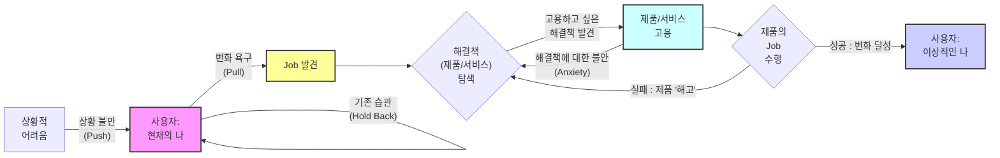
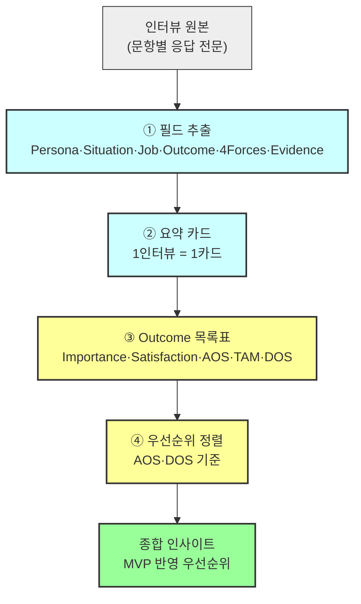

# 07 - 고객 상황을 객관화하는 JTBD(Jobs-To-Be-Done) 분석

> 이 단계는 [06.market-opportunity](../../06.market-opportunity/1인가구한끼해결-시장기회분석/)에서 AOS·DOS로 우선순위를 매긴 Pain을, **실제 인터뷰로 검증**하는 단계다.

### 인터뷰 대상 선정 — 두 기준의 교집합

| # | 기준 | 근거 |
| --- | --- | --- |
| ① | [페르소나 스펙트럼](../../05.persona-journey-map/1인가구한끼해결-페르소나여정/02-페르소나스펙트럼.md)의 **핵심(Core) + 확장(Adjacent)** 그룹만 (극단·비활성 제외) | Extreme(X1·X2)·Non-user(N1·N2)는 별도 데이터 확보·신뢰 트랙이 필요하다고 이미 확정됨([02-AOS매트릭스.md §7-3](../../06.market-opportunity/1인가구한끼해결-시장기회분석/02-AOS매트릭스.md)) |
| ② | [04-AOSxDOS-혼합매트릭스.md](../../06.market-opportunity/1인가구한끼해결-시장기회분석/04-AOSxDOS-혼합매트릭스.md)의 **혁신기회(최우선) + 니치마켓** 사분면(SAM·SOM 공통 — X축 AOS가 동일해 최우선∪니치 집합이 두 매트릭스에서 일치) |

두 기준을 교집합하면 **C1「퇴근을 예측할 수 없다」· C3「매일이 곧 지출이다」· A2「또 그 메뉴다」** 세 명(Pain 5개: P01·P02·P07·P09·P20)이 남는다. C5는 AOS 2.0이 기준선(2.09)에 살짝 못 미쳐 "시장주도" 칸에 남고, A1·A3는 AOS가 기준선에 못 미쳐 제외된다. **이 3명이 이 단계의 1차 인터뷰 대상이자 입력이다.**

## 1. JTBD란? — 고객의 실제 상황을 캐낼 수 있는 인터뷰·정리·분석 종합 기법

> **"필요하다고 생각해서 만들었더니 막상 아무도 안 쓴다?"** — 사용자에게 외면받는 공허한 비즈니스 실패를 방지하는 핵심 도구가 JTBD다.

### JTBD 관점에서 바라보는 고객의 문제해결 활동 구조



### 사용자의 구매/전환 결정을 이끄는 4가지 힘

| 힘 | 구분 | 의미 | 예시 발화 |
| --- | --- | --- | --- |
| **상황 불만 (Situation Push)** | 전환을 이끄는 힘 | 고객을 현재 상태(기존 제품)에서 밀어내는 힘. 약하면 탐색조차 시작하지 않는다 | "아, 지금 쓰는 이거 너무 불편해!", "이대로는 안 되겠어." |
| **새 솔루션의 매력 (Situation Pull)** | 전환을 이끄는 힘 | 고객을 새로운 상태(자사 제품)로 끌어당기는 힘 | "오, 저 신제품이 내 문제를 완벽하게 해결해 줄 것 같아!" |
| **기존 습관의 관성 (Holding Back Habit)** | 전환을 막는 힘 | 고객을 현재 상태에 머무르게 하는 아주 강력한 힘 | "지금 쓰는 게 불편하긴 해도 그냥 익숙해서 쓸 만해." |
| **새로운 것에 대한 불안 (Anxiety for New Habit)** | 전환을 막는 힘 | 새 솔루션 도입 시 발생할 수 있는 잠재적 손실·마찰에 대한 두려움 | "괜히 바꿨다가 더 복잡하면 어떡하지?", "사용법 다시 배워야 하나?" |

### JTBD 중심 사고가 전통적인 페르소나 중심 사고와 다른 점

1. **사용자가 누구인가보다 사용자의 행위(솔루션 고용) 모델링에 집중한다.**
   - "누구인가?" ❌ — 정적 모델링
   - "어떤 변화를 추구하는가?" ⭕ — 동적 모델링
2. **사용자의 복잡한 행위 동기를 설명할 수 있다.** 사람들은 자신의 행동 동기를 정확히 파악하지 못하거나(모름·오해), 솔직하게 말하지 않는다(숨김·꾸밈).

**⇒ "고객의 행위 동기를 파악하기 위한 심층 인터뷰 구성에 좋다."**

---

## 2. JTBD 인터뷰 실행 방법

> 참고: [dscout — The Jobs-To-Be-Done Interviewing Style](https://www.dscout.com/people-nerds/the-jobs-to-be-done-interviewing-style-understanding-who-users-are-trying-to-become) · [강의 가이드 영상(Google Drive)](https://drive.google.com/file/d/1aRd6gPhYQKdLeQB9lnbeHdi5PhqyuuD2/view?usp=drive_link) · [JTBD 인터뷰 가이드 웹페이지(Codepen)](https://codepen.io/wild-mental/pen/dPpgVav)

### JTBD 인터뷰 계획서 프롬프트 예시 (풀버전)

```markdown
**Persona:**
당신은 JTBD(Jobs-to-be-Done) 리서치 전문가이자 신규 비즈니스/서비스 전략 컨설턴트입니다. 당신은 시장 분석 데이터를 실제 고객의 'Job'과 연결하여 검증 가능한 인터뷰 계획을 수립하는 데 매우 능숙합니다.

**Aim:**
'[비즈니스/서비스명]' 신규 서비스 기획을 위한 JTBD 심층 인터뷰 종합 계획서를 작성합니다. 이 계획서의 핵심 목표는 Context로 제공된 분석 자료(PDF, 문서 등)의 핵심 내용과 인사이트를 계획서 전반에 충실하게 인용하고 부연 설명하여, '왜 이 인터뷰가 필요하며', '무엇을 검증해야 하는지'를 명확하게 제시하는 것입니다.

**Recipients:**
신규 서비스를 준비하는 Product Manager 및 예비창업가.
이미 1차 시장 분석(첨부된 분석 자료)을 마쳤으며, 이제 실제 잠재 고객의 목소리를 통해 가설을 검증하고 비즈니스 모델을 구체화해야 하는 단계에 있습니다.

**Theme:**
- '고객의 실제 Job 발굴'을 통한 '[비즈니스/서비스명]'의 가설 검증 및 서비스 구체화.

**Structure:**
다음 6단계 구조를 반드시 준수하여 종합 계획서를 작성합니다.

1. 인터뷰 개요 및 목적:
    - (첨부된 분석 자료의 내용을 요약하며) 현재 시장 분석을 통해 도출된 핵심 기회 영역과 문제점을 명시합니다.
    - 이러한 분석 결과를 검증하기 위해 JTBD 인터뷰가 왜 필수적인지 그 목적을 명확히 정의합니다.
2. 핵심 타겟 고객 페르소나 (선정 기준):
    - (첨부된 분석 자료에서 정의된) 잠재 고객 세그먼트 중, 이번 인터뷰에서 검증할 핵심 타겟 페르소나를 구체적으로 기술합니다.
    - 이들을 인터뷰이로 선정해야 하는 이유를 분석 결과에 기반하여 설명합니다.
3. 검증을 위한 핵심 가설 (Job-Story 기반):
    - (첨부된 분석 자료를 기반으로) 우리가 예상하는 고객의 핵심 'Job'(해결하려는 과업)이 무엇인지 'Job-Story' 또는 'Job-Statement' 형태로 가설을 수립합니다.
    - 예: `[특정 상황]`일 때, 나는 `[동기]`를 위해 `[해결하려는 과업]`을 하고 싶지만, `[장애물]` 때문에 어렵다.
4. 심층 인터뷰 질문지:
    - (첨부된 인터뷰 가이드라인을 철저히 준수하여) 위 3번의 가설을 검증하기 위한 구체적인 핵심 질문(Key Questions)과 후속 질문(Follow-up Questions)을 설계합니다.
    - 질문은 고객의 '고용(Hiring)'과 '해고(Firing)'의 순간, 즉 구매 여정(Push/Pull, Habits, Anxieties)을 파악하는 데 중점을 둡니다.
5. 인터뷰 수행 절차 및 방법론:
    - (첨부된 인터뷰 가이드라인에 따라) 인터뷰이 모집 방법, 인터뷰 진행 방식(대면/비대면), 예상 소요 시간, 보상 계획, 기록 및 동의 절차를 포함한 구체적인 실행 방안을 기술합니다.
6. 예상 결과 및 후속 조치:
    - 인터뷰 결과를 통해 무엇을 명확히 알 수 있을지(기대 효과) 기술합니다.
    - 수집된 데이터를 어떻게 분석하고(예: Job Map, Outcome-Driven Innovation), 향후 '[비즈니스/서비스명]'의 비즈니스 모델 및 기능 정의(MVP)에 어떻게 반영할 것인지 계획을 제시합니다.

**Context:**
[포터의 5가지 힘 분석 보고서]
[기업 내부 활동 가치사슬 분석 보고서]
[핵심 성공 요인 분석 보고서]
[TAM-SAM-SOM & Market Segment Map]
[페르소나, 페르소나 스펙트럼, 고객 여정지도]
[시장기회 분석 보고서]
```

### 수업 시간 중 프롬프트

```
지금부터 JTBD 분석을 시작하려고 해.
먼저 방법론 문서를 세팅해줘.
```

> 우리 프로젝트의 Context 6종은 이미 전부 존재한다: [01.porters-five-forces](../../01.porters-five-forces/) · [02.value-chain](../../02.value-chain/) · [03.ksf](../../03.ksf/) · [04.tam-sam-som](../../04.tam-sam-som/1인가구한끼해결-7단계/) · [05.persona-journey-map](../../05.persona-journey-map/1인가구한끼해결-페르소나여정/) · [06.market-opportunity](../../06.market-opportunity/1인가구한끼해결-시장기회분석/). 실제 계획서 작성(§3)에서 이 여섯을 그대로 투입한다.

### JTBD를 활용한 심층 인터뷰 실행 방침 (원문)

> [Codepen 가이드](https://codepen.io/wild-mental/pen/dPpgVav) 페이지의 실행 방침 원문. §3에서 우리 비즈니스에 맞게 고도화하기 전, 일반론 그대로 먼저 기록해 둔다.

**환영합니다.** Jobs to be Done (JTBD) 접근 방식을 인터뷰에 적용하면 사용자가 현재의 자신을 넘어 원하는 이상적인 모습이 되기 위해 노력하는 과정의 핵심을 파악할 수 있습니다.

연구자로서 우리는 사용자의 '채용(hiring)' 및 구매 패턴을 이해하고, 특정 제품 X를 사용하기 위한 조건과 왜 제품 X에서 제품 Y로 전환하는지 파악하는 것을 목표로 합니다.

다음은 JTBD 인터뷰를 수행하기 위한 구체적인 행동 방침입니다.

#### ① 인터뷰 준비 및 구조

**시간 배정** — 클래식한 생성 연구(generative research) 세션과 유사하게, 인터뷰 시간은 보통 60분에서 90분을 배정합니다. 이 기법에 익숙하지 않은 경우 편안함을 느끼는 데 시간이 걸릴 수 있기 때문입니다.

**고유한 참가자 모집(Recruiting)** — JTBD의 핵심은 전환 행동(switching behavior)을 이해하는 것이므로, 특히 다음 세 그룹을 스크리닝하여 모집합니다.

- 최근에 우리 제품/서비스를 사용하기 시작한 사람들.
- 최근에 우리 제품/서비스 사용을 중단한 사람들.
- 우리 제품/서비스에 대해 아직 들어본 적이 없는 사람들.

이들을 통해 사람들이 우리 제품/서비스로 전환하거나 떠나는 이유, 그리고 경쟁 제품으로 이끄는 푸시/풀(Pushes/Pulls) 요소를 이해하고자 합니다.

#### ② 심층 목표 파헤치기 (Focus on Deeper Goals)

**표면적 답변 피하기** — 단순히 사용자에게 왜 다른 제품으로 전환했는지 직설적으로 묻는 것을 피해야 합니다. 그렇게 하면 행동을 유도하는 더 깊은 목표에 도달할 수 없습니다.

**'전환 사건'에 집중** — 인터뷰이는 대화의 방향을 이끌도록 허용하되, 연구자는 참가자가 변화를 일으키게 된 '전환 사건(switch event)'에 초점을 맞춰야 합니다.

**스토리텔링 유도** — 깊은 목표와 행동을 이해하기 위해서는 사용자가 무언가를 하기로 결정한 배경에 대한 이야기를 하도록 유도해야 합니다. 생성 연구와 마찬가지로 질문을 심층적으로 파고들어야 하지만, 특정 방식으로 진행해야 합니다.

#### ③ 핵심 질문 전략 (Interview Scripting)

**대안 및 맥락 파악 질문**

- 제품/서비스를 시도하기 전에 다른 어떤 해결책을 고려했습니까?
- 이러한 해결책을 고려할 때 무엇을 찾고 있었습니까?
- 무엇을 해결하려고 했습니까?
- 이 제품/서비스들을 어떻게 찾아보았는지 이야기해 주십시오.
- 실제로 사용해 본 다른 해결책은 무엇입니까?
- 시도하거나 사용해 본 다른 해결책 중에서 좋았던 점과 싫었던 점은 무엇입니까?
- 이 제품/서비스를 사용할 수 없었다면 대신 무엇을 했을 것입니까?
- 주변 사람들이 시도하거나 사용해 본 해결책은 무엇입니까?
- 과거와 비교했을 때 지금 무엇을 하고 있습니까?

**맥락 및 감정적 질문** — 경쟁사 및 잠재적인 전환 행동을 파악한 후에는 더 감정적인 질문을 통해 깊이 파고들기 시작합니다.

- 문제를 해결할 무언가가 필요하다는 것을 언제 처음 깨달았습니까?
- 고려 중인 선택에 대해 다른 사람과 이야기했습니까? 대화는 어땠습니까?
- 이 제품/서비스를 사용하면 어떤 모습일지 상상했습니까?
- 제품/서비스로부터 무엇을 원했습니까?
- 이 제품/서비스를 구매/사용하는 것에 대해 불안감(anxiety)이 있었습니까?
- 사용하는 것에 대해 걱정하게 만드는 요소가 있었습니까?

**스토리텔링을 위한 연상 유도** — 사용자의 기억은 사람, 장소, 냄새 또는 소리와의 연상을 통해 회상되는 경우가 많습니다.

- 그때는 하루 중 몇 시였습니까?
- 집에 있었습니까, 직장에 있었습니까?
- 뒤에서 TV가 켜져 있었습니까?
- 당신은 어떤 상태였습니까(who they were)?

#### ④ 경청해야 할 4가지 전환 동인 (Listening for the Switch)

인터뷰를 진행하는 동안, 전환을 유도한 동기나 페인 포인트(pain points)에 귀 기울여야 합니다.

1. **상황의 푸시(Push)** — 특정 상황 중 무엇이 그들을 새로운 해결책을 찾도록 이끌었습니까?
2. **새로운 해결책의 풀(Pull)** — 새로운 해결책의 어떤 점이 그들이 그것을 시도하고 싶게 만들었습니까?
3. **발목을 잡는 습관(Habits)** — 새로운 해결책을 시도하는 것을 방해할 수 있는 그들의 습관은 무엇이었습니까?
4. **새로운 해결책에 대한 불안감(Anxieties)** — 새로운 해결책을 시도하거나 사용하는 것에 대해 어떤 불안감을 느꼈습니까?

> **공통 결론(원문 4회 반복)**: JTBD는 사용자가 긍정적인 변화를 이루고 싶어 하며, 그 변화는 진전(progress)을 통해 이루어진다는 점을 시사한다. 연구자로서 긍정적인 변화와 사용자가 그 변화를 만들도록 돕는 방법에 집중한다면, 그들의 원하는 목표에 더 효율적이고 즐거운 방식으로 도달하도록 도울 수 있다.

---

## 3. 내 서비스 계획에 JTBD 방법론을 적용해 인터뷰를 계획하고 실제 수행해보기

### JTBD 인터뷰 계획

| 산출물 | 만드는 방법 |
| --- | --- |
| 인터뷰 질문지 | §2의 "JTBD 인터뷰 실행 방법" 문서와 우리 비즈니스 기획 문서(01~06 챕터 전체)를 첨부해서 추출·검토 |
| 인터뷰 실행 방침 | §2의 일반론 방침을 **한끼라우터의 관심사에 맞춘 구체적 실행 방침**으로 고도화 |
| 인터뷰 결과 정리 양식 | 우리 비즈니스 핵심 인사이트를 기록할 커스텀 양식을 미리 준비(JTBD 인터뷰 결과 보고서 작성법 별도 참고) |

### JTBD 인터뷰 롤플레잉 실습

- **인터뷰 조 편성**: 2인 1조(인터뷰어와 인터뷰이 번갈아 맡음) — 각자 작성한 인터뷰 질문지로 상대방을 심층 인터뷰
- **약식 인터뷰 수행**: 연습이므로 회당 20분 — 서로 JTBD 인터뷰의 목적을 이미 알고 있는 "오염된 인터뷰이"라는 점을 감안한다

---

## 4. AI로 페르소나별 JTBD 모의 인터뷰 수행하고 결과 정리하기

- 인터뷰 계획서와 [페르소나 스펙트럼](../../05.persona-journey-map/1인가구한끼해결-페르소나여정/02-페르소나스펙트럼.md)을 투입해, 12명 각각의 `JTBD 가상 인터뷰` 기록지를 추출한다 — 프롬프트는 직접 작성.
- 12명의 `JTBD 가상 인터뷰` 기록지를, 요약 카드를 포함한 종합 결과보고서로 정리한다 — 프롬프트는 직접 작성.

> 두 단계 모두 이번 방법론 세팅에는 포함하지 않는다. 별도 지시로 진행한다.

---

## 5. JTBD 인터뷰 결과 보고서 작성법

> "실질적인 잠재고객 인터뷰"를 수행한 뒤, 인터뷰 원본(§2~4의 문항 응답)을 **의사결정에 쓸 수 있는 형태**로 압축하는 단계다. 인터뷰가 길고 풍부할수록, 이 압축 과정 없이는 다음 단계(제품 우선순위 결정)로 넘어갈 수 없다.



### 5-1. 요약 카드 구성 필드

인터뷰 1건당 아래 필드로 압축한다.

| 필드 | 작성 가이드 |
| --- | --- |
| **Persona / Segment** | 코어·확장·극단·비활성 중 분류 + 짧은 설명(직무/맥락) |
| **Situation (When …)** | 전환을 유발한 "상황적 맥락" 한 문장 |
| **Job Statement (… I want to …)** | 사용자가 "해결하려는 핵심 일(진보)" 한 문장 |
| **Desired Outcome (… so I can …)** | 달성하고 싶은 결과(측정 가능 표현) |
| **4 Forces** | Push(현상 불만), Pull(새 솔루션 매력), Habit(관성), Anxiety(불안) 각 1–2줄 |
| **Current Solutions / Workarounds** | 현재 쓰는 대체수단(툴/사람/엑셀/수기 등) |
| **Switch Triggers / Barriers** | 채택/이탈을 유발한 계기와 장애요인 |
| **Evidence (Quotes / Data)** | 인터뷰 인용 1–2개 + 로그/지표/리뷰 근거 |
| **Priority (AOS / DOS)** | AOS = Imp×(1−Sat/5), DOS = (Imp−Sat)×TAM(%) |
| **Notes** | 실험 아이디어, 리스크, 추정 가설 |

### 5-2. 요약 카드 작성 예시 (일반 SaaS 사례 — 형식 참고용, 극단적으로 짧은 예시)

| 구분 | 내용 |
| --- | --- |
| Persona / Segment | 코어 – 초기 단계 B2B SaaS 비즈니스의 운영 매니저 (5~20명 조직) |
| Situation | 월말 경영회의를 48시간 앞둔 상황 |
| Job Statement | 지표를 한 번에 모아 경영진용 리포트를 신뢰성 있게 제출하고자 함 |
| Desired Outcome | 에러 0건, 취합 시간 4시간 → 30분 단축, 승인 1회 통과 |
| 4 Forces | Push: 수작업 취합 스트레스 / Pull: 자동 수집·요약에 대한 기대 / Habit: 익숙한 스프레드시트 중심 업무 패턴 / Anxiety: 새 툴 도입 시 권한·보안 이슈 |
| Current Solutions | Google Sheet + 수동 CSV 업로드 + Slack 요청 |
| Switch Triggers / Barriers | Trigger: CFO의 "오탈자 지적" 이후 자동화 도구 탐색 시작 / Barrier: 보안·권한 관리 이슈로 도입 보류 |
| Evidence (근거) | "전표가 늦게 들어와 엑셀을 다시 합쳐요." / 지난 3개월 평균 취합시간 5.6시간 |
| Priority (AOS / DOS) | AOS = 3.0, DOS = 2.4 (Importance=5, Satisfaction=2, TAM=0.8) |
| Notes (추가 메모) | MVP: 3소스 연결, 자동 요약, PDF 내보내기 기능 중심 / SSO 통합 필수 |

### 5-3. 인터뷰 결과 → Outcome 목록표

카드 여러 건에서 나온 Outcome을 한 표로 모아 **AOS·DOS로 정렬**하면, 어떤 Outcome을 먼저 해결해야 하는지 한눈에 보인다(가상 예시).

| Outcome(고객이 원하는 결과) | Importance(1–5) | Satisfaction(1–5) | AOS | TAM(%) | DOS | 증거(인용/로그) |
| --- | --- | --- | --- | --- | --- | --- |
| 취합 시간 단축(4h→30m) | 5 | 2 | 3.0 | 0.8 | 2.4 | "밤샘 취합, 매달 반복" |
| 에러 0건 | 5 | 3 | 2.0 | 0.5 | 1.0 | "오탈자 한번 나면 재작업" |
| 승인 1회 통과 | 4 | 3 | 1.6 | 0.6 | 0.6 | 승인 1.8회 평균 |

### 5-4. 한끼라우터 프로젝트 적용 매핑

§5-1 필드를 우리 프로젝트의 기존 산출물에 그대로 매핑하면, 새로 조사할 필요 없이 **이미 있는 데이터를 재배열**하는 작업이 된다.

| 필드 | 우리 프로젝트에서 가져올 원천 |
| --- | --- |
| Persona / Segment | [02-페르소나스펙트럼.md](../../05.persona-journey-map/1인가구한끼해결-페르소나여정/02-페르소나스펙트럼.md)의 코어/확장 분류 |
| Situation·Job Statement·Desired Outcome | [02-모의인터뷰응답.md](./02-모의인터뷰응답.md) Part D(Q14, JTBD 문장)를 When/Want/So-that 3절로 분해 |
| 4 Forces | 같은 문서 Part C(Q6~13) 응답 |
| Current Solutions / Workarounds | 같은 문서 Part A(Q2·Q3) + 페르소나별 맞춤 문항 1번 |
| Switch Triggers / Barriers | 페르소나별 맞춤 문항 3~5번 + Part C Q12·Q13 |
| Evidence (Quotes) | 응답 원문 인용 그대로 |
| Priority (AOS / DOS) | [06.market-opportunity](../../06.market-opportunity/1인가구한끼해결-시장기회분석/)의 기존 AOS·DOS 값을 그대로 재사용하되, TAM(%) 자리에는 06장에서 이미 검증된 **Market Relevance(MR, SAM·SOM 기준)** 를 대입 — 이 인터뷰가 그 값을 실제로 뒷받침하는지 확인하는 것이 이 보고서의 핵심 목적 |
| Notes | 인터뷰에서 새로 드러난 리스크·가설(예: C3의 "누적 지출 확인" 요구처럼 기존 Pain 리스트에 없던 발견) |

> ⚠️ [02-모의인터뷰응답.md](./02-모의인터뷰응답.md)는 **(가정)** 등급 데이터다. §5-4의 AOS·DOS는 "실제 인터뷰였다면"을 가정한 재배열이며, [§심화](#심화-jtbd-기반-aos-dos와-페르소나-기반-aos-dos)가 말하는 "JTBD 기반(실제 인터뷰)" 등급으로 승격되는 것은 아니다.

---

## [참고] 페르소나 선언과 JTBD 선언의 차이 이해하기

### 페르소나 선언 방법

```markdown
As a [Persona], I need to [Action], so that [Benefit]
-> 나는 [30대 마케터]로서, [월간 리포트를 작성]해야 한다. 왜냐하면 [팀의 성과를 보고]해야 하기 때문이다.
```

**문제점(JTBD 관점에서 비판)**
- ❌ [페르소나]는 행동의 원인(Causality)이 될 수 없다 — "30대 마케터"라는 속성이 월간 리포트를 작성해야 하는 니즈로 직결되는 것은 아니다.
- 행위 동기가 지나치게 결핍 또는 의무에 초점을 맞추어 정의된다.

### JTBD 선언 방법 — (JTBD 인터뷰 요약에서 한 문장으로 추출)

```markdown
When [Situation], I want to [Motivation/Goal], so I can [Desired Outcome]
-> [경영진과 중요한 주간 미팅을 앞두고 있을 때], 나는 [팀의 성과를 명확히 보여주고 싶다]. 왜냐하면 [다음 분기 예산을 확보]하기 위해서이다.
```

**페르소나 기법과의 핵심 차별점**

- **고객을 입체적인 존재로 파악하는 데 유용**(속성이 아닌 진보Progress에 집중) — 고객은 '현재 상태(Attributes)에 머무는 정적인 존재(Persona)'가 아니라 '더 나은 상태로 나아가고 싶은(Progress) 존재'다.
- **고객 소비를 유발하는 진짜 이유를 파악하는 데 유용**(Motivation을 유발하는 종합적 맥락을 드러냄) — "30대 마케터"라는 속성은 행동을 유발하지 않는다. "경영진과의 중요한 미팅을 앞둔" 상황(맥락)이 행동을 유발한다.
- **정확한 경쟁상황 인식에 유용**(경쟁은 Pain/Category에서 직접 발생하는 게 아니라, Goal/Job에 따라 발생) — `월간 리포트 작성`이라는 Job에 대해 "리포트를 쉽고 빠르게 추출"하는 AI 솔루션을 개발하려는 경우, 경쟁 분석에 유효한 접근은 ❌ 제품군 중심 사고(`AI 생산성 도구`)가 아니라 ✅ Job 중심 사고(`엑셀로 그래프 그리기`, `파워포인트로 장표 만들기`)다.

---

## [심화] JTBD 기반 AOS-DOS와 페르소나 기반 AOS-DOS

> 💡 JTBD 기반 AOS–DOS는 "누가 불편한가?"에서 "어떤 일이 불편한가?"로 초점이 이동한다 — JTBD를 통해 AOS–DOS는 '페르소나 중심의 정태적 분석'에서 'Job 중심의 동태적 분석'으로 진화한다.

| 구분 | 페르소나 기반 AOS–DOS | JTBD 기반 AOS–DOS |
| --- | --- | --- |
| 기준 단위 | Persona (고객 유형) | Job (해결하려는 일) |
| 데이터 출처 | 가정적/설문적 인식 | 실제 인터뷰/행동 관찰 |
| 평가 항목 | Pain / Goal (속성 중심) | Outcome (행동·맥락 중심) |
| 점수 부여 | 마케터·기획자의 추정 | 고객의 실제 발화와 경험 기반 |
| 결과물 | 시장 세분화용 지표 | 제품 기획/우선순위 의사결정용 지표 |

### 1) 기존 관점 — 페르소나 기반 AOS–DOS

초기 AOS–DOS는 '정의된 고객 유형(Persona)'을 기준으로 각 세그먼트의 Pain과 Goal을 평가하는 **탑다운 방식**이다. [02-AOS매트릭스.md](../../06.market-opportunity/1인가구한끼해결-시장기회분석/02-AOS매트릭스.md)·[03-DOS매트릭스.md](../../06.market-opportunity/1인가구한끼해결-시장기회분석/03-DOS매트릭스.md)의 Importance·Satisfaction은 전부 **가정적 수치**였다. 이 접근은 초기 시장 탐색 단계에 유용하지만, 고객의 실제 의사결정 맥락("왜 그렇게 행동하는가?")을 반영하지 못하는 한계가 있다.

### 2) 개선 관점 — JTBD 기반의 AOS–DOS

JTBD 인터뷰를 수행하면, 고객의 Pain과 Goal이 "정체(Identity)"가 아닌 "상황(Situation)"과 "목표(Job)"로 재정의된다. AOS–DOS는 더 이상 "페르소나별 가정된 니즈 점수표"가 아니라, 실제 인터뷰 데이터로부터 도출된 'Job Outcome별 시장 기회 지표'가 된다 — [06.market-opportunity](../../06.market-opportunity/1인가구한끼해결-시장기회분석/)의 32개 Pain을 이 단계 이후 재검증할 수 있는 근거가 된다.

---

## 참고 자료

- **밥 모에스타(Bob Moesta)** — JTBD 프레임워크의 공동 창시자. 고객의 'Struggling Moment(힘들어하는 순간)'를 포착하는 노하우를 설명하는 JTBD 궁극의 가이드 영상(강의 자료로 별도 제공됨, 이 리포지토리에는 링크 미포함)
- [dscout — The Jobs-To-Be-Done Interviewing Style](https://www.dscout.com/people-nerds/the-jobs-to-be-done-interviewing-style-understanding-who-users-are-trying-to-become)
- [강의 가이드 영상(Google Drive)](https://drive.google.com/file/d/1aRd6gPhYQKdLeQB9lnbeHdi5PhqyuuD2/view?usp=drive_link)
- [JTBD 인터뷰 가이드 웹페이지(Codepen)](https://codepen.io/wild-mental/pen/dPpgVav)

---

## 다음 작업

| 단계 | 상태 |
| --- | --- |
| 방법론 세팅(이 문서) | **완료** |
| JTBD 인터뷰 계획서 작성(§3) | 대기 — 01~06 챕터 전체를 Context로 투입 |
| 인터뷰 질문지·실행방침 고도화 | **완료** — [01-인터뷰문항지.md](./01-인터뷰문항지.md). 데모 체험 후 회고 방식, 공통 문항지 + C1·C3·A2 맞춤 문항지 |
| AI 페르소나별 JTBD 모의 인터뷰(§4) | **완료** — [02-모의인터뷰응답.md](./02-모의인터뷰응답.md) C1·C3·A2 3명(§4 서술의 "12명"은 최초 구상안, 실제 인터뷰 대상은 문서 상단 교집합 기준으로 3명 확정) |
| 결과 보고서 작성법 세팅(§5, 이 문서) | **완료** |
| 종합 결과보고서 정리(§5 양식 적용, 실제 작성) | **완료** — [03-JTBD결과보고서.md](./03-JTBD결과보고서.md) C1·C3·A2 요약 카드 + Outcome 목록표 |

각 단계는 별도 지시로 진행한다.
