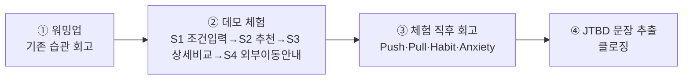

# JTBD 인터뷰 문항지 — 데모 체험 기반

> 입력: [00-방법론.md](./00-방법론.md) · 인터뷰 대상 [C1·C3·A2](./00-방법론.md) · 대상별 확정 Pain [01-Pain리스트.md](../../06.market-opportunity/1인가구한끼해결-시장기회분석/01-Pain리스트.md) · 페르소나 원본 [02-페르소나스펙트럼.md](../../05.persona-journey-map/1인가구한끼해결-페르소나여정/02-페르소나스펙트럼.md)

## 인터뷰 설정 — 데모 체험 후 회고

이번 인터뷰는 일반적인 순수 회상형 JTBD 인터뷰가 아니라, **인터뷰 대상이 한끼라우터 고객용 데모 페이지를 먼저 체험하고, 그 체험을 계기로 기존 경험을 회고·비교하는 방식**으로 설계한다.

- **①워밍업**에서 데모를 보여주기 **전에** 먼저 기존 습관을 말하게 한다 — 데모를 먼저 보여주면 그 인상이 회고를 오염시킨다.
- **②데모 체험**은 [07단계 SRS](../../04.tam-sam-som/1인가구한끼해결-7단계/07-솔루션구체화-SRS.md)의 S1~S4 화면 흐름 그대로 진행한다(S5 피드백은 인터뷰 자체가 피드백 역할을 하므로 생략 가능).
- **③체험 직후 회고**가 이 인터뷰의 핵심이다 — [00-방법론.md §1](./00-방법론.md)의 4가지 힘(Push·Pull·Habit·Anxiety)을 데모라는 구체적 자극에 대한 반응으로 직접 관찰한다.
- **④JTBD 문장 추출**은 모든 대상 공통 클로징이다.

**진행 시간**: [00-방법론.md §2](./00-방법론.md)의 원칙(60~90분)보다 짧게, 데모 체험 10~15분 + 인터뷰 30~40분을 권장한다(데모가 있어 워밍업 스토리텔링에 걸리는 시간이 줄어든다).

---

## 1. 공통 문항지 (C1·C3·A2 전체 공통)

### Part A — 데모 체험 전 워밍업 (기존 경험 회고)

> 데모를 보여주기 전에 진행한다.

1. 최근에 "오늘 뭘 먹을지" 정하기 어려웠던 날을 하나 떠올려 주실 수 있을까요? 그날 무슨 일이 있었나요?
   - (연상 유도) 그때가 하루 중 몇 시였나요? 집이었나요, 밖이었나요?
2. 그 순간 실제로 어떻게 하셨나요? (배달앱을 켰다 / 편의점에 갔다 / 그냥 참았다 등)
3. 그 방법을 쓰기 전에 다른 방법도 고려하셨나요? 어떤 걸 고려했고, 왜 그걸 고르셨나요?
4. 그 방법에서 좋았던 점과 별로였던 점은 각각 무엇이었나요?
5. 그 방법을 못 썼다면 대신 무엇을 하셨을 것 같나요?

### Part B — 데모 체험 (진행 안내)

> 인터뷰이에게: *"지금부터 한끼라우터 데모 페이지를 자유롭게 사용해 보세요. 방금 말씀해 주신 것처럼 실제로 한 끼를 정해야 했던 상황을 그대로 가정하고 입력해 보시면 됩니다."*

**진행자용 관찰 체크리스트** (인터뷰이에게 묻지 않고 관찰·기록)

- [ ] 조건(위치·예산·최대시간·우선순위) 입력 중 머뭇거린 항목이 있는가
- [ ] 추천 결과(절약/빠름/균형 3개 카드)를 보고 처음 보인 표정·반응
- [ ] 상세비교 화면을 눌러봤는가, 눌러봤다면 어느 항목을 가장 오래 봤는가
- [ ] "원 서비스로 이동" 안내를 보고 멈칫했는가

### Part C — 데모 체험 직후 회고 (Push·Pull·Habit·Anxiety)

6. 방금 사용해 보신 걸 보고 처음 든 생각은 무엇이었나요?
7. 조건을 입력하는 과정이, 평소 방법과 비교하면 어땠나요?
8. 추천된 3개 카드를 보고 어떤 느낌이 드셨나요? 그중 하나를 고른다면 무엇을, 왜 고르시겠어요?
9. 총비용·총시간이 표시된 걸 보고, 이 정보를 그대로 믿고 바로 쓸 수 있을 것 같나요? 다시 확인하고 싶은 부분이 있다면 무엇인가요?
10. "원 서비스로 이동해야 한다"는 걸 보셨을 때 어떤 생각이 드셨나요?
11. 평소 쓰시던 방법과 비교했을 때, 이걸 쓰면 무엇이 달라질 것 같나요? 반대로 이게 채워주지 못하는 부분이 있다면 무엇일까요?
12. 이걸 계속 쓴다면, 지금 습관 중 무엇을 바꿔야 할까요? 그게 얼마나 어려울 것 같나요?
13. 이걸 새로 쓰기 시작한다면 걱정되는 점이 있으신가요?

### Part D — JTBD 문장 추출 (클로징, 전원 공통)

14. 다음 문장을 완성해 주시겠어요? — *"**[어떤 상황]**일 때, 나는 **[무엇]**을 원한다. 왜냐하면 **[어떤 결과]**를 얻고 싶어서다."*
15. 오늘 대화 중 더 하고 싶었던 말이나 인상 깊었던 순간이 있다면 자유롭게 말씀해 주세요.

---

## 2. 페르소나별 맞춤 문항지

> Part C(체험 직후 회고) 다음, Part D(클로징) 이전에 각 인터뷰 대상에게만 추가로 질문한다.

### C1 「퇴근을 예측할 수 없다」— 스타트업 백엔드 개발자

> 확인 대상 Pain: [P01](../../06.market-opportunity/1인가구한끼해결-시장기회분석/01-Pain리스트.md)(매번 같은 고민이 반복된다) · [P02](../../06.market-opportunity/1인가구한끼해결-시장기회분석/01-Pain리스트.md)(갱신시각 지난 정보 불신). 기존 대체 솔루션: 배달앱 3개를 번갈아 켜서 가격을 눈으로 비교.

1. 야근이 잦아서 퇴근 시각을 예측하기 어렵다고 하셨는데, 그런 날 저녁 메뉴를 정하는 과정이 보통 어떻게 되나요? 매번 새로 고민하시나요, 아니면 정해둔 패턴이 있나요?
2. 데모에서 조건을 입력했을 때, 퇴근 시각이 매번 달라지는 상황도 반영해 줄 수 있다고 느끼셨나요?
3. 지금은 배달앱 여러 개를 비교하신다고 하셨는데, 그 이유가 뭘까요? 한 곳의 정보만 보면 안 되는 이유가 있으신가요?
4. 데모의 "갱신시각" 표시를 보셨나요? 그걸 보고 신뢰가 더 갔나요, 아니면 여전히 직접 확인해 보고 싶으셨나요?
5. 이 데모가 실제 서비스라면, 지금처럼 앱 3개를 번갈아 켜는 습관을 그만두실 수 있을까요? 무엇이 있으면 그만두실 수 있을까요?

### C3 「매일이 곧 지출이다」— 제조업 대기업 사무직

> 확인 대상 Pain: [P07](../../06.market-opportunity/1인가구한끼해결-시장기회분석/01-Pain리스트.md)(방치될수록 누적 지출이 커진다) · [P09](../../06.market-opportunity/1인가구한끼해결-시장기회분석/01-Pain리스트.md)(지출 누적 확인 못 함). 기존 대체 솔루션: 편의점 도시락으로 며칠 버티다 배달로 복귀.

1. 거의 매일 배달·포장에 의존하신다고 하셨는데, 그게 지출 부담이 된다고 느끼신 게 언제부터인가요? 계기가 있었나요?
2. 데모를 쓰면서 "이번 달에 얼마나 썼는지" 확인할 수 있었나요? 그런 정보가 있었으면 좋겠다고 느끼셨나요?
3. 편의점 도시락으로 며칠 버티다 다시 배달로 돌아가는 패턴이 있다고 하셨는데, 데모가 그 패턴을 바꿀 수 있을 것 같나요? 왜 그런가요?
4. 데모에서 "절약" 모드로 추천받으셨다면, 그게 실제로 지출을 줄여줄 거라는 확신이 드셨나요?
5. 지출을 눈으로 확인하는 게 왜 지금까지 안 되고 있었다고 생각하세요? (도구가 없었나, 확인할 마음의 여유가 없었나 등)

### A2 「또 그 메뉴다」— 프리랜서 디자이너

> 확인 대상 Pain: [P20](../../06.market-opportunity/1인가구한끼해결-시장기회분석/01-Pain리스트.md)(추천이 매번 비슷해 다양성 결핍이 해결되지 않는다). 기존 대체 솔루션: 밀키트를 대량구매해 냉동보관 후 조리.

1. "또 그 메뉴다"라는 느낌이 최근에 언제 가장 강하게 드셨나요? 그때 상황을 좀 더 얘기해 주실 수 있을까요?
2. 데모의 추천 카드를 보고, 평소 쓰시던 앱에서 보던 것과 다르다고 느끼셨나요, 비슷하다고 느끼셨나요?
3. 밀키트를 대량으로 사두고 돌려 드신다고 하셨는데, 그것도 결국 반복이라는 느낌은 없으셨나요? 데모가 그 반복을 깨줄 수 있을 것 같나요?
4. 데모에서 취향·카테고리 입력란을 보셨을 때, 정말 다른 추천을 받을 거라는 기대가 생기셨나요, 아니면 여전히 의심이 드셨나요?
5. 이 서비스를 한 달 써본다면, 밀키트 비축을 그만두실 것 같나요? 왜 그렇게 생각하시나요?

---

## 다음 작업

이 문항지로 **① 실제(또는 롤플레잉) 인터뷰**를 진행하거나, **② AI로 페르소나별 모의 인터뷰**([00-방법론.md §4](./00-방법론.md))를 수행할 수 있다. 어느 쪽으로 진행할지 별도 지시로 정한다.
