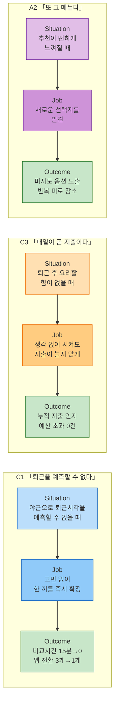

# 🧪 JTBD 인터뷰 **모의** 결과 보고서 — 한끼라우터 (1인 가구 한 끼 해결 플랫폼)

> [방법론 §5](./00-방법론.md) · 입력 [모의 응답지](./02-모의인터뷰응답.md) · [문항지](./01-인터뷰문항지.md) · 원 점수 [AOS 분석](../../06.market-opportunity/1인가구한끼해결-시장기회분석/02-AOS매트릭스.md) · [DOS 분석](../../06.market-opportunity/1인가구한끼해결-시장기회분석/03-DOS매트릭스.md)

> # ⛔ 근거는 모의 응답지다
>
> 방법론 §5의 양식을 그대로 따랐으나, **채운 내용의 출처가 [02-모의인터뷰응답.md](./02-모의인터뷰응답.md)** 다. 실제 인터뷰는 한 건도 수행되지 않았다.
>
> **따라서 이 보고서는 §5 양식의 작성 예행연습이며, 챕터 05·06의 근거 등급을 하나도 바꾸지 못한다.** 아래 재채점된 Importance·Satisfaction 값은 **가정 위에 얹은 가정**이다.
>
> 📌 **그럼에도 만들 가치가 있는 이유** — 양식을 실제로 채워 보면 **어떤 칸이 채워지지 않는지**가 드러난다. 이 문서에서 비는 칸(측정 표현 8개 중 7개)이 곧 **실제 인터뷰에서 반드시 받아 와야 할 항목의 목록**이다.

---

## 0. 작성 규칙

### 세 가지 표기 규칙

| # | 규칙 | 근거 |
| --- | --- | --- |
| **1** | **DOS에는 모수를 반드시 병기한다** — `0.60 (SAM · MR 0.20)` | 방법론 §5는 `TAM(%)`로 고정 표기하지만 [03-DOS매트릭스.md §0](../../06.market-opportunity/1인가구한끼해결-시장기회분석/03-DOS매트릭스.md)이 **TAM을 기각하고 SAM·SOM 병기를 채택**했다 |
| **2** | **Pain을 Outcome으로 변환하되 측정 표현은 참가자 진술에서만 가져온다** | 우리가 숫자를 정하면 다시 가정이 된다 |
| **3** | **인터뷰에서 드러난 재채점·신규 Outcome을 그대로 반영한다** | 원 Pain 5개(P01·P02·P07·P09·P20)를 그대로 베끼면 인터뷰를 한 의미가 없다 — 응답에서 나온 신규 요구·순위 변화를 §2~3에 반영 |

### Market Relevance (03-DOS매트릭스.md §0 승계)

| 인물 | SAM MR | SOM MR |
| --- | :---: | :---: |
| C1 「퇴근을 예측할 수 없다」 | 0.20 | 0.90 |
| C3 「매일이 곧 지출이다」 | 0.20 | 0.60 |
| A2 「또 그 메뉴다」 | 0.13 | 0.00 |

---

## 1. JTBD 요약 카드

### 1-1. C1 「퇴근을 예측할 수 없다」— 스타트업 백엔드 개발자

| 필드 | 내용 |
| --- | --- |
| **Persona / Segment** | **코어(Core)** — 야근 빈도가 높고 퇴근 시각을 예측할 수 없음 |
| **Situation** | 야근으로 퇴근 시각이 언제인지도 모를 때 |
| **Job Statement** | 뭘 먹을지 세 개 앱을 돌려가며 고민하지 않고, 한 끼를 즉시 확정하고 싶다 |
| **Desired Outcome** | 비교에 쓰는 시간을 아껴 조금이라도 빨리 쉬고 싶다 |
| **4 Forces** | **Push**: 세 앱을 오가며 비교하는 동안 더 배고파지는 비효율 / **Pull**: 한 화면에서 끝나는 비교 / **Habit**: 직접 대조해야 신뢰가 가는 검증 습관 — 데모 한 번으로는 안 버려짐 / **Anxiety**: 갱신시각을 봐도 그 사이 품절·가격변동 우려, 외부이동 후 정보가 다를까 하는 걱정 |
| **Current Solutions** | 배달앱 3개(배민·쿠팡이츠·요기요)를 번갈아 켜서 가격을 눈으로 비교 |
| **Switch Triggers / Barriers** | **Trigger**: 야근이 반복될수록 쌓이는 비교 피로 / **Barrier**: 데이터 신뢰가 검증되기 전까지는 원래 앱도 같이 켜서 대조하려 함 |
| **Evidence** | *"세 개를 왔다 갔다 하면서 가격 비교하다가 15분은 그냥 날린 것 같아요."* / *"숫자를 보여주는 거랑 그게 실제로 맞는 거랑은 다르니까."* / *"몇 번 정확했다는 게 쌓이면 그만둘 수 있을 것 같아요."* / *"최근 조건 기억해주면 좋겠어요."* |
| **Priority (AOS / DOS)** | 즉시 확정(O01) **AOS 3.0 · DOS 0.60 (SAM·MR 0.20) / 2.70 (SOM·MR 0.90)** 과거 정확도 이력 확인(O03, 🆕) **AOS 2.4 · DOS 0.40 / 1.80** 화면 정보를 그대로 신뢰(O04) **AOS 2.4 · DOS 0.40 / 1.80** 조건 자동 기억(O07, 🆕) **AOS 1.8 · DOS 0.20 / 0.90** |
| **Notes** | 🆕 **정보 신뢰(P02)가 "실시간 정보 표시"로는 안 풀린다는 게 드러났다** — 대신 **"과거에 몇 번이나 정확했는가"라는 이력 증명**을 원한다. 반복 결정 축소(P01)도 조건 재입력을 줄이는 더 구체적인 형태(O07)로 좁혀졌다 |

### 1-2. C3 「매일이 곧 지출이다」— 제조업 대기업 사무직

| 필드 | 내용 |
| --- | --- |
| **Persona / Segment** | **코어(Core)** — 정시퇴근이지만 요리 의욕 없어 거의 매일 배달·포장에 의존 |
| **Situation** | 퇴근하고 요리할 힘이 하나도 없을 때 |
| **Job Statement** | 생각 없이 그냥 시키고 싶다, 그러면서도 지출은 늘리고 싶지 않다 |
| **Desired Outcome** | 나중에 카드값 보고 후회하고 싶지 않다 |
| **4 Forces** | **Push**: 카드값 보고 놀랄 만큼 쌓인 배달비 / **Pull**: 예산 입력란이 처음으로 지출을 자각하게 함 / **Habit**: 앱 켜고 바로 시키는, 생각을 거치지 않는 습관 / **Anxiety**: 매번 켜서 확인해야 한다는 것 자체가 새 숙제로 느껴짐 |
| **Current Solutions** | 거의 매일 배달·포장 의존, 가끔 편의점 도시락으로 며칠 버티다 다시 배달로 복귀 |
| **Switch Triggers / Barriers** | **Trigger**: 카드값을 본 순간의 충격 / **Barrier**: 이번 달 누적 지출을 보여주는 기능이 데모에 없음, 확인 행위 자체가 새 부담 |
| **Evidence** | *"카드값 보고 좀 놀랐어요, 이번 달에 배달비만 얼마 나갔는지."* / *"누적 지출 보여주는 기능 있으면 진짜 좋을 것 같아요."* / *"매번 이걸 켜야 한다는 게 저한테는 하나의 숙제가 될 수도 있을 것 같아요."* |
| **Priority (AOS / DOS)** | 누적 지출 확인(O02, ↑) **AOS 3.2 · DOS 0.60 (SAM·MR 0.20) / 1.80 (SOM·MR 0.60)** 지출 방치 인지(O05) **AOS 2.4 · DOS 0.40 / 1.20** 예산 확인의 자동화(O06, 🆕) **AOS 2.4 · DOS 0.40 / 1.20** |
| **Notes** | ↑ **P09(누적 지출 확인)가 원래보다 더 크게 뛰었다** — 추상적 Pain이 인터뷰를 거치며 "누적 지출 대시보드"라는 구체적 기능 요구로 좁혀지고, 그만큼 Importance를 3→4로 올려 잡을 근거가 생겼다(§3-3). 다만 **확인 행위 자체가 새 숙제가 되면 안 된다**는 조건(O06)이 새로 붙는다 — 수동 확인이 아니라 자동 인지여야 한다 |

### 1-3. A2 「또 그 메뉴다」— 프리랜서 디자이너

| 필드 | 내용 |
| --- | --- |
| **Persona / Segment** | **확장(Adjacent)** — 배달앱 사용 경력이 길어 추천 피로가 누적됨 |
| **Situation** | 배달앱을 켜도 뭘 볼지 뻔하게 느껴질 때 |
| **Job Statement** | 뭔가 새로운 걸 발견하고 싶다 |
| **Desired Outcome** | 매번 같은 걸 먹는 지겨움과 그 지겨움이 주는 스트레스에서 벗어나고 싶다 |
| **4 Forces** | **Push**: 추천이 낯익어 앱을 그냥 꺼버릴 정도의 반복 피로 / **Pull**: 취향·카테고리 입력란을 보고 생긴 기대 / **Habit**: 밀키트를 미리 대량구매해 돌려 먹는, 이미 자리 잡은 대체 습관 / **Anxiety**: 뚜렷하지 않음 — "이것도 결국 비슷하네"라는 무관심에 가까운 실망 |
| **Current Solutions** | 밀키트를 대량구매해 냉동보관 후 조리 |
| **Switch Triggers / Barriers** | **Trigger**: 추천 낯익음에 대한 피로가 누적될 때 / **Barrier**: 데모 결과도 결국 익숙한 브랜드들 — "이번엔 다르네" 하는 확신이 아직 생기지 않음 |
| **Evidence** | *"이것도 결국 제가 아는 데들이네."* / *"지금 상태로는 안 그만둘 것 같아요. 이게 매번 다른 걸 보여준다는 확신이 서면 다시 생각해볼 것 같긴 한데."* |
| **Priority (AOS / DOS)** | 매번 다른 선택지 추천(O08, ↓) **AOS 1.8 · DOS 0.13 (SAM·MR 0.13) / 0.00 (SOM·MR 0.00)** |
| **Notes** | ↓ **다양성 결핍(P20)이 원래보다 약하게 나왔다** — 응답의 어조가 "심각한 불편"이 아니라 "지루함·체념"에 가까워, Importance를 4→3으로 낮춰 잡을 근거가 생겼다(§3-1). Push는 확인됐지만 데모가 Pull을 만들지 못해 **4 Forces가 불균형**한 상태다 |

---

## 2. Outcome 목록표

> **AOS = Imp × (1 − Sat/5)** · **DOS = (Imp − Sat) × MR** · MR은 [03-DOS매트릭스.md §0](../../06.market-opportunity/1인가구한끼해결-시장기회분석/03-DOS매트릭스.md) 승계
> **정렬: DOS(SAM) 내림차순** · `Δ`는 [02-AOS매트릭스.md](../../06.market-opportunity/1인가구한끼해결-시장기회분석/02-AOS매트릭스.md)·[03-DOS매트릭스.md](../../06.market-opportunity/1인가구한끼해결-시장기회분석/03-DOS매트릭스.md) 원 점수 대비 변화

| # | Outcome (고객이 원하는 결과) | 인물 | Imp | Sat | **AOS** | MR SAM | **DOS** SAM | DOS SOM | Δ | 증거 |
| :---: | --- | :---: | :---: | :---: | :---: | :---: | :---: | :---: | :---: | --- |
| **O01** | 반복 결정 없이 **즉시 확정** | C1 | 5 | 2 | 3.0 | 0.20 | **0.60** | 2.70 | — | *"15분은 그냥 날린 것 같아요"* |
| **O02** | **누적 지출을 확인**해 통제 | C3 | 4 | 1 | 3.2 | 0.20 | **0.60** | 1.80 | ↑ | *"누적 지출 보여주는 기능 있으면"* |
| **O03** | 과거 **정확도 이력**을 근거로 신뢰 | C1 | 3 | 1 | 2.4 | 0.20 | **0.40** | 1.80 | 🆕 | *"몇 번 정확했다는 게 쌓이면"* |
| **O04** | 화면 정보를 **그대로 믿고** 선택 | C1 | 4 | 2 | 2.4 | 0.20 | **0.40** | 1.80 | — | *"숫자를 보여주는 거랑 맞는 거랑은 다르니까"* |
| **O05** | 지출이 쌓이는 걸 **미리 인지·조절** | C3 | 4 | 2 | 2.4 | 0.20 | **0.40** | 1.20 | — | *"카드값 보고 좀 놀랐어요"* |
| **O06** | 예산 확인이 **자동으로**, 새 숙제 없이 | C3 | 3 | 1 | 2.4 | 0.20 | **0.40** | 1.20 | 🆕 | *"이것도 하나의 숙제가 될 수도"* |
| **O07** | 조건 재입력 없이 **최근 조건 기억** | C1 | 3 | 2 | 1.8 | 0.20 | **0.20** | 0.90 | 🆕 | *"최근 조건 기억해주면 좋겠어요"* |
| **O08** | 매번 **다른 선택지**를 추천 | A2 | 3 | 2 | 1.8 | 0.13 | **0.13** | 0.00 | ↓ | *"지금 상태로는 안 그만둘 것 같아요"* |

> 📌 **측정 표현이 붙은 Outcome은 8개 중 1개뿐이다** — O01("15분"). **전부 참가자가 말한 수치에서 나왔다.** 나머지 7개는 측정 표현이 비어 있고, **그 빈칸이 실제 인터뷰에서 반드시 받아 와야 할 목록**이다.

---

## 3. 재채점이 바꾼 것

### 3-1. 무너진 것

| Outcome | 원 점수(챕터 06) | 재채점 | 무슨 일이 |
| --- | :---: | :---: | --- |
| **O08** 다양성 결핍(P20) | AOS 2.4 · DOS(SAM) 0.26 | AOS **1.8** · DOS(SAM) **0.13** | 응답의 어조가 "심각한 불편"이 아니라 **"지루함·체념"** 에 가까워 Importance를 4→3으로 낮춤 |

> 🚨 **A2에게 유일하게 배정된 Outcome이 하향 조정됐다.** 페르소나 스펙트럼이 상정한 "이 페르소나를 정의하는 문제"만큼 절박하지 않을 수 있다는 신호다.

### 3-2. 새로 생긴 것

| Outcome | AOS | DOS(SAM) | 어디서 나왔나 |
| --- | :---: | :---: | --- |
| **O03** 정확도 이력 확인 | 2.4 | **0.40** | C1 세션 — "실시간 정보"가 아니라 "과거 이력 증명"이 신뢰의 실체임이 드러남 |
| **O06** 예산 확인의 자동화 | 2.4 | **0.40** | C3 세션 — 확인 행위 자체가 새 부담이 되면 습관이 안 바뀐다는 발견 |
| **O07** 조건 자동 기억 | 1.8 | **0.20** | C1 세션 — 반복 결정 축소(P01)가 "메뉴 확정"뿐 아니라 "조건 재입력"까지 포함한다는 발견 |

> 📌 **신규 3개 중 2개가 C1 세션에서 나왔다.** 정량 분석(챕터 06)에서는 P01·P02가 단일 항목이었지만, 인터뷰를 거치며 각각 더 구체적인 두 갈래(이력 증명 / 조건 기억)로 갈라졌다.

### 3-3. 순위가 크게 오른 것

| Outcome | 변화 | 이유 |
| --- | --- | --- |
| **O02** 누적 지출 확인 | DOS(SAM) 0.40 → **0.60**, DOS(SOM) 1.20 → **1.80** | Importance를 3→4로 올림 — 참가자가 구체적 기능("대시보드")을 자발적으로 요청할 만큼 desire가 강하게 확인됨 |

> 📌 **P09처럼 추상적으로 서술된 Pain이, 인터뷰를 거치며 구체적 기능 요구로 좁혀질수록 순위가 오른다.** O08의 하락과 정반대 방향이다.

### 3-4. 기능 단위 재환원

| 기능 | 포함 Outcome | DOS(SAM) 합 |
| --- | --- | :---: |
| **① 지출 가시화** | O02 · O05 · O06 | **1.40** |
| **② 반복 결정 축소** | O01 · O07 | **0.80** |
| **③ 신뢰 증명** | O03 · O04 | **0.80** |
| **④ 다양성** | O08 | **0.13** |

> 🎯 **"지출 가시화"가 인터뷰 이후 가장 큰 덩어리로 올라선다.** 챕터 06에서는 "즉시 결정 지원"(P01·P13 포함, 다른 인물까지 합산)이 1위였지만, 이번 3인 부분집합만 놓고 보면 **지출 가시화가 반복 결정 축소·신뢰 증명을 모두 앞선다** — C3의 "누적 지출 확인" 요구가 인터뷰를 거치며 구체화되고 강화된 결과다.

---

## 4. 관통하는 인사이트

**① "생각하지 않고도 안전하게 결정하고 싶다"는 공통 동기가, 인터뷰를 거치며 서로 다른 구체적 기능으로 갈라졌다.** C1은 "정확도 이력", C3는 "지출 대시보드", A2는 여전히 "다양성"이지만 그 절박함은 약해졌다.

**② 정량 분석이 못 보는 것은 "구현 형태"다.** P02(정보 신뢰)는 챕터 06에서 "갱신시각 표시"로 처방됐지만, 실제로는 **"과거에 몇 번이나 정확했는가"라는 이력 증명**이 필요하다는 것이 인터뷰에서만 드러났다. 점수는 무엇이 문제인지는 맞혔지만 무엇으로 풀어야 하는지는 못 맞혔다.

**③ "확인해야 하는 행동"은 그 자체로 새 습관 비용이다.** C3는 지출을 확인하고 싶어 하면서도, 확인이라는 행위 자체가 "숙제"가 되는 것을 경계했다(O06). 해법은 사용자가 켜서 확인하는 것이 아니라 **자동으로 인지되는 것**이어야 한다 — 여기서도 정량 분석은 "무엇을 보여줄지"만 답하고 "어떻게 보여줄지"는 답하지 못했다.

---

## 5. 근거 등급

| 구성 요소 | 등급 | 비고 |
| --- | --- | --- |
| §5(방법론) 양식 준수 여부 | **(확인)** | 요약 카드 10개 필드 전부 채움 |
| MR 값 | **(가정)** | [03-DOS매트릭스.md §0](../../06.market-opportunity/1인가구한끼해결-시장기회분석/03-DOS매트릭스.md) 승계 — 그 자체가 작업 가정 |
| **Imp·Sat 재채점 8개 전부** | **(가정)** | **모의 응답 기반. 실제 인터뷰 없음** |
| **인용문 전부** | **(가정)** | 생성된 발화. 실존 인물의 말이 아니다 |
| 참가자 진술 수치 1개(O01의 "15분") | **(가정)** | 전부 생성값 |

> ⛔ **이 보고서의 어떤 값도 챕터 05·06의 근거 등급을 올리지 못한다.** §3의 Δ 표는 *"인터뷰가 점수를 이만큼 움직일 수 있다"*는 변동 폭의 예시이며, 그 방향이 맞다는 근거는 어디에도 없다.

---

## 6. 다음 단계

| 순위 | 할 일 | 이 보고서가 남긴 것 |
| :---: | --- | --- |
| **1** | **실제(또는 롤플레잉) 인터뷰 실행** | 대상 3인(C1·C3·A2) · [01-인터뷰문항지.md](./01-인터뷰문항지.md) |
| **2** | **측정 표현 7개 확보** | §2에서 비어 있는 칸. 인터뷰에서 "몇 분", "얼마나 자주"를 반드시 받아 적는다 |
| **3** | **O08(다양성) 재검증** | 하향 조정됐지만 표본 1로 폐기할 수 없다 — A2 유형 표본을 늘려 확인 |
| **4** | **O02(지출 대시보드) 우선 실험** | 인터뷰에서 가장 강한 desire로 확인됨 — SRS 기능 정의([04.tam-sam-som §07](../../04.tam-sam-som/1인가구한끼해결-7단계/07-솔루션구체화-SRS.md))에 반영할지 검토 |
| **5** | **O03(정확도 이력) 실험** | "실시간 정보 표시"가 아니라 "과거 정확도 이력 노출" UI 프로토타입 필요 |

**→ 실제 인터뷰가 끝나면 이 문서를 폐기하고 같은 양식으로 다시 쓴다.** 이 보고서의 용도는 **양식이 어디서 비는지 보여주는 것**이었고, 그 답은 §2 아래 📌에 있다 — **측정 표현 8칸 중 7칸이 비었다.**
