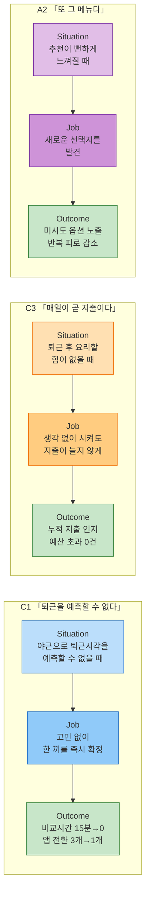

# JTBD 인터뷰 결과 보고서 — C1·C3·A2 요약 카드 & Outcome 목록표

> 방법론 [§5](./00-방법론.md) · 입력 [02-모의인터뷰응답.md](./02-모의인터뷰응답.md) · Pain/AOS 원값 [02-AOS매트릭스.md](../../06.market-opportunity/1인가구한끼해결-시장기회분석/02-AOS매트릭스.md) · DOS 원값 [03-DOS매트릭스.md](../../06.market-opportunity/1인가구한끼해결-시장기회분석/03-DOS매트릭스.md)
>
> ⚠️ 입력이 [02-모의인터뷰응답.md](./02-모의인터뷰응답.md)의 **(가정) 등급 모의 응답**이므로, 이 문서 역시 "실제 인터뷰였다면"을 가정한 재배열이다. 실제(또는 롤플레잉) 인터뷰를 수행하면 이 문서를 대조 기준으로 재작성한다.

---

## 0. 세 사람의 JTBD를 한 장으로

---

## 1. 요약 카드 — C1 「퇴근을 예측할 수 없다」

| 필드 | 내용 |
| --- | --- |
| **Persona / Segment** | **코어(Core)** — 스타트업 백엔드 개발자, 야근 빈도가 높고 퇴근 시각을 예측할 수 없음 |
| **Situation (When …)** | 야근으로 퇴근 시각이 언제인지도 모를 때 |
| **Job Statement (… I want to …)** | 뭘 먹을지 세 개 앱을 돌려가며 고민하지 않고, 한 끼를 즉시 확정하고 싶다 |
| **Desired Outcome (… so I can …)** | 비교에 쓰는 15분이라도 아껴서 조금이라도 빨리 쉬고 싶다 — *측정: 메뉴 결정 시간 15분→즉시, 오가는 앱 3개→1개* |
| **4 Forces** | **Push**: 세 앱을 오가며 비교하는 동안 더 배고파지는 비효율 — "15분은 그냥 날린 것 같아요" / **Pull**: 한 화면에서 끝나는 비교 — "세 개 앱 켤 필요가 없네" / **Habit**: 직접 대조해야 신뢰가 가는 검증 습관 — "몇 번 정확했다는 게 쌓여야" 버릴 수 있음 / **Anxiety**: 갱신시각을 봐도 그 사이 품절·가격변동 우려, 원 서비스 이동 후 정보가 다를까 하는 걱정 |
| **Current Solutions / Workarounds** | 배달앱 3개(배민·쿠팡이츠·요기요)를 번갈아 켜서 가격을 눈으로 비교 |
| **Switch Triggers / Barriers** | **Trigger**: 야근이 반복될수록 쌓이는 비교 피로 / **Barrier**: 데이터 신뢰가 검증되기 전까지는 원래 앱도 같이 켜서 대조하려 함 — 습관이 한 번에 사라지지 않음 |
| **Evidence (Quotes)** | "세 개를 왔다 갔다 하면서 가격 비교하다가 15분은 그냥 날린 것 같아요." / "숫자를 보여주는 거랑 그게 실제로 맞는 거랑은 다르니까." |
| **Priority (AOS / DOS)** | P01: AOS **3.0**, DOS(SAM) **0.60**, DOS(SOM) **2.70** — P02: AOS **2.4**, DOS(SAM) **0.40**, DOS(SOM) **1.80** |
| **Notes** | "최근 조건 기억" 같은 반복 입력 축소 기능 실험 후보. Anxiety가 예상보다 강함 — 단순 정보 제공만으로는 안 되고, **반복적으로 정확했다는 이력**을 보여줘야 습관이 이탈함 |

---

## 2. 요약 카드 — C3 「매일이 곧 지출이다」

| 필드 | 내용 |
| --- | --- |
| **Persona / Segment** | **코어(Core)** — 제조업 대기업 사무직, 정시퇴근이지만 요리 의욕 없어 거의 매일 배달·포장에 의존 |
| **Situation (When …)** | 퇴근하고 요리할 힘이 하나도 없을 때 |
| **Job Statement (… I want to …)** | 생각 없이 그냥 시키고 싶다, 그러면서도 지출은 늘리고 싶지 않다 |
| **Desired Outcome (… so I can …)** | 나중에 카드값 보고 후회하고 싶지 않다 — *측정: 이번 달 배달·포장 누적 지출을 인지, 예산 초과 0건* |
| **4 Forces** | **Push**: 카드값 보고 놀랄 만큼 쌓인 배달비 — "이게 다 배달비야?" / **Pull**: 예산 입력란이 처음으로 지출을 자각하게 함 — "내가 오늘 얼마까지 쓸 수 있지 하고 처음으로 생각해봤어요" / **Habit**: 앱 켜고 바로 시키는, 생각을 거치지 않는 습관 / **Anxiety**: 매번 켜서 확인해야 한다는 것 자체가 새 숙제로 느껴짐 |
| **Current Solutions / Workarounds** | 거의 매일 배달·포장 의존, 가끔 편의점 도시락으로 며칠 버티다 다시 배달로 복귀 |
| **Switch Triggers / Barriers** | **Trigger**: 카드값을 본 순간의 충격 / **Barrier**: 이번 달 누적 지출을 보여주는 기능이 데모에 없음 — "그게 있었으면 진짜 좋았을 것 같아요" |
| **Evidence (Quotes)** | "카드값 보고 좀 놀랐어요, 이번 달에 배달비만 얼마 나갔는지." / "누적 지출 보여주는 기능 있으면 진짜 좋을 것 같아요." |
| **Priority (AOS / DOS)** | P07: AOS **2.4**, DOS(SAM) **0.40**, DOS(SOM) **1.20** — P09: AOS **2.4**, DOS(SAM) **0.40**, DOS(SOM) **1.20** |
| **Notes** | **새로운 발견**: 기존 P09("지출 누적 확인 못 함")가 인터뷰를 거치며 "누적 지출 대시보드"라는 구체적 기능 요구로 좁혀짐 — 다음 스프린트 최우선 실험 후보 |

---

## 3. 요약 카드 — A2 「또 그 메뉴다」

| 필드 | 내용 |
| --- | --- |
| **Persona / Segment** | **확장(Adjacent)** — 프리랜서 디자이너, 배달앱 사용 경력이 길어 추천 피로가 누적됨 |
| **Situation (When …)** | 배달앱을 켜도 뭘 볼지 뻔하게 느껴질 때 |
| **Job Statement (… I want to …)** | 뭔가 새로운 걸 발견하고 싶다 |
| **Desired Outcome (… so I can …)** | 매번 같은 걸 먹는 지겨움과 그 지겨움이 주는 스트레스에서 벗어나고 싶다 — *측정: 최근 N회 추천 중 미시도 옵션 비율 상승* |
| **4 Forces** | **Push**: 추천이 낯익어 앱을 그냥 꺼버릴 정도의 반복 피로 / **Pull**: 취향·카테고리 입력란을 보고 생긴 기대 — "이건 뭔가 다른 걸 보여줄까" / **Habit**: 밀키트를 미리 대량구매해 돌려 먹는, 이미 자리 잡은 대체 습관 / **Anxiety**: 뚜렷하지 않음 — 오히려 "이것도 결국 비슷하네"라는 무관심에 가까운 실망(기대 미충족) |
| **Current Solutions / Workarounds** | 밀키트를 대량구매해 냉동보관 후 조리 |
| **Switch Triggers / Barriers** | **Trigger**: 추천 낯익음에 대한 피로가 누적될 때 / **Barrier**: 데모 결과도 결국 익숙한 브랜드들 — "이번엔 다르네" 하는 확신이 아직 생기지 않음 |
| **Evidence (Quotes)** | "이것도 결국 제가 아는 데들이네." / "지금 상태로는 안 그만둘 것 같아요. 이게 매번 다른 걸 보여준다는 확신이 서면 다시 생각해볼 것 같긴 한데." |
| **Priority (AOS / DOS)** | P20: AOS **2.4**, DOS(SAM) **0.26**, DOS(SOM) **0.00** |
| **Notes** | Push는 확인됐지만 데모가 Pull을 만들지 못함 — **4 Forces가 불균형**한 상태(Push > Pull)라 지금 상태로는 전환이 일어나지 않을 위험. 다양성을 채우려면 신규·비인기 매장 데이터 확보가 선결 과제([02-AOS매트릭스.md §7-1](../../06.market-opportunity/1인가구한끼해결-시장기회분석/02-AOS매트릭스.md)의 데이터 확보 트랙과 같은 성격) |

---

## 4. Outcome 목록표 — 세 사람 통합, DOS(SOM) 내림차순

| Outcome(고객이 원하는 결과) | 인물 | Imp | Sat | AOS | MR(SAM) | DOS(SAM) | MR(SOM) | DOS(SOM) | 증거(인용) |
| --- | :---: | :---: | :---: | :---: | :---: | :---: | :---: | :---: | --- |
| 반복 결정 없이 즉시 확정(P01) | C1 | 5 | 2 | **3.0** | 0.20 | 0.60 | 0.90 | **2.70** | "15분은 그냥 날린 것 같아요" |
| 화면 정보를 그대로 믿고 선택(P02) | C1 | 4 | 2 | **2.4** | 0.20 | 0.40 | 0.90 | **1.80** | "숫자를 보여주는 거랑 맞는 거랑은 다르니까" |
| 지출이 쌓이는 걸 미리 인지·조절(P07) | C3 | 4 | 2 | **2.4** | 0.20 | 0.40 | 0.60 | **1.20** | "카드값 보고 좀 놀랐어요" |
| 누적 지출을 눈으로 확인해 통제(P09) | C3 | 3 | 1 | **2.4** | 0.20 | 0.40 | 0.60 | **1.20** | "누적 지출 보여주는 기능 있으면" |
| 매번 다른 선택지를 추천(P20) | A2 | 4 | 2 | **2.4** | 0.13 | 0.26 | 0.00 | **0.00** | "이것도 결국 제가 아는 데들이네" |

> 📌 **DOS(SOM) 기준으로 C1·C3의 4개 Outcome이 상위를 차지하고, A2의 Outcome만 0으로 떨어진다** — [03-DOS매트릭스.md §8](../../06.market-opportunity/1인가구한끼해결-시장기회분석/03-DOS매트릭스.md)이 이미 "1년차엔 C1·C3·C5, 확장 단계엔 A2·X1·X2"로 나눈 결론과 이 모의 인터뷰가 정확히 같은 방향을 가리킨다 — **A2가 인터뷰에서도 "이 데모로는 안 바뀐다"고 명시적으로 확인했다는 점**이 이 문서가 추가한 새 근거다.

---

## 5. 종합 인사이트

### 5-1. 공통 패턴 — "생각하지 않고도 안전하게 결정하고 싶다"

세 사람의 Job Statement는 표면적으로 다르지만(즉시 확정 / 지출 억제 / 새로움 발견), 밑에 흐르는 동기는 같다 — **반복되는 판단 부담을 없애면서도, 그 판단을 남에게 맡겼을 때의 리스크(품절·과소비·똑같음)를 지고 싶지 않다는 것**이다. C1·C3는 "믿고 맡길 수 있는가"(신뢰), A2는 "맡겨도 결과가 다를 것인가"(다양성)로 리스크의 종류가 갈린다.

### 5-2. C1·C3 — 1년차 검증 순서와 정확히 일치

Outcome 목록표의 DOS(SOM) 순위(C1 2건 > C3 2건 > A2 0)는 [03-DOS매트릭스.md §8](../../06.market-opportunity/1인가구한끼해결-시장기회분석/03-DOS매트릭스.md)이 이미 지정한 "SOM 기준 1년차 PoC 우선순위"와 동일하다. 모의 인터뷰가 기존 정량 분석을 뒤집지 않고 **재확인**했다는 뜻이며, 동시에 두 사람의 응답에서 **정량 분석에는 없던 구체적 실험 아이디어**가 나왔다는 것이 이 인터뷰 단계의 실질적 부가가치다.

- C1: 정보 신뢰(P02)의 해법이 "더 많은 정보 표시"가 아니라 **"반복적으로 정확했다는 이력 노출"** 일 수 있다는 가설
- C3: 지출 인지(P09)의 해법이 **"누적 지출 대시보드"** 라는 구체적 UI로 좁혀짐

### 5-3. A2 — Push는 확인, Pull은 미확인

A2는 유일하게 "이 데모로는 습관이 안 바뀐다"고 스스로 밝힌 사례다. Push(반복 피로)는 페르소나 스펙트럼·Pain 리스트가 예상한 그대로 확인됐지만, 데모가 Pull(새로움에 대한 확신)을 만들어내지 못했다 — 4 Forces 프레임에서 **Push>Pull로 힘의 균형이 무너진 상태**이며, [02-AOS매트릭스.md §7-1](../../06.market-opportunity/1인가구한끼해결-시장기회분석/02-AOS매트릭스.md)이 지목한 "다양성 기능의 데이터 확보 문제"가 여전히 미해결임을 인터뷰로도 재확인한 셈이다.

### 5-4. 다음 실험 우선순위 (DOS(SOM) 기준)

| 순위 | 실험 | 대상 Outcome | 근거 |
| :---: | --- | --- | --- |
| 1 | 반복 결정 축소 — "최근 조건 기억"·정확도 이력 노출 | P01·P02 (C1) | DOS(SOM) 최상위 2건, 신뢰 이력이라는 구체적 실험 아이디어 확보 |
| 2 | 누적 지출 대시보드 | P07·P09 (C3) | DOS(SOM) 3~4위, 인터뷰에서 구체적 기능형으로 좁혀진 유일한 항목 |
| 3(보류) | 다양성 확대(신규·비인기 매장 노출) | P20 (A2) | DOS(SOM) 0 — 데이터 확보 트랙 완료 후 재실험 |

---

## 6. 근거 등급

| 구성 요소 | 등급 | 비고 |
| --- | --- | --- |
| Importance·Satisfaction·AOS·MR·DOS 원값 | **(가정)** | [02-AOS매트릭스.md](../../06.market-opportunity/1인가구한끼해결-시장기회분석/02-AOS매트릭스.md)·[03-DOS매트릭스.md](../../06.market-opportunity/1인가구한끼해결-시장기회분석/03-DOS매트릭스.md)에서 승계, 재평가하지 않음 |
| 요약 카드의 Situation/Job/Outcome/4 Forces/Evidence | **(가정)** | [02-모의인터뷰응답.md](./02-모의인터뷰응답.md)의 모의 응답에서 추출 — 실제 발화가 아님 |
| §5 종합 인사이트 | **(가정)** | 위 두 (가정) 요소의 조합에서 도출한 해석 |

> ⚠️ **이 보고서가 검증하는 것은 "방법론(§5 양식)이 우리 데이터에 맞게 작동하는가"이며, "실제 고객이 이렇게 말할 것인가"는 아직 검증되지 않았다.** 실제(또는 롤플레잉) 인터뷰 수행 후, 이 문서의 각 필드를 실제 응답으로 교체하면 근거 등급이 (가정)에서 (확인)으로 올라간다.

---

## 다음 단계

| 순위 | 할 일 | 이유 |
| :---: | --- | --- |
| 1 | 실제(또는 롤플레잉) 인터뷰 수행 후 이 문서 재작성 | 지금은 전부 (가정) 등급 — [00-방법론.md §심화](./00-방법론.md)의 "JTBD 기반(실제 인터뷰)" 등급으로 승격되지 않음 |
| 2 | "반복 정확성 이력 노출"·"누적 지출 대시보드" 두 실험을 SRS 기능 정의([04.tam-sam-som §07](../../04.tam-sam-som/1인가구한끼해결-7단계/07-솔루션구체화-SRS.md))에 반영할지 검토 | §5-4 우선순위 1·2위 |
| 3 | A2의 다양성 실험은 데이터 확보 트랙 완료까지 보류 | §5-3, DOS(SOM) 0 |
