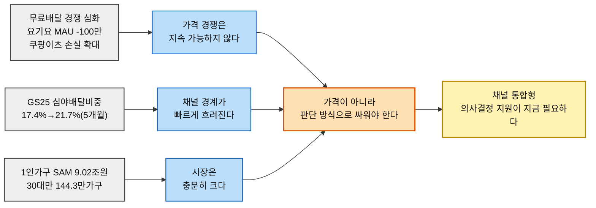
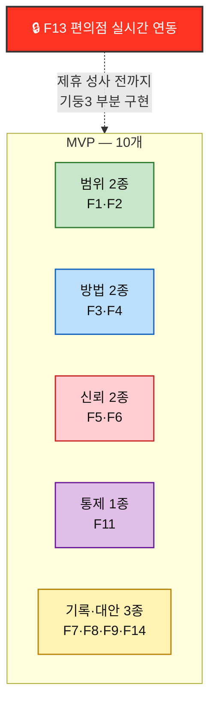

# Value Proposition Statement — 한끼라우터 v2.0 (rooted)

> **이 문서는 자기완결적(self-contained)이다.** v1.0 합본(`한끼라우터-VPS-v1_0.md`)의 목차 구조를 그대로 유지하면서, 그 문서가 다른 챕터 문서로 링크만 걸어두었던 모든 리서치·분석·기획 지식을 **이 파일 안에 직접 인용해 넣었다.** 다른 파일을 열어보지 않아도 이 문서 하나로 프로젝트 전체의 근거를 확인할 수 있다. 근거의 출처는 각 절 상단에 *(원문: OO장 문서명)* 형태의 평문 각주로만 표시하고, 파일 경로 링크는 쓰지 않는다.

---

## 0. Executive Summary

**핵심 타깃**: 단순히 "30대 1인가구"가 아니라, **평일 퇴근 후 예산과 시간이 동시에 부족해 배달·포장·편의점-HMR 중 무엇을 고를지 반복해서 고민하는 사람**이다. 30대 1인가구는 이 상황을 검증하기 위한 PoC 모집 프록시다.

**핵심 문제**: 고객은 주문 자체를 못 해서가 아니라, 세 가지가 한꺼번에 해결되지 않아 피로를 겪는다 — ① 여러 채널을 오가며 가격·시간을 매번 다시 비교해야 함 ② 화면의 가격·시간·재고 정보가 실제와 맞는지 확신하기 어려움 ③ 한 번의 지출은 작아 보여도 누적 지출을 제때 인지·조절하기 어려움.

**Value Proposition**

> **오늘 가진 돈과 시간 안에서, 가장 납득되는 한 끼를 더 빨리 고르게 합니다.**

**이 문서에서 확정한 것**:
1. 원안(SRS)에서 SHOULD·후순위였던 "지출 요약"을 **경량 누적 지출 대시보드**로 범위를 좁혀 MVP에 승격한다 — AOS·DOS 최우선(P07·P09)과 JTBD 모의 인터뷰 양쪽에서 반복 확인됐다.
2. **C5(Q4 원형 핵심 페르소나)가 JTBD 인터뷰 대상에서 빠져 있다** — C1이 Q4 전체를 대표한다고 가정하면 안 되며, 실제 인터뷰 단계에서 반드시 보강해야 한다.
3. 경쟁 비교에서 한끼라우터가 **약한 축(매장 재고·개인 쿠폰 실시간성)도 하나 인정**한다 — 모든 축에서 이긴다고 말하지 않는다.

---

## 1. 문서를 읽기 전에 고정할 전제

### 1.1 근거 등급 — 5단계

| 등급 | 의미 | 이 문서에서의 예 |
| --- | --- | --- |
| **확인** | 공식 통계·기업 발표·실제 웹 검증으로 확인한 내용 | TAM 41.4882조원(2025), 경쟁사 매출·MAU |
| **근사** | 확인된 자료를 다른 모집단에 적용해 계산한 추정치 | SAM 9.02조원(연령대 배달앱 결제액을 1인가구에 적용), SOM 약 3.1만 가구(전국 연령 비중을 관악구에 적용) |
| **추정** | 여러 확인 사실을 연결해 도출한 해석 | 경쟁사 가치 선언(활동에서 역산), 시장 공백 해석 |
| **가정** | 실제 인터뷰·행동 로그 없이 만든 제품 가설 | 12종 페르소나의 행동·감정, CJM 이탈 위험, JTBD 모의 응답, AOS·DOS 점수 |
| **내부 기준** | PoC 의사결정을 위해 설정한 성공 문턱 | 결정시간 30% 단축, 선택비용 10% 절감, 추천 수용률 40%, 오류율 5% 미만 |

### 1.2 가장 중요한 한계

- JTBD 인터뷰 3건(C1·C3·A2)은 전부 **AI 모의 응답**이다. 인용문·Imp·Sat·AOS·DOS 재점수는 고객 증거가 아니라 인터뷰 설계 가설이다.
- 페르소나 12종과 CJM의 행동·감정·이탈 위험 전부 실제 인터뷰·퍼널 로그 없음.
- SAM 9.02조원은 연령대 전체 배달앱 평균 결제액을 같은 연령대 1인가구에 적용한 근사치, SOM 3.1만 가구는 전국 1인가구 연령 비중을 관악구에 적용한 모집단 추정치이며 매출 SOM이 아니다.
- 경쟁사 현황은 2026년 8월 웹조사 기준이며 이 문서 작성 중 재조사하지 않았다.
- **⚠️ C5「둘 다 없다」(Q4 원형 핵심 페르소나)가 JTBD 인터뷰 대상에서 빠졌다.** AOS×DOS 혼합매트릭스에서 C5는 "시장 주도" 사분면 상위이지만 모의 인터뷰 대상 3인(C1·C3·A2)에 포함되지 않았다 — **C1만으로 Q4(동시압박형) 전체를 대표시키지 말고, 실제 인터뷰 단계에서 C5 유형을 추가해 예산·시간 동시압박을 교차검증해야 한다.**

---

## 2. 서비스 정의

**오늘 한 끼의 예산·시간·취향을 입력하면 배달·포장·편의점-HMR 중 가장 적합한 경로를 정규화해 보여주는 의사결정 서비스**를 운영한다. 주문·결제·배차는 하지 않으며, 직접 판매하는 것은 음식이 아니라 **"오늘 가진 돈과 시간 안에서 가장 납득되는 선택"이라는 판단**이다.

| 제품 한 줄 | 위치·예산·최대시간·취향을 입력하면 배달·포장·편의점-HMR을 총비용·총시간으로 환산해 '절약·빠름·균형' 3개 선택지와 선택 근거, 누적 한 끼 지출까지 함께 보여주는 의사결정 서비스 |
| --- | --- |

### 2.1 최종 의사결정과 그 근거 *(원문: 04장 07-솔루션구체화-SRS)*

**결론**: "저렴한 1인분 배달앱"을 하나 더 만드는 대신, 사용자가 오늘의 예산·시간·취향에 맞춰 배달·포장·편의점-HMR 중 가장 적합한 한 끼 해결 경로를 빠르게 고르도록 돕는 **의사결정 서비스**를 만든다.

| 지표 | 값 | 의미 |
| --- | --- | --- |
| 1인가구 실속·가성비 우선 | 55.4% | 정량적 검증 단계 최종 증거층 |
| 반복성 | 12.9끼/주 | 경제활동 1인가구 평균 |
| 가격 반응 | 약 70% | 배달비 발생/무료배달 종료 시 이용 감소 |
| 경쟁 공백 | 채널 간 | 배달 자체가 아닌 "한 끼 방식" 선택 |

**왜 이 방향인가?** 두잇은 배달비 0원·최소주문금액 0원을 내세워 "저렴한 1인 배달"을 이미 강하게 해결하고 있고, 배달핏은 배달앱 간 배달비·멤버십 비교를 제공한다. 따라서 새로운 공급망을 만드는 것보다, 여러 식사 해결 수단 사이의 비용·시간 판단을 정규화하는 쪽이 차별성과 PoC 가능성이 높다.

**솔루션 후보 수렴**

| 후보 | 문제 적합성 | 차별성 | PoC 난이도 | 핵심 판단 |
| --- | --- | --- | --- | --- |
| A. 저렴한 1인 배달망 | 높음 | 낮음 | 매우 높음 | 두잇과 직접 중복. 공급망·라이더 운영 필요 |
| B. 배달앱 가격비교 | 중간 | 낮음 | 중간 | 배달핏 등과 겹침. 문제를 배달 채널 안에 가둠 |
| C. 월간 식사 패스 | 높음 | 중간 | 높음 | 가맹점 제휴와 정산 구조가 PoC부터 필요 |
| D. 포장 특가 탐색 | 중간 | 중간 | 낮음 | 가격은 해결하지만 편의성이 크게 훼손될 수 있음 |
| **E. 한끼라우터** | **매우 높음** | **높음** | **낮음~중간** | 기존 채널을 활용하면서 가격·시간 trade-off를 직접 해결 |

**추천 원칙: 임의 가중치 대신 Pareto 방식.** 균형 추천에서 "가격 40%, 시간 30%"처럼 근거 없는 가중치를 고정하지 않는다. 먼저 사용자의 예산·시간 조건을 넘는 옵션을 제거하고, 남은 옵션 중 다른 옵션보다 더 비싸면서 더 느린 선택지를 제거한다(파레토 열위 제거). 그 뒤 취향 적합도와 사용자가 고른 우선순위로 정렬한다.

| 모드 | 1순위 기준 | 사용자에게 보이는 문구 예시 |
| --- | --- | --- |
| 절약 | 총현금지출 최소 | "오늘 예산에서 가장 적게 드는 한 끼" |
| 빠름 | 총소요시간 최소 | "지금 가장 빨리 먹을 수 있는 한 끼" |
| 균형 | 비용·시간 모두 열위인 옵션 제거 후 취향 적합도 | "가격과 시간을 둘 다 낭비하지 않는 선택" |

### 2.2 제품 경계와 SRS 요구사항

| 항목 | 정의 |
| --- | --- |
| 사용자 입력 | 현재 위치, 한 끼 예산, 최대 허용시간, 먹고 싶은 카테고리/제외 음식, 오늘의 우선순위 |
| 핵심 출력 | 총비용, 총소요시간, 선택 이유, 최소주문/이동 조건, 데이터 갱신시각, 원 서비스 이동 버튼 |
| MVP에서 하지 않는 것 | 직접 주문·결제, 라이더 배차, 음식점 정산, 구독권 판매, 실시간 쿠폰 자동 적용 |

**핵심 기능 요구사항(FR)**

| ID | 우선 | 요구사항 | 수용 기준 |
| --- | --- | --- | --- |
| FR-01 | MUST | 위치 설정(동 단위 또는 현재 위치) | 정확한 주소 저장 없이 생활권 단위로 추천 가능 |
| FR-02 | MUST | 한 끼 조건 입력(예산·최대시간·카테고리·제외·우선순위) | 필수값 누락 시 명확한 안내 |
| FR-03 | MUST | 옵션 정규화(총비용·총시간 공통 필드) | 모든 노출 옵션에 두 값이 존재 |
| FR-04 | MUST | 조건 필터(예산/시간/영업/최소주문) | 필터 이유 확인 가능 |
| FR-05 | MUST | 추천 생성(절약/빠름/균형 3종) | 중복 옵션 최소화, 이유 표시 |
| FR-06 | MUST | 비교 상세(가격·시간 구성, 갱신시각) | 총액의 근거 확인 가능 |
| FR-07 | MUST | 외부 이동(원 서비스로) | MVP 내부 결제 없음 |
| FR-08 | MUST | 피드백(선택여부·실제결제액·소요시간·만족도) | 미입력 시 건너뛰기 가능 |
| FR-09 | MUST | 관리자 데이터 관리 | 변경 이력·갱신시각 저장 |
| FR-10 | SHOULD | 최근 선택/즐겨찾기 | 로그인 없이 로컬 저장 가능 |

**비기능 요구사항(NFR)**

| ID | 영역 | 요구사항 |
| --- | --- | --- |
| NFR-01 | 성능 | PoC 데이터셋 기준 추천 결과 2초 이내 표시 |
| NFR-02 | 데이터 신뢰성 | 모든 옵션에 갱신시각·출처 유형(수동/공공/파트너) 표시 |
| NFR-03 | 개인정보 | 정확한 집 주소 미저장, 생활권 단위 위치만 보관 |
| NFR-04 | 설명가능성 | 추천 결과를 "왜 저렴/빠름/균형인지" 한 문장으로 설명 |
| NFR-05 | 오류 처리 | 불확실한 옵션은 추정값 여부 표시 또는 추천에서 제외 |
| NFR-06 | 모바일 우선 | 핵심 입력·비교가 한 손 조작 모바일 화면에서 완료 |

**비용·시간 계산 규칙**

| 채널 | 총비용 | 총시간 | 주의 |
| --- | --- | --- | --- |
| 배달 | 메뉴가격 + 필수 추가구매 + 배달비 − 확인 가능한 할인 | 표시 ETA | 회원 전용 할인은 분리 표기 |
| 포장 | 메뉴가격 − 포장할인 | 왕복 이동 + 조리/대기 | 이동비는 도보 PoC 0원 |
| 편의점-HMR | 상품가격 | 왕복 이동 + 구매 + 가열/준비 | 재고 미확인 배지 표시 |

---

## 3. 시장 범위와 세그먼트

### 3.1 TAM–SAM–핵심세그먼트–SOM

| 단계 | 시장 정의 | 규모 | 등급 |
| --- | --- | --- | :---: |
| **TAM** | 국내 온라인 음식서비스 전체 거래시장 | **41.4882조원**(2025) | 확인 |
| **SAM** | 1인가구가 배달·포장 채널에서 쓰는 연간 지출 | **약 9.02조원/년** | 근사 |
| **핵심 세그먼트 프록시** | 전국 30대 1인가구 | **144.3만 가구·약 1.76조원/년** | 근사 |
| **PoC 모집단 추정** | 관악구 30대 1인가구 | **약 3.1만 가구** | 근사(매출 SOM 아님) |

### 3.2 SAM 확정 계산(배달·포장 채널, bottom-up) *(원문: 04장 08-TAMSAMSOM단계별대응구조)*

기존 참고 SAM 17.5조원은 "전체 온라인 음식서비스 거래액 × 혼자 주문하는 행위의 비중(42.1%)"을 곱한 **top-down 추정**이었던 반면, 아래는 실제 **1인가구 인구 수 × 연령대별 배달앱 결제액**을 곱한 **bottom-up 추정**으로 대체·확정했다.

| 연령대 | 1인가구 수(2025) | 월평균 배달앱 결제액 | 연간 지출 |
| --- | --- | --- | --- |
| 20대 이하 | 139.2만 가구 | 97,590원 | 1.63조원 |
| 30대 | 144.3만 가구 | 101,491원 | 1.76조원 |
| 40대 | 99.8만 가구 | 97,941원 | 1.17조원 |
| 50대 | 123.9만 가구 | 89,741원 | 1.33조원 |
| 60세 이상 | 317.2만 가구 | 82,227원 | 3.13조원 |
| **합계** | **824.4만 가구** | — | **9.02조원/년** |

**정직하게 밝히는 가정 세 가지**: ① 연령대 전체 결제액을 그 연령대 1인가구에도 동일 적용했다(1인가구만의 별도 통계 아님) ② 포장(방문수령)은 배달과 이미 합산되어 있다고 가정했다 ③ **편의점·HMR은 의도적으로 제외**했다 — 국내 HMR 시장은 5.3조원~10조원으로 추정 편차가 크고, 이 중 1인가구 비중을 분리한 공개 통계가 없어 임의로 더하지 않는다(참고: 편의점·HMR 포함 시 이론적 상한 약 14~19조원, 비현실적 최댓값 가정).

**SOM 확정 계산(PoC 모집단 기준)**

| 항목 | 수치 | 근거 |
| --- | --- | --- |
| 관악구 전체 세대 수 | 288,132세대 | 관악구청, 2025.3 |
| 관악구 1인가구 비율 | 62.7%(서울 25개 자치구 중 최고) | 관악구청, 2025.4 |
| 관악구 1인가구 수 | 약 18.1만 가구 | 288,132×62.7% |
| 30대 비중(전국 1인가구 중) | 17.4% | 연령대별 구성비 |
| **관악구 30대 1인가구 수(SOM 상한)** | **약 3.1만 가구** | 18.1만×17.4%(전국 구성비를 관악구에 동일 적용한 근사치) |

> ⚠️ 관악구는 대학가 밀집으로 전국 평균보다 청년층 1인가구 비중이 높을 가능성이 커 — 3.1만 가구는 보수적으로 낮게 잡힌 하한에 가까울 수 있다. 매출 기준 SOM은 수익모델이 확정되지 않아 계산하지 않았으나, "SOM(원) = 3.1만 가구 × 이용전환율 × 월 이용횟수 × 건당 수수료 × 12개월" 구조는 마련해두었다.

### 3.3 Market Segment Map — 예산×시간 2×2 *(원문: 04장 09-마켓세그먼트맵)*

후보 축으로 (a) 연령대×배달결제액(중복), (b) 채널선호×가격(결과변수라 부적합)을 검토했고, 최종 채택은 **예산 민감도×시간 민감도**다 — 이 프로젝트의 최종 가설 자체가 "채널이 아니라 총비용×총시간이 선택을 좌우한다"이므로 세그먼트도 이 두 변수로 나누는 것이 가설-세그먼트-솔루션(3모드)을 하나의 논리로 꿴다.

| | 예산 민감도 낮음 | 예산 민감도 높음 |
| --- | --- | --- |
| **시간 민감도 낮음** | **Q1 여유형** — 배달·외식을 채널 고민 없이 이용. 규모 산정 안 함(직접조사 데이터 없음). 1차 타깃 아님 — 서비스 개입 유인 약함 | **Q2 가성비 탐색형** — 시간 여유 있어 직접 비교 가능. 근거: 간편식 비구매 이유 1위 "가격이 비싸서" 37.9%. "절약" 모드 핵심 유저 |
| **시간 민감도 높음** | **Q3 시간 최우선형** — 돈보다 시간이 아까움, 배달 압도적 선호. 근거: "혼자 먹을 음식 주문" 42.1%, 최소주문금액 완화 후 주문 급증. "빠름" 모드 핵심 유저 | **Q4 동시압박형(핵심 타깃)** — "평일 퇴근 후 혼자 한 끼"의 전형. 30대 1인가구(144.3만 가구, 월평균 결제액 101,491원 전 연령대 최고)와 정확히 일치. 규모: 전국 SAM 1.76조원/년(SAM의 19.5%)·144.3만 가구·PoC 3.1만 가구. **"균형" 모드, 한끼라우터 존재 이유 자체가 이 사분면** |

**TAM→SAM→Q4→SOM 퍼널**

| 단계 | 규모 | TAM 대비 | 비고 |
| --- | --- | --- | --- |
| TAM | 41.49조원 | 100% | 국내 온라인 음식서비스 전체 |
| SAM | 9.02조원 | 21.8% | 1인가구 배달·포장(전 연령, bottom-up) |
| Q4 프록시(30대 1인가구, 전국) | 1.76조원·144.3만 가구 | 4.2% | SAM 중 핵심 타깃 세그먼트 |
| SOM(관악구 PoC) | 3.1만 가구 | 30대 전국 인구의 2.15% | 1차 PoC 모집단 상한 |

> 📌 이 매트릭스의 핵심 시사점: **세그먼트는 "사람 유형"이 아니라 "상황(occasion) 유형"이다** — 같은 30대 1인가구도 월급날 직후엔 Q1, 월말엔 Q4로 이동한다. 제품은 가입 시 정한 성향보다 매 끼니의 예산·시간 맥락을 입력으로 우선해야 한다. SOM(3.1만 가구)은 Q4 전국 인구의 2.15%에 불과해 PoC는 "핵심 타깃의 핵심 타깃"이라는 이중으로 좁힌 표본에서 출발한다.

### 3.4 Five Forces 분석 *(원문: 01장 분석④-1인가구배달플랫폼)*

**분석 단위**: 1인 가구 수요(소용량 메뉴·즉시 조리·근거리 단건 배달)에 특화한 음식 배달·포장 주문 중개 플랫폼 사업자. 수익 모델은 입점업체 중개수수료·배달비·노출 광고. 참고 사례는 배달의민족(배민1)·쿠팡이츠·요기요.

| 힘 | 강도 | 핵심 근거 |
| --- | --- | --- |
| **1) 공급자의 힘** | 중간~강함 | 라이더는 멀티호밍이 표준이라 개별 협상력은 낮지만 집단적 민감도가 크다. 결제 PG사·지도 API·클라우드는 중간 |
| **2) 구매자의 힘** | 매우 높음 | 소비자는 3개 앱을 동시에 깔아두고 쿠폰 있는 곳에서 주문(멀티호밍, 전환비용 0). 입점업체는 조건 협상력은 있으나 이탈 협상력은 제한적 |
| **3) 신규 진입자 위협** | 낮음(니치는 예외) | 규모의 경제·채널·브랜드 선점이 강한 장벽이지만, "1인 가구 근거리 소용량"이라는 니치는 대형 플랫폼이 최적화하지 않은 영역이라 예외 |
| **4) 대체재 위협** | 매우 높음 | 가장 치명적인 것은 HMR(가정간편식) — 배달비 없이 집에서 바로 조리 가능해 가격 우위가 압도적. 그 외 편의점 도시락, 도보 이동 가능한 구내식당·백반집 |
| **5) 산업 내 경쟁 강도** | 매우 높음 | 배민·쿠팡이츠·요기요 3강 구도 + 지역 소형 플랫폼. 쿠폰·무료배달 경쟁으로 마진 소진 + 라이더 확보 배달비 인상이 동시에 겹쳐 양쪽에서 비용 압박 |

**종합**: 산업 매력도 **낮음** — 이중 비용압박형 과밀 시장. 전국 단위로는 진입장벽이 높아 신규 진입자가 막혀 있지만, 그 장벽은 대형 플랫폼이 최적화하지 않은 좁은 니치에는 적용되지 않는다.

**전략 시사점**

| 방향 | 내용 |
| --- | --- |
| **집중화(권장)** | 반경을 넓히지 말고 1인 가구 밀집 지역(오피스텔·원룸촌)에서 소용량 메뉴·단건 즉시배달로 좁게 포지셔닝 |
| 차별화(비권장) | 메뉴 큐레이션·UI 차별화는 대형 플랫폼에 즉시 복제된다 |
| 저비용(비권장) | 쿠폰·무료배달 경쟁과 라이더 배달비 인상이 동시에 원가를 끌어올려 성립하지 않는다 |
| (보조) 수요 예측성 확보 | 구독형 정기 주문 등으로 주문 패턴을 예측 가능하게 만들면 라이더 배차 효율이 올라가 원가 압박 일부 완화 |

### 3.5 가치사슬 분석 *(원문: 02장 분석-1인가구배달플랫폼)*

이 산업은 핵심 자원이 사람의 이동(라이더)이라는 소유 불가능한 자원이라는 점에서 조달과 산출이 분리되지 않는다. **투입·조달 물류(라이더 확보), 산출·배송 물류(배달 자체가 제품 본질), 마케팅 및 영업(쿠폰 경쟁)** 세 활동에 원가·차별화가 집중된다.

| 심층 활동 | 분석 |
| --- | --- |
| **투입·조달 물류** | 라이더 풀·입점업체 계약은 소유가 아니라 접근권으로 확보되며 멀티호밍이 표준이라 "매 순간 재확보"에 가깝다. 개선 관점: 피크타임 배차 실패 대비 인센티브 설계가 조달 안정성의 핵심 레버 |
| **산출·배송 물류** | 대부분 산업에서 부가활동인 배송이 이 산업에서는 **판매하는 제품의 실체**다. 배달 속도·정확도가 곧 상품 품질. 개선 관점: 지연 원인(조리/배차/이동)을 구분해 안내하지 못하면 오귀인이 반복된다 |
| **마케팅 및 영업** | 소비자 멀티호밍이 극심해 쿠폰·프로모션이 상시 원가 항목으로 고정된다. 개선 관점: 구독형 정기주문처럼 쿠폰 없이도 재주문이 일어나는 습관을 만드는 것이 유일한 완화 방법 |

**종합**: 라이더(투입)와 배송(산출)이라는 가치사슬 양 끝이 결국 "사람의 이동"이라는 동일 자원에 의존한다 — 조달과 산출이 사실상 하나의 자원 관리 문제로 수렴한다. 마케팅(쿠폰)은 이 이동 자원의 가동률을 높이기 위한 수요 조절 수단이다.

### 3.6 신규 진입자 Top5 KSF *(원문: 03장 신규진입자-Top5-KSF-1인가구배달플랫폼-기업사례포함)*

| # | KSF | 선정 근거 | 기업 사례 |
| :---: | --- | --- | --- |
| **1** | **니치 세그먼트(근거리·소용량) 우선 공략 — 전국 정면승부 회피** | Five Forces "전국 단위 정면 진입은 막혀 있지만 '1인 가구 근거리 소용량' 니치는 예외" | **두잇(dooeat)**은 배달비 0원·최소주문금액 0원으로 대형 플랫폼이 최적화하지 않은 좁은 니치에 정확히 자리 잡음 |
| **2** | **라이더 가동률을 예측 가능하게 만드는 수요 설계(구독형 정기주문)** | 가치사슬의 "조달·산출이 하나의 자원 관리 문제로 수렴" | **요기요 요기패스X**는 월정액 무제한 무료배달로 반복 주문 습관을 설계해 라이더 배차를 계획 가능한 수요로 전환 |
| **3** | **HMR·편의점 대비 체감 가격 장벽을 낮추는 소액주문 대응** | Five Forces "가장 치명적인 것은 HMR — 배달비 없이 바로 조리 가능" | **배달의민족 '한그릇'**은 최소주문금액을 없앤 1인분 소액주문 전용 서비스로 주문 건수 10배 이상 증가 |
| **4** | **단건배달 체계를 통한 라이더 공급 안정화** | Five Forces "쿠폰 경쟁+라이더 배달비 인상이 동시에 비용 압박" | **쿠팡이츠**는 라이더 1명이 1건만 배달하는 단건배달로 시간당 수익·배달 속도를 동시에 높임 |
| **5** | **배달 자체의 운영 정확도(ETA 예측)를 상품 품질로 관리하는 역량** | 가치사슬 "배송 자체가 판매하는 제품의 실체" | **DoorDash**는 ETA 예측 정확도를 위해 자체 머신러닝 모델에 투자, 조리·배차·이동 지연을 구분 예측 |

> 📌 다섯 사례(두잇·요기패스X·배민한그릇·쿠팡이츠 단건배달·DoorDash) 중 국내 배달 3강이 세 곳에 걸쳐 등장한다 — 소수 대형 플레이어가 거의 모든 KSF 영역에서 동시에 실험 중이라는 사실이, 신규 진입자가 정면 대응이 아니라 니치(KSF 1)로 시작해야 하는 이유를 뒷받침한다.

### 3.7 산업분석과 최종 솔루션의 관계

Five Forces·가치사슬·KSF는 라이더와 주문 중개를 보유한 배달 플랫폼을 분석했다. 반면 한끼라우터는 주문·결제·배차를 하지 않는 의사결정 지원 서비스다 — **라이더 확보·단건배달·배차 효율은 직접 기능 요건이 아니다.** 이 분석의 핵심 결론은 **과밀한 실행 시장에 들어가지 말고, 기존 채널 위에서 의사결정 계층을 차지해야 한다**는 것이다.

---

## 4. 선별 페르소나와 선정 이유

| 우선도 | 페르소나 | 세그먼트 | 선정 이유 | VP에서의 역할 |
| --- | --- | --- | --- | --- |
| **Primary** | **C1**「퇴근을 예측할 수 없다」— 스타트업 백엔드 개발자 | Q4 Core | P01 반복결정 피로·P02 정보불신이 SAM·SOM 모두 최우선. 모의 JTBD에서 즉시결정·신뢰가 구체화됨 | "더 빨리"와 "납득되는 정보"의 핵심 고객 |
| **Primary-2** | **C3**「매일이 곧 지출이다」— 제조업 대기업 사무직 | Q2 Core | P07 지출방치·P09 누적확인불가가 SAM·SOM 모두 최우선. 경쟁사 조사에서도 누적 지출 도구 공백 확인 | "돈 안에서"와 "누적 통제"의 핵심 고객 |
| **Exploratory** | **A2**「또 그 메뉴다」— 프리랜서 디자이너 | Adjacent | 다양성 Pain은 있으나 SOM MR 0, 모의 JTBD에서 절박함이 하향됨 | 핵심 MVP 이후 개인화·탐색 기능 검증 대상 |

> 🚨 **C5「둘 다 없다」는 Q4의 전형적 페르소나지만 JTBD 모의 인터뷰 대상이 아니다.** 향후 실제 인터뷰에서는 C1만으로 Q4를 대표시키지 말고 C5 유형을 추가해 교차검증해야 한다.

### 4.1 페르소나 스펙트럼 생성 과정 *(원문: 05장 02-페르소나스펙트럼)*

방법론이 요구하는 배분(핵심 5·확장 3·극단 2·비활성 2 = 12종)을 채우는 **1차 생성(Divergent Thinking)** 단계만 수행하고 종료 처리했다(②평가·③보정·④검증·⑤통합은 이 프로젝트 범위에서 진행하지 않기로 결정 — 미완이 아니라 확정된 종료 지점).

**두 가지 편차**: ① '이름' 항목을 코드네임으로 대체했다(나이·성별 등 신상 미생성 — 지어낸 신상은 설계 판단을 바꾸지 못하면서 문서를 사실처럼 읽히게 만들기 때문). ② 비활성(Non-user)을 **회피형**(N1, 알지만 거부)과 **비접근형**(N2, 쓰고 싶어도 닿지 않음) 두 갈래로 나눴다 — 대응이 반대(N1은 신뢰 회복, N2는 온보딩)이기 때문.

**①단계에서 이미 보이는 것 네 가지**:
1. Core 5인 중 진짜 Q4(예산·시간 둘 다 높음)는 C1·C2·C5 셋뿐이다 — C3는 Q2, C4는 Q3에 실제로 더 가깝다. Core 배치가 시장 검증이 아니라 다양성 확보를 위한 발산이었다는 증거.
2. Q1(여유형)에 정확히 대응하는 인물이 12명 중 한 명도 없다 — 여유형은 별도 인물이 아니라 다른 사람들의 "상황"일 가능성이 높다.
3. 극단·비활성 4명(X1·X2·N1·N2)의 제약은 예산·시간 축과 무관하다 — 영업시간의 존재, 배달 커버리지, 신뢰, 디지털 리터러시라는 별도 축에서 나온다.
4. 대체 솔루션을 세로로 읽으면 12명 중 다수가 이미 "편의점·직접조리·전화주문·밀키트"로 스스로 문제를 해결하고 있다 — **싸워야 할 상대는 다른 배달앱이 아니라 이미 자리잡은 개인적 해결책**이다.

**기존 4종과의 계보**: Market Segment Q1~Q4에 직접 매핑했던 이전 4종 페르소나는 하나도 버리지 않았다 — Q4(동시압박형)는 C1·C2·C5로 세 갈래 변주됐고, Q2(가성비탐색형)는 A1과 재분류된 C3로, Q3(시간최우선형)는 재분류된 C4로 이어졌다. Q1(여유형)은 별도 인물로 옮기지 않았다(다른 페르소나의 "상황"). 신규 6종(A2·A3·X1·X2·N1·N2) 중 절반 이상(A3·X1·X2)이 예산×시간 두 축 바깥에서 나왔다 — 그 축이 재지 못하는 "가구 정의·영업시간·인프라 커버리지"라는 별도 조건이 이들을 막는다.

### 4.2 12종 페르소나 전체 프로필

**🔵 핵심(Core) 5종 — 주력 타깃**

| 코드 | 직무 | Q | 문제 | 목표 | 감정 | 대체 솔루션 |
| --- | --- | --- | --- | --- | --- | --- |
| **C1**「퇴근을 예측할 수 없다」 | 스타트업 백엔드 개발자 | Q4 | 야근이 잦아 퇴근 시각을 스스로도 예측 못 한다. 늦게 시키면 배달비가 아깝고, 대기시간까지 겹쳐 자정을 넘겨 먹는 날이 반복된다 | 퇴근 시각과 무관하게 20분 안에 예산 내 한 끼를 확정 | 매번 같은 고민을 반복하는 데서 오는 피로감 | 배달앱 3개를 번갈아 켜서 가격을 눈으로 비교 |
| **C2**「마감엔 다 필요없다」 | 프리랜서 콘텐츠 마케터 | Q4 | 재택근무라 규칙적인 식사 시간이 없다. 마감 직전엔 가장 빨리 오는 걸 시켜 예산을 초과하고, 그 죄책감이 다음 선택도 흐트러뜨린다 | 마감 기간에도 예산을 지키면서 스트레스 없이 정하기 | 지출까지 통제 못 한다는 자책감 | 최근 주문 목록에서 고민 없이 재주문 |
| **C3**「매일이 곧 지출이다」 | 제조업 대기업 사무직 | Q2 | 정시 퇴근은 하지만 혼자 사는 집에서 요리할 의욕이 없어 거의 매일 배달·포장에 의존, 누적 지출이 부담된다 | 매일 반복되는 지출을 줄이되 매번 새로 고민하지 않기 | 귀찮음과 지출 부담 사이의 무력감 | 편의점 도시락으로 며칠 버티다 다시 배달로 복귀 |
| **C4**「기운이 없는데 골라야 한다」 | 병원 간호사(낮 근무) | Q3 | 육체노동 후 퇴근하면 장을 보거나 조리할 체력이 남지 않는다. 근무 스케줄이 불규칙해 미리 계획하기도 어렵다 | 그날 체력·시간에 맞춰 즉석에서 "이거면 된다"는 확신 | 체력 소진 상태에서 또 결정해야 하는 부담 | 병원 근처 익숙한 가게 몇 곳을 번갈아 전화 주문 |
| **C5**「둘 다 없다」 | 계약직 사무보조 | Q4 | 소득이 불규칙해 예산 압박이 크면서, 야근이 잦은 회사라 시간도 없다 — 예산·시간이 동시에 바닥나는 전형적 상황 | 오늘 쓸 수 있는 돈 안에서 가장 빠르게 해결되는 한 끼 | 돈도 시간도 없다는 이중 압박감 | 편의점에서 가장 싼 상품을 즉흥적으로 선택 |

> 📌 Core 5인 중 순수하게 "예산·시간 둘 다 높음(Q4)"인 사람은 C1·C2·C5 셋뿐이다. C3는 Q2, C4는 Q3에 실제로는 더 가깝다.

**🟢 확장(Adjacent) 3종 — 유사 문제·다른 맥락**

| 코드 | 직무 | Q | 문제 | 목표 | 감정 | 대체 솔루션 |
| --- | --- | --- | --- | --- | --- | --- |
| **A1**「1인분은 손해다」 | 대학생·야간 편의점 알바 | Q2 | 용돈·알바비로 생활해 예산 민감도가 Core보다 훨씬 높다. 배달앱 최소주문금액 때문에 혼자 시키면 손해라고 느낀다 | 1인분만 시켜도 손해 보지 않는 선택지를 빠르게 찾기 | 최소주문금액 앞에서 매번 느끼는 억울함 | 알바지 편의점 상품으로 직접 해결 |
| **A2**「또 그 메뉴다」 | 프리랜서 디자이너(인접 연령) | — | 배달 앱을 오래 써서 "배달 피로감"이 쌓였고, 매번 비슷한 메뉴만 반복하게 된다 — 예산도 시간도 아니라 선택 다양성 결핍이 진짜 문제 | 반복되지 않으면서도 새로 고민할 필요 없는 다양한 대안 | 선택의 다양성이 줄어드는 데서 오는 지루함 | 밀키트를 대량 구매해 냉동 보관 후 조리 |
| **A3**「같이 살아도 혼자 먹는다」 | 맞벌이 2인가구(퇴근시각 엇갈림) | — | 가구는 2인이지만 실제로는 각자 다른 시각에 혼자 저녁을 먹는 날이 더 많다 — 가구 형태가 아니라 상황이 문제를 만든다 | 혼자 먹는 날에도 함께 먹는 날과 비슷한 만족도 | 함께 살면서도 "혼자 먹는다"는 옅은 소외감 | 한 명이 미리 2인분을 시켜 냉장 보관 |

**🔴 극단(Extreme) 2종 — 제약 상황·실패 중심**

| 코드 | 직무 | Q | 문제 | 목표 | 감정 | 대체 솔루션 |
| --- | --- | --- | --- | --- | --- | --- |
| **X1**「새벽엔 문 닫은 도시」 | 물류센터 야간 교대근무 | — | 새벽 3~4시에 퇴근해 영업 중인 배달·매장이 거의 없다 — 영업시간 자체가 벽이다 | 야간에도 확실히 먹을 수 있는 선택지를 미리 알기 | 배가 고파도 선택지가 없다는 좌절 | 퇴근 전 편의점에서 미리 사둔 상온 보관 식품 |
| **X2**「지도 밖의 동네」 | 지방 소도시 원룸 거주 | — | 거주 지역의 배달 커버리지가 열악해 원하는 메뉴 대부분이 "배달 불가"로 표시된다 | 내 위치에서 실제로 가능한 옵션만 빠르게 걸러 보기 | 도시 기준 정보와 내 현실이 다르다는 소외감 | 포장 가능한 가까운 몇 곳만 기억해 반복 방문 |

**⬜ 비활성(Non-user) 2종 — 진입 장벽**

| 코드 | 직무 | Q | 문제 | 목표 | 감정 | 대체 솔루션 |
| --- | --- | --- | --- | --- | --- | --- |
| **N1**「안 시켜도 괜찮다」(회피형) | 회계사무소 직원 | — | 배달 음식의 가격·위생·건강에 대한 불신이 커서 앱 자체를 거의 열지 않는다 | 굳이 앱을 쓰지 않아도 되는 지금의 방식(직접 요리) 유지 | 배달에 의존하는 주변을 보며 느끼는 약한 안도감 | 주말에 몰아서 장을 보고 직접 조리·소분 |
| **N2**「전화가 더 빠르다」(비접근형) | 개인 사업자 | — | 앱 사용 자체가 익숙하지 않고, 오래 다닌 단골 식당에 전화로 주문하는 방식에 만족한다 | 지금 쓰는 방식보다 딱히 더 나아질 게 없다고 느낌 | 새 앱을 배워야 한다는 데서 오는 가벼운 거부감 | 단골 식당 전화 주문, 안 되면 직접 방문 포장 |

---

## 5. 페르소나 및 CJM 기반 고객별 핵심 문제

### 5.1 여정을 새로 정의한 근거 *(원문: 05장 06-고객여정지도-종합판)*

| # | 질문 | 이 서비스의 답 |
| --- | --- | --- |
| 1 | 고객이 실제로 통과하는 관문은? | 일반형에 없는 관문이 셋 있다 — **조건 설정**(예산·시간·우선순위를 매번 새로 입력)·**외부 이동**(결제가 앱 안에 없다)·**수령·준비**(채널마다 완전히 다른 물리적 과정) |
| 2 | 가장 많이 이탈하는 곳은? | **③후보 비교**와 **①오늘의 갈등.** 전자는 조건에 맞는 옵션이 없어 구조적으로 종료되고, 후자는 신뢰·접근 장벽으로 아예 시작되지 않는다 |
| 3 | 외부 이동 이후에 더 큰 관문이 있는가? | 있다. 가구의 "조립·설치"와 같은 위치에 **⑤수령·준비**가 있다 — 배달은 대기, 포장은 왕복 이동, 편의점-HMR은 가열/준비를 거쳐야 실제로 먹을 수 있다 |
| 4 | 페르소나마다 여정이 갈라지는가? | 갈라진다. X1·X2는 ③에서 여정이 끝나고, N1·N2는 ①에서 아예 다른 루프로 샌다 |

**이 서비스의 7단계**: ①오늘의갈등(Trigger) → ②조건설정(Setup) → ③후보비교(Compare) → ④외부이동(Handoff) → ⑤수령·준비(Receive&Prep) → ⑥소비·피드백(Consume&Feedback) → ⑦내일의재방문(Recurrence, 다시 ①로). 극단 사용자는 ③에서 "후보 0건"으로 이탈, 비활성 사용자는 ①에서 신뢰·접근 장벽으로 이탈.

**색상 범례**: 🟩초록(4~5, 편안·만족·습관화) · 🟨노랑(3, 중립·약한불편) · 🟧주황(2, 불편·피로·자책감·지루함·억울함) · 🟥빨강(1, 매우 괴로움·확신에 찬 거부·여정 종료) · ⬜회색(도달 못 함)

### 5.2 12인 개별 여정 진단

**🔵 C1「퇴근을 예측할 수 없다」— 배달**

| 단계 | 고객 행동 | 감정 | Pain Point | 개선 기회 |
| --- | --- | :---: | --- | --- |
| ①갈등 | 퇴근 시각이 다가오며 배고픔 자각 | 🟧피로 | 매번 같은 고민이 반복된다 | 최근 조건 자동 채움 |
| ②설정 | 위치·예산·최대시간 빠르게 입력 | 🟨조급함 | 입력 자체가 새로운 결정 부담 | 슬라이더 기본값을 최근 패턴으로 |
| ③비교 | 3개 카드와 총비용·총시간 확인 | 🟨확인욕구 | 갱신시각이 지난 정보에 대한 불신 | 출처·갱신시각 강조(NFR-02) |
| ④이동 | 원 서비스로 이동해 배달 주문 | 🟨약한불안 | 이동 직후 가격이 달라질 수 있다는 불확실성 | S4 안내 문구 명확화 |
| ⑤수령 | 배달원 위치추적+대기 | 🟧배고픔심화 | 표시 ETA와 실제 도착시간 차이가 신뢰를 깎음 | 추정 ETA 오차범위 표시 |
| ⑥소비 | 실제로 먹고 피드백은 대체로 건너뜀 | 🟩충족 | 피드백 입력이 귀찮아 생략됨 | 만족도 1탭 최소 피드백 |
| ⑦재방문 | 다음 날도 앱을 다시 여는가 | 🟩습관화 | 새로울 것이 없다는 지루함 재발 가능 | 주간 지출 요약으로 누적가치 환기 |

> 여정은 완주하지만 ①과 ⑤에서 두 번 눌린다 — ①은 앱 밖의 심리적 피로, ⑤는 앱이 직접 통제할 수 없는 외부 서비스 ETA 정확도 문제다. **완주해도 만족이 보장되지 않는다.**

**🔵 C2「마감엔 다 필요없다」— 배달**

| 단계 | 감정 | Pain Point | 개선 기회 |
| --- | :---: | --- | --- |
| ①갈등 | 🟧자책감초기 | 마감 압박과 식사 결정이 겹쳐 최악의 타이밍에 결정해야 함 | 원터치 "지금 급함" 모드 |
| ②설정 | 🟧마감중조급함 | 조급한 상태에서 입력 절차 자체가 방해로 느껴짐 | 원터치 프리셋 |
| ③비교 | 🟧예산초과우려 | 급할 때일수록 예산 초과 선택을 하게 되고 알면서도 못 막음 | 예산 초과 옵션 경고 배지 |
| ④이동 | 🟨약한불안 | 이동 직후 가격 변동 불확실성 | S4 안내 명확화 |
| ⑤수령 | 🟧대기가아까움 | 마감 중 대기시간은 심리적 비용이 더 큼 | 대기 중 방해하지 않기 옵션 |
| ⑥소비 | 🟧자책감 | 예산초과 반복 시 앱을 탓하게 될 수 있음 | 예산 준수율 주간 긍정 피드백 |
| ⑦재방문 | 🟨불확실 | 마감이라는 특수 상황에서만 쓰다 보니 습관화 어려움 | 마감형 패턴 인식 후 맞춤 프리셋 유지 |

**🔵 C3「매일이 곧 지출이다」— 배달·편의점(재분류 Q2)**

| 단계 | 감정 | Pain Point | 개선 기회 |
| --- | :---: | --- | --- |
| ①갈등 | 🟧무력감 | 문제가 급하지 않아 방치되고, 방치될수록 누적 지출이 커짐 | 누적 지출 알림으로 문제 가시화 |
| ②설정 | 🟨귀찮음 | 매일 같은 입력을 반복하는 것 자체가 피로 | 원클릭 "오늘도 같은 조건" |
| ③비교 | 🟨가격에민감 | 매번 최저가를 찾아야 한다는 부담이 누적 피로로 쌓임 | 저렴한 옵션 우선 정렬 |
| ④이동 | 🟩무난 | 채널을 매번 새로 고민해야 함 | 지난주 채널 선택 패턴 표시 |
| ⑤수령 | 🟨중립 | 채널이 바뀔 때마다 수령 방식도 새로 익혀야 하는 느낌 | 채널별 수령 안내 통일 아이콘 |
| ⑥소비 | 🟧무력감재발 | 지출이 누적되는 걸 눈으로 확인하기 전까지 심각성 못 느낌 | **월간 지출 누적 요약(SHOULD→MVP 승격 대상)** |
| ⑦재방문 | 🟨반복적무력감 | 구조적 문제(혼자라 요리 안 함)가 해결 안 돼 증상 완화일 뿐 | 예산 목표 설정 후 달성률 피드백 |

> C3는 시간은 여유롭고 예산만 압박받는 Q2에 실제로는 더 가깝다. Core에 배치됐지만 여정 전체가 "지출 피로"로 일관된다.

**🔵 C4「기운이 없는데 골라야 한다」— 배달(전화)(재분류 Q3)**

| 단계 | 감정 | Pain Point | 개선 기회 |
| --- | :---: | --- | --- |
| ①갈등 | 🟧체력소진 | 육체적으로 지친 상태에서 인지적 결정을 요구받음 | 저에너지 모드 — 최소입력 즉시추천 |
| ②설정 | 🟧선택부담 | 근무 스케줄 불규칙해 저장된 조건이 잘 안 맞음 | 근무 패턴(3교대) 선택 시 자동 조정 |
| ③비교 | 🟨간단확인만 | 깊게 비교할 여력 없어 최적 선택 못 하는 걸 알면서도 넘어감 | 피로도 높음 모드에서 카드 1개만 즉시 제시 |
| ④이동 | 🟨전화가더익숙 | 앱의 추천·이동 기능이 전화 주문 습관 앞에서 무용해짐 | 추천 결과에서 원클릭 "전화 연결" |
| ⑤수령 | 🟨무관심 | 앱 추적 정보가 전화 주문자에겐 무의미 | 전화 주문 시에도 예상시간 입력만으로 알림 |
| ⑥소비 | 🟧피로 | 피드백 남길 에너지 없어 데이터가 거의 수집 안 됨 | 이모지 1탭 최소 피드백 |
| ⑦재방문 | 🟨불규칙 | 불규칙한 스케줄 자체가 습관 형성을 방해 | 재방문을 강요하지 않는 저부담 리마인더 |

> C4는 예산은 여유롭고 시간(체력)만 압박받는 Q3에 더 가깝다. ④~⑤에서 앱의 핵심 기능이 전화 주문 습관 앞에서 무용해진다는 것이 독특한 발견이다.

**🔵 C5「둘 다 없다」— 편의점(순수 Q4)**

| 단계 | 감정 | Pain Point | 개선 기회 |
| --- | :---: | --- | --- |
| ①갈등 | 🟥이중압박감 | 예산·시간이 동시에 바닥나 어떤 기준으로도 여유 없음 | 둘 다 낮을 때 "균형" 모드 자동 제안 |
| ②설정 | 🟨속도최우선 | 입력을 최소화하고 싶은데 항목이 여전히 많게 느껴짐 | 3항목 이하 초간단 입력 모드 |
| ③비교 | 🟨빠른확인만 | 빠르게 결정해야 해서 상세 비교를 사실상 못 함 | 1위 카드에 "지금 이걸로" 원클릭 |
| ④이동 | 🟨약한불안 | 빠른 결정 뒤 이게 최선이었는지 확신 없음 | 선택 근거 한 줄 재확인 안내 |
| ⑤수령 | 🟨작은성취감 | 즉흥 선택이 괜찮을지 걱정이 가열하는 동안 남음 | 선택 이유를 다시 보여줘 안심 |
| ⑥소비 | 🟩즉흥적만족 | 만족했지만 왜 만족했는지 기록이 없어 재현 어려움 | 만족한 선택 "즐겨찾기" 저장 |
| ⑦재방문 | 🟩습관화 | 습관이 됐지만 매번 즉흥적이라 지출 계획은 여전히 없음 | 즉흥 선택 패턴 모아 사후 지출 요약 |

> C5는 순수 Q4의 전형이며 즉흥성이 강점(빠른 결정)이자 약점(지출 계획 부재)으로 동시에 작동한다. **JTBD 인터뷰 대상에서 빠져 있다(§4 경고).**

**🟢 A1「1인분은 손해다」— 편의점**

| 단계 | 감정 | Pain Point | 개선 기회 |
| --- | :---: | --- | --- |
| ①갈등 | 🟧억울함(선제적) | 시작 전부터 실패를 예상하게 됨 | 최소주문금액 이슈 적은 채널 먼저 안내 |
| ②설정 | 🟧방어적 | 낮은 예산에서 옵션이 급감할까 걱정 | 예산 구간별 옵션 수 미리보기 |
| ③비교 | 🟧억울함 | 최소주문금액 미충족 옵션이 섞여 나와 확인 자체가 시간 낭비 | 미충족 옵션 사전 배제(FR-04) |
| ④이동 | 🟨안도 | 이동한 매장에 실제 재고가 없으면 헛걸음 | 재고 확인 가능 매장만 필터링 |
| ⑤수령 | 🟩회복 | 가열 도구·장소가 없으면 이 단계 자체가 성립 안 할 수 있음 | 조건 입력에 "가열 가능 여부" 필터 |
| ⑥소비 | 🟧미충족 | 지출을 기록하고 싶은데 기능이 없음 | 간단한 누적 지출 뷰 |
| ⑦재방문 | 🟨조건부신뢰 | 예산이 안 맞는 날은 채널 선택을 매번 다시 고민 | 예산 구간별 선호 채널 기억 |

> A1은 ⑤에서 오히려 점수가 오른다 — 편의점 채널을 선택한 순간 ③의 Pain Point(최소주문금액)가 자연히 해소되기 때문이다. 채널 선택 자체가 Pain Point 회피 전략으로 쓰인다.

**🟢 A2「또 그 메뉴다」— 편의점-HMR(밀키트)**

| 단계 | 감정 | Pain Point | 개선 기회 |
| --- | :---: | --- | --- |
| ①갈등 | 🟧지루함 | 매번 비슷한 선택으로 귀결될 걸 알고 시작부터 흥이 안 남 | 오늘의 신규·이색 옵션 우선 노출 |
| ②설정 | 🟨무난 | 입력이 매번 같은 결과로 이어질 거란 예상이 의욕 낮춤 | 다양성 우선 정렬 옵션 토글 |
| ③비교 | 🟧다양성부족실망 | 추천이 매번 비슷해 다양성 결핍이 해결 안 됨 | 카테고리 강제 다양화·신규 옵션 우선 |
| ④이동 | 🟨낮은기대 | 이동 자체엔 문제 없지만 기대감이 낮은 상태로 이동 | "이번엔 새로운 조합" 동기부여 문구 |
| ⑤수령 | 🟨약한상쇄 | 준비 과정의 소소한 재미가 반복성을 완전히 상쇄 못 함 | 밀키트 레시피 간단 변형 팁 |
| ⑥소비 | 🟨애매함 | 앱 추천과 개인 대체 솔루션(밀키트)을 비교, 우열이 애매 | 밀키트 대비 시간·비용 명시적 비교 |
| ⑦재방문 | 🟧유인약함 | 다양성 문제가 해결 안 되면 재방문 유인이 약함 | 신규 카테고리 알림 |

> A2는 완주하는 8명 중 유일하게 **앱 자체(추천 품질)를 원인으로 재방문이 줄어들 위험**을 안고 있다.

**🟢 A3「같이 살아도 혼자 먹는다」— 배달**

| 단계 | 감정 | Pain Point | 개선 기회 |
| --- | :---: | --- | --- |
| ①갈등 | 🟧옅은소외감 | 가구는 2인인데 실제 경험은 1인가구와 같아 이 앱이 나를 위한 게 맞는지 헷갈림 | "오늘은 혼자" 상황 배지 |
| ②설정 | 🟧조율어색함 | 1인가구 전제 입력 흐름이 2인 상황에는 맞지 않음 | "혼자 먹는 날" 토글 |
| ③비교 | 🟨무난 | 혼자 먹는 양 기준 추천인지 불분명해 확신 부족 | 1인분 기준임을 명시 |
| ④이동 | 🟨무난 | 1인분·2인분 수량을 다시 헷갈릴 수 있음 | 이동 전 수량 확인 리마인드 |
| ⑤수령 | 🟨약한불편 | 혼자 먹을 몫과 보관 몫을 매번 나눠야 함 | 보관 팁 함께 제공 |
| ⑥소비 | 🟩만족도회복 | 공유할 대상이 없어 경험이 개인 안에서 끝남 | 만족도 기록 후 다음 참고 |
| ⑦재방문 | 🟨상황부합시만 | 엇갈린 퇴근이 매번 다르게 발생해 사용이 불규칙 | 엇갈린 퇴근 패턴 학습 후 사전 알림 |

> A3는 **가구 형태(2인가구)가 아니라 상황(엇갈린 퇴근)이 문제를 만든다**는 것을 보여주는 사례다.

**🔴 X1「새벽엔 문 닫은 도시」— ③에서 구조적으로 끊긴다**

| 단계 | 감정 | Pain Point | 개선 기회 |
| --- | :---: | --- | --- |
| ①갈등 | 🟧불안 | 시간이 아니라 영업시간의 존재 자체가 벽 | 야간 데이터 커버리지 수준 미리 안내 |
| ②설정 | 🟨기대반신반의 | 입력하는 동안에도 결과 없을 예감 | 커버리지 수준 사전 표시 |
| ③비교⛔ | 🟥좌절 | 조건에 맞는 옵션 0개면 여정이 그대로 끝남 | 결과 0건 시 "다음 영업 예상 시각" 안내 |
| ④~⑦ | ⬜도달못함 | 비교가 아니라 후보 없음으로 끝남(일반 UX 개선으로 해결 안 됨) | 포장 전용 뷰 등 "대안 모드" 재구성 |

**🔴 X2「지도 밖의 동네」— ③에서 구조적으로 끊긴다**

| 단계 | 감정 | Pain Point | 개선 기회 |
| --- | :---: | --- | --- |
| ①갈등 | 🟧소외감시작 | 도시 기준으로 설계된 서비스라 처음부터 기대치가 낮음 | 위치 입력 즉시 커버리지 수준 안내 |
| ②설정 | 🟨체념섞인시도 | 여러 번 실망한 경험이 있어 입력하면서도 기대 안 함 | 실제 가능 옵션만 먼저 보여주는 "내 동네 모드" |
| ③비교⛔ | 🟥소외감 | 선택지가 사실상 없어 "비교"라는 단계 자체가 무의미 | 포장 전용 뷰로 전환 |
| ④~⑦ | ⬜도달못함 | 앱이 도와줄 수 있는 게 없다는 걸 매번 재확인 | 결과 0건 시 "포장 가능 매장 지도" 즉시 제공 |

> X1·X2는 "완주 채널 중 포장 대표 없음" 공백의 당사자다 — X2가 유일하게 포장을 선호하지만, 정작 ③에서 좌절해 ⑤(수령·준비)에 도달하지 못한다. 이 지도는 전환 경로가 아니라 **이탈 지도**다.

**⬜ N1「안 시켜도 괜찮다」(회피형) — ①에서 앱과 갈라진다**

| 단계 | 감정 | Pain Point | 개선 기회 |
| --- | :---: | --- | --- |
| ①갈등⛔ | 🟥확신에찬거부 | 불신이 근본 원인이라 UX를 개선해도 애초에 앱을 열지 않음 | 신뢰 신호는 필요조건일 뿐 — 별도의 신뢰 획득 문제 |
| *대체루프* | 🟩안정·만족 | 장보기→직접조리→소분보관, 이 루프 자체엔 문제 없음 — 앱이 개입할 지점이 없음 | 개선 대상이 아님, 별도 신뢰 확보 채널만이 유일한 개입점 |

**⬜ N2「전화가 더 빠르다」(비접근형) — ①에서 앱과 갈라진다**

| 단계 | 감정 | Pain Point | 개선 기회 |
| --- | :---: | --- | --- |
| ①갈등⛔ | 🟧가벼운거부감 | 앱이라는 형식 자체가 진입장벽 | 전화 주문만큼 단순한 진입 경로(문자·전화 연동) |
| *대체루프* | 🟩만족 | 단골식당 전화주문→방문포장, 이 루프 자체엔 문제 없음 | 온보딩 단순화만이 유일한 개입점 |

> N1은 신뢰 회복이 필요하고, N2는 온보딩 단순화가 필요하다 — 같은 "미사용"이지만 해법이 다르다.

### 5.3 이탈 위험 매트릭스와 통찰

| 단계 | C1(핵심) | A1(확장) | X1(극단) | N1(비활성) |
| --- | :---: | :---: | :---: | :---: |
| ①오늘의갈등 | 중 | 중 | 중 | **최대⛔** |
| ②조건설정 | 낮 | 중 | 낮 | — |
| ③후보비교 | 낮 | 높 | **최대⛔** | — |
| ④외부이동 | 낮 | 낮 | — | — |
| ⑤수령·준비 | 중 | 낮(회복) | — | — |
| ⑥소비·피드백 | 낮 | 중 | — | — |
| ⑦내일의재방문 | 낮 | 중 | — | — |

**세로로 읽어서 나오는 것 다섯 가지**:
1. 모든 여정이 ③에서 한 번, ①에서 다시 걸린다 — ③은 "보여줄 옵션이 없다"(데이터 문제), ①은 "신뢰·의욕이 없다"(채널·신뢰 문제)이므로 같은 방법으로 풀리지 않는다.
2. 외부 이동(④)은 어느 여정에서도 최대 병목이 아니다 — 결제 흐름 최적화는 우선순위가 낮은 투자다.
3. 완주하는 여정(Core·Adjacent)도 ⑤에서 다시 눌린다 — 완주가 곧 만족을 뜻하지 않는다.
4. Extreme·Non-user의 회색(도달 못 함)이 압도적으로 많다 — 앱이 개입할 수 있는 구간 자체가 이 두 유형에겐 절반 이하다.
5. 네 여정의 Pain Point 중 다수가 "정보의 부재·불일치"로 환원된다(최소주문금액 미표시, ETA 오차, 영업시간 데이터 부재, 갱신시각 불신). 나머지는 구조적 도달 불가(Extreme)와 근본적 불신·학습비용(Non-user)이다.

**공통 Pain Point와 해소 지점**

| 공통 Pain Point | 걸리는 단계 | 겪는 인물 | 해소하는 것 |
| --- | --- | --- | --- |
| 조건에 안 맞는 정보가 걸러지지 않고 노출 | ②③ | C1·A1·X1·X2 | FR-04 조건 필터 강화 |
| 정보가 실제와 다를 수 있음(가격·ETA·재고) | ③⑤ | Core·Adjacent 전반 | NFR-02·NFR-05, ETA 오차 표시 |
| 애초에 정보를 믿지 않거나 배우는 수고가 아까움 | ① | N1·N2 | UX 밖의 신뢰 확보·온보딩 단순화 |

> ⚠️ 세 번째 항목이 이 여정의 급소다 — UX로 해결되지 않는 유일한 Pain Point다.

### 5.4 개선 우선순위

| 순위 | 개선 항목 | 해소 단계 | 영향 인물 | 선행 조건 |
| :---: | --- | :---: | --- | --- |
| **1** | 결과 0건일 때 대안 안내(다음 영업 예상 시각 등) | ③ | X1·X2→극단 사용자 전체 | 영업시간·배달 커버리지 데이터 확보 |
| **2** | NFR-02 데이터 신뢰성(갱신시각·출처 강조) | ③ | C1 등 Core 전반 | 선행 조건 없음 — 바로 가능 |
| **3** | 최소주문금액 미충족 옵션 사전 배제 | ②③ | A1 | 가맹점별 최소주문금액 데이터 |
| **4** | ETA 오차 범위 표시 | ⑤ | 배달 채널 전반 | 외부 서비스 ETA 데이터 접근(불확실) |
| **5** | 가열 가능 여부 필터 | ⑤ | 편의점-HMR 채널 | 조건 입력 UI 확장 |
| **6** | 신뢰 신호 노출 | ① | N1 | 마케팅·채널 전략 — 제품 밖의 과제 |
| **7** | 포장 채널 대표 페르소나 보완 | — | 스펙트럼 공백 | 페르소나 평가 재개 |

> 📌 1·2위가 개발 난이도가 아니라 **데이터 확보 여부**로 정해졌다.

---

## 6. JTBD 관점 — 고객 상황별 Goal · Job

### 6.1 JTBD 방법론 핵심 *(원문: 07장 00-방법론)*

**JTBD 관점에서 바라보는 고객의 문제해결 활동 구조**: 상황적 어려움(사용자: 현재의 나) → 상황 불만(Push) → 변화 욕구(Pull) → Job 발견 → 해결책 탐색 → 고용 → 해결책에 대한 불안(Anxiety) → 제품의 Job 수행 → 성공 시 사용자: 이상적인 나 / 실패 시 제품 '해고'.

**사용자의 구매/전환 결정을 이끄는 4가지 힘**

| 힘 | 구분 | 의미 |
| --- | --- | --- |
| **상황 불만(Situation Push)** | 전환을 이끄는 힘 | 고객을 현재 상태에서 밀어내는 힘. 약하면 탐색조차 시작하지 않는다 |
| **새 솔루션의 매력(Situation Pull)** | 전환을 이끄는 힘 | 고객을 새로운 상태로 끌어당기는 힘 |
| **기존 습관의 관성(Holding Back Habit)** | 전환을 막는 힘 | 고객을 현재 상태에 머무르게 하는 강력한 힘 |
| **새로운 것에 대한 불안(Anxiety)** | 전환을 막는 힘 | 새 솔루션 도입 시 발생할 수 있는 손실·마찰에 대한 두려움 |

**JTBD 선언 방법**: `When [Situation], I want to [Motivation/Goal], so I can [Desired Outcome]` — 페르소나 선언("As a [Persona], I need to [Action]")과 달리, 속성이 아닌 **상황(맥락)**이 행동을 유발한다는 것을 드러낸다.

**인터뷰 대상 선정 — 두 기준의 교집합**: ① 페르소나 스펙트럼의 핵심(Core)+확장(Adjacent) 그룹만(극단·비활성 제외) ② AOSxDOS 혼합매트릭스의 혁신기회(최우선)+니치마켓 사분면(SAM·SOM 공통). 교집합하면 **C1·C3·A2** 세 명(Pain 5개: P01·P02·P07·P09·P20)이 남는다. C5는 AOS 2.0이 기준선(2.09)에 살짝 못 미쳐 "시장주도" 칸에 남고, A1·A3는 AOS가 기준선에 못 미쳐 제외된다.

### 6.2 인터뷰 문항지 *(원문: 07장 01-인터뷰문항지)*

**Part A — 데모 체험 전 워밍업(공통)**: ①최근 "오늘 뭘 먹을지" 정하기 어려웠던 날, 무슨 일이 있었나 ②그 순간 실제로 어떻게 했나 ③다른 방법도 고려했나 ④좋았던 점·별로였던 점 ⑤그 방법을 못 썼다면 무엇을 했을까.

**Part B — 데모 체험(관찰 체크리스트)**: 조건 입력 중 머뭇거린 항목 / 추천 결과를 보고 처음 보인 반응 / 상세비교를 눌러봤는가 / "원 서비스로 이동" 안내에서 멈칫했는가.

**Part C — 체험 직후 회고(공통)**: ⑥처음 든 생각 ⑦조건 입력, 평소 방법과 비교 ⑧3개 카드 반응 ⑨정보를 그대로 믿고 쓸 수 있는가 ⑩"원 서비스 이동"을 보고 든 생각 ⑪평소 방법과 비교해 달라지는 것·채워지지 않는 것 ⑫계속 쓴다면 바꿔야 할 습관 ⑬새로 쓰기 시작한다면 걱정되는 점.

**Part D — JTBD 문장 추출(공통 클로징)**: ⑭"[상황]일 때, 나는 [무엇]을 원한다. 왜냐하면 [결과]를 얻고 싶어서다" 완성 ⑮더 하고 싶은 말.

**페르소나별 맞춤 문항**: C1(P01·P02 겨냥, 배달앱 3개 번갈아 대조 관련 5문항), C3(P07·P09 겨냥, 지출 확인 도구 부재 관련 5문항), A2(P20 겨냥, 다양성 결핍 관련 5문항).

### 6.3 모의 인터뷰 응답 전문 *(원문: 07장 02-모의인터뷰응답)*

> ⚠️ 실제 인터뷰가 아니다. 확정된 페르소나 특성에서 AI가 생성한 모의 응답 — (가정) 등급.

**C1「퇴근을 예측할 수 없다」**
- (워밍업) *"지지난 주 화요일, 배포 있어서 밤 11시까지 잡혀 있었어요... 배민 켰다가 비싸다 싶어 쿠팡이츠, 요기요까지 켜서 15분은 그냥 날린 것 같아요."*
- (체험 직후) *"오, 이거 세 개 앱 켤 필요가 없네. 근데 이게 진짜 최신 가격 맞나 하는 생각도 동시에 들었어요."* / *"몇 번 정확했다는 게 쌓이면 그만둘 수 있을 것 같아요."* / *"최근 조건 기억해주면 좋겠어요."*
- (JTBD 문장) *"야근으로 퇴근시각이 언제인지도 모를 때, 나는 더 이상 뭘 먹을지 세 개 앱을 돌려가며 고민하고 싶지 않다. 왜냐하면 그 15분이라도 아껴서 조금이라도 빨리 쉬고 싶어서다."*

**C3「매일이 곧 지출이다」**
- (워밍업) *"그냥 거의 매일이 비슷해요... 최근에 카드값 보고 좀 놀랐어요, 이번 달에 배달비만 얼마 나갔는지."*
- (체험 직후) *"예산을 입력하라고 하니까 처음으로 '내가 오늘 얼마까지 쓸 수 있지' 하고 생각해봤어요."* / *"제일 좋은 건 이게 얼마짜리인지보다 제가 이번 달에 얼마 썼는지 보여주는 거였으면 좋겠어요."* / *"매번 이걸 켜야 한다는 게 하나의 숙제가 될 수도 있을 것 같아요."*
- (JTBD 문장) *"퇴근하고 요리할 힘이 하나도 없을 때, 나는 생각 없이 그냥 시키고 싶다. 근데 그러면서도 지출은 늘리고 싶지 않다. 왜냐하면 나중에 카드값 보고 후회하고 싶지 않아서다."*

**A2「또 그 메뉴다」**
- (워밍업) *"배달앱 켰다가 추천 뜨는 거 보고 '어 이거 저번 주에도 봤는데' 싶어서 그냥 끄고 냉동실에 있는 밀키트 꺼내 먹었어요."*
- (체험 직후) *"결과 보니까... 어 이것도 결국 제가 아는 데들이네."* / *"밀키트 비축하는 습관은 안 바뀔 것 같아요. 이게 다양성을 안 채워주면 굳이 바꿀 이유가 없어요."*
- (JTBD 문장) *"배달앱을 켜도 뭘 볼지 뻔하게 느껴질 때, 나는 뭔가 새로운 걸 발견하고 싶다. 왜냐하면 매번 같은 걸 먹는 게 지겹고, 그 지겨움 자체가 스트레스라서다."*

### 6.4 Job 정의와 동사 방향 분석

| Job ID | 인물 | Situation | Job Statement |
| :---: | --- | --- | --- |
| **J1** | C1 | 야근으로 퇴근 시각이 언제인지도 모를 때 | 세 개 앱을 다시 비교하지 않고 한 끼를 **즉시 확정**한다 |
| **J2** | C3 | 퇴근 후 요리할 힘이 없고 평소처럼 바로 주문하려는 순간 | 생각 없이 주문하더라도 이번 달 지출이 **늘지 않게 관리**한다 |
| **J3** | A2 | 배달앱을 켜도 추천이 뻔하게 느껴질 때 | 새로 고민하는 수고 없이 **미시도 선택지를 발견**한다 |
| **J4** | 공통(X1·X2 특히) | 조건에 맞는 후보가 없을 때 | 그래도 **다음 행동을 찾는다**(0건 대안) |
| **J5** | 공통(C1·C5 특히) | 반복 사용할수록 | 입력과 검증 **수고를 줄인다** |

> 🎯 J1·J2의 동사(확정하다·억제하다)와 J3의 동사(발견하다)가 정반대 방향이다. J1·J2는 애쓰지 않아도 되는 상태를, J3는 적극적으로 더 애써주길 원한다 — 정보를 줄이면 J1·J2엔 좋고 J3엔 나쁘다는 설계상 긴장 관계다. J3(A2)는 실제로 가장 약하게 확인됐다 — J3를 J1·J2와 같은 비중으로 두면 안 된다.

### 6.5 JTBD 결과보고서 — 재채점과 신규 발굴 *(원문: 07장 03-JTBD결과보고서)*

인터뷰 응답을 근거로 원 Pain 5개를 재채점하고 신규 Outcome 3개를 발굴했다.

| # | Outcome | 인물 | Imp | Sat | AOS | DOS(SAM) | DOS(SOM) | Δ | 증거 |
| :---: | --- | :---: | :---: | :---: | :---: | :---: | :---: | :---: | --- |
| O01 | 반복 결정 없이 즉시 확정 | C1 | 5 | 2 | 3.0 | 0.60 | 2.70 | — | "15분은 그냥 날린 것 같아요" |
| O02 | 누적 지출을 확인해 통제 | C3 | 4 | 1 | 3.2 | 0.60 | 1.80 | ↑ | "누적 지출 보여주는 기능 있으면" |
| O03 | 과거 정확도 이력을 근거로 신뢰 | C1 | 3 | 1 | 2.4 | 0.40 | 1.80 | 🆕 | "몇 번 정확했다는 게 쌓이면" |
| O04 | 화면 정보를 그대로 믿고 선택 | C1 | 4 | 2 | 2.4 | 0.40 | 1.80 | — | "숫자를 보여주는 거랑 맞는 거랑은 다르니까" |
| O05 | 지출이 쌓이는 걸 미리 인지·조절 | C3 | 4 | 2 | 2.4 | 0.40 | 1.20 | — | "카드값 보고 좀 놀랐어요" |
| O06 | 예산 확인이 자동으로, 새 숙제 없이 | C3 | 3 | 1 | 2.4 | 0.40 | 1.20 | 🆕 | "이것도 하나의 숙제가 될 수도" |
| O07 | 조건 재입력 없이 최근 조건 기억 | C1 | 3 | 2 | 1.8 | 0.20 | 0.90 | 🆕 | "최근 조건 기억해주면 좋겠어요" |
| O08 | 매번 다른 선택지를 추천 | A2 | 3 | 2 | 1.8 | 0.13 | 0.00 | ↓ | "지금 상태로는 안 그만둘 것 같아요" |

**기능 단위 재환원(DOS(SAM) 합)**: ① 지출 가시화(O02·O05·O06) = 1.40(최대) ② 반복 결정 축소(O01·O07) = 0.80 ③ 신뢰 증명(O03·O04) = 0.80 ④ 다양성(O08) = 0.13.

**관통하는 인사이트**: ① "생각하지 않고도 안전하게 결정하고 싶다"는 공통 동기가 인터뷰를 거치며 서로 다른 구체적 기능(정확도이력/지출대시보드/다양성)으로 갈라졌다. ② 정량 분석이 못 보는 것은 "구현 형태"다 — P02는 "갱신시각 표시"로 처방됐지만 실제로는 "과거 정확도 이력 증명"이 필요했다. ③ "확인해야 하는 행동"은 그 자체로 새 습관 비용이다 — 해법은 사용자가 켜서 확인하는 게 아니라 자동으로 인지되는 것이어야 한다.

---

## 7. 고객이 원하는 Outcome

> 측정 가능한 형태로 서술. `📏`는 모의 인터뷰에서 구체적 수치가 확보된 항목. DOS(SAM) 내림차순.

| # | Outcome | 인물 | Imp | Sat | AOS | DOS(SAM) | DOS(SOM) | 상태 | 측정 표현 |
| :---: | --- | :---: | :---: | :---: | :---: | :---: | :---: | --- | --- |
| **O01** | 반복 결정 없이 즉시 확정 | C1 | 5 | 2 | 3.0 | **0.60** | 2.70 | SRS 내부 기준. 실제 베이스라인 필요 | 📏 비교에 15분 소요 → 목표 즉시 |
| **O02** | 누적 지출을 확인해 통제(대시보드) | C3 | 4 | 1 | 3.2 | **0.60** | 1.80 | 비용 목표는 SRS 기준, 인지효과 목표치는 PoC 후 설정 | 예산 초과 0건(목표치 미확정) |
| **O03** | 과거 추천 정확도 이력을 근거로 신뢰 | C1 | 3 | 1 | 2.4 | **0.40** | 1.80 | 신규 검증 항목 | 이력 확인 횟수(미확정) |
| **O04** | 화면 정보를 재확인 없이 신뢰 | C1 | 4 | 2 | 2.4 | **0.40** | 1.80 | SRS 내부 기준(오류율 5% 미만) | 원 서비스 재확인율(미확정) |
| **O05** | 지출이 쌓이는 것을 미리 인지·조절 | C3 | 4 | 2 | 2.4 | **0.40** | 1.20 | 신규 검증 항목 | 미확정 |
| **O06** | 예산 확인이 자동으로, 새 숙제 없이 | C3 | 3 | 1 | 2.4 | **0.40** | 1.20 | 신규 검증 항목 | 미확정 |
| **O07** | 조건 재입력 없이 최근 조건 기억 | C1 | 3 | 2 | 1.8 | **0.20** | 0.90 | 신규 검증 항목 | 미확정 |
| **O08** | 매번 다른 선택지를 추천 | A2 | 3 | 2 | 1.8 | **0.13** | 0.00 | **MVP 후순위** — §11 반증으로 하향 재판정 | 미시도 옵션 비율(미확정) |
| **공통** | 상위 3개 카드 중 하나를 최종 선택 | C1·C3 | — | — | — | — | — | SRS 내부 기준 | 📏 추천 수용률 40% 이상 |
| **공통** | 처음 생각한 채널과 다른 채널 선택 | C1·C3 | — | — | — | — | — | 탐색 지표, 목표치 없음 | 관찰만 |

### 7.1 원천 데이터 — 32개 Pain의 Importance·Satisfaction 채점 *(원문: 06장 02-AOS매트릭스)*

**채점 규칙(앵커)**

| 점수 | Importance — 이 Pain 해소가 얼마나 중요한가 | Satisfaction — 대체 솔루션이 얼마나 해결해주는가 |
| :---: | --- | --- |
| 5 | 막히면 여정이 종료된다 | 대체 솔루션이 충분히 해결한다 |
| 4 | 크게 지연·왜곡되고 상당수가 이탈한다 | 대체로 해결되며 약간 아쉬운 정도 |
| 3 | 불편하지만 우회할 수 있다 | 절반쯤 해결된다 |
| 2 | 있으면 좋은 수준이다 | 거의 해결되지 않는다 |
| 1 | 거의 영향이 없다 | 전혀 해결되지 않는다 |

**AOS = Importance × (1 − Satisfaction/5)**. 사분면 기준선은 32개 값의 중앙값(Importance 4.0·Satisfaction 3.0)을 사용했다.

**AOS Table 상위권(내림차순, `★`=AOS 기회경계 2.09 이상)**

| 순위 | ID | 인물 | Pain | Imp | Sat | AOS | 사분면 |
| :---: | --- | --- | --- | :---: | :---: | :---: | :---: |
| 1 | P26 | X1 | 커버리지 신뢰 부재(야간) | 4 | 1 | 3.2★ | 🔥Q1 |
| 2 | P01 | C1 | 매번 같은 고민이 반복 | 5 | 2 | 3.0★ | 🔥Q1 |
| 2 | P25 | X1 | 영업시간 자체가 벽 | 5 | 2 | 3.0★ | 🔥Q1 |
| 2 | P27 | X1 | 후보 0건이면 여정 종료 | 5 | 3 | 3.0★ | 💎Q2 |
| 2 | P30 | X2 | 선택지 없어 비교 무의미 | 5 | 3 | 3.0★ | 💎Q2 |
| 6 | P02 | C1 | 갱신시각 지난 정보 불신 | 4 | 2 | 2.4★ | 🔥Q1 |
| 6 | P07 | C3 | 방치될수록 누적 지출 커짐 | 4 | 2 | 2.4★ | 🔥Q1 |
| 6 | P09 | C3 | 지출 누적 확인 못 함 | 3 | 1 | 2.4★ | ⚫Q3 |
| 6 | P20 | A2 | 다양성 결핍 | 4 | 2 | 2.4★ | 🔥Q1 |
| 10 | P13 | C5 | 예산·시간 동시압박 | 5 | 3 | 2.0 | 💎Q2 |

> ⚠️ P09는 AOS 2.4로 6위인데 사분면은 Q3(유지관리)다 — Importance 3점이 기준선 4.0에 못 미쳤을 뿐이다. **AOS 값을 따른다 — 사분면 이름만 보고 후순위로 넘기면 6번째로 큰 기회를 버리게 된다.**

**해석**: 최상위권(P25·P26·P27, X1)은 "대체 솔루션이 아예 없는" 자리다 — 더 잘 추천해서 이기는 문제가 아니라 아무도 안 하는 것을 하는 문제다. Q2(11개)는 "잘해도 이기지 못하는" 위생 요인 영역이다. Non-user(N1·N2, AOS 0.6)는 채점이 정확히 작동한 사례 — 대체 솔루션(직접조리·전화주문)이 이미 그 Goal을 잘 달성시키고 있다.

### 7.2 DOS(시장 가중형) 원천 데이터 *(원문: 06장 03-DOS매트릭스)*

**DOS = (Importance − Satisfaction) × Market Relevance(MR)**. MR은 Pain별이 아니라 **인물별**로 부여한다(Pain별로 매기면 Importance를 두 번 세게 된다). SAM 기준(확장성)·SOM 기준(1년차 실행) 두 버전을 병기.

**인물별 MR**

| 인물 | SAM MR | SOM MR |
| --- | :---: | :---: |
| C1·C2·C5(30대 Q4 원형) | 0.20 | 0.90 |
| C3(30대, Q2 재분류) | 0.20 | 0.60 |
| C4(30대, Q3 재분류) | 0.20 | 0.60 |
| A2(인접연령 40대 추정) | 0.13 | 0.00 |
| A1(20대) | 0.18 | 0.00 |
| X1·X2(연령불특정) | 0.10 | 0.00 |
| A3·N1·N2 | 0.00 | 0.00 |

**DOS 상위 — SAM 기준**

| 순위 | ID | 인물 | Imp−Sat | MR | DOS |
| :---: | --- | --- | :---: | :---: | :---: |
| 1 | P01 | C1 | 3 | 0.20 | 0.60 |
| 2 | P02·P07·P09·P13 | C1·C3·C5 | 2 | 0.20 | 0.40 |
| 6 | P25·P26 | X1 | 3 | 0.10 | 0.30 |
| 8 | P20 | A2 | 2 | 0.13 | 0.26 |

**DOS 상위 — SOM 기준**

| 순위 | ID | 인물 | Imp−Sat | MR | DOS |
| :---: | --- | --- | :---: | :---: | :---: |
| 1 | P01 | C1 | 3 | 0.90 | 2.70 |
| 2 | P02·P13 | C1·C5 | 2 | 0.90 | 1.80 |
| 4 | P07·P09 | C3 | 2 | 0.60 | 1.20 |

> 📌 두 기준 모두 상위 5위 안에 드는 다섯 개(P01·P02·P07·P09·P13)가 모수 선택과 무관하게 견고한 기회다 — 전부 Core(C1·C3·C5)의 Pain이다. **P26이 SAM 6위(0.30)에서 SOM 최하위(0)로 완전히 사라진다** — 확장 시장에서는 존재감 있지만 1년차 PoC(관악구 30대) 밖이기 때문이다.

**인물 단위 합계(SOM 기준)**: C1 4.50(①위) · C5 3.60(②위) · C3 3.00(③위) · X1 0.00 · A2 0.00.

---

## 8. 기존 대안 (Competitor / Substitute)

### 8.1 경쟁 지형 — 우리는 무엇과 경쟁하는가 *(원문: 08장 01-경쟁사-가치선언-분석)*

| 경쟁 축 | 우리가 하겠다는 것 | 이미 점유한 서비스 |
| --- | --- | --- |
| ① 실제 주문·결제 실행 | 하지 않음(MVP 제외) | 배달의민족·쿠팡이츠·요기요·두잇 |
| ② 배달앱 간 조건 비교 | 참고하되 전부는 아님 | 배달핏 |
| ③ 채널 자체의 대체(편의점 HMR) | 옵션 중 하나로 정규화 | GS25(대표) |

### 8.2 경쟁사 상세 브리핑

| 기업 | 비즈니스 규모 | 핵심 비즈니스 모델 | 사업 전략 특징 |
| --- | --- | --- | --- |
| **배달의민족**(우아한형제들) | 2025년 매출 5조2,829억원(+22%), 영업이익 5,929억원(-7.5%). MAU 2,375만명(1위), 시장점유율 약 54% | 중개수수료(매출구간별 2.0~7.8% 차등)+배달비(2,400~3,400원)+광고 | "한그릇"(1인분 소액주문, 최소주문금액 없음+무료배달)으로 2주 만에 주문 123%↑→전국 확대. 공정위·상생협의체발 수수료 규제 압박 지속 |
| **쿠팡이츠** | 쿠팡 "성장사업" 부문 통합공시(단독 비공개). MAU 1,316만명(+26%), 연간손실 9.95억달러로 확대 | 단건배달+일반회원까지 무료배달 확대(쿠팡 전액부담) | 배민 추격전략. "하나만 담아도 무료배달"(2025.8)로 한그릇과 정면경쟁. 배달료 삭감으로 라이더 반발, "배달비 후불제" 논란 |
| **요기요**(위대한상상) | 2024년 매출 2,752억원(-3.67%), 영업손실 431억원. MAU 418만명(-100만). 업계 3위 | 수수료+광고+요기패스X 월 구독료(2,900원, 무제한 무료배달) | 구독자 100만→160만(+110%), 재주문율 51.9%→54.2%. 자율주행 배달로봇 실험. 가격 경쟁 대신 "즐거움" 브랜딩 |
| **두잇**(dooeat) | 2022년 설립. 시드26억+시리즈A/A2 306억(2025.1). 서울 5개구 한정. 가입자 120만, MAU 18만 | 건당 배달수수료(기성 대비 -10%p)+"팀배달"(반경내 3명↑ 묶음배달) | "1인가구를 위한 무료배달앱" 명시적 타겟팅. 거래고객 3년간 328배 증가. 서울 전역 확장 계획(미실현) |
| **배달핏** | 회사명·설립연도·투자·이용자수 확인 불가. 자체 앱 없이 웹사이트 기반 | 배민·쿠팡이츠·요기요 3사의 배달비·최소주문금액·구독혜택 비교(약 7,800개 프랜차이즈 기준) | "특정 배달앱에 소속되지 않은 독립 웹사이트" 중립성이 핵심 차별점. 비교 범위는 배달앱 3사 조건에 한정 |
| **GS25**(GS리테일) | 2026 Q2 매출 3조1,751억원(+6.4%), 영업이익 1,094억원(+31.7%). 편의점 연매출 약 8조9,396억원, 매장 약 1만8천개 | 편의점 프랜차이즈+모바일앱 "우리동네GS"(픽업·배달·멤버십). PB 혜자로운(도시락 약 30종) | 1인가구용 소용량 양념육(+90%). 쿠팡이츠(전국 24시간, ~1,000점포)·요기요(~2,000점포) 등과 배달 제휴, 심야(22~03시) 배달비중 21.7%(2026.4) |

### 8.3 기업별 핵심가치와 가치 선언문(역산)

| 기업 | 핵심 가치 | 가치 선언(역산) | 해설 |
| --- | --- | --- | --- |
| 배달의민족 | 보편적 접근성 | "1인분이라도, 전국 어디서든, 소외되지 않는 한 끼를 문 앞으로" | 한그릇으로 실체화했지만 차등수수료 갈등이 병존 |
| 쿠팡이츠 | 무마찰 진입 | "얼마를 시키든, 배달비 걱정 없이" | 무료의 재원이 라이더·입점업체 비용전가로 조달됨 |
| 요기요 | 정서적 유대 | "가장 싼 곳이 아니라, 가장 즐거운 한 끼를" | 재주문율은 올랐지만 MAU 감소는 아직 못 막음 |
| 두잇 | 니치 정체성 | "혼자여도, 먹고 싶은 만큼만, 가장 저렴하게" | 가장 일관되나 서울 5개구 한정이라는 지리적 제약 |
| 배달핏 | 제3자 중립성 | "어떤 배달앱 편도 들지 않고, 가장 싼 선택지를" | 회사 실체 불투명이 오히려 중립성과 맞물림. 범위는 배달앱 3사에 한정 |
| GS25 | 채널 편의성의 확장 | "24시간보다 더 큰 가치로, 우리 동네의 모든 순간을" | Lifestyle Platform 슬로건, 배달앱 제휴로 채널 경계를 스스로 허묾 |

### 8.4 행동적 대안 — Job 프레이밍

| 대안 | 고객이 현재 고용하는 이유 | 해결하는 Job | 남는 공백 |
| --- | --- | --- | --- |
| 배달앱 3개 직접 비교 | 본인이 직접 확인해야 가장 정확하다고 느낌 | 최저가·최단시간 검증 | 앱 전환·반복 비교에 시간과 피로가 큼 |
| 늘 먹던 메뉴 재주문 | 생각할 필요가 없음 | 결정 부담 최소화 | 예산 초과·누적 지출·선택 반복을 방치 |
| 밀키트 비축·편의점 도시락 | 가격·준비시간이 예측 가능 | 배달 대체, 실패 위험 축소 | 다양성·재고·가열 가능 여부 제약, 채널 비교는 여전히 직접 해야 함 |
| 가계부·카드앱 사후 확인 | 월 지출을 확인할 수 있음 | 지출 기록·회고 | 한 끼를 고르는 순간의 추천과 분리 |

> 🚨 우리는 세 개 축에서 동시에 신생이다 — 각 축에 이미 강자가 있고 규모·제도·데이터 어느 것도 앞서지 않는다.
> ⚠️ '무료배달'은 이미 레드오션이다 — 배민·쿠팡이츠·두잇 셋 다 가격을 브랜드 축으로 잡았다.

---

## 9. 우리 솔루션의 핵심 제안 (Value Proposition)

> ## **"오늘 가진 돈과 시간 안에서, 가장 납득되는 한 끼를 더 빨리 고르게 합니다."**

### 9.1 이 문장이 성립하는 이유 — 절별 필요조건 *(원문: 08장 02-차별적가치목표-제안)*

| 절 | 대응 기둥 | 경쟁 공백 |
| --- | --- | --- |
| *"오늘 가진 돈과 시간 안에서"* | **범위 — 채널을 넘나드는 단일 기준** | 배달 4사는 배달채널 내부, 배달핏은 배달앱 간 조건만. 세 채널을 하나의 기준으로 비교하는 곳은 없음 |
| *"가장 납득되는… 더 빨리"* | **방법 — 가격·시간 동시 최적화** | 6개사 전부 단일 축(가격/즐거움/편의성)에 머문다 |
| — *(확장 기둥, §10.3)* | **통제 — 누적 지출 인지** | 개인 누적 한 끼 지출을 보여주는 곳이 없음 |
| *(전제)* | **신뢰 — 이해관계 없는 판단** | 배달 4사는 자기 채널 매출에 이해관계, 배달핏의 중립성은 배달앱 3사에 갇힘 |

**제거 논증** — 기둥을 하나씩 빼면 마스터 선언의 어느 절이 무너지는지:

| 제거해 보면 | 무너지는 절 | 왜 |
| --- | --- | --- |
| 기둥1(중립성) 없으면 | "납득되는" | 이해관계가 있으면 추천이 "납득"이 아니라 "설득당함"이 됨 — 배민·쿠팡이츠의 무료배달발 비용전가 논란이 실제 사례 |
| 기둥2(Pareto균형) 없으면 | "가장" | 가격 또는 시간 하나만 최적화하면 "그나마 나은"이 됨 — 6개사 전부의 단일축 가치가 이 구멍의 사례 |
| 기둥3(채널정규화) 없으면 | "오늘 가진 돈과 시간 안에서" | 비교 대상이 배달 채널 하나뿐이면 그날 실제 최선(편의점 HMR)이 후보에 없어 표본이 좁아짐 |

**세 기둥을 경쟁 지형과 재대조한 결과**

| 1차안 | 재대조 결과 | 판정 | 조정 |
| --- | --- | :---: | --- |
| A. 이해관계 없는 판단 | 배달핏이 유사 중립성 주장 중(배달앱 3사에 갇힘) | ⚠️부분중복 | 범위를 채널 전체로 확장해야 진짜 빈자리 |
| B. 가격·시간 동시 최적화 | 6개사 전부 단일축 — 완전 공백 | ✅유효 | 조정 불필요 |
| C. 채널 정규화 | GS25가 배달앱과 제휴 확대하며 경계를 스스로 허무는 중 | ⚠️시급성있음 | 착수를 앞당길 것 |

### 9.2 제품 경계

| 한끼라우터가 하는 것 | MVP에서 하지 않는 것 |
| --- | --- |
| 채널 간 총비용·총시간 정규화 | 직접 주문·결제 |
| 예산·시간을 넘는 옵션 사전 제거 | 라이더 배차·배송 운영 |
| 절약·빠름·균형 3개 카드와 추천 이유 제공 | 음식점 정산·구독권 판매 |
| 데이터 출처·갱신시각·불확실성 표시 | 개인별 쿠폰·멤버십 실시간 자동 계산 |
| 경량 누적 지출·예산 상태 표시 | 종합 가계부·재무관리 |
| 기존 서비스·매장으로 이동 | 특정 채널의 주문 전환을 우선하는 광고형 랭킹 |

---

## 10. 우리가 제공하는 차별적 가치

### 10.1 핵심 3기둥과 최소요건·거짓신호

**기둥 1 — 신뢰(이해관계 없는 판단)**: 선언 — *"추천 순서와 필터링 로직에 채널·업체별 차등을 두지 않습니다."*
- 최소요건: ① 추천 순서·필터링 로직에 채널별·업체별 차등을 두지 않는다 ② 계산 근거를 항상 확인할 수 있다(FR-06) ③ 특정 채널 노출 대가를 받으면 그 사실을 반영하거나 받지 않는다.
- 거짓 신호: ⛔ 특정 배달앱과 제휴해 옵션을 상단 고정 노출 ⛔ 추천 이유를 설명하지 않는 블랙박스 카드 ⛔ 수익모델이 노출순서에 영향을 준다는 사실을 숨김.
- 상태: 설계 원칙은 지금부터, **대외 선언은 수익모델 확정 후**(수익원이 없으니 편향될 유인 자체가 없다는 것을 지금 강점으로 씀).

**기둥 2 — 방법(가격·시간 동시 최적화)**: 선언 — *"가격 40%, 시간 30%식 가중치 없이, 두 조건을 동시에 만족하는 선택만 남깁니다."*
- 최소요건: ① 예산·시간 초과 옵션 무조건 제외(FR-04) ② 다른 옵션보다 더 비싸면서 더 느린 선택지 제거(Pareto) ③ 절약·빠름·균형 3장을 항상 함께 제시.
- 거짓 신호: ⛔ 임의 가중치가 슬쩍 들어감 ⛔ 균형 카드가 절약 카드와 동일해짐 ⛔ 가격·시간 정보 없이 "추천"만 표시.
- 상태: **즉시 유효**(SRS Pareto로 이미 완성).

**기둥 3 — 범위(채널을 넘나드는 단일 기준)**: 선언 — *"배달·포장·편의점을 같은 총비용·총시간 기준으로 비교합니다."*
- 최소요건: ① 세 채널 모두 최소 1개 이상 후보 포함 ② 세 채널 비용·시간이 같은 두 필드로 환산(FR-03) ③ 편의점 옵션에 재고 확인 여부 명시(NFR-05).
- 거짓 신호: ⛔ 편의점 옵션이 항상 "재고 미확인"으로 사실상 배제 ⛔ 배달·포장만 늘고 편의점 정체 ⛔ "채널 통합"을 표방하면서 실제로는 배달앱 링크 모음.
- 상태: 선언은 즉시 유효, **구현은 부분적**(편의점 데이터 제휴 전). GS25가 먼저 채울 수 있어 착수를 서둘러야 함.

### 10.2 세 기둥은 같은 약점을 뒤집은 것이다

| 기둥 | 우리 약점 | 뒤집힌 결과 |
| --- | --- | --- |
| 1(신뢰) | 수익모델이 아직 없다 | 그래서 지금은 완전히 중립적이다 |
| 2(방법) | 없음 — 이미 완성 | 약점 없이 바로 강점 |
| 3(범위) | 편의점 실시간 데이터를 소유하지 않는다 | 그래서 어느 채널에도 종속되지 않은 재가공자로 포지셔닝 |

### 10.3 확장 기둥 4 — 통제(누적 지출 연결)

- 추천 시점에 이번 주·이번 달 한 끼 지출을 간단히 보여준다.
- 별도 가계부를 열지 않아도 현재 예산 상태를 알아차리게 한다.
- 종합 금융관리로 확장하지 않고, 한 끼 의사결정에 필요한 최소 범위만 다룬다.

> 📌 O02·O05·O06(§7)이 DOS(SAM) 상위 3위 안에 들 정도로 근거가 강하지만, 단발 선택이 아니라 반복 사용에 걸친 관계를 다루므로 마스터 문장의 필요조건(9.1)과는 분리한다 — 필요조건과 확장가치를 섞으면 9.1의 논리적 엄밀성이 흐려진다.

---

## 11. Proof

### 11.1 고객가치 도출의 근거 — 여섯 경로가 같은 곳을 가리켰다

| 경로 | 산출물 | 지목한 것 | 근거강도 |
| --- | --- | --- | :---: |
| ① 페르소나 스펙트럼 | C1·C3가 Core에서 반복결정·지출 문제로 정의됨 | 즉시확정·지출가시화 | 가정 |
| ② 고객여정지도 | 병목이 ②~③(C1), ①~⑥(C3)에 집중 | 반복적 판단 부담 | 가정 |
| ③ AOS | P01(3.0) 2위권, P07·P09·P20(각 2.4) 6위권 동률 | 즉시확정 최우선 | 가정 위 파생점수 |
| ④ DOS(SOM) | O01(2.70)·O02(1.80) 1년차 검증 순서 1·2위 | 즉시확정+지출가시화 | 가정 위 파생점수 |
| ⑤ JTBD 모의인터뷰 | C1·C3 재확인+구체화(O03·O07 신규), A2는 오히려 약화 | 같은 결론 재확인 | 모의 인터뷰 가정 |
| ⑥ 경쟁사 조사 | 6개사 누구도 채널통합+가격시간 동시최적화 선언 안 함 | 공백 실증 | 경쟁 활동 확인/공백 해석 |

> 🎯 모수 선택도, 분석 방법(정량 채점/모의 인터뷰/경쟁 실사)도 이 결론을 바꾸지 못했다.

### 11.2 시급성 근거 — 시장·경쟁 통계(확인)

### 11.3 경쟁 대안과의 가치 비교 — 4단계 척도

범례: `●` 핵심 제공 · `◐` 부분 제공 · `○` 제공하지 않음 · `△` 한끼라우터도 데이터 제약으로 부분 제공(약점 인정)

| 가치 기준 | 배달3사 | 두잇 | 배달핏 | GS25/HMR | 직접 앱 비교 | **한끼라우터** |
| --- | :---: | :---: | :---: | :---: | :---: | :---: |
| 실제 주문·결제·배송 | ● | ● | ○ | ◐ | ● | ○ |
| 배달·포장·HMR 채널 간 비교 | ○ | ○ | ○ | ○ | ○ | **●** |
| 총비용·총시간 동시 비교 | ◐ | ◐ | ◐ | ○ | ◐ | **●** |
| 개인 누적 한 끼 지출 인지 | ○ | ○ | ○ | ○ | ○ | **●** |
| **매장 재고·개인 쿠폰 실시간성** | ◐ | ◐ | ◐ | ● | ● | **△(약점 인정)** |
| "세지 않겠다"(이해관계 무선언) | ✖ | ✖ | ⚠️부분 | ✖ | — | **✔(예정)** |

> 📌 한끼라우터의 차별성은 주문 실행이 아니라 서로 다른 채널을 같은 기준으로 판단하게 하고, 그 판단을 누적 지출과 연결하는 것이다. **실시간 개인 쿠폰·재고 정확도는 기존 원 서비스보다 약할 수 있으므로** 갱신시각·불확실성 표시가 필수다 — 이 표는 우리가 이기는 축만 고르지 않는다.

### 11.4 반증된 것도 함께 기록한다

| 항목 | 한때의 판정 | 반증 | 근거 |
| --- | --- | --- | --- |
| **P26 커버리지 신뢰 부재**(X1) | AOS 3.2, 공동 1위 | GS25의 24시간 운영+심야배달 확대(21.7%)가 부분 대안 제공 → AOS **2.4**로 재판정 | 08장 §4-3 |
| **O08 다양성 결핍**(A2) | AOS 2.4 | 모의 인터뷰 어조가 "지루함·체념"에 가까움 → AOS **1.8**로 하향, MVP 후순위로 재조정 | 07장 §3-1 |

> 🎯 반증을 남기는 것이 이 문서의 신뢰 근거다 — 한때 상위권이던 두 항목을 스스로 낮춘 기록이 있어야 남은 C1·C3 기회가 살아남은 것이라는 말에 무게가 실린다.

---

## 12. Job–Feature Map

### 12.1 기능 명세

> `🔒`는 외부 데이터 제휴에 종속된 기능. 중요도 = AOS·DOS 순위+여정 병목 여부, 난이도 = 개발·데이터 확보 난도.

| 기능명 | Job 연관 | 중요도 | 난이도 | MVP | 우선순위 | 판단 근거 |
| --- | :---: | :---: | :---: | :---: | :---: | --- |
| **F1** 위치/예산/시간/취향 입력 | J1·J2 | 5 | 2 | ✔ | High | SRS FR-01·02, 모든 Job의 입력 전제 |
| **F2** 배달·포장·편의점-HMR 정규화 | J1·J2·J3 | 5 | 4 | ✔ | High | SRS FR-03, 기둥3(범위)의 기술적 실체 |
| **F3** 조건 필터(예산/시간/영업/최소주문) | J1·J2·J4 | 4 | 2 | ✔ | High | SRS FR-04 |
| **F4** 추천 생성 — 절약/빠름/균형 3카드(Pareto) | J1·J2 | 5 | 3 | ✔ | High | SRS FR-05, 기둥2(방법) 핵심 |
| **F5** 비교 상세 — 가격·시간 구성, 갱신시각 | J1(정보신뢰) | 4 | 2 | ✔ | High | SRS FR-06, O04 |
| **F6** 추천 로직 노출순서 무차등(로그화) | 기둥1(신뢰) | 5 | 2 | ✔ | High | 기둥1의 최소요건 |
| **F11** 누적 지출 대시보드(JTBD 신규, 경량화) | J2(C3) | **5** | 3 | ✔(격상) | **High** | O02·O05·O06 최우선 실험, SRS 원안 SHOULD→격상 |
| **F14** 결과 0건 대안 경로(신규 채택) | J4 | 4 | 2 | ✔(신규) | Mid | X1·X2 Pain(P27·P30), 실패 UX 방지 |
| **F7** 외부 이동(원 서비스 딥링크) | J1, 기둥1 | 3 | 1 | ✔ | Mid | SRS FR-07 |
| **F8** 선택 결과·피드백 기록 | J1·J5 | 3 | 2 | ✔ | Mid | SRS FR-08, F12의 원재료 |
| **F9** 관리자 데이터 관리 | 데이터 신뢰성 | 3 | 3 | ✔ | Mid | SRS FR-09 |
| **F10** 최근 조건·선택·즐겨찾기 | J5(C1) | 3 | 2 | △(SHOULD) | Mid | O07, SRS FR-10 |
| **F12** 추천 정확도 이력 노출(JTBD 신규) | J1(C1), 기둥1 | 4 | 4 | ✖ | Mid | O03, 이력 축적 인프라 필요 |
| **F13** 🔒 편의점 재고 실시간 연동 | 기둥3(범위) 완성 | 4 | 5 | ✖ | Mid | 데이터 제휴 의존 |

**MVP 10개(F1~F11, F14) · Phase 2 3개(F10·F12·F13)**

### 12.2 MVP 그룹과 구현 순서

| 단계 | 포함 기능 | 진입 조건 |
| --- | --- | --- |
| **PoC** | F1~F5, 경량 F11, F14 | 핵심 흐름 사용성 확인 |
| **MVP** | F6~F9(완성), F10 | PoC에서 결정시간·비용 개선과 오류율 기준 충족 |
| **Phase 2** | F12, F13, 다양성 기능 | 실제 JTBD 검증 + 데이터 제휴 확보 |
| **제외 유지** | 주문·결제·배차·정산 | 별도 사업모델·규제 검토 전에는 확장하지 않음 |

---

## 13. 검증 설계와 반증 조건

### PoC 핵심 지표

| 지표 | 성공 기준 | VP와의 연결 |
| --- | ---: | --- |
| 결정시간 중앙값 | 기존 대비 30% 이상 단축 | "더 빨리" |
| 선택 총비용 중앙값 | 기존 첫 선택 대비 10% 이상 절감 | "가진 돈 안에서" |
| 추천 수용률 | 상위 3개 중 선택 40% 이상 | "납득되는 선택" |
| 데이터 오류율 | 5% 미만 | 기둥1(신뢰) |
| 예산 인지 변화 | 누적 지출 노출 전후 예산 내 선택률 변화 | 기둥4(통제) |
| 채널 전환률 | 목표치 없이 관찰 | 기둥3(범위)이 실제 선택을 바꾸는지 확인 |

### 반증 조건 — 다음 중 하나가 반복되면 이 VP를 수정한다

- 결정시간은 줄지만 추천 수용률이 낮다 → 정보 요약은 유용해도 추천 방식이 납득되지 않는 것.
- 비용은 줄지만 만족도가 크게 낮아진다 → 가격·시간 최적화가 취향을 훼손한 것.
- 오류율이 5%를 넘거나 외부 이동 후 가격 차이가 반복된다 → 기둥1(신뢰)이 성립하지 않는 것.
- 누적 지출 표시(F11)가 선택 행동을 바꾸지 않는다 → 지출 가시화는 Pain이지만 이 서비스가 풀 Job은 아닐 수 있음.
- 사용자가 배달·포장·HMR을 비교하지 않고 원래 채널만 고수한다 → 기둥3(범위)이 실제 전환가치를 만들지 못한 것.
- A2 유형이 새 옵션보다 익숙한 밀키트를 계속 선택한다 → 다양성 기능을 로드맵에서 제외하는 §11.4의 판단을 유지.
- **C5 유형 인터뷰에서 C1과 확연히 다른 반응이 나온다** → §4의 대표성 경고가 실현된 것, Q4 세그먼트 전체 전략을 재검토.

---

## 14. 핵심 리스크와 대응

| 리스크 | 구조적 영향 | 대응 |
| --- | --- | --- |
| 실제 인터뷰 부재 | Pain·Outcome 우선순위가 뒤집힐 수 있음 | C1·C3·**C5** 실제 인터뷰를 먼저 실시 |
| 실시간 가격·쿠폰 접근 제한 | 외부 이동 후 가격 차이로 신뢰 훼손 | 확인 가능한 할인만 반영, 갱신시각·추정 배지 표시 |
| 편의점 재고 불확실성 | 채널 통합 가치(기둥3)가 형식적으로만 남을 수 있음 | 재고 확인 가능 품목 우선, 미확인 배지, 체인 제휴 확인(F13) |
| SAM·SOM 모집단 가정 | 시장 규모가 실제보다 과대·과소 추정될 수 있음 | 1인가구 카드 소비 데이터와 관악구 연령별 통계로 보정 |
| 중립성과 수익모델 충돌 | 기둥1(신뢰)의 브랜드 약속이 무너질 수 있음 | 제휴·광고가 순위에 영향을 주는지 공개, 무차등 원칙을 정책으로 명문화(F6) |
| 범위 팽창 | 주문·배차·정산으로 넘어가면 Five Forces의 과밀 경쟁을 직접 떠안음 | 의사결정 지원·외부 이동 경계 유지(§9.2) |
| F11 기능의 제품 정체성 팽창 | 지출 기능이 종합 가계부로 변질될 수 있음 | "한 끼 지출"과 추천 시점의 예산 인지에만 범위 제한 |

---

## 15. 최종 Value Proposition Statement

### 내부 전략문

> 평일 퇴근 후 혼자 한 끼를 해결해야 하지만 돈과 시간이 모두 빠듯한 사람을 위해, 한끼라우터는 배달·포장·편의점-HMR을 총비용과 총시간으로 정규화하고 절약·빠름·균형 3개 선택지와 근거, 누적 지출을 함께 보여준다. 여러 앱을 직접 비교하거나 생각 없이 재주문하는 대안과 달리, 사용자가 주문 전 한 화면에서 더 빠르고 납득 가능하게 결정하도록 돕는다.

### 대외 마스터 문장

> **오늘 가진 돈과 시간 안에서, 가장 납득되는 한 끼를 더 빨리 고르게 합니다.**

### 태그라인

| 후보 | 문장 | 강조점 | 지금 사용 가능? |
| :---: | --- | --- | :---: |
| 1 | 가장 싼 게 아니라, 가장 납득되는 한 끼. | 기둥2 | ✅ |
| 2 | 배달이든 포장이든 편의점이든, 기준은 하나. | 기둥3 | ✅(구현은 부분적) |
| 3 | 돈도 시간도, 그리고 지출도 — 한 화면에서. | 기둥4 | ✅(경량형 기준) |
| 4 | 누구의 편도 아닌 추천. | 기둥1 | ⏳ 수익모델 확정 후 |

---

## 16. 원천 자료 목록(경로 없이 항목만)

| 원천 자료 | 이 문서에 반영한 내용 |
| --- | --- |
| Five Forces 분석(1인가구배달플랫폼) | 산업 매력도, 대체재 위협, 니치 진입 시사점(§3.4) |
| 가치사슬 분석(1인가구배달플랫폼) | 라이더·배송 중심 가치사슬, 실행 플랫폼 범위(§3.5) |
| KSF Top5 분석(기업사례포함) | 니치·수요예측·소액주문·배달운영 KSF(§3.6) |
| SRS(솔루션구체화) | 제품 정의, Pareto 추천, PoC 지표, FR/NFR(§2·§9·§12·§13) |
| TAM-SAM-SOM 단계별대응구조 | TAM 41.4882조원, SAM 9.02조원, SOM 3.1만 가구(§3.2) |
| 마켓세그먼트맵 | 예산×시간 2×2, Q4 핵심 상황(§3.3) |
| 페르소나 스펙트럼 | 12종 페르소나 생성 과정과 전체 프로필(§4.1·4.2) |
| 고객여정지도 종합판 | 7단계 CJM, 12인 개별 진단, 이탈위험매트릭스(§5) |
| Pain 리스트 | 32개 Pain의 페르소나 Goal·Pain별 Goal(§7 기반) |
| AOS 매트릭스 | Importance·Satisfaction 채점, AOS 산출(§7.1) |
| DOS 매트릭스 | Market Relevance, DOS 산출(§7.2) |
| JTBD 방법론·인터뷰문항지 | 4 Forces, 인터뷰 대상 선정 기준, 문항 구성(§6.1·6.2) |
| 모의인터뷰응답 | C1·C3·A2 전 발화(§6.3) |
| JTBD결과보고서 | Outcome 재채점·신규발굴(§6.5·§7) |
| 경쟁사-가치선언-분석 | 6개사 실사, 가치선언 역산(§8) |
| 차별적가치목표-제안 | 마스터 선언, 3기둥, 최소요건·거짓신호(§9·10) |
| VPS v1.0(합본) | 목차 구조, GPT-5-Codex 채택분(§0·§1·§4 C5경고·§11.3 4단계척도·§13·14) |

---

## 17. 근거 등급 총괄

| 구성 요소 | 등급 |
| --- | :---: |
| §3.2·§8.2 TAM/경쟁사 규모 | 확인 |
| §3.2 SAM·SOM | 근사 |
| §8.3 가치 선언, §11.1 여섯 경로 수렴 해석 | 추정 |
| §5·§6·§7 Pain·Job·Outcome·AOS·DOS 수치 | 가정 |
| §13 PoC 성공 기준 | 내부 기준 |
| §12 Job-Feature Map 우선순위 | 위 값들의 추정 종합 |

> ⛔ §5~§7·§12의 수치는 실제 인터뷰(특히 C5 포함)가 끝나면 재작성 대상이다.

## 18. 다음 단계

| 순위 | 할 일 | 넘기는 것 |
| :---: | --- | --- |
| **1** | C1·C3·C5 실제 인터뷰 실행 | §4 경고, §13 반증조건 마지막 항목 |
| **2** | F11(누적 지출 대시보드) 프로토타입으로 §13 반증조건 검증 | §12.2 MVP 그룹 |
| **3** | 편의점 체인 2~3곳에 F13 데이터 제휴 가능성 확인 | §14 |
| **4** | §11.3 비교표를 실제 사용성 테스트로 재검증(특히 △ 표시 축) | §11.3 |
