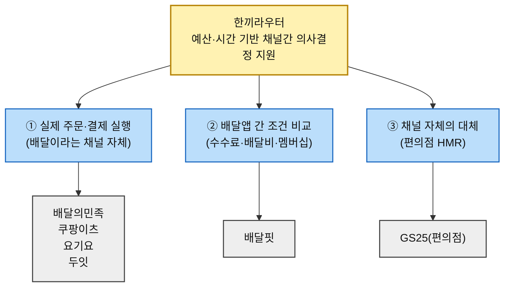
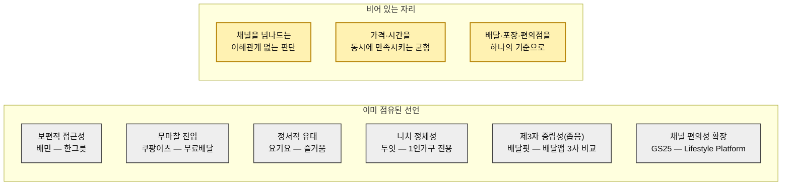

# 경쟁 지형과 가치 선언 분석 — 한끼라우터 (1인 가구 한 끼 해결 플랫폼)

> 입력: [Five Forces 분석](../../01.porters-five-forces/분석④-1인가구배달플랫폼.md) · [가치사슬 분석](../../02.value-chain/분석-1인가구배달플랫폼.md) · [KSF 분석](../../03.ksf/신규진입자-Top5-KSF-1인가구배달플랫폼-기업사례포함.md) · [SRS](../../04.tam-sam-som/1인가구한끼해결-7단계/07-솔루션구체화-SRS.md) · [TAM-SAM-SOM](../../04.tam-sam-som/1인가구한끼해결-7단계/08-TAMSAMSOM단계별대응구조.md) · [마켓세그먼트맵](../../04.tam-sam-som/1인가구한끼해결-7단계/09-마켓세그먼트맵.md) · [페르소나 스펙트럼](../../05.persona-journey-map/1인가구한끼해결-페르소나여정/02-페르소나스펙트럼.md) · [고객여정지도](../../05.persona-journey-map/1인가구한끼해결-페르소나여정/06-고객여정지도-종합판.md) · [AOS 분석](../../06.market-opportunity/1인가구한끼해결-시장기회분석/02-AOS매트릭스.md) · [DOS 분석](../../06.market-opportunity/1인가구한끼해결-시장기회분석/03-DOS매트릭스.md) · [AOSxDOS 혼합매트릭스](../../06.market-opportunity/1인가구한끼해결-시장기회분석/04-AOSxDOS-혼합매트릭스.md) · [JTBD 결과보고서](../../07.jtbd/1인가구한끼해결-jtbd/03-JTBD결과보고서.md)
>
> 🔎 **리서치 기준일 2026-08.** 아래 수치와 링크는 각 기업의 공식 발표·공시·언론 보도에서 확인한 것이다.
>
> ⚠️ **이 문서는 이 프로젝트에서 근거 등급이 다르다.** 챕터 05·06·07의 산출물은 전량 **(가정)**이었으나, 이 문서의 규모·모델 서술은 대부분 **(확인)**이다. 다만 **가치 선언문(§3)은 활동에서 역산한 해석**이므로 **(추정)**이며, 각 기업의 공식 슬로건이 아니다.
>
> 📌 **이 문서가 답하는 미결 과제.** [02-AOS매트릭스.md §7-1](../../06.market-opportunity/1인가구한끼해결-시장기회분석/02-AOS매트릭스.md)이 1순위로 지목한 *"대체재 재조사 — Satisfaction 1점 5개(P09·P12·P15·P18·P26)에 상위 순위 다수가 걸려 있다"*에 대한 응답이다. 판정 결과는 §4-3에 있다.

---

## 0. 경쟁의 정의 — 우리는 무엇과 경쟁하는가

[SRS §5](../../04.tam-sam-som/1인가구한끼해결-7단계/07-솔루션구체화-SRS.md)가 이미 "기존 서비스와의 경계"를 규정했지만, 그 경계를 실제 기업 단위로 쪼개면 한끼라우터는 **하나의 시장이 아니라 세 개의 서로 다른 축에서 동시에 실사받는다.**

| 경쟁 축 | 우리가 하겠다는 것 | 이미 그 자리를 점유한 서비스 |
| --- | --- | --- |
| **① 실제 주문·결제 실행** | (MVP에서 하지 않음 — [SRS §4](../../04.tam-sam-som/1인가구한끼해결-7단계/07-솔루션구체화-SRS.md) "직접 주문·결제 제외") | 배달의민족 · 쿠팡이츠 · 요기요 · 두잇 |
| **② 배달앱 간 조건 비교** | 참고는 하되 우리 서비스의 전부는 아님 | 배달핏 |
| **③ 채널 자체의 대체(편의점 HMR)** | 옵션 중 하나로 정규화([SRS FR-03](../../04.tam-sam-som/1인가구한끼해결-7단계/07-솔루션구체화-SRS.md)) | GS25(대표 사례) |

> 🚨 **여기서 이미 전략적 문제가 하나 드러난다.** ①에 있는 4개사는 전부 "무료배달·소액주문 대응"으로 수렴 중이라 산업 자체의 관심이 우리 타깃(1인가구 소용량)과 겹친다. **"저렴한 배달"로는 이 넷을 이길 수 없다** — [SRS §1](../../04.tam-sam-som/1인가구한끼해결-7단계/07-솔루션구체화-SRS.md)이 이미 "두잇과 직접 중복 회피"라 판단한 이유다.

---

## 1. 경쟁사 브리핑

| # | 서비스 | 경쟁 축 | 비즈니스 규모 | 핵심 비즈니스 모델 | 사업 전략의 특징 | 출처 |
| :---: | --- | :---: | --- | --- | --- | --- |
| **1** | **배달의민족** (우아한형제들) | ① | 2025년 매출 5조2,829억원(+22%), 영업이익 5,929억원(-7.5%). MAU 2,375만명(2025.12, 1위), 시장점유율 약 54%(2026.2) | 중개수수료(2.0~7.8% 차등)+배달비(2,400~3,400원)+광고 | **"한그릇"**(1인분 소액주문, 최소주문금액 없음+무료배달)으로 2주 만에 주문 123%↑→전국 확대. 공정위·상생협의체발 수수료 규제 압박 지속 | [매출 4조 돌파](https://www.newspim.com/news/view/20250404001043) · [한그릇 출시](https://www.thevaluenews.co.kr/news/190608) · [이용자 1위](https://www.asiatoday.co.kr/kn/view.php?key=20260106010002560) · [수수료 인하](https://www.hankyung.com/article/2025012237531) · [상생협의체 좌초위기](https://www.khan.co.kr/article/202604281410001) |
| **2** | **쿠팡이츠** | ① | 쿠팡 "성장사업" 부문 통합공시(단독 비공개). 2025 Q4 매출 14.27억달러(+32%), 손실 확대. MAU 1,316만명(2026.7, +26%), 점유율 25~29% | 단건배달+일반회원까지 무료배달 확대(쿠팡 전액부담) | 배민 추격전략. **"하나만 담아도 무료배달"**(2025.8)로 한그릇과 정면경쟁. 배달료 삭감으로 라이더 반발, "배달비 후불제" 논란 | [쿠팡 성장 꺾임](https://zdnet.co.kr/view/?no=20260227064907) · [무료배달 후불제 논란](https://www.khan.co.kr/article/202605211420001) · [하나만 담아도 무료배달](https://news.nate.com/view/20250807n29652) |
| **3** | **요기요** (위대한상상) | ① | 2024년 매출 2,752억원(-3.67%), 영업손실 431억원. MAU 418만명(2026.3, -100만). 업계 3위 | 수수료+광고+**요기패스X** 월 구독료(2,900원, 무제한 무료배달) | 구독자 100만→160만(+110%), 재주문율 51.9%→54.2%. 자율주행 배달로봇 실험. 가격 경쟁 대신 "즐거움" 브랜딩 | [2600억 적자](https://kpinews.kr/newsView/1065598508809603) · [이용자 이탈](https://www.mt.co.kr/tech/2026/05/02/2026042714162937384) · [요기패스X 100만 돌파](https://www.klnews.co.kr/news/articleView.html?idxno=314495) |
| **4** | **두잇** (dooeat) | ① | 2022년 설립. 시드 26억+시리즈A/A2 306억(2025.1). **서울 5개구 한정**. 가입자 120만, MAU 18만 | 건당 배달수수료(기성 대비 -10%p) + **"팀배달"**(반경내 3명↑ 묶음배달) | **"1인가구를 위한 무료배달앱"** 명시적 타겟팅. 거래고객 3년간 328배 증가. 2026년 이후 서울 전역 확장 계획(미실현) | [306억 투자유치](https://www.mt.co.kr/future/2025/01/24/2025012410394637523) · [기업정보](https://www.innoforest.co.kr/company/CP00011268/두잇) · [공식 사이트](https://doeat.io) |
| **5** | **배달핏** | ② | 회사명·설립연도·투자·이용자수 **확인 불가**. 자체 앱 없이 **웹사이트 기반** | 배민·쿠팡이츠·요기요 3사의 배달비·최소주문금액·구독혜택 비교(약 7,800개 프랜차이즈 기준) | **"특정 배달앱에 소속되지 않은 독립 웹사이트"** 중립성이 핵심 차별점. 비교 범위는 배달앱 3사 조건에 한정 | [메인 페이지](https://www.baedalfit.com) · [프랜차이즈 비교](https://www.baedalfit.com/brand/) |
| **6** | **GS25** (GS리테일) | ③ | 2026 Q2 매출 3조1,751억원(+6.4%), 영업이익 1,094억원(+31.7%). 2025년 GS25 연매출 약 8조9,396억원, 매장 약 1만8천개 | 편의점 프랜차이즈+모바일앱 "우리동네GS"(픽업·배달·멤버십). PB **혜자로운**(도시락 약 30종) | 1인가구용 소용량 양념육(+90%). 쿠팡이츠(전국 24시간, ~1,000점포)·요기요(~2,000점포) 등과 배달 제휴, 퀵커머스 고성장, **심야(22~03시) 배달비중 21.7%(2026.4)** | [편의점 수익성 개선](https://www.viva100.com/article/20260811500351) · [쿠팡이츠 24시간 배달](https://www.klnews.co.kr/news/articleView.html?idxno=321180) · [혜자로운 진화](https://www.the-pr.co.kr/news/articleView.html?idxno=62169) |

---

## 2. 기업별 핵심 가치와 주요 사업활동

### 2-1. 배달의민족 — "소외되는 소액주문 없애기"

**핵심 가치: 보편적 접근성(universal access).**

**한그릇**은 최소주문금액이라는 장벽을 없애 1인분 주문 수요를 시장에 드러냈다 — 시범 2주 만에 **주문 123% 증가, 이용 고객 2배, 등록 메뉴 4배**. 이는 [01.porters-five-forces](../../01.porters-five-forces/분석④-1인가구배달플랫폼.md)가 대체재 위협 1순위로 지목한 HMR·편의점 대비 가격 격차를, 최소주문금액 폐지 하나로 좁힌 실증 사례다. 다만 동시에 진행 중인 **차등 수수료 개편**(2.0~7.8%)을 두고 입점업체가 반발 중이라, 소비자 대상 가치와 입점업체 대상 활동이 긴장 관계에 있다.

### 2-2. 쿠팡이츠 — "무료배달의 보편화"와 그 비용을 둘러싼 논쟁

**핵심 가치: 무마찰 진입(frictionless entry).**

전회원 무료배달과 **"하나만 담아도 무료배달"**로 최소주문금액 장벽을 없앴다. 그러나 그 재원이 **라이더 기본배달료 2,100원 삭감**과 **"배달비 후불제"**(입점업체·소비자 부담 전가)로 조달된다는 논란이 동시에 벌어진다 — "무료"라는 소비자 가치 선언의 이면에서 공급망 다른 참여자에게 비용이 전가되고 있다.

### 2-3. 요기요 — 가격이 아닌 "즐거움"으로 차별화

**핵심 가치: 정서적 유대(emotional loyalty).**

배민·쿠팡이츠와 정면 가격 경쟁 대신 **"오늘도 즐거움 배달중"**이라는 정서적 브랜딩을 앞세운다. 요기패스X 구독은 재주문 고객 비중을 51.9%→54.2%까지 끌어올려 락인 효과를 일부 실증했지만, MAU가 1년 새 100만 명 감소하는 등 신규 고객 확보에서는 아직 반등이 뚜렷하지 않다.

### 2-4. 두잇 — 1인가구 문제 정의 자체를 다시 쓴 회사

**핵심 가치: 니치 정체성(niche identity).**

다섯 회사 중 유일하게 **회사 존재 이유 전체가 1인가구 소용량 문제**다. "혼자여도 먹고싶은 음식만, 먹을 만큼만"이라는 메시지는 **팀배달**(반경 내 주문을 묶어 배달비를 나누는 구조)로 뒷받침되며, 이는 [03.ksf #1](../../03.ksf/신규진입자-Top5-KSF-1인가구배달플랫폼-기업사례포함.md)이 "니치 세그먼트 우선 공략"의 실증 사례로 이미 지목한 회사다. 다만 **서울 5개구 한정**이라는 지리적 제약이 이 가치의 실제 도달 범위를 좁힌다.

### 2-5. 배달핏 — 존재 자체가 "중립성"인 서비스

**핵심 가치: 제3자 중립성(third-party neutrality).**

회사 실체(투자·매출·인력)에 대한 정보가 거의 없다는 점 자체가 역설적으로 **"어떤 배달앱에도 속하지 않은 독립 웹사이트"**라는 선언과 일관된다. 다만 비교 범위가 배달앱 3사의 조건에 한정되고, 배달·포장·편의점 HMR을 아우르는 채널 간 비교나 예산·시간 기반 추천으로는 확장되지 않았다 — 한끼라우터가 채워야 할 정확한 공백이다. [04-AOSxDOS-혼합매트릭스.md](../../06.market-opportunity/1인가구한끼해결-시장기회분석/04-AOSxDOS-혼합매트릭스.md)의 최우선 사분면에 오른 Pain 상당수가 정확히 "채널을 넘나드는 비교" 부재에서 나온다.

### 2-6. GS25 — 편의점을 "라이프스타일 플랫폼"으로

**핵심 가치: 채널 편의성의 확장.**

2019년 BI 개편에서 슬로건을 **'Lifestyle Platform'**으로 바꿨고, PB **혜자로운**은 "합리적 가격+신뢰"를 내세우며 1인가구용 소용량 상품까지 확장했다. 동시에 쿠팡이츠·요기요·배민과 **멀티플랫폼 배달 제휴**를 맺어 편의점이 단순 매장을 넘어 배달 채널의 한 축이 되고 있다 — 한끼라우터가 정규화해야 할 "포장/HMR" 옵션의 실제 데이터 원천이자, [01-Pain리스트.md](../../06.market-opportunity/1인가구한끼해결-시장기회분석/01-Pain리스트.md) P26(야간 커버리지 신뢰 부재)의 재판정에 직결된다(§4-3).

---

## 3. 가치 선언문 도출

> 아래 선언문은 각 기업의 **공식 슬로건이 아니라**, §1·§2의 활동 근거에서 역산해 압축한 **해석**이다. 근거 등급은 **(추정)**이다.

### 배달의민족
> **"1인분이라도, 전국 어디서든, 소외되지 않는 한 끼를 문 앞으로."**

**해설**: 한그릇 서비스가 최소주문금액이라는 장벽을 없애 이 선언을 실체화했고, 억눌려 있던 소액주문 수요(2주 만에 123% 증가)가 이를 뒷받침한다. 다만 같은 시기 진행된 차등 수수료 개편을 둘러싼 입점업체와의 갈등은, 이 선언이 모든 이해관계자에게 동시에 적용되지는 않는다는 것을 보여준다.

### 쿠팡이츠
> **"얼마를 시키든, 배달비 걱정 없이."**

**해설**: 전회원 무료배달과 "하나만 담아도 무료배달"이 이 선언을 직접 실증한다. 그러나 이 무료의 재원이 라이더 배달료 인하와 "배달비 후불제" 구조에서 나온다는 논란은, 이 선언이 누구의 비용으로 성립하는지에 대한 질문을 남긴다.

### 요기요
> **"가장 싼 곳이 아니라, 가장 즐거운 한 끼를 배달합니다."**

**해설**: 가격 경쟁 열위를 인정하고 정서적 가치로 포지션을 옮긴 선언이다. 요기패스X의 재주문율 상승은 기존 고객에게는 통했다는 신호지만, MAU 감소 추세는 신규 고객 확보에서는 아직 이 선언이 충분히 작동하지 않음을 보여준다.

### 두잇
> **"혼자여도, 먹고 싶은 만큼만, 가장 저렴하게."**

**해설**: 다섯 회사 중 가장 일관된 선언이다 — 존재 이유·타겟팅·운영 구조·상품 전부가 이 한 문장을 향해 정렬되어 있다. 다만 서울 5개구라는 지리적 한계는 이 선언이 "1인가구 전체"가 아니라 "이 5개구의 1인가구"에게만 유효함을 뜻한다.

### 배달핏
> **"어떤 배달앱 편도 들지 않고, 가장 싼 선택지를 알려드립니다."**

**해설**: 회사 실체가 드러나지 않는다는 점이 오히려 "중립적 제3자"라는 선언과 맞물린다. 그러나 비교 범위가 배달앱 3사의 조건에 그쳐, "어떤 채널이 오늘 가장 나은가"라는 더 큰 질문에는 답하지 않는다.

### GS25
> **"24시간보다 더 큰 가치로, 우리 동네의 모든 순간을 채웁니다."**

**해설**: 편의점을 "라이프스타일 플랫폼"으로 재정의하려는 선언이며, PB 혜자로운과 배달앱 멀티 제휴가 이를 뒷받침한다. 다만 이 선언은 "오늘 이 한 끼를 어떻게 고를지"에 특화된 것은 아니다 — 한끼라우터가 겨냥하는 의사결정 지원과는 다른 층위의 가치다.

---

## 4. 종합 분석

### 4-1. 선언 지형 — 어떤 가치가 이미 점유됐는가

**여섯 개 선언을 나란히 놓으면 우리가 쓰려던 문장 대부분이 이미 누군가의 것에 근접해 있다.**

| 우리가 말하려던 것 | 이미 말한 곳 | 그래서 |
| --- | --- | --- |
| *"배달앱을 대신 비교해준다"* | 배달핏 | **범위만 다른 같은 선언.** 배달앱 3사 조건 비교는 이미 있다 — 우리는 채널(배달·포장·편의점) 전체로 범위를 넓혀야 빈자리가 된다 |
| *"1인가구를 위한 저렴한 배달"* | 두잇, 배민 한그릇, 쿠팡이츠 하나만담아도무료배달 | 가격으로는 셋 다 이미 강하게 싸우고 있다. **가격만으로는 이길 수 없다** |
| *"편의점도 옵션에 넣는다"* | GS25(멀티플랫폼 배달 제휴 확대 중) | 편의점과 배달앱의 경계가 GS25 쪽에서 스스로 흐려지고 있다 — **우리가 먼저 그 경계를 없애지 않으면 GS25가 자체 앱으로 그 자리를 채울 수 있다** |

### 4-2. 비어 있는 세 자리

| # | 빈 자리 | 왜 비어 있나 | 우리 분석의 어디와 맞물리나 |
| --- | --- | --- | --- |
| **①** | **채널을 넘나드는 이해관계 없는 판단** | 배달핏은 중립적이나 배달앱 3사에 갇혀 있고, 배민·쿠팡이츠·요기요·두잇은 전부 자기 채널 매출에 이해관계가 있다 | [04-AOSxDOS-혼합매트릭스.md](../../06.market-opportunity/1인가구한끼해결-시장기회분석/04-AOSxDOS-혼합매트릭스.md) 최우선 사분면 |
| **②** | **가격·시간 동시 최적화** | 6개사 전부 단일 축(가격 또는 즐거움)에 갇혀 있다 | [JTBD 결과보고서 O01·O02](../../07.jtbd/1인가구한끼해결-jtbd/03-JTBD결과보고서.md) |
| **③** | **배달·포장·편의점을 하나의 기준으로** | GS25가 배달앱과 제휴하며 경계를 흐리고 있지만, 소비자에게 "같은 화면"으로 보여주는 곳은 없다 | [SRS FR-03](../../04.tam-sam-som/1인가구한끼해결-7단계/07-솔루션구체화-SRS.md) |

### 4-3. AOS 분석의 미결 과제에 대한 응답

[02-AOS매트릭스.md §7-1](../../06.market-opportunity/1인가구한끼해결-시장기회분석/02-AOS매트릭스.md)이 *"가장 흔들리기 쉬운 값"*으로 지목한 **Satisfaction 1점 5개**를 이번 경쟁사 조사로 재판정한다.

| ID | 항목(인물) | 챕터 06 판정 | 조사 결과 | 재판정 |
| --- | --- | :---: | --- | :---: |
| **P26** | 커버리지 신뢰 부재(X1) | Sat **1** *(대체재 없음)* | **GS25가 부분적 대안** — 24시간 운영 + 심야(22~03시) 배달비중 21.7%(2026.4)로 "적어도 편의점은 열려 있다"는 대체 채널을 제공. 다만 "어느 식당이 영업 중인가"는 여전히 못 알려준다 | **Sat 2** ⬆️ |
| **P09** | 지출 누적 확인(C3) | Sat **1** *(대체재 없음)* | 6개사 중 어디도 개인 누적 지출을 보여주지 않는다 | **Sat 1 유지** ✅ |
| **P12** | 피드백 경로 없음(C4) | Sat **1** *(대체재 없음)* | 조사 범위에서 전화주문 피드백 도구를 찾지 못함 | **Sat 1 유지** *(조사 한계)* |
| **P15** | 선택 확신 재확인 불가(C5) | Sat **1** *(대체재 없음)* | 구매 후 선택 근거를 재확인해주는 서비스를 찾지 못함 | **Sat 1 유지** *(조사 한계)* |
| **P18** | 지출 기록 기능 없음(A1) | Sat **1** *(대체재 없음)* | 6개사 어디도 개인 지출 기록 기능을 제공하지 않음 — **P09와 같은 공백을 서로 다른 페르소나에서 독립적으로 재확인** | **Sat 1 유지** ✅ |

> 🚨 **P26이 유일하게 상향된다.** 원래 AOS 3.2(공동 1위)였던 P26은 Sat 1→2로 재계산하면 **AOS 2.4로 낮아진다**(4×(1-2/5)=2.4) — 6위권 클러스터(P02·P07·P09·P20)와 동률이 된다. **X1의 커버리지 문제가 완전히 해소된 것은 아니지만, GS25라는 부분적 대안이 이미 시장에 존재한다는 것을 이번 조사가 처음으로 확인했다.**
>
> 📌 **P09·P18은 두 조사(챕터06 가정 + 이번 실사)를 모두 통과했다.** 서로 다른 페르소나(C3·A1)에서 독립적으로 "지출을 기록·확인할 도구가 없다"는 같은 공백이 재확인됐다는 것은, 이 공백이 특정 페르소나의 특이 사례가 아니라 **시장 전체의 구조적 공백**이라는 신호다 — [08-02번 문서](./02-차별적가치목표-제안.md)의 기둥 설계에 직접 반영된다.

### 4-4. 우리 가치 선언문 — 1차 초안과 그 위험 *(기록용, 대체됨)*

> ➡️ **이 절은 [02-차별적가치목표-제안.md](./02-차별적가치목표-제안.md)로 대체됐다.** 아래 세 후보는 **경쟁 공백에서만 역산한 1차안**이며, 그 문서에서 경쟁 지형과 다시 대조해 마스터 선언+세 기둥 구조로 조정한 결과가 있다. 기록용으로 남긴다.

| 후보 | 선언문 초안 | 근거 | 위험 |
| :---: | --- | --- | --- |
| **A. 이해관계 없는 판단** | *"누구의 편도 아닌, 오직 당신의 오늘을 위한 계산."* | §4-2 ①, [SRS §4](../../04.tam-sam-som/1인가구한끼해결-7단계/07-솔루션구체화-SRS.md) MVP 제외 항목 | 수익모델이 확정되면 흔들릴 수 있다 |
| **B. 가격·시간 동시 최적화** | *"돈도 시간도, 둘 중 하나만 고르지 않아도 되는 한 끼."* | §4-2 ②, [SRS §4.1](../../04.tam-sam-som/1인가구한끼해결-7단계/07-솔루션구체화-SRS.md) Pareto | 이미 SRS에 설계돼 있어 위험이 낮다 |
| **C. 채널을 넘나드는 단일 기준** | *"배달이든 포장이든 편의점이든, 오늘 최선은 하나의 기준으로."* | §4-2 ③, [SRS FR-03](../../04.tam-sam-som/1인가구한끼해결-7단계/07-솔루션구체화-SRS.md) | 편의점 HMR 실시간 데이터 API 부재 |

### 4-5. 이 조사가 남긴 경고 세 가지

**① 우리는 세 개 축에서 동시에 신생이다.** §0의 세 축 각각에 이미 자리 잡은 강자가 있고, 우리는 어느 축에서도 규모·데이터가 앞서지 않는다.

**② "무료배달"은 이미 레드오션이다.** 배민·쿠팡이츠·두잇 셋 다 가격을 브랜드 축으로 삼았다. 가격을 선언하는 것만으로는 차별화가 생기지 않는다.

**③ 채널의 경계는 우리가 아니라 GS25 쪽에서 먼저 흐려지고 있다.** GS25가 배달앱과의 제휴를 계속 넓히면, "채널을 넘나드는 비교"라는 우리의 빈자리를 GS25 자체 앱이 채울 수도 있다 — **시급성이 있는 자리다.**

---

## 5. 근거 등급

| 구성 요소 | 등급 | 비고 |
| --- | --- | --- |
| §1 규모·모델 수치 | **(확인)** | 각 행 병기 링크로 검증. 쿠팡이츠 단독 실적·배달핏 기업실체 등은 "확인 불가"로 별도 표기(01번 문서 최초판 §5 참고) |
| §2 사업활동 서술 | **(확인)** | 위 출처 정리 |
| **§3 가치 선언문 6종** | **(추정)** | 공식 슬로건이 아니라 활동에서 역산한 해석 |
| §4-3 Satisfaction 재판정 | **(추정)** | 공개 자료 기준. 개별 기능 수준의 실사용 검증은 미실시 |
| §4-4 1차 선언문 초안 | **(가정)** | 위 해석의 산물, 이후 02번 문서에서 조정됨 |

> ⚠️ **조사 범위의 한계.** 국내 서비스 위주로 조사했다. 해외 유사 서비스(예: 다른 나라의 1인가구 특화 배달앱)는 포함하지 않았다. P09·P12·P15·P18의 "대체재 없음" 판정이 유지된 것도 **조사 범위 안에서 못 찾았다는 뜻**이지 존재하지 않는다는 뜻은 아니다.

---

## Sources

- [우아한형제들, 매출 4조 돌파](https://www.newspim.com/news/view/20250404001043)
- [매출 늘고 이익 준 배민](https://byline.network/2025/04/04_baemin/)
- [배민, '한그릇' 카테고리 출시](https://www.thevaluenews.co.kr/news/190608)
- [배달의민족, 이용자 수 압도적 1위](https://www.asiatoday.co.kr/kn/view.php?key=20260106010002560)
- [배민 중개수수료 인하 시행](https://www.hankyung.com/article/2025012237531)
- [배달앱 상생협의체 좌초위기](https://www.khan.co.kr/article/202604281410001)
- [배민, 배민배달·가게배달·픽업으로 명칭 변경](https://v.daum.net/v/20260226085847530)
- [쿠팡, 분기 성장 꺾임](https://zdnet.co.kr/view/?no=20260227064907)
- [배민, 쿠팡이츠 비중 90% 육박](https://m.sedaily.com/amparticle/20046527)
- [쿠팡이츠 무료배달, 배달비 후불제 논란](https://www.khan.co.kr/article/202605211420001)
- [쿠팡이츠 배달료 인하 갈등](https://www.speconomy.com/news/articleView.html?idxno=302918)
- [쿠팡이츠 '하나만 담아도 무료배달' 도입](https://news.nate.com/view/20250807n29652)
- [쿠팡이츠 공식 사이트](https://www.coupangeats.com/)
- [요기요, 2600억 적자](https://kpinews.kr/newsView/1065598508809603)
- [요기요 이용자 이탈](https://www.mt.co.kr/tech/2026/05/02/2026042714162937384)
- [요기요, 구독·배달로봇으로 돌파구](https://www.asiatoday.co.kr/kn/view.php?key=20250922010011893)
- [요기패스X 구독자 100만 돌파](https://www.klnews.co.kr/news/articleView.html?idxno=314495)
- [GS리테일 컨소시엄, 요기요 인수](https://dealsite.co.kr/articles/77473/080057)
- [두잇, 306억 투자유치(머니투데이)](https://www.mt.co.kr/future/2025/01/24/2025012410394637523)
- [두잇 기업정보(이노포레스트)](https://www.innoforest.co.kr/company/CP00011268/두잇)
- [두잇 공식 사이트](https://doeat.io)
- [배달핏 메인 페이지](https://www.baedalfit.com)
- [배달핏 프랜차이즈 배달비 비교](https://www.baedalfit.com/brand/)
- [GS리테일, 편의점이 효자](https://www.viva100.com/article/20260811500351)
- [GS25, 쿠팡이츠와 24시간 배달 전국 확대](https://www.klnews.co.kr/news/articleView.html?idxno=321180)
- [GS25 PB '혜자로운'의 진화](https://www.the-pr.co.kr/news/articleView.html?idxno=62169)
- [GS25, 1인 가구 위한 소용량 양념육](https://www.viva100.com/article/20260729500502)
- [우리동네GS 앱](https://apps.apple.com/kr/app/id426644449)
