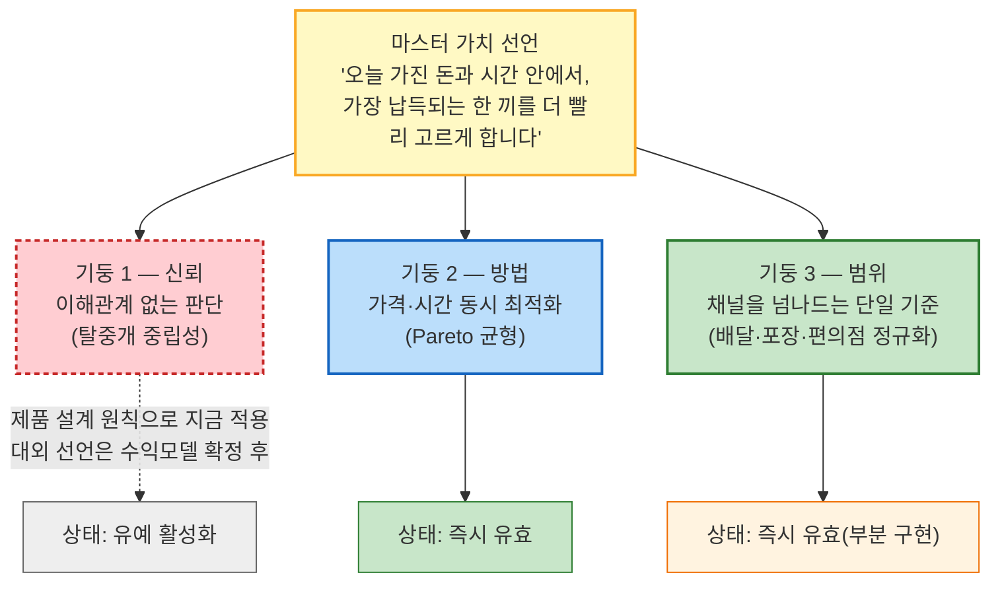

# 한끼라우터의 가치 목표 — 마스터 선언과 세 기둥

> 입력: [01-경쟁사-가치선언-분석.md](./01-경쟁사-가치선언-분석.md) §3(개별 가치 선언문)·§4(종합 분석) · [SRS](../../04.tam-sam-som/1인가구한끼해결-7단계/07-솔루션구체화-SRS.md) · [JTBD 결과보고서](../../07.jtbd/1인가구한끼해결-jtbd/03-JTBD결과보고서.md)
>
> 📊 **구조 결정.** 세 방향을 "하나만 골라야 하는 경쟁 관계"가 아니라, **하나의 마스터 가치 선언을 세 기둥이 각각 다른 각도에서 성립시키는 구조**로 재구성했다. 세 기둥은 전부 동시에 유효하며, 어느 하나가 빠져도 마스터 선언의 특정 단어가 거짓이 된다는 것을 §2에서 직접 논증한다. 방향 1(탈중개 중립성)은 지금부터 **제품 설계 원칙**으로 적용하되, 대외 브랜드 선언으로서의 공식화는 수익모델 확정 이후로 유예한다(§3-3 활성화 조건 참고).

---

## 1. 마스터 가치 선언

> **"오늘 가진 돈과 시간 안에서, 가장 납득되는 한 끼를 더 빨리 고르게 합니다."**

이 문장은 새로 만든 것이 아니라 [SRS §12](../../04.tam-sam-som/1인가구한끼해결-7단계/07-솔루션구체화-SRS.md)의 최종 한 문장, [01번 문서 §4-3](./01-경쟁사-가치선언-분석.md)이 경쟁사 6곳 중 아무도 차지하지 않았다고 확인한 자리와 동일하다. 아래 §2는 이 한 문장 안의 **세 개 절("오늘 가진... 안에서" / "가장" / "납득되는")**이 각각 어느 기둥 없이는 성립하지 않는지를 보인다.

---

## 2. 왜 세 기둥이 전부 있어야만 이 선언이 성립하는가 — 제거 논증

마스터 선언에서 기둥 하나씩을 제거했을 때 **문장의 어느 부분이 무너지는지**를 직접 짚는다. 이 표가 "근거 → 결론"을 직결시키는 핵심이다 — 세 기둥은 서로 다른 가치를 나열한 것이 아니라, **하나의 문장이 참이 되기 위한 필요조건 세 개**다.

| 제거해 보면 | 마스터 선언의 어느 절이 무너지는가 | 왜 |
| --- | --- | --- |
| **기둥 1(중립성)을 빼면** | **"납득되는"**이 무너진다 | 추천자가 특정 채널의 매출과 이해관계를 가지면, 사용자는 그 추천을 "납득"이 아니라 "설득당함"으로 받아들일 근거가 생긴다 — [01번 문서 §2-1·2-2](./01-경쟁사-가치선언-분석.md)의 배민·쿠팡이츠 무료배달발 비용전가 논란이 실제로 이 구멍을 보여준다 |
| **기둥 2(Pareto 균형)를 빼면** | **"가장"**이 무너진다 | 가격 또는 시간 중 하나만 최적화하면, 다른 축에서 손해를 강요하는 추천이 나온다. "가장 납득되는"이 아니라 "그나마 나은"이 된다 — [01번 문서 §4-2](./01-경쟁사-가치선언-분석.md)가 확인한 6개사 전부의 단일 축 가치가 이 구멍의 실제 사례다 |
| **기둥 3(채널 정규화)을 빼면** | **"오늘 가진 돈과 시간 안에서"**가 무너진다 | 비교 대상이 배달 채널 하나뿐이라면, 그날 실제 최선(예: 도보 5분 거리 편의점 HMR)이 애초에 후보에 들어오지 못한다. 표본이 좁아지면 "가진 돈과 시간 안에서 최선"이라는 말 자체가 성립할 수 없다 — [01번 문서 §4-1](./01-경쟁사-가치선언-분석.md)의 경쟁 지형 표(배달앱 4사는 배달 채널 내부, 배달핏은 배달앱 간, GS25는 분리된 채널)가 이 구멍을 보여준다 |

📌 **이 표가 "세 가치 모두 유효하다"의 근거다.** 세 기둥은 대체재가 아니라 **서로 다른 필요조건**이므로, 어느 하나를 "1차로 앞세우고 나머지는 후순위로"라고 줄 세울 수 없다 — 줄을 세우는 순간 마스터 선언의 해당 절이 곧바로 거짓이 된다.

---

## 3. 기둥별 상세

### 3-1. 기둥 1 — 신뢰: 이해관계 없는 판단 (탈중개 중립성)

> 이 기둥이 성립시키는 절: **"납득되는"**

**경쟁사 근거**: [01번 문서 §2-1·2-2](./01-경쟁사-가치선언-분석.md)가 확인한 대로, 배민의 "한그릇"과 쿠팡이츠의 "전회원 무료배달"은 그 재원이 차등 수수료 개편(입점업체 반발)이나 라이더 기본배달료 삭감·배달비 후불제(비용 전가)로 조달된다. 두 회사는 구조적으로 주문 중개 수수료에 의존하기 때문에, "무료"를 선언하는 순간 그 비용을 공급망의 다른 참여자에게 넘길 수밖에 없다. 배달핏은 중립성을 내세우지만([01번 문서 §2-5](./01-경쟁사-가치선언-분석.md)) 비교 대상이 배달앱 3사에 그쳐 범위가 좁다.

**SRS 근거**: [SRS §4](../../04.tam-sam-som/1인가구한끼해결-7단계/07-솔루션구체화-SRS.md)는 MVP에서 "직접 주문·결제, 라이더 배차, 음식점 정산, 구독권 판매"를 명시적으로 제외한다 — 어느 채널의 매출에도 지분이 없다.

| SRS 근거 | 이 기둥과의 연결 |
| --- | --- |
| NFR-04 설명가능성 — "왜 저렴/빠름/균형인지 한 문장으로 설명" | 추천 이유를 감추지 않는다는 것 자체가 중립성의 증거 |
| S4 외부이동 확인 — "원 서비스에서 가격을 다시 확인하세요" | 최종 결제를 붙잡지 않는다는 것을 스스로 드러내는 화면 |
| FR-06 비교 상세 — 가격 구성·시간 구성 근거 공개 | 계산 과정을 숨기지 않는다는 것이 곧 이해관계 없음의 증거 |

**상태 — 유예 활성화 (사용자 결정 반영)**: 이 기둥은 **지금부터 제품 설계 원칙으로 적용**한다 — 위 표의 NFR-04·S4·FR-06은 이미 SRS에 있으므로 추가 개발 없이 원칙만 명문화하면 된다. 다만 **"우리는 이해관계 없는 중립 서비스다"라는 대외 브랜드 문구(공식 슬로건·마케팅 카피)로 공식화하는 것은 수익모델이 확정될 때까지 유예한다.** [SRS §12](../../04.tam-sam-som/1인가구한끼해결-7단계/07-솔루션구체화-SRS.md)가 확장 조건으로 언급한 "데이터 제휴와 개인화 확대"가 실제로 어떤 형태(광고·제휴수수료 등)를 취하는지에 따라 이 선언과 충돌할 수 있기 때문이다.

- **활성화 조건**: 수익모델이 확정되는 시점에 "그 수익모델이 추천 순서·내용에 영향을 주지 않는가"를 확인한다. 영향이 없다고 확인되면 즉시 대외 선언으로 승격한다. 영향이 있다면(예: 특정 채널의 노출 대가를 받는 구조), 이 기둥은 "완전 중립"이 아니라 "노출 순서에는 영향을 주지 않는 범위 내 중립"처럼 **선언의 정밀도를 낮춰 재조정**해야 한다.
- **지금 해야 할 일**: 개발팀·기획 내부적으로는 "추천 순서·필터링 로직에 채널별 차등을 두지 않는다"는 원칙을 지금 문서화해 둔다 — 나중에 수익모델을 설계할 때 이 원칙이 이미 있었다는 것이 협상의 기준점이 된다.

### 3-2. 기둥 2 — 방법: 가격·시간 동시 최적화 (Pareto 균형)

> 이 기둥이 성립시키는 절: **"가장"**

**경쟁사 근거**: [01번 문서 §4-2](./01-경쟁사-가치선언-분석.md)가 정리한 대로, 6개사의 가치 선언은 전부 단일 축에 머문다 — 배민·쿠팡이츠·두잇은 "가격", 요기요는 "즐거움", GS25는 "채널 편의성". 가격과 시간을 동시에 판단 기준으로 선언한 곳은 없다. [JTBD 결과보고서](../../07.jtbd/1인가구한끼해결-jtbd/03-JTBD결과보고서.md) §5의 C1(반복 결정 피로, O01)·C3(지출 가시화, O02) 사례가 보여주듯, 실제 사용자는 가격만도 시간만도 아니라 둘 다 매번 새로 저울질하는 피로를 겪는다.

**SRS 근거**: [SRS §4.1](../../04.tam-sam-som/1인가구한끼해결-7단계/07-솔루션구체화-SRS.md)의 Pareto 열위 제거 방식이 이 기둥을 정확히 구현한다 — "가격 40%, 시간 30%"처럼 임의 가중치를 정하지 않고, 예산·시간 조건을 넘는 옵션을 먼저 제거한 뒤, 다른 옵션보다 더 비싸면서 더 느린 선택지만 제거한다.

| SRS 근거 | 이 기둥과의 연결 |
| --- | --- |
| §4.1 3모드(절약/빠름/균형) | 가격 축과 시간 축을 각각 대표하는 카드를 동시에 제시 |
| FR-05 추천 생성 | "저렴/빠름/균형 3종을 최대 3개 카드로" — 단일 정답을 강요하지 않음 |
| PoC 지표 "결정시간 중앙값 30%↓·선택 총비용 중앙값 10%↓" | 가격과 시간을 동시에 개선한다는 것을 수치로 검증하도록 설계됨 |

**상태 — 즉시 유효**: 이 기둥은 이미 SRS에 설계돼 있으므로 추가 의사결정 없이 지금 바로 대외 선언에 포함할 수 있다.

**확장 가능성**: [JTBD 결과보고서 §3-2·3-3](../../07.jtbd/1인가구한끼해결-jtbd/03-JTBD결과보고서.md)이 발굴한 신규 Outcome(O02 누적 지출 대시보드, O03 정확도 이력)을 반영하면, "한 번의 균형"에서 "반복해도 믿을 수 있는 균형"으로 심화될 수 있다.

### 3-3. 기둥 3 — 범위: 채널을 넘나드는 단일 기준 (배달·포장·편의점 정규화)

> 이 기둥이 성립시키는 절: **"오늘 가진 돈과 시간 안에서"**

**경쟁사 근거**: [01번 문서 §4-1](./01-경쟁사-가치선언-분석.md)의 경쟁 지형 표가 보여주듯, 배민·쿠팡이츠·요기요·두잇은 전부 배달이라는 하나의 채널 안에서만 경쟁하고, 배달핏은 그 배달앱들 사이의 조건만 비교하며, GS25는 편의점이라는 분리된 채널이다. GS25가 최근 배달앱과 멀티플랫폼 제휴를 맺으며 채널 경계가 흐려지고 있는데도([01번 문서 §2-6](./01-경쟁사-가치선언-분석.md)), 소비자 입장에서 그 경계를 없애 같은 화면으로 보여주는 서비스는 없다.

**SRS 근거**: [SRS §4](../../04.tam-sam-som/1인가구한끼해결-7단계/07-솔루션구체화-SRS.md)의 차별점이 정확히 이것이다 — "배달앱끼리의 비교가 아니라 서로 다른 '한 끼 해결 방식'을 동일한 비용·시간 축으로 정규화."

| SRS 근거 | 이 기둥과의 연결 |
| --- | --- |
| FR-03 옵션 정규화 — 배달/포장/편의점-HMR을 총비용·총시간 공통 필드로 변환 | 채널을 넘나드는 비교의 기술적 실체 |
| §8.3 비용·시간 계산 규칙(채널별 표) | 서로 다른 채널의 이질적 비용 구조를 하나의 표로 환산 |
| §9 데이터 설계 MealOption.channel_type | 세 채널을 애초에 하나의 데이터 모델로 취급 |

**상태 — 즉시 유효(부분 구현)**: 선언 자체는 지금 유효하지만, [SRS §9](../../04.tam-sam-som/1인가구한끼해결-7단계/07-솔루션구체화-SRS.md)가 이미 지적한 대로 편의점 HMR의 실시간 재고·가격을 가져올 공개 API가 없어, 배달·포장 두 채널은 완전하고 편의점-HMR은 수동 큐레이션 수준으로 부분적이다. **선언의 방향은 지금 확정하되, "전 채널 실시간 커버리지"는 [01번 문서 §4-3](./01-경쟁사-가치선언-분석.md)이 지목한 GS25 등과의 데이터 제휴가 완료되는 시점에 완성된다** — 기둥 1과 달리 이 기둥은 선언 자체를 미룰 필요는 없고, 구현 완성도만 단계적으로 따라간다.

---

## 4. 세 기둥의 활성화 상태 요약

| 기둥 | 마스터 선언에서 담당하는 절 | 지금 상태 | 완전해지는 시점 |
| --- | --- | :---: | --- |
| 1. 신뢰(중립성) | "납득되는" | 설계 원칙으로 즉시 적용, **대외 선언은 유예** | 수익모델 확정 + 무영향 확인 시 |
| 2. 방법(Pareto 균형) | "가장" | **즉시 완전 유효** | 이미 완성 — 확장은 신뢰 이력 반영 시 심화 |
| 3. 범위(채널 정규화) | "오늘 가진 돈과 시간 안에서" | **선언은 즉시 유효**, 구현은 부분적 | 편의점 HMR 데이터 제휴 완료 시 |

📌 세 기둥 모두 "지금 유효하지 않다"는 것이 아니다 — **기둥 2·3은 선언과 구현이 이미 정합적이고, 기둥 1만 "설계 원칙은 지금, 대외 선언은 나중"이라는 이원적 상태**를 가진다. 이는 기둥 1의 가치가 약해서가 아니라, 그 가치가 **아직 결정되지 않은 다른 의사결정(수익모델)에 종속**되어 있기 때문이다.

---

## 5. 근거 등급

| 구성 요소 | 등급 | 비고 |
| --- | --- | --- |
| 마스터 선언 문장 | **(확인)** | [SRS §12](../../04.tam-sam-som/1인가구한끼해결-7단계/07-솔루션구체화-SRS.md) 최종 문장 원문 그대로 |
| §2 제거 논증(기둥→절 매핑) | **(가정)** | 이 문서가 구성한 논증 — 언어적으로 타당하나 사용자 대상 검증(실제로 이 절이 없으면 "납득 안 된다"고 느끼는지)은 되지 않았다 |
| 기둥 2·3의 SRS 연결 | **(확인)** | SRS 원문 조항을 직접 대조 |
| 기둥 1의 리스크·활성화 조건 | **(가정)** | 수익모델이 아직 확정되지 않아, "영향이 없다"는 판정 기준 자체가 가설이다 |

---

## 다음 단계

| 순위 | 할 일 | 이유 |
| :---: | --- | --- |
| **1** | "추천 순서·필터링 로직에 채널별 차등을 두지 않는다"는 원칙을 지금 내부 설계 문서(SRS 또는 별도 원칙 문서)에 명문화 | 기둥 1의 "지금 해야 할 일" — 수익모델 협상 이전에 기준점을 만들어 둔다 |
| **2** | 수익모델 설계 시점에 "그 모델이 추천 순서에 영향을 주는가"를 판정하는 체크리스트 준비 | 기둥 1의 활성화 조건 판정 기준 |
| **3** | 편의점 HMR 데이터 제휴 가능성을 [01번 문서 §4-3](./01-경쟁사-가치선언-분석.md) 다음 단계와 함께 재타진 | 기둥 3의 완전한 구현 조건 |
| **4** | 마스터 선언 + 기둥 2·3(즉시 유효한 두 기둥)만으로 우선 대외 커뮤니케이션 초안 작성, 기둥 1은 내부 원칙으로만 유지 | §4 활성화 상태 요약 반영 |
