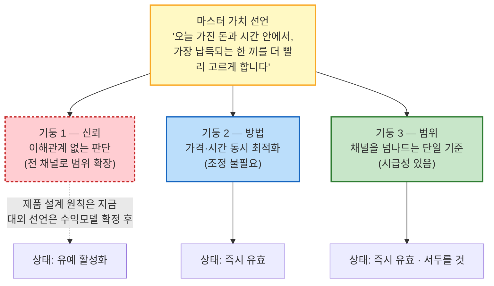
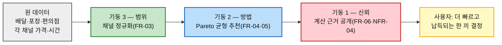

# 차별적 가치목표 제안 — 한끼라우터 (1인 가구 한 끼 해결 플랫폼)

> 입력: [01-경쟁사-가치선언-분석.md](./01-경쟁사-가치선언-분석.md) §3(가치 선언문)·§4(종합 분석) · [SRS](../../04.tam-sam-som/1인가구한끼해결-7단계/07-솔루션구체화-SRS.md) · [JTBD 결과보고서](../../07.jtbd/1인가구한끼해결-jtbd/03-JTBD결과보고서.md)
>
> 🎯 **이 문서는 [01번 문서 §4-4](./01-경쟁사-가치선언-분석.md)를 대체한다.** 그쪽의 세 후보(A 이해관계 없는 판단 / B 가격·시간 동시 최적화 / C 채널 정규화)는 **경쟁 공백에서만 역산한 1차안**이었다. 이 문서는 그 세 방향을 **경쟁 지형과 다시 한 번 개별 대조**해 판정하고, **하나의 마스터 가치 선언을 세 기둥이 떠받치는 구조**로 조정한 결과다.
>
> ⚠️ **근거 등급.** 경쟁 대조는 **(확인)**, 조정 논리와 선언문 초안은 **(추정)**, 실행 순서는 **(가정)**이다.
>
> 📊 **구조 결정 사항(확정).** ① 세 방향을 양자택일이 아니라 마스터 선언을 성립시키는 세 기둥으로 재구성한다 — 셋 다 동시에 유효하다. ② 기둥 1(이해관계 없는 판단)은 지금부터 제품 설계 원칙으로 적용하되, 대외 브랜드 선언으로서의 공식화는 수익모델 확정 이후로 유예한다.

---

## 0. 세 방향을 경쟁 지형과 다시 대조하면

[01번 문서 §4-4](./01-경쟁사-가치선언-분석.md)의 1차안 세 개를, 이번에는 **개별 경쟁사 6곳 전부와 하나씩 대조**한다 — 처음 도출할 때 참고했던 회사뿐 아니라 나머지 회사까지 다시 확인하는 2차 검증이다.

| 1차안 | 경쟁 지형 재대조 결과 | 판정 | 조정 방향 |
| :---: | --- | :---: | --- |
| **A. 이해관계 없는 판단** | 배달핏이 "특정 배달앱에 속하지 않는다"는 유사한 중립성을 이미 주장 중이다([01번 문서 §2-5](./01-경쟁사-가치선언-분석.md)) | ⚠️ **부분 중복** | 배달핏의 중립성은 **배달앱 3사 조건 비교**에 갇혀 있다. 우리는 범위를 **채널 전체(배달·포장·편의점)의 이해관계 없는 판단**으로 넓혀야 비로소 빈자리가 된다 → **기둥 1(신뢰)** |
| **B. 가격·시간 동시 최적화** | 6개사 전부(배민·쿠팡이츠·요기요·두잇은 가격, 요기요는 즐거움, GS25는 채널편의) 단일 축에 머문다. 대조 결과 완전한 공백 | ✅ **유효, 조정 불필요** | 그대로 **기둥 2(방법)**로 채택 |
| **C. 채널을 넘나드는 단일 기준** | 배달핏은 배달앱 간, GS25는 편의점 자체였으나, **GS25가 쿠팡이츠·요기요와 배달 제휴를 넓히며 채널 경계를 스스로 허물고 있다**([01번 문서 §2-6](./01-경쟁사-가치선언-분석.md)) | ⚠️ **시급성 있음** | 아직 아무도 소비자에게 "같은 화면"으로 보여주진 않지만, **GS25가 먼저 이 자리를 채울 수 있는 유일한 경쟁자**다. 조정 없이 채택하되 착수 시점을 앞당긴다 → **기둥 3(범위)** |

📌 **세 조정이 따르는 원리는 하나다.** 경쟁자가 이미 하고 있는 것을 "더 잘하겠다"가 아니라, **A는 범위를 넓히고(좁은 중립성 → 전 채널 중립성), C는 속도를 앞당긴다(경쟁자가 채우기 전에 먼저).** B는 애초에 아무도 없어 조정할 것이 없다.

---

## 1. 기둥 1 — 신뢰: 이해관계 없는 판단

### 선언문 초안

> **"누구의 편도 아닌, 오직 당신의 오늘을 위한 계산."**

### 왜 비어 있는가

| 경쟁사 | 중립성의 범위 | 무엇이 없나 |
| --- | --- | --- |
| 배달핏 | 배달앱 3사(배민·쿠팡이츠·요기요) 조건 비교 | 포장·편의점을 포함한 전 채널 비교는 아니다 |
| 배달의민족·쿠팡이츠 | 무료배달을 선언하지만 자사 채널 매출에 이해관계가 있다 | "왜 이 채널을 추천했는가"에 답할 필요가 없는 구조 |
| **비어 있는 자리** | **채널 전체에 대해 매출 지분이 없는 추천자** | — |

**셋 다 "우리 채널이 낫다"거나 "우리가 비교해준다"고 말하지만, 아무도 "우리는 어느 채널의 매출과도 무관하다"고 말하지 않는다.**

### 우리 분석의 어디서 나왔나

| 근거 | 내용 |
| --- | --- |
| [SRS §4](../../04.tam-sam-som/1인가구한끼해결-7단계/07-솔루션구체화-SRS.md) | MVP에서 "직접 주문·결제, 라이더 배차, 음식점 정산, 구독권 판매" 제외 — 어느 채널의 매출에도 지분이 없다 |
| [SRS NFR-04](../../04.tam-sam-som/1인가구한끼해결-7단계/07-솔루션구체화-SRS.md) | 설명가능성 — "왜 저렴/빠름/균형인지 한 문장으로 설명" |
| [01번 문서 §2-1·2-2](./01-경쟁사-가치선언-분석.md) | 배민·쿠팡이츠의 무료배달 확대발 라이더·입점업체 비용전가 논란 — 중개 수수료 의존 구조의 구조적 한계 |

### 이 선언이 참이 되기 위한 최소 요건

1. **추천 순서·필터링 로직에 채널별·업체별 차등을 두지 않는다** — 수수료·제휴 여부와 무관하게 총비용·총시간 기준으로만 정렬한다
2. **계산 근거를 항상 확인할 수 있다** — [FR-06](../../04.tam-sam-som/1인가구한끼해결-7단계/07-솔루션구체화-SRS.md) 가격 구성·시간 구성을 감추지 않는다
3. **특정 채널의 노출 대가를 받는 순간, 그 사실을 선언에 반영하거나 받지 않는다**

### 이 선언이 거짓이 되는 신호

- ⛔ 특정 배달앱과 제휴해 그 앱의 옵션을 상단에 고정 노출하기 시작한다
- ⛔ 추천 이유를 설명하지 않는 "블랙박스" 카드가 생긴다
- ⛔ 수익모델이 노출 순서에 영향을 준다는 사실을 대외적으로 숨긴다

> ⚠️ **이 기둥의 유일한 급소는 수익모델이다.** [SRS §12](../../04.tam-sam-som/1인가구한끼해결-7단계/07-솔루션구체화-SRS.md)가 확장 조건으로 언급한 "데이터 제휴와 개인화 확대"가 노출 순서에 영향을 주는 형태라면 이 선언과 충돌한다. **그래서 대외 선언은 지금 하지 않는다**(§4 실행 순서 참고).

---

## 2. 기둥 2 — 방법: 가격·시간 동시 최적화

### 선언문 초안

> **"돈도 시간도, 둘 중 하나만 고르지 않아도 되는 한 끼."**

### 왜 비어 있는가

| 경쟁사 | 무엇을 최적화하나 | 무엇이 없나 |
| --- | --- | --- |
| 배민·쿠팡이츠·두잇 | 가격(무료배달·소액주문) | 시간(ETA·이동시간)은 판단 기준에 없다 |
| 요기요 | 정서적 즐거움 | 가격도 시간도 아니다 |
| GS25 | 채널 편의성(24시간·근접성) | 예산·시간을 동시에 저울질하는 로직은 없다 |
| **비어 있는 자리** | **예산과 시간을 동시에, 임의 가중치 없이 반영하는 추천** | — |

### 우리 분석의 어디서 나왔나

| 근거 | 내용 |
| --- | --- |
| [SRS §4.1](../../04.tam-sam-som/1인가구한끼해결-7단계/07-솔루션구체화-SRS.md) | Pareto 열위 제거 방식 — "가격 40%, 시간 30%" 같은 임의 가중치 없이, 조건 초과 옵션 제거 후 열위 옵션만 제거 |
| [JTBD 결과보고서 O01·O02](../../07.jtbd/1인가구한끼해결-jtbd/03-JTBD결과보고서.md) | C1(반복 결정 피로)·C3(지출 가시화) 사례 — 실제 사용자는 가격만도 시간만도 아니라 둘 다 매번 저울질하는 피로를 겪는다 |
| PoC 지표(SRS §6.1) | "결정시간 중앙값 30%↓·선택 총비용 중앙값 10%↓" — 가격·시간 동시 개선을 수치로 검증하도록 설계됨 |

### 이 선언이 참이 되기 위한 최소 요건

1. **예산·시간 조건을 넘는 옵션은 무조건 제외한다**([FR-04](../../04.tam-sam-som/1인가구한끼해결-7단계/07-솔루션구체화-SRS.md))
2. **다른 옵션보다 더 비싸면서 더 느린 선택지는 제거한다**(Pareto 열위 제거)
3. **절약·빠름·균형 3장의 카드를 항상 함께 보여준다** — 단일 정답을 강요하지 않는다

### 이 선언이 거짓이 되는 신호

- ⛔ "이번 달 추천 메뉴" 식으로 임의 가중치가 슬쩍 들어간다
- ⛔ 균형 카드가 사실상 절약 카드와 동일해진다(취향 적합도가 반영되지 않는다)
- ⛔ 가격·시간 정보 없이 "추천"만 표시되는 화면이 생긴다

### 상태 — 즉시 유효

이 기둥은 이미 SRS에 설계돼 있으므로 추가 의사결정 없이 지금 바로 대외 선언에 포함할 수 있다. [JTBD 결과보고서 §3-2·3-3](../../07.jtbd/1인가구한끼해결-jtbd/03-JTBD결과보고서.md)이 발굴한 O02(누적 지출 대시보드)·O03(정확도 이력)을 반영하면 "한 번의 균형"에서 "반복해도 믿을 수 있는 균형"으로 심화될 수 있다.

---

## 3. 기둥 3 — 범위: 채널을 넘나드는 단일 기준

### 선언문 초안

> **"배달이든 포장이든 편의점이든, 오늘 최선은 하나의 기준으로 보여드립니다."**

### 왜 비어 있는가

| 경쟁사 | 비교 대상 | 무엇이 없나 |
| --- | --- | --- |
| 배달의민족·쿠팡이츠·요기요·두잇 | 배달이라는 한 채널 내부 | 포장·편의점과의 비교는 없다 |
| 배달핏 | 배달앱 3사 사이의 조건 | 채널 자체를 넘는 비교는 없다 |
| GS25 | 편의점이라는 분리된 채널 | 배달앱과 제휴는 넓히지만, 소비자에게 "같은 화면"으로 통합해 보여주진 않는다 |
| **비어 있는 자리** | **세 채널을 동일한 총비용·총시간 기준으로 정규화한 비교** | — |

### 우리 분석의 어디서 나왔나

| 근거 | 내용 |
| --- | --- |
| [SRS FR-03](../../04.tam-sam-som/1인가구한끼해결-7단계/07-솔루션구체화-SRS.md) | 옵션 정규화 — 배달/포장/편의점-HMR을 총비용·총시간 공통 필드로 변환 |
| [SRS §8.3](../../04.tam-sam-som/1인가구한끼해결-7단계/07-솔루션구체화-SRS.md) | 채널별 비용·시간 계산 규칙(배달비 vs 왕복이동+구매 vs 왕복이동+조리) |
| [01번 문서 §2-6·4-1](./01-경쟁사-가치선언-분석.md) | GS25의 배달앱 멀티 제휴 확대 — 채널 경계가 흐려지는 중이라는 시급성의 근거 |

### 이 선언이 참이 되기 위한 최소 요건

1. **배달·포장·편의점-HMR 세 채널이 모두 최소 1개 이상 후보로 포함된다**(데이터 확보된 생활권 기준)
2. **세 채널의 비용·시간이 같은 두 필드로 환산되어 나란히 비교된다**([FR-03](../../04.tam-sam-som/1인가구한끼해결-7단계/07-솔루션구체화-SRS.md))
3. **편의점 옵션에 재고 확인 여부가 명시된다**([NFR-05](../../04.tam-sam-som/1인가구한끼해결-7단계/07-솔루션구체화-SRS.md))

### 이 선언이 거짓이 되는 신호

- ⛔ 편의점 옵션이 항상 "재고 미확인"으로만 표시되어 사실상 추천에서 배제된다
- ⛔ 배달·포장 옵션만 계속 늘고 편의점 옵션 수가 정체된다
- ⛔ "채널 통합"을 표방하면서 실제로는 배달앱 링크만 모아놓은 상태로 남는다

### 상태 — 즉시 유효, 구현은 부분적

선언 자체는 지금 확정하되, [SRS §9](../../04.tam-sam-som/1인가구한끼해결-7단계/07-솔루션구체화-SRS.md)가 지적한 대로 편의점 HMR의 실시간 재고·가격 공개 API가 없어 배달·포장은 완전하고 편의점-HMR은 수동 큐레이션 수준으로 부분적이다. **[01번 문서 §4-5](./01-경쟁사-가치선언-분석.md)가 지적한 대로 GS25가 이 자리를 먼저 채울 수 있으므로, 데이터 제휴 착수를 다른 기둥보다 서둘러야 한다.**

---

## 4. 세 기둥의 관계와 실행 순서

### 하나의 파이프라인, 세 개의 산출

세 기둥은 별개의 원칙이 아니라 **SRS가 이미 규정한 처리 순서(FR-03→FR-04/05→FR-06) 위에 놓인 세 지점**이다.

### 실행 순서

| 순서 | 기둥 | 착수 시점 | 이유 |
| :---: | --- | --- | --- |
| **1** | **3 — 범위(채널 정규화)** | **지금** (PoC 데이터셋 구축과 동시) | 정규화된 데이터가 없으면 나머지 두 기둥이 계산할 대상 자체가 없다. [01번 문서 §4-5](./01-경쟁사-가치선언-분석.md)의 시급성도 여기에 걸려 있다 |
| **2** | **2 — 방법(Pareto 균형)** | **기둥 3과 동시** | FR-04·05는 FR-03의 출력(정규화된 필드)을 입력으로 받는다 — 순서상 분리할 수 없다 |
| **3** | **1 — 신뢰(대외 선언)** | **수익모델 확정 후** | 설계 원칙(추천 로직 무차등)은 지금부터 내부적으로 적용하되, 대외 브랜드 선언은 §1의 급소가 해소된 뒤로 미룬다(사용자 결정 반영) |

> ⚠️ **1·2는 동시 착수이지 순차가 아니다.** SRS의 FR 순서상 정규화와 Pareto 계산은 하나의 파이프라인에서 바로 이어지므로, 실무적으로는 "채널 데이터 확보"가 곧 "균형 추천 가능"으로 직결된다.

### 세 기둥이 각각 뒤집는 약점

| 기둥 | 우리 약점 | 뒤집힌 결과 |
| --- | --- | --- |
| **1(신뢰)** | 수익모델이 아직 없다 | **그래서 지금은 완전히 중립적이다** — 수익원이 없으니 편향될 유인 자체가 없다는 것을 오히려 지금 시기의 강점으로 쓸 수 있다 |
| **2(방법)** | 없음 — 이미 SRS 설계로 충족 | 약점 없이 바로 강점 |
| **3(범위)** | 편의점 실시간 데이터를 우리가 소유하지 않는다 | **그래서 어느 채널에도 종속되지 않은 재가공자로 포지셔닝할 수 있다** — GS25와 경쟁하는 대신 GS25를 포함해 보여주는 위치를 취한다 |

---

## 5. 통합 선언문과 태그라인 후보

### 마스터 선언 (재확인)

> **"오늘 가진 돈과 시간 안에서, 가장 납득되는 한 끼를 더 빨리 고르게 합니다."**

### 짧은 형(태그라인 후보)

| 후보 | 문장 | 강조점 | 지금 쓸 수 있는가 |
| :---: | --- | --- | --- |
| **1** | *"가장 싼 게 아니라, 가장 납득되는 한 끼."* | 기둥 2 단독 | ✅ 지금 가능 |
| **2** | *"배달이든 포장이든 편의점이든, 기준은 하나."* | 기둥 3 단독 | ✅ 지금 가능(구현은 배달·포장 중심, 편의점은 부분적) |
| **3** | *"누구의 편도 아닌 추천."* | 기둥 1 단독 | ⏸ 수익모델 확정 후 |

> 📌 **지금 채택 가능한 것은 1·2번이다.** 3번은 실행(수익모델 확정 + 무영향 확인)이 선언을 따라잡은 뒤에 꺼내야 한다 — 지금 꺼내면 "말뿐인 중립"이라는 반박에 취약하다.

---

## 6. 위험과 근거 등급

### 세 기둥이 공유하는 전제

| 기둥 | 종속 대상 |
| --- | --- |
| 1 | 수익모델 확정 및 "노출 순서에 무영향" 판정 |
| 2 | 없음(이미 SRS 설계로 충족) |
| 3 | 편의점 HMR 데이터 제휴 |

> 🚨 **기둥 1·3은 아직 우리 손 밖의 결정(수익모델, 데이터 제휴)에 종속된다.** 기둥 2만 지금 완전히 우리 통제 아래 있다.

**선언문 확정 전에 반드시 할 일** — 편의점 체인(GS25·CU 등) 2~3곳에 "실시간 재고·가격 데이터를 제휴 형태로 받을 수 있는가"를 직접 문의한다. **답이 "불가"면 기둥 3은 "배달·포장 중심, 편의점은 수동 큐레이션"으로 선언의 정밀도를 낮춰야 한다.**

### 근거 등급

| 구성 요소 | 등급 | 비고 |
| --- | --- | --- |
| §0 경쟁 지형 재대조 | **(확인)** | [01번 문서](./01-경쟁사-가치선언-분석.md)의 검증 링크 승계 |
| 마스터 선언 문장 | **(확인)** | [SRS §12](../../04.tam-sam-som/1인가구한끼해결-7단계/07-솔루션구체화-SRS.md) 최종 문장 원문 |
| 기둥별 "왜 비어 있는가" 대조표 | **(확인)** | 경쟁사 실사 근거 |
| 기둥별 최소요건·거짓신호 | **(가정)** | 이 문서가 구성한 검증 기준 — 실제 사용자 반응으로 확인된 것은 아니다 |
| 기둥 1의 활성화 조건 | **(가정)** | 수익모델이 아직 확정되지 않아 "무영향" 판정 기준 자체가 가설이다 |

> ⚠️ **기둥 3의 근거가 가장 얇다.** "GS25가 채널 경계를 흐리고 있다"는 관찰은 확인된 사실이지만, 그로부터 "우리가 서둘러야 한다"는 결론은 이 문서의 해석이다 — 편의점 제휴 문의 결과가 나오기 전까지는 가정으로 남는다.

---

## 다음 단계

| 순위 | 할 일 | 이유 |
| :---: | --- | --- |
| **1** | "추천 순서·필터링 로직에 채널별 차등을 두지 않는다"는 원칙을 SRS 또는 별도 원칙 문서에 지금 명문화 | 기둥 1의 설계 원칙 즉시 적용분 |
| **2** | 편의점 체인 2~3곳에 실시간 데이터 제휴 가능 여부 직접 문의 | §6 "선언문 확정 전 반드시 할 일" |
| **3** | 수익모델 설계 시점에 "그 모델이 추천 순서에 영향을 주는가" 판정 체크리스트 준비 | 기둥 1의 활성화 조건 |
| **4** | 태그라인 1·2번으로 우선 대외 커뮤니케이션 초안 작성, 3번은 내부 원칙으로만 유지 | §5 태그라인 후보 |
