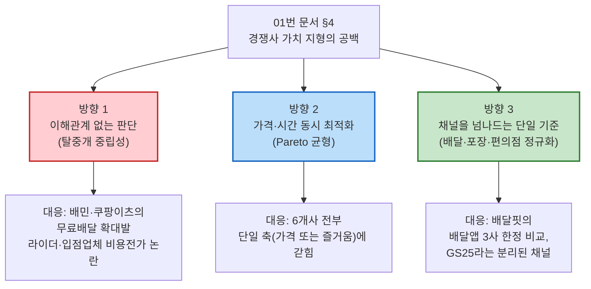

# 한끼라우터의 차별적 가치 목표 — 세 가지 방향 제안

> 입력: [01-경쟁사-가치선언-분석.md](./01-경쟁사-가치선언-분석.md) §3(개별 가치 선언문)·§4(종합 분석) · [SRS](../../04.tam-sam-som/1인가구한끼해결-7단계/07-솔루션구체화-SRS.md) · [JTBD 결과보고서](../../07.jtbd/1인가구한끼해결-jtbd/03-JTBD결과보고서.md)
>
> 📊 **산출.** 경쟁사 6곳의 가치 선언이 실제로는 세 갈래(배달채널 내부 가격 경쟁 / 배달앱 간 조건 비교 / 채널이 다른 대체재)로 수렴하고, 아무도 "예산·시간을 동시에 고려한 의사결정 지원"이라는 축을 선언하지 않는다는 것이 [01번 문서 §4](./01-경쟁사-가치선언-분석.md)의 결론이었다. 이 공백을 세 개의 서로 다른 **가치 목표 방향**으로 분해해 제안한다.

---

## 방향 1 — 이해관계 없는 판단 (탈중개 중립성)

> **가치 목표**: *"누구의 편도 아닌, 오직 당신의 오늘을 위한 계산."*

### 근거 — 경쟁사의 어떤 한계에 대응하는가

[01번 문서 §2-1·2-2](./01-경쟁사-가치선언-분석.md)가 확인한 대로, 배민의 "한그릇"과 쿠팡이츠의 "전회원 무료배달"은 소비자에게는 좋은 소식이지만, 그 재원이 **차등 수수료 개편**(입점업체 반발)이나 **라이더 기본배달료 삭감**·**배달비 후불제**(입점업체·소비자 부담 전가)로 조달된다는 논란을 동시에 안고 있다. 이 두 회사는 구조적으로 **주문 중개 수수료에 의존**하기 때문에, "무료"를 선언하는 순간 그 비용을 공급망의 다른 참여자에게 넘길 수밖에 없다. 배달핏은 특정 배달앱에 속하지 않는다는 중립성을 내세우지만([01번 문서 §2-5](./01-경쟁사-가치선언-분석.md)), 비교 대상이 배달앱 3사에 그쳐 "중립"의 범위가 좁다.

### 왜 한끼라우터가 이 자리를 차지할 수 있는가

[SRS §4](../../04.tam-sam-som/1인가구한끼해결-7단계/07-솔루션구체화-SRS.md)는 MVP에서 "직접 주문·결제, 라이더 배차, 음식점 정산, 구독권 판매"를 명시적으로 제외한다 — 한끼라우터는 **어느 채널의 매출에도 지분이 없다.** 이는 결핍이 아니라 **추천이 특정 채널로 쏠릴 유인이 구조적으로 없다는 신뢰 자산**으로 전환할 수 있다.

| SRS 근거 | 이 가치와의 연결 |
| --- | --- |
| NFR-04 설명가능성 — "왜 저렴/빠름/균형인지 한 문장으로 설명" | 추천 이유를 감추지 않는다는 것 자체가 중립성의 증거 |
| S4 외부이동 확인 — "원 서비스에서 가격을 다시 확인하세요" | 우리가 최종 결제를 붙잡지 않는다는 것을 스스로 드러내는 화면 |
| FR-06 비교 상세 — 가격 구성·시간 구성 근거 공개 | "계산 과정을 숨기지 않는다"는 것이 곧 이해관계 없음의 증거 |

### 리스크

이 가치는 **수익모델이 확정되는 순간 흔들릴 수 있다.** [SRS §12](../../04.tam-sam-som/1인가구한끼해결-7단계/07-솔루션구체화-SRS.md)는 확장 조건에서 "데이터 제휴와 개인화 확대"를 언급하는데, 향후 특정 채널과 제휴하거나 그 채널의 노출 대가를 받기 시작하면 "이해관계 없음"이라는 선언과 정면으로 충돌한다. 이 가치를 채택한다면 **수익모델 설계 자체가 이 선언에 종속되어야 한다**(예: 노출 순서에 영향을 주지 않는 제휴만 허용).

---

## 방향 2 — 가격·시간 동시 최적화 (Pareto 균형)

> **가치 목표**: *"돈도 시간도, 둘 중 하나만 고르지 않아도 되는 한 끼."*

### 근거 — 경쟁사의 어떤 한계에 대응하는가

[01번 문서 §4-2](./01-경쟁사-가치선언-분석.md)가 정리한 대로, 6개사의 가치 선언은 전부 **단일 축**에 머문다 — 배민·쿠팡이츠·두잇은 "가격"(무료배달·소액주문), 요기요는 "즐거움", GS25는 "채널 편의성". **가격과 시간을 동시에 판단 기준으로 선언한 곳은 없다.** [JTBD 결과보고서](../../07.jtbd/1인가구한끼해결-jtbd/03-JTBD결과보고서.md) §5의 C1(반복 결정 피로, O01)·C3(지출 가시화, O02) 사례가 보여주듯, 실제 사용자는 가격만도 시간만도 아니라 **둘 다 매번 새로 저울질하는 피로**를 겪는다.

### 왜 한끼라우터가 이 자리를 차지할 수 있는가

[SRS §4.1](../../04.tam-sam-som/1인가구한끼해결-7단계/07-솔루션구체화-SRS.md)의 **Pareto 열위 제거 방식**이 이 가치를 정확히 구현한다 — "가격 40%, 시간 30%"처럼 임의 가중치를 정하지 않고, 예산·시간 조건을 넘는 옵션을 먼저 제거한 뒤, 다른 옵션보다 더 비싸면서 더 느린 선택지만 제거한다. **절약(가격 최소)·빠름(시간 최소)·균형(둘 다 열위가 아닌 선택)** 3장의 카드는 "하나를 포기해야 한다"는 전제 자체를 없앤다.

| SRS 근거 | 이 가치와의 연결 |
| --- | --- |
| §4.1 3모드(절약/빠름/균형) | 가격 축과 시간 축을 각각 대표하는 카드를 동시에 제시 |
| FR-05 추천 생성 | "저렴/빠름/균형 3종을 최대 3개 카드로" — 단일 정답을 강요하지 않음 |
| PoC 지표 "결정시간 중앙값 30%↓·선택 총비용 중앙값 10%↓" | 가격과 시간을 동시에 개선한다는 것을 수치로 검증하도록 설계됨 |

### 확장 가능성

[JTBD 결과보고서 §3-2·3-3](../../07.jtbd/1인가구한끼해결-jtbd/03-JTBD결과보고서.md)이 발굴한 신규 Outcome(O02 누적 지출 대시보드, O03 정확도 이력)을 반영하면, 이 가치는 "한 번의 균형"에서 "반복해도 믿을 수 있는 균형"으로 심화될 수 있다 — 단발성 추천이 아니라 누적된 선택 이력이 신뢰를 쌓아가는 방향.

---

## 방향 3 — 채널을 넘나드는 단일 기준 (배달·포장·편의점 정규화)

> **가치 목표**: *"배달이든 포장이든 편의점이든, 오늘 최선은 하나의 기준으로 보여드립니다."*

### 근거 — 경쟁사의 어떤 한계에 대응하는가

[01번 문서 §4-1](./01-경쟁사-가치선언-분석.md)의 경쟁 지형 표가 보여주듯, 배민·쿠팡이츠·요기요·두잇은 전부 **배달이라는 하나의 채널 안에서만** 경쟁하고, 배달핏은 그 배달앱들 사이의 조건만 비교하며, GS25는 편의점이라는 **분리된 채널**이다. 채널의 경계 자체를 넘어 같은 기준(총비용·총시간)으로 비교하는 곳은 없다 — 심지어 GS25가 최근 배달앱과 멀티플랫폼 제휴를 맺으며 채널 경계가 흐려지고 있는데도([01번 문서 §2-6](./01-경쟁사-가치선언-분석.md)), 소비자 입장에서 그 경계를 없애 "같은 화면"으로 보여주는 서비스는 없다.

### 왜 한끼라우터가 이 자리를 차지할 수 있는가

[SRS §4](../../04.tam-sam-som/1인가구한끼해결-7단계/07-솔루션구체화-SRS.md)의 차별점이 정확히 이것이다 — "배달앱끼리의 비교가 아니라 서로 다른 '한 끼 해결 방식'을 동일한 비용·시간 축으로 정규화." 이는 두잇·배달핏이 절대 하지 않는(또는 못하는) 일이다 — 두잇은 배달망 자체를 운영하는 사업자이고, 배달핏은 배달앱 3사의 조건 비교에서 사업모델이 완결된다.

| SRS 근거 | 이 가치와의 연결 |
| --- | --- |
| FR-03 옵션 정규화 — 배달/포장/편의점-HMR을 총비용·총시간 공통 필드로 변환 | 채널을 넘나드는 비교의 기술적 실체 |
| §8.3 비용·시간 계산 규칙(채널별 표) | 서로 다른 채널의 이질적 비용 구조(배달비 vs 왕복이동+구매 vs 왕복이동+조리)를 하나의 표로 환산 |
| §9 데이터 설계 MealOption.channel_type | 세 채널을 애초에 하나의 데이터 모델로 취급 |

### 리스크

[SRS §9](../../04.tam-sam-som/1인가구한끼해결-7단계/07-솔루션구체화-SRS.md)가 이미 지적한 대로, **편의점 HMR의 실시간 재고·가격을 가져올 공개 API가 없다.** 이 가치를 완전히 실현하려면 [01번 문서 §4-3](./01-경쟁사-가치선언-분석.md)이 지목한 GS25 등과의 **데이터 제휴**가 선결 조건이며, 그 전까지는 "채널을 넘나드는 비교"가 배달·포장 두 채널에서만 완전하고 편의점-HMR은 부분적(수동 큐레이션)일 수밖에 없다.

---

## 종합 — 세 방향의 관계

| 방향 | SRS에 이미 있었나 | 성격 |
| --- | :---: | --- |
| **방향 2**(가격·시간 동시 최적화) | 있음 — [SRS §4.1](../../04.tam-sam-som/1인가구한끼해결-7단계/07-솔루션구체화-SRS.md) Pareto 방식 그대로 | 기존 제품 설계의 가치화 |
| **방향 3**(채널 정규화) | 있음 — [SRS §5](../../04.tam-sam-som/1인가구한끼해결-7단계/07-솔루션구체화-SRS.md) "기존 서비스와의 경계" | 기존 제품 설계의 가치화 |
| **방향 1**(탈중개 중립성) | **없음** — SRS는 "MVP에서 하지 않는 것"으로만 서술, 가치 선언으로 명문화된 적 없음 | 경쟁사 조사([01번 문서](./01-경쟁사-가치선언-분석.md))를 거치며 새로 발견된 축 |

📌 **방향 2·3은 이미 SRS에 설계돼 있던 것을 "왜 경쟁사는 못 하는가"의 언어로 재확인한 것이고, 방향 1은 이번 경쟁사 조사가 아니었다면 드러나지 않았을 새로운 축이다.** 배민·쿠팡이츠의 "무료배달 확대 vs 비용전가" 갈등이라는 **경쟁사의 약점을 실제로 조사하지 않았다면, "중개하지 않는다"는 소극적 제품 결정을 적극적 가치 선언으로 전환할 생각을 하지 못했을 것이다.**

세 방향은 서로 배타적이지 않다 — 방향 2·3이 "무엇을 보여주는가"(제품의 기능적 가치)를 답한다면, 방향 1은 "왜 믿을 수 있는가"(제품의 신뢰 기반)를 답한다. 셋을 합치면 [01번 문서 §4-3](./01-경쟁사-가치선언-분석.md)의 제안 문장 — *"오늘 가진 돈과 시간 안에서, 가장 납득되는 한 끼를 더 빨리 고르게 합니다"* — 이 왜 납득되는지(방향 1)와 무엇을 어떻게 고르는지(방향 2·3)로 나뉘어 뒷받침된다.

---

## 다음 단계

| 순위 | 할 일 | 이유 |
| :---: | --- | --- |
| **1** | 세 방향 중 1차 브랜드 메시지로 무엇을 앞세울지 결정 | 셋을 동시에 다 말하면 선언이 흐려진다 — 우선순위 필요 |
| **2** | 방향 1 채택 시, 수익모델 설계 원칙에 "노출 순서 불변" 같은 제약을 미리 반영 | §방향1 리스크 |
| **3** | 방향 3의 편의점 HMR 데이터 제휴 가능성을 [01번 문서 §4-3](./01-경쟁사-가치선언-분석.md) 다음 단계와 함께 재타진 | §방향3 리스크 |
