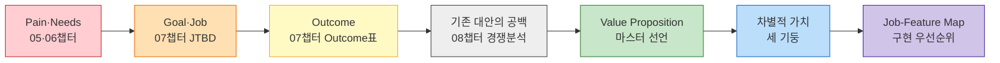

# Value Proposition 통합 문서 — 한끼라우터 (1인 가구 한 끼 해결 플랫폼)

> 방법론: [00-방법론.md](./00-방법론.md) · 입력: [TAM-SAM-SOM §08](../../04.tam-sam-som/1인가구한끼해결-7단계/08-TAMSAMSOM단계별대응구조.md)·[§09](../../04.tam-sam-som/1인가구한끼해결-7단계/09-마켓세그먼트맵.md) · [페르소나 스펙트럼](../../05.persona-journey-map/1인가구한끼해결-페르소나여정/02-페르소나스펙트럼.md)·[고객여정지도](../../05.persona-journey-map/1인가구한끼해결-페르소나여정/06-고객여정지도-종합판.md) · [Pain 리스트](../../06.market-opportunity/1인가구한끼해결-시장기회분석/01-Pain리스트.md)·[AOS](../../06.market-opportunity/1인가구한끼해결-시장기회분석/02-AOS매트릭스.md)·[DOS](../../06.market-opportunity/1인가구한끼해결-시장기회분석/03-DOS매트릭스.md) · [JTBD 결과보고서](../../07.jtbd/1인가구한끼해결-jtbd/03-JTBD결과보고서.md) · [경쟁사 가치선언 분석](../../08.competitor-branding/1인가구한끼해결-경쟁사분석/01-경쟁사-가치선언-분석.md)·[차별적 가치목표 제안](../../08.competitor-branding/1인가구한끼해결-경쟁사분석/02-차별적가치목표-제안.md) · [SRS](../../04.tam-sam-som/1인가구한끼해결-7단계/07-솔루션구체화-SRS.md)
>
> 📊 **산출.** 01~08챕터에서 이미 확정된 산출물을 하나의 Value Proposition으로 압축한다 — 새로운 조사나 재산정 없이, **기존 분석을 종합**하는 문서다. 대상 페르소나는 07챕터가 이미 두 기준(핵심·확장 그룹 ∩ 최우선·니치마켓 사분면)의 교집합으로 좁힌 **C1·C3·A2 3인**을 그대로 승계한다.

---

## 1. 페르소나 및 CJM 기반 핵심 문제 (Pain, Needs)

> [06-고객여정지도-종합판.md](../../05.persona-journey-map/1인가구한끼해결-페르소나여정/06-고객여정지도-종합판.md)의 7단계 여정(①오늘의갈등→②조건설정→③후보비교→④외부이동→⑤수령·준비→⑥소비·피드백→⑦내일의재방문) 기준으로, 07챕터가 선별한 3인의 대표 Pain을 정리한다.

| 페르소나 | 병목 단계 | 대표 Pain(ID) | Needs(막히는 Goal) |
| --- | --- | --- | --- |
| **C1**「퇴근을 예측할 수 없다」— 스타트업 백엔드 개발자, 야근 빈도 높음 | ②조건설정~③후보비교 반복 | **P01** 매번 같은 고민이 반복된다 · **P02** 갱신시각 지난 정보에 대한 불신 | 매번 새로 결정하지 않고 즉시 확정 / 화면 정보를 믿고 바로 선택 |
| **C3**「매일이 곧 지출이다」— 제조업 대기업 사무직, 거의 매일 배달·포장 의존 | ①오늘의갈등(지출 방치)~⑥소비·피드백(사후 인지) | **P07** 방치될수록 누적 지출이 커진다 · **P09** 지출 누적을 확인 전까지 심각성을 못 느낀다 | 지출이 쌓이는 걸 미리 인지·조절 / 누적 지출을 눈으로 확인해 통제 |
| **A2**「또 그 메뉴다」— 프리랜서 디자이너, 배달앱 사용 경력 길어 추천 피로 누적 | ③후보비교(다양성 결핍) | **P20** 추천이 매번 비슷해 다양성이 해결 안 된다 | 매번 다른 선택지를 추천 |

---

## 2. JTBD 관점 목표 서술 (Goal, Job)

> [07.jtbd 03-JTBD결과보고서.md §1](../../07.jtbd/1인가구한끼해결-jtbd/03-JTBD결과보고서.md)의 요약 카드에서 추출한 JTBD 선언.

| 페르소나 | Situation (When…) | Job Statement (…I want to…) | Desired Outcome (…so I can…) |
| --- | --- | --- | --- |
| **C1** | 야근으로 퇴근 시각이 언제인지도 모를 때 | 뭘 먹을지 세 개 앱을 돌려가며 고민하지 않고, 한 끼를 즉시 확정하고 싶다 | 비교에 쓰는 시간을 아껴 조금이라도 빨리 쉬고 싶다 |
| **C3** | 퇴근하고 요리할 힘이 하나도 없을 때 | 생각 없이 그냥 시키고 싶다, 그러면서도 지출은 늘리고 싶지 않다 | 나중에 카드값 보고 후회하고 싶지 않다 |
| **A2** | 배달앱을 켜도 뭘 볼지 뻔하게 느껴질 때 | 뭔가 새로운 걸 발견하고 싶다 | 매번 같은 걸 먹는 지겨움과 그 지겨움이 주는 스트레스에서 벗어나고 싶다 |

---

## 3. 고객이 원하는 Outcome

> [07.jtbd 03-JTBD결과보고서.md §2](../../07.jtbd/1인가구한끼해결-jtbd/03-JTBD결과보고서.md) Outcome 목록표를 그대로 승계한다. DOS(SOM) 내림차순.

| # | Outcome(측정 가능한 형태) | 인물 | AOS | DOS(SAM) | DOS(SOM) |
| :---: | --- | :---: | :---: | :---: | :---: |
| **O01** | 메뉴 결정 시간 15분→즉시, 오가는 앱 3개→1개로 축소 | C1 | 3.0 | 0.60 | **2.70** |
| **O02** | 이번 달 배달·포장 누적 지출을 인지, 예산 초과 0건 | C3 | 3.2 | 0.60 | **1.80** |
| **O03** | 과거 추천 정확도 이력을 근거로 신뢰 형성 | C1 | 2.4 | 0.40 | **1.80** |
| **O04** | 화면 정보를 재확인 없이 그대로 신뢰 | C1 | 2.4 | 0.40 | **1.80** |
| **O05** | 지출이 쌓이는 것을 미리 인지·조절 | C3 | 2.4 | 0.40 | **1.20** |
| **O06** | 예산 확인이 자동으로, 새 숙제 없이 이뤄짐 | C3 | 2.4 | 0.40 | **1.20** |
| **O07** | 조건 재입력 없이 최근 조건을 기억 | C1 | 1.8 | 0.20 | **0.90** |
| **O08** | 최근 N회 추천 중 미시도 옵션 비율 상승 | A2 | 1.8 | 0.13 | **0.00** |

---

## 4. 기존 대안 (Competitor / Substitute)

> [08.competitor-branding 01번 문서](../../08.competitor-branding/1인가구한끼해결-경쟁사분석/01-경쟁사-가치선언-분석.md)의 경쟁 지형·가치 선언을 요약한다.

| 대안 | 성격 | 가치 선언(역산) | 공백 |
| --- | --- | --- | --- |
| **배달의민족** | 배달 채널 내부 가격경쟁 | "1인분이라도, 전국 어디서든, 소외되지 않는 한 끼를" | 채널 내부에 갇힘, 수수료 갈등 동반 |
| **쿠팡이츠** | 배달 채널 내부 가격경쟁 | "얼마를 시키든, 배달비 걱정 없이" | 무료의 재원이 라이더·입점업체 비용전가 |
| **요기요** | 배달 채널 내부, 정서적 차별화 | "가장 싼 곳이 아니라, 가장 즐거운 한 끼를" | 가격·시간 판단 축 자체가 없음 |
| **두잇** | 1인가구 니치 배달 | "혼자여도, 먹고 싶은 만큼만, 가장 저렴하게" | 서울 5개구 한정, 채널은 배달 하나뿐 |
| **배달핏** | 배달앱 조건 비교(가장 유사) | "어떤 배달앱 편도 들지 않고, 가장 싼 선택지를" | 비교 범위가 배달앱 3사에 한정, 예산·시간 추천 로직 없음 |
| **GS25(편의점 대표)** | 분리된 채널, 배달앱과 제휴 확대 중 | "24시간보다 더 큰 가치로, 우리 동네의 모든 순간을" | 오늘 이 한 끼를 어떻게 고를지에는 특화되지 않음 |

> 📌 **여섯 대안 모두 단일 축(가격/즐거움/채널편의)에 머물고, "예산과 시간을 동시에 고려한 채널 통합 판단"은 아무도 선언하지 않았다.** ([08번 문서 §4-2](../../08.competitor-branding/1인가구한끼해결-경쟁사분석/01-경쟁사-가치선언-분석.md))

---

## 5. 우리 솔루션의 핵심 제안 (Value Proposition)

[SRS §1](../../04.tam-sam-som/1인가구한끼해결-7단계/07-솔루션구체화-SRS.md)의 최종 결론과 [08번 문서](../../08.competitor-branding/1인가구한끼해결-경쟁사분석/02-차별적가치목표-제안.md)의 마스터 가치 선언은 동일한 자리를 가리킨다 — JTBD(§2)가 확인한 Job과 Opportunity(AOS/DOS, §3)가 확인한 우선순위를 통합하면 솔루션은 다음 한 문장으로 재확인된다.

> ### **"오늘 가진 돈과 시간 안에서, 가장 납득되는 한 끼를 더 빨리 고르게 합니다."**

이 문장은 "저렴한 1인 배달망"(경쟁사가 이미 강하게 점유)도, "배달앱 간 비교"(배달핏이 이미 점유)도 아니라, **예산·시간을 동시에 고려해 배달·포장·편의점-HMR 중 오늘 가장 적합한 경로를 정규화해 보여주는 의사결정 서비스**([SRS §4](../../04.tam-sam-som/1인가구한끼해결-7단계/07-솔루션구체화-SRS.md))다.

---

## 6. 우리가 제공하는 차별적 가치

> [08번 문서 §1~3](../../08.competitor-branding/1인가구한끼해결-경쟁사분석/02-차별적가치목표-제안.md)의 마스터 선언+세 기둥 구조를 그대로 승계한다. 세 기둥은 경쟁 관계가 아니라 **마스터 선언의 세 필요조건**이다.

| 기둥 | 마스터 선언에서 담당하는 절 | 가치 목표 | 대응하는 Outcome | 상태 |
| --- | --- | --- | --- | :---: |
| **1. 신뢰**(이해관계 없는 판단) | "납득되는" | *"누구의 편도 아닌, 오직 당신의 오늘을 위한 계산."* | O03, O04 | 설계 원칙 즉시 적용, 대외 선언은 수익모델 확정 후 |
| **2. 방법**(가격·시간 동시 최적화) | "가장" | *"돈도 시간도, 둘 중 하나만 고르지 않아도 되는 한 끼."* | O01, O02, O05, O06, O07 | 즉시 유효(SRS Pareto로 이미 완성) |
| **3. 범위**(채널을 넘나드는 단일 기준) | "오늘 가진 돈과 시간 안에서" | *"배달이든 포장이든 편의점이든, 오늘 최선은 하나의 기준으로."* | O08(간접), 전 옵션 정규화 | 즉시 유효, 구현은 부분적(편의점 데이터 제휴 전) |

---

## 7. Proof — 근거와 경쟁사 대비 차별성

### 7-1. 직접 근거

| 근거 | 내용 |
| --- | --- |
| AOS 최상위권(§1 대표 Pain) | P01(AOS 3.0)·P02·P07·P09·P20(각 AOS 2.4) — 5개 모두 [02-AOS매트릭스.md](../../06.market-opportunity/1인가구한끼해결-시장기회분석/02-AOS매트릭스.md) 상위권 |
| DOS(SOM) 1년차 우선순위 | O01(2.70)·O02(1.80) — C1·C3의 Outcome이 [03-DOS매트릭스.md §8](../../06.market-opportunity/1인가구한끼해결-시장기회분석/03-DOS매트릭스.md)이 지정한 1년차 검증 순서와 정확히 일치 |
| JTBD 인터뷰가 재확인 | [07.jtbd 03번 문서 §5](../../07.jtbd/1인가구한끼해결-jtbd/03-JTBD결과보고서.md) — C1·C3는 정량 분석과 같은 방향, A2는 4 Forces 불균형(Push>Pull)을 스스로 확인 |
| 경쟁사 미결과제 재판정 | [08.competitor-branding 01번 §4-3](../../08.competitor-branding/1인가구한끼해결-경쟁사분석/01-경쟁사-가치선언-분석.md) — P26(야간 커버리지)만 GS25 덕분에 소폭 상향, P09·P12·P15·P18(지출 기록·피드백류)은 6개사 조사에도 대체재 없음 재확인 → **지출 가시화(O02·O05·O06)가 시장 전체의 구조적 공백**이라는 근거 강화 |

### 7-2. 경쟁사 대비 차별성 시각화

| 차원 | 배민 | 쿠팡이츠 | 요기요 | 두잇 | 배달핏 | GS25 | **한끼라우터** |
| --- | :---: | :---: | :---: | :---: | :---: | :---: | :---: |
| 신뢰(이해관계 없는 판단) | ❌ | ❌ | ❌ | ❌ | ⚠️(배달앱 3사로 좁음) | ❌ | **✅** |
| 방법(가격·시간 동시 최적화) | ⚠️(가격만) | ⚠️(가격만) | ❌(즐거움) | ⚠️(가격만) | ⚠️(조건비교만) | ❌(편의성) | **✅** |
| 범위(채널 통합) | ❌(배달만) | ❌(배달만) | ❌(배달만) | ❌(배달만) | ⚠️(배달앱 간) | ⚠️(편의점만, 제휴 확대 중) | **✅** |

> 📌 **세 차원 모두 ✅인 곳은 한끼라우터뿐이다.** 다만 GS25가 배달앱 제휴를 계속 넓히면 "범위" 차원에서 가장 먼저 위협받을 수 있다는 것이 [08번 문서](../../08.competitor-branding/1인가구한끼해결-경쟁사분석/01-경쟁사-가치선언-분석.md)의 경고다 — 그래서 [02번 문서 §4](../../08.competitor-branding/1인가구한끼해결-경쟁사분석/02-차별적가치목표-제안.md)는 기둥 3(범위)의 착수를 다른 기둥보다 서두르도록 실행 순서를 정했다.

---

## 8. Job-Feature Map

> 중요도는 대응하는 Pain/Outcome의 AOS·DOS 순위를 반영했다. 난이도는 SRS·경쟁사 조사에서 확인된 구현 제약(데이터 API 부재 등)을 반영했다. MVP 포함 여부는 [SRS §7](../../04.tam-sam-som/1인가구한끼해결-7단계/07-솔루션구체화-SRS.md) MUST/SHOULD/WON'T 분류를 승계하되, JTBD·경쟁사 조사로 새로 발굴된 기능(F11~F13)은 이 문서에서 처음 우선순위를 매긴다.

| 기능명 | 핵심 Job 연관성 | 중요도(1~5) | 개발 난이도(1~5) | MVP 포함 여부(✔/✖) | 우선순위 |
| --- | --- | :---: | :---: | :---: | :---: |
| **F1** 위치/예산/시간/취향 입력([FR-01·02](../../04.tam-sam-som/1인가구한끼해결-7단계/07-솔루션구체화-SRS.md)) | 모든 Job의 입력 전제 | 5 | 2 | ✔ | High |
| **F2** 배달·포장·편의점-HMR 옵션 정규화([FR-03](../../04.tam-sam-som/1인가구한끼해결-7단계/07-솔루션구체화-SRS.md)) | 기둥3(범위) 전체, O08 간접 | 5 | 4 | ✔ | High |
| **F3** 조건 필터(예산/시간/영업/최소주문)([FR-04](../../04.tam-sam-som/1인가구한끼해결-7단계/07-솔루션구체화-SRS.md)) | 기둥2(방법) 1단계 | 4 | 2 | ✔ | High |
| **F4** 추천 생성 — 절약/빠름/균형 3카드(Pareto)([FR-05](../../04.tam-sam-som/1인가구한끼해결-7단계/07-솔루션구체화-SRS.md)) | O01, 기둥2 핵심 | 5 | 3 | ✔ | High |
| **F5** 비교 상세 — 가격·시간 구성, 갱신시각([FR-06](../../04.tam-sam-som/1인가구한끼해결-7단계/07-솔루션구체화-SRS.md)) | O04, 기둥1(신뢰) | 4 | 2 | ✔ | High |
| **F6** 추천 로직 노출순서 무차등 원칙(로그화) | 기둥1(신뢰)의 최소요건([08번 §1](../../08.competitor-branding/1인가구한끼해결-경쟁사분석/02-차별적가치목표-제안.md)) | 5 | 2 | ✔ | High |
| **F7** 외부 이동(원 서비스 딥링크)([FR-07](../../04.tam-sam-som/1인가구한끼해결-7단계/07-솔루션구체화-SRS.md)) | 기둥1(중립 — 결제 안 붙잡음) | 3 | 1 | ✔ | Mid |
| **F8** 선택 결과·피드백 기록([FR-08](../../04.tam-sam-som/1인가구한끼해결-7단계/07-솔루션구체화-SRS.md)) | PoC 검증, F11의 원재료 | 3 | 2 | ✔ | Mid |
| **F9** 관리자 데이터 관리([FR-09](../../04.tam-sam-som/1인가구한끼해결-7단계/07-솔루션구체화-SRS.md)) | 데이터 신뢰성(기둥1 뒷받침) | 3 | 3 | ✔ | Mid |
| **F10** 최근 선택·즐겨찾기([FR-10](../../04.tam-sam-som/1인가구한끼해결-7단계/07-솔루션구체화-SRS.md)) | O07(C1 조건 자동기억) | 3 | 2 | △(SHOULD) | Mid |
| **F11** 누적 지출 대시보드(JTBD 신규 발굴, O02·O05·O06) | C3 Job 전체, [07번 §3-3](../../07.jtbd/1인가구한끼해결-jtbd/03-JTBD결과보고서.md) 1순위 실험 | **5** | 3 | ✖(SRS는 후순위였으나 JTBD가 최우선으로 격상 제안) | **High** |
| **F12** 추천 정확도 이력 노출(JTBD 신규 발굴, O03) | C1 습관 이탈의 조건, 기둥1(신뢰) | 4 | 4(이력 축적 인프라 필요) | ✖ | Mid |
| **F13** 편의점 재고 실시간 연동(데이터 제휴 의존) | 기둥3(범위) 완성 | 4 | 5(외부 제휴·API 부재) | ✖ | Mid |

> 📌 **F11이 이 문서에서 가장 중요한 조정이다.** [SRS §7](../../04.tam-sam-som/1인가구한끼해결-7단계/07-솔루션구체화-SRS.md)은 "주간 한 끼 지출 요약"을 SHOULD·후순위로 분류했지만, [07.jtbd 03번 문서 §3-3·§5-4](../../07.jtbd/1인가구한끼해결-jtbd/03-JTBD결과보고서.md)는 인터뷰에서 확인된 desire 강도를 근거로 이를 **1순위 실험**으로 격상시켰다 — Value Proposition 관점에서는 우선순위를 SRS 원안이 아니라 JTBD 근거를 따라 조정한다.

---

## 9. 근거 등급

| 구성 요소 | 등급 | 비고 |
| --- | --- | --- |
| §1~3 (Pain·Goal·Outcome) | **(가정)** | 05·06·07챕터에서 승계 — 인터뷰 없는 추정 또는 모의 인터뷰 기반 |
| §4 (기존 대안) | **(확인)** | 08챕터의 실제 웹 검증 근거 승계 |
| §5~6 (Value Proposition·차별적 가치) | **(추정)** | 위 근거에서 역산·구성한 해석 |
| §7 Proof | **(확인)+(추정) 혼합** | 정량 근거는 확인, 시각화 표의 판정(✅/⚠️/❌)은 이 문서의 해석 |
| §8 Job-Feature Map | **(가정)** | 중요도·난이도는 이 문서가 매긴 값 — 실제 개발 견적·사용자 반응으로 검증되지 않음 |

---

## 다음 단계

| 순위 | 할 일 | 이유 |
| :---: | --- | --- |
| **1** | F11(누적 지출 대시보드)을 실제 SRS MVP 범위에 반영할지 결정 | §8 우선순위 조정의 핵심 |
| **2** | F6(노출순서 무차등 로그화)을 지금 설계 문서에 명문화 | 기둥1의 즉시 적용분([08번 §다음단계](../../08.competitor-branding/1인가구한끼해결-경쟁사분석/02-차별적가치목표-제안.md)) |
| **3** | F13 착수를 위해 편의점 체인에 데이터 제휴 문의 | 기둥3의 시급성([08번 §6](../../08.competitor-branding/1인가구한끼해결-경쟁사분석/02-차별적가치목표-제안.md)) |
| **4** | 실제 인터뷰로 §1~3의 근거 등급을 (가정)에서 (확인)으로 승격 | 07챕터가 이미 지정한 후속 과제 |
